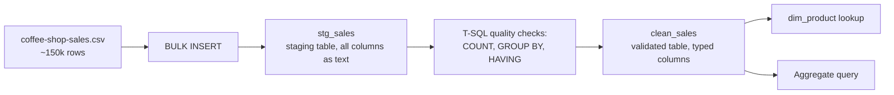

# Lab 01: Loading Coffee Shop Sales Data into SQL Server

## Objectives

- **Part 1:** Load the raw transaction export into a staging table and assess data quality with T-SQL
- **Part 2:** Fix data types and remove duplicate transaction rows in a validated table
- **Part 3:** Build a lookup table for store locations and products
- **Part 4:** Produce a first aggregate query answering a real question

## Background / Scenario

A three-location coffee shop chain exports transactions from its point-of-
sale system as a single CSV: every sale, every location, every product, all
in one flat file. Nobody has looked at revenue by store or by product
category, the export just accumulates.

This lab is the first step in this series: get the raw export into a shape
a human can actually query, using SQL Server and T-SQL.

## Required Resources

- SQL Server 2022 Developer or Express edition (free)
- SQL Server Management Studio (SSMS, free). SQL Server is the database
  engine, a background service with no interface of its own. SSMS is the
  client you connect with to write and run queries against it. They are two
  separate downloads, and installing SSMS alone gets you nowhere without a
  running SQL Server instance to point it at.
- `data/coffee-shop-sales.csv`, the [Coffee Shop Sales, Maven Roasters
  dataset](https://www.kaggle.com/datasets/ahmedabbas757/coffee-sales)
  (Kaggle, CC0). Free Kaggle account needed to download.
- Approximately 2 hours

## Topology



---

## Part 1: Load and Assess

### Step 1: Create a database and a staging table

Open SSMS, connect to your local instance, and run:

```sql
CREATE DATABASE CoffeeShop;
GO

USE CoffeeShop;
GO

CREATE TABLE stg_sales (
    transaction_id      NVARCHAR(50),
    transaction_date    NVARCHAR(50),
    transaction_time    NVARCHAR(50),
    transaction_qty     NVARCHAR(50),
    store_id            NVARCHAR(50),
    store_location      NVARCHAR(100),
    product_id          NVARCHAR(50),
    unit_price           NVARCHAR(50),
    product_category    NVARCHAR(100),
    product_type        NVARCHAR(100),
    product_detail      NVARCHAR(200)
);
```

<details>
<summary>Hint</summary>

Every column in the staging table is text (`NVARCHAR`), even the ones that
are obviously numbers or dates. A staging table's job is to accept whatever
the file actually contains without failing the load. If `unit_price` were
typed as `DECIMAL` here and one row in the export had a stray currency
symbol or a blank, the entire `BULK INSERT` would abort on that row instead
of letting you find and fix it with a query.

</details>

### Step 2: Bulk insert the raw file

```sql
BULK INSERT stg_sales
FROM 'C:\data\coffee-shop-sales.csv'
WITH (
    FORMAT = 'CSV',
    FIRSTROW = 2,
    FIELDTERMINATOR = ',',
    ROWTERMINATOR = '0x0a',
    CODEPAGE = '65001',
    TABLOCK
);
```

Adjust the file path to wherever you saved the CSV. `BULK INSERT` runs on
the SQL Server *service* account, not your own login, so the file needs to
sit somewhere that account can read, typically a local path on the same
machine the service runs on, not a network share without extra
configuration.

<details>
<summary>Hint</summary>

If `BULK INSERT` fails with a permissions or "cannot bulk load" error, the
service account most likely can't see the path you gave it. Move the CSV
into a folder like `C:\data\` at the root of the drive rather than under
your own user profile, since `C:\Users\<you>\Downloads\` is often locked
down to your login specifically.

</details>

### Step 3: Check what actually landed

```sql
SELECT COUNT(*) AS row_count FROM stg_sales;

SELECT TOP 20 * FROM stg_sales;
```

> **Why check before cleaning.** A query built on data you haven't looked
> at will produce a number that's wrong in a way you can't see. It will
> just look like an answer.

### Step 4: Check each column with T-SQL, not a spreadsheet formula

```sql
-- Distinct stores
SELECT DISTINCT store_id, store_location FROM stg_sales;

-- Distinct product categories
SELECT DISTINCT product_category FROM stg_sales;

-- Rows where unit_price is zero or can't even convert to a number
SELECT COUNT(*) AS bad_price_rows
FROM stg_sales
WHERE TRY_CAST(unit_price AS DECIMAL(10,2)) IS NULL
   OR TRY_CAST(unit_price AS DECIMAL(10,2)) <= 0;
```

<details>
<summary>Hint</summary>

`TRY_CAST` returns `NULL` instead of erroring when a value can't convert,
which is exactly what you want while auditing a staging table full of text.
A `$0.00` unit price usually means a comped drink or a till error, not a
real sale, and it will quietly drag your average price down in Lab 02 if
you don't decide what to do with it now.

</details>

### Step 5: Find the actual problem

```sql
SELECT transaction_id, COUNT(*) AS occurrences
FROM stg_sales
GROUP BY transaction_id
HAVING COUNT(*) > 1
ORDER BY occurrences DESC;
```

<details>
<summary>Hint</summary>

If this returns zero rows, check whether `transaction_id` has leading or
trailing whitespace picked up from the export, `'1001'` and `'1001 '`
group as different values in `GROUP BY` the same way they'd read as
different values in Excel. Wrap the grouping column in `TRIM()` and re-run
if the first pass looks suspiciously clean.

</details>

**Expected result:** a small but nonzero number of duplicate transaction
IDs. The export process double-writes rows when the POS system retries a
failed sync.

<details>
<summary>Expected result, Part 1</summary>

`row_count` is close to 150,000 but not a round number. The duplicate query
returns a small fraction of that total, typically under 1%. `store_id`
runs 1 through 3 (three locations). `product_category` lands somewhere
around 8-9 distinct values (Coffee, Tea, Bakery, and similar). `bad_price_rows`
should be a handful of exact-zero rows at most, nothing negative and
nothing that fails `TRY_CAST` outright if the file loaded cleanly.

</details>

---

## Part 2: Fix Types and Remove Duplicates

### Step 1: Create the validated table with real types

```sql
CREATE TABLE clean_sales (
    transaction_id      INT PRIMARY KEY,
    transaction_date    DATE NOT NULL,
    transaction_time    TIME NOT NULL,
    transaction_qty     INT NOT NULL,
    store_id            INT NOT NULL,
    store_location      NVARCHAR(100) NOT NULL,
    product_id          INT NOT NULL,
    unit_price           DECIMAL(10,2) NOT NULL,
    product_category    NVARCHAR(100) NOT NULL,
    product_type        NVARCHAR(100) NOT NULL,
    revenue              AS (unit_price * transaction_qty) PERSISTED
);
```

<details>
<summary>Hint</summary>

`revenue` is a computed column, marked `PERSISTED` so it's stored on disk
and indexable rather than recalculated on every query. Defining it once
here means every later lab in this series reads the same revenue figure
from the same source instead of five different queries each reimplementing
`unit_price * transaction_qty` slightly differently.

</details>

### Step 2: Insert only the first occurrence of each transaction_id, typed

```sql
INSERT INTO clean_sales
    (transaction_id, transaction_date, transaction_time, transaction_qty,
     store_id, store_location, product_id, unit_price,
     product_category, product_type)
SELECT
    transaction_id, transaction_date, transaction_time, transaction_qty,
    store_id, store_location, product_id, unit_price,
    product_category, product_type
FROM (
    SELECT
        TRY_CAST(transaction_id AS INT)              AS transaction_id,
        TRY_CAST(transaction_date AS DATE)            AS transaction_date,
        TRY_CAST(transaction_time AS TIME)            AS transaction_time,
        TRY_CAST(transaction_qty AS INT)              AS transaction_qty,
        TRY_CAST(store_id AS INT)                     AS store_id,
        store_location,
        TRY_CAST(product_id AS INT)                   AS product_id,
        TRY_CAST(unit_price AS DECIMAL(10,2))         AS unit_price,
        product_category,
        product_type,
        ROW_NUMBER() OVER (
            PARTITION BY transaction_id ORDER BY transaction_id
        ) AS rn
    FROM stg_sales
) deduped
WHERE rn = 1
  AND transaction_id IS NOT NULL;
```

> **`ROW_NUMBER() OVER (PARTITION BY ...)` keys off the column you
> partition on, only.** If you partitioned on the whole row instead of
> `transaction_id` alone, two rows that differ by one stray character in
> `product_category` would both keep `rn = 1` and both survive, because SQL
> Server would see them as different partitions entirely. Partition on
> `transaction_id`, the column that should be unique, not the whole row.

<details>
<summary>Hint</summary>

`TRY_CAST` turns anything that fails to convert into `NULL` rather than
aborting the whole `INSERT`. The final `WHERE transaction_id IS NOT NULL`
is what actually drops rows that failed to parse as a valid integer id, so
check that filter is doing real work here and not silently passing zero
rows through if your staging data turned out cleaner than expected.

</details>

### Step 3: Confirm the load

```sql
SELECT COUNT(*) FROM clean_sales;

SELECT TOP 10 transaction_id, revenue FROM clean_sales ORDER BY transaction_id;
```

<details>
<summary>Expected result, Part 2</summary>

`clean_sales` has fewer rows than `stg_sales` (the duplicates dropped in
Step 2), `transaction_date` and `transaction_time` sort and filter like real
dates, not text, and a manual spot-check of `revenue` on a handful of rows
matches `unit_price * transaction_qty` by hand.

</details>

---

## Part 3: Build the Product Lookup

### Step 1: Extract distinct products

```sql
SELECT DISTINCT product_id, product_category, product_type
INTO dim_product_raw
FROM clean_sales;
```

**Expected result:** one row per product, roughly 80 distinct products
across 9 categories.

### Step 2: Check for a specific problem, reused product_id across stores

```sql
SELECT product_id, COUNT(DISTINCT product_category) AS category_count
FROM clean_sales
GROUP BY product_id
HAVING COUNT(DISTINCT product_category) > 1
ORDER BY category_count DESC;
```

<details>
<summary>Hint</summary>

`GROUP BY product_id` collapses every row for that id into one group,
`COUNT(DISTINCT product_category)` counts how many different category
values show up inside that group. Any result above 1 means the same
numeric `product_id` maps to more than one category, a trap for Lab 02's
dimension table.

</details>

**Troubleshooting:** if this query returns rows, it means the POS system
assigns product IDs per location rather than globally. Note it. Lab 02's
star schema will need a compound key (`store_id` + `product_id`) if so, not
`product_id` alone.

### Step 3: Name and finalize the lookup

```sql
EXEC sp_rename 'dim_product_raw', 'dim_product';
```

<details>
<summary>Expected result, Part 3</summary>

`dim_product` has one row per distinct product, around 80 rows. If Step 2
found `product_id` reused across stores with different categories, write
that down now (product name, the two categories it collided between). Lab
02 Part 2 asks you to fix it, and it will be easier if you already know
which IDs are affected.

</details>

---

## Part 4: A First Aggregate Query

### Step 1: Revenue by store and category

```sql
SELECT
    store_location,
    product_category,
    SUM(revenue) AS total_revenue
FROM clean_sales
GROUP BY store_location, product_category
ORDER BY store_location, total_revenue DESC;
```

**Expected result:** total revenue per store, broken down by category.

### Step 2: Answer the question this lab set out to answer

Which store sells the most coffee (category = 'Coffee') in absolute
revenue?

```sql
SELECT store_location, SUM(revenue) AS coffee_revenue
FROM clean_sales
WHERE product_category = 'Coffee'
GROUP BY store_location
ORDER BY coffee_revenue DESC;
```

Which store has the highest *share* of revenue from bakery items? That
needs each store's bakery revenue divided by that same store's total
revenue, a ratio between two aggregates, not a single `SUM`.

```sql
SELECT
    store_location,
    SUM(CASE WHEN product_category = 'Bakery' THEN revenue ELSE 0 END)
        / SUM(revenue) AS bakery_share
FROM clean_sales
GROUP BY store_location
ORDER BY bakery_share DESC;
```

These are two different questions. The first query answers the first one
directly. The second needs a conditional `SUM` divided by an unconditional
one, a pattern that gets unwieldy fast once you want the same ratio broken
out by month, or by a slicer a report viewer picks, rather than hard-coded
into the `WHERE` and `CASE` of one query. That gap is why Lab 02 exists.

<details>
<summary>Expected result, Part 4</summary>

One store should lead clearly in coffee revenue (not a near-tie). Whichever
store leads on absolute bakery revenue is not guaranteed to lead on bakery
*share* once you divide by each store's own total, the two queries in Step
2 can plausibly name different stores.

</details>

---

## Troubleshooting

| Symptom | Cause | Fix |
|---|---|---|
| Revenue looks doubled for some stores | Duplicate transaction_ids not removed | Redo Part 2 Step 2, confirm `ROW_NUMBER()` partitions on `transaction_id` alone |
| `BULK INSERT` fails with an access-denied error | SQL Server's service account can't read the file path | Move the CSV to a path the service account can reach, such as `C:\data\`, not a user-profile folder |
| Every row in `clean_sales` came back as `NULL` for several columns | Staging table's raw text didn't match the format `TRY_CAST` expected, often a date format mismatch | Check `stg_sales`'s raw values for that column with `SELECT DISTINCT` before assuming the cast logic is wrong |
| Some products show as unmatched against `dim_product` | product_id not present in the lookup | Confirm Part 3 Step 1 selected from `clean_sales`, not `stg_sales` |

---

## Reflection

1. How many duplicate transaction rows did the export actually contain, and
   as a percentage of total rows, does it matter?
2. Which store had the highest bakery revenue *share*? Did the query for
   that take more work to write than the plain `SUM` for coffee revenue?
3. If a fourth store opens next month, how many of these queries would you
   need to touch versus just re-running?

---

## What Went Wrong When I Did This

- **Typed `unit_price` as `DECIMAL` directly in the staging table** on the
  first attempt, instead of `NVARCHAR`. One row near the end of the file
  had a blank price field, and `BULK INSERT` aborted the entire load on
  that row with no indication of which row it was until I dropped the
  table and rebuilt it with text columns.
- **Forgot the `FORMAT = 'CSV'` option on the first `BULK INSERT`**, using
  the older `WITH (FIELDTERMINATOR = ',', ROWTERMINATOR = '\n')` syntax
  alone. Rows with a comma inside a quoted product name split into the
  wrong columns. Adding `FORMAT = 'CSV'` fixed the quoted-field handling.
- **Missed the per-store product_id collision** the first time through,
  because I ran the `GROUP BY product_id, product_category` check instead
  of `GROUP BY product_id` with `COUNT(DISTINCT product_category)`, which
  hid the collision inside a bigger result set instead of surfacing it
  directly. Redid Part 3 Step 2 with the correct aggregate to catch it.

---

## Where This Breaks

The database answers today's question but not the next one:

- No way to get a percentage-of-subtotal without hand-writing a new `CASE`
  expression for every ratio anyone asks for
- Every new question is a new query, none of it reusable across store,
  category, or date filters at once
- If `product_id` really does collide across stores, `dim_product` is
  silently wrong for two of three locations

**Next:** [Lab 02: Building a Power BI Data Model](02-data-model.md)
