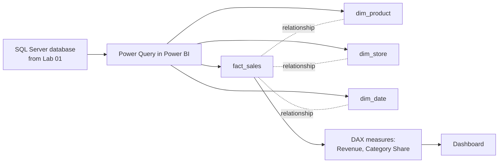

# Lab 02: Building a Power BI Data Model

## Objectives

- **Part 1:** Import the Lab 01 SQL Server database into Power BI and split it into a
  star schema
- **Part 2:** Resolve the store/product key problem found in Lab 01
- **Part 3:** Write DAX measures for revenue and category share
- **Part 4:** Build a dashboard answering both Lab 01 questions properly
- **Part 5:** Validate against the Lab 01 query results

## Background / Scenario

Lab 01 answered "which store sells the most coffee" but not "which store's
bakery *share* is highest," a percentage-of-subtotal that took a hand-built
`CASE` expression to answer once, and a rewritten query for every new
question after that.

Power BI fixes both. A measure defines the calculation once, and it
recalculates correctly in whatever context (store, category, or both) a
visual asks for.

## Required Resources

- Power BI Desktop (free, Windows)
- The `CoffeeShop` database from Lab 01, containing `clean_sales` and
  `dim_product`
- Approximately 2.5 hours

## Topology



---

## Part 1: Split into a Star Schema

### Step 1: Load both tables

**Get Data → SQL Server** → enter the server name and `CoffeeShop` as the
database → tick `clean_sales` and `dim_product` → **Transform Data**.

### Step 2: Build fact_sales

From `clean_sales`, keep: `transaction_id`, `store_id`, `store_location`,
`product_id`, `transaction_date`, `transaction_qty`, `Revenue`. Rename the
query `fact_sales`.

### Step 3: Build dim_store

Reference `fact_sales` → keep `store_id`, `store_location` → **Remove
Duplicates**. Rename `dim_store`.

### Step 4: Build dim_date

Reference `fact_sales` → keep `transaction_date` only → **Remove
Duplicates** → rename column to `Date`. Rename query `dim_date`. Add
columns: `Year`, `Month`, `MonthName`, `DayOfWeek` via **Add Column → Date**
menu options.

> **Why a date table, even for one month of data.** Power BI's time
> intelligence functions (`SAMEPERIODLASTYEAR`, `DATESYTD`, and the ones
> Lab 04 uses) require a proper marked date table to work at all, not just
> a date *column* on the fact table. Building it now, even though this
> dataset only spans a few months, is what makes Lab 04 possible without
> rebuilding the model.

<details>
<summary>Hint</summary>

If `Add Column → Date → Day → Name of Day` isn't producing what you
expect, check that the column's type is actually Date and not Text or
Date/Time first. The Date menu options only appear fully once Power Query
recognizes the column as a date.

</details>

### Step 5: Close and apply

**Home → Close & Apply**.

<details>
<summary>Expected result, Part 1</summary>

Four tables in the Model view: `fact_sales`, `dim_product`, `dim_store`,
`dim_date`. `dim_store` has 3 rows. `dim_date` has one row per distinct
date the transactions actually cover, not a full year. Power BI will have
auto-guessed relationships between them, look at the diagram view before
Part 2 and don't assume the guesses are right.

</details>

---

## Part 2: Resolve the Store/Product Key Problem

> This Part only applies if Lab 01 Part 3 Step 2 found that `product_id`
> collides across stores. If it did not, skip to Part 3.

### Step 1: Confirm the collision in Power BI

**Model view** → try relating `fact_sales[product_id]` to
`dim_product[product_id]` directly.

**Expected result if the collision is real:** the relationship either
refuses to create as many-to-one, or creates but the product names shown
per store are wrong for at least one store.

### Step 2: Fix it

You already know from Lab 01 Part 3 Step 2 that `product_id` alone isn't
unique here, it repeats across stores with different meanings each time.
Build whatever column you need, in both `fact_sales` and `dim_product`, so
that relating the two tables on it produces a genuinely one-to-one match
per product per store. Then relate on that column instead of `product_id`,
many-to-one, single direction, and delete the old relationship.

<details>
<summary>Hint</summary>

A value that's unique per store *and* per product is the concatenation of
the two: something like `store_id` and `product_id` joined with a
separator, built with **Add Column → Custom Column** in Power Query using
`Text.From()` on each piece so numbers don't fail to concatenate. Build
the same column, with the same logic, in both tables, or they won't match.

</details>

> **A composite business key beats a technical ID when the ID isn't
> actually unique.** The dataset's `product_id` looks like a primary key
> and isn't one, it's only unique within a store. This is the single
> most common cause of a Power BI model that looks right and returns wrong
> numbers for a subset of rows nobody happens to check.

<details>
<summary>Expected result, Part 2</summary>

The relationship between `fact_sales` and `dim_product` now shows as
many-to-one on your new key column, single direction, with no warning
icon in Model view. Picking a product that you noted as colliding in Lab
01 and filtering to each of its two stores should now show two different
category values, not one merged row.

</details>

---

## Part 3: Write the Measures

### Step 1: Total Revenue

```dax
Total Revenue = SUM(fact_sales[Revenue])
```

### Step 2: Category Share, the measure Lab 01 couldn't produce

```dax
Category Share =
DIVIDE(
    [Total Revenue],
    CALCULATE( [Total Revenue], ALL(dim_product[product_category]) )
)
```

### Step 3: Understand what ALL does here

| Function | What it does |
|---|---|
| `[Total Revenue]` in the numerator | Revenue in whatever category/store the visual currently shows |
| `ALL(dim_product[product_category])` | Removes the category filter only, so the denominator sums every category |
| `CALCULATE(..., ALL(...))` | The standard "percent of a wider total" pattern in DAX |

> **This is the exact gap Lab 01 hit.** Lab 01's bakery-share query hard
> coded one `CASE` expression for one ratio. A measure using `ALL()`
> computes the same ratio but stays correct in any visual, a card, a
> matrix, a chart with a slicer applied, without rewriting the query.

### Step 4: Format as a percentage

Select `Category Share` → **Measure tools → Format → Percentage**, 1
decimal place.

<details>
<summary>Expected result, Part 3</summary>

`Total Revenue` on a blank card should be within a few dollars of the sum
you got from the Lab 01 aggregate query for the same store/category
filters (small rounding differences are fine; a large gap means Part 2's
key isn't matching correctly). `Category Share` on a card with no filters
applied should read 100%; filtered to one category it should read
something well under 100%, never over.

</details>

---

## Part 4: Build the Dashboard

### Step 1: Add visuals answering both Lab 01 questions

| Visual | Fields | Answers |
|---|---|---|
| Bar chart | `dim_store[store_location]`, filter category = Coffee, value `Total Revenue` | Which store sells the most coffee |
| Matrix | Rows `dim_store[store_location]`, columns `dim_product[product_category]`, value `Category Share` | Which store's bakery share is highest |
| Slicer | `dim_date[MonthName]` | (filters the other two) |

### Step 2: Read the matrix

Find the Bakery column, compare down the store rows.

**Expected result:** the answer is now a direct read from the matrix, no
manually rewritten query, and it stays correct if you add a slicer,
filter, or a fourth store next month.

<details>
<summary>Expected result, Part 4</summary>

The bar chart shows a clear leader for coffee revenue, matching whichever
store you found in Lab 01. The matrix's Bakery column should show one
store noticeably ahead of the other two on share, and it does not have to
be the same store that leads on absolute coffee revenue, those are
different rankings by design.

</details>

---

## Part 5: Validate Against Lab 01

### Step 1: Cross-check the coffee revenue number

Pick one store. Confirm `Total Revenue` filtered to Coffee matches the Lab
01 query result exactly.

**Troubleshooting:** a mismatch of a small, consistent amount usually means
Lab 01's duplicate transaction rows weren't fully removed before the table
was promoted out of staging. Re-check `clean_sales` in SQL Server, not the
Power BI model.

<details>
<summary>Expected result, Part 5</summary>

The two numbers should match exactly, to the cent. If they're close but
not exact, the gap is almost always leftover duplicate rows from Lab 01,
not a Power BI problem.

</details>

---

## Troubleshooting

| Symptom | Cause | Fix |
|---|---|---|
| One store's product names look wrong | product_id relationship instead of compound key | Redo Part 2 |
| Category Share always shows 100% | ALL() applied to the wrong column | Confirm it targets `product_category`, not the whole table |
| Time intelligence functions error | dim_date not marked as a date table | Model view → right-click `dim_date` → Mark as Date Table |

---

## Reflection

1. Why does `ALL(dim_product[product_category])` change the denominator but
   not the numerator?
2. If you used `ALL(dim_product)` instead of `ALL(dim_product[product_category])`,
   what would change?
3. What would happen to `Category Share` if the compound key from Part 2
   were removed and the model reverted to relating on `product_id` alone?

---

## What Went Wrong When I Did This

- **Built the first relationship on `product_id` alone**, the same mistake
  Lab 01 flagged as a risk without actually fixing it. Two stores' coffee
  categories merged into one in the matrix before I went back and built the
  compound key.
- **Wrote `Category Share` with `ALL(dim_product)`** instead of
  `ALL(dim_product[product_category])` on the first attempt. It removed
  every filter from the whole table, including store, and the matrix showed
  the same percentage in every cell.
- **Forgot to mark `dim_date` as a date table.** Everything in Part 4 worked
  fine; Lab 04's time-intelligence measures failed with a cryptic error
  until I came back and fixed it here.

---

## Where This Breaks

- The model works for one snapshot of the database, refreshed by hand
- No live connection kept open, someone has to re-run Power Query's refresh
  every time the underlying table changes
- Category Share is correct but the model has no way to compare this month
  to last month yet

**Next:** [Lab 03: Interactive Sales Dashboard](03-dashboard.md)
