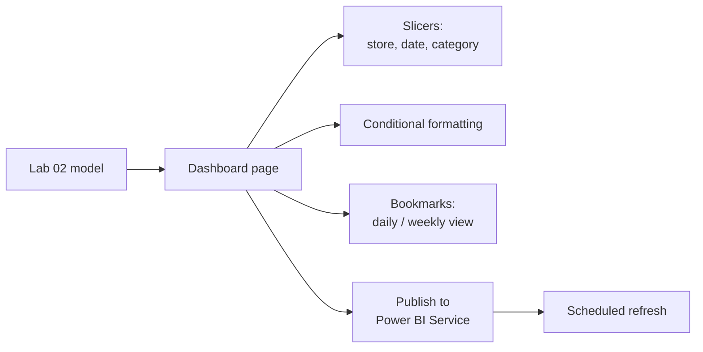

# Lab 03: Interactive Sales Dashboard

## Objectives

- **Part 1:** Design a dashboard page around one decision, not a wall of charts
- **Part 2:** Add cross-filtering slicers and a bookmark-based view toggle
- **Part 3:** Apply conditional formatting to surface outliers
- **Part 4:** Publish to Power BI Service and set a scheduled refresh

## Background / Scenario

Lab 02 built the data model and two visuals to answer two specific
questions. A dashboard is different. It has to work for a question nobody
has asked yet, at a glance, from across the room, and that changes what
"add a chart" means.

## Required Resources

- Power BI Desktop
- The `.pbix` file from Lab 02
- A free Power BI Service account (Microsoft 365 email works, or a free
  Fabric trial) for Part 4
- Approximately 3 hours

## Topology

---

## Part 1: Design Around One Decision

### Step 1: Write down the decision before building anything

A manager opening this dashboard each morning needs to answer one thing:
*is any store underperforming today relative to its own recent average?*
Everything on the page should serve that.

### Step 2: Build the core visual

Add a line chart: axis `dim_date[Date]`, values `[Total Revenue]`, legend
`dim_store[store_location]`.

### Step 3: Add a reference line

**Format the visual → Analytics → Average line**, applied per store
(Format → set "per category").

Hint

If the average line renders as one flat value across all three stores
instead of three separate lines, check the "per category" setting again,
it needs `store_location` recognized as the category being split on, which
depends on the legend field from Step 2 actually being applied.

> **A single number is not an outlier signal, a comparison is.** "$412
> today" means nothing on its own. "$412 today against an $890 average"
> is the actual answer to the question Part 1 Step 1 asked.

Expected result, Part 1

Three lines, one per store, each with its own average line at a different
height (the three stores don't have the same average daily revenue).
Whichever store has the choppiest line day-to-day is the one where a
single average is the least informative, worth noting for yourself before
Part 3's conditional formatting.

---

## Part 2: Slicers and a Bookmark Toggle

### Step 1: Add cross-filtering slicers

Add slicers for `dim_store[store_location]`, `dim_date[MonthName]`, and
`dim_product[product_category]`. Confirm **Format → Edit interactions**
leaves cross-filtering on for all three visuals from Lab 02 and Part 1.

Hint

**Edit interactions** only shows up while a visual is selected, and it
sets how the *other* visuals respond to that one, not itself. Click each
of the three slicers in turn and check the icons above every other visual
on the page.

### Step 2: Build two views with bookmarks

Set the line chart to daily granularity. Add a bookmark that captures this
state, name it `Daily`.

Change the chart's date hierarchy to weekly (drill up one level). Add a
second bookmark capturing this state, name it `Weekly`.

Hint

**View → Bookmarks → Add**, once per state, right after you've made the
change you want it to capture, not before. A bookmark records the report
exactly as it looks the moment you click Add.

### Step 3: Add buttons that apply each bookmark

Using the same bookmark-and-button pattern (create the state, then wire a
button to it via **Format → Action**), add two buttons on the page
labelled "Daily" and "Weekly" that switch the report between the views
from Step 2.

Hint

**Insert → Buttons → Blank** for the button shape itself, then with the
button selected, **Format button → Action → On** and set Type to
Bookmark, one bookmark per button.

> **A bookmark captures visual state, not data.** Switching between Daily
> and Weekly doesn't requery anything, it's the same model, displayed two
> ways. This is why it's instant, unlike a slicer change on a large model,
> which does requery.

Expected result, Part 2

Clicking "Daily" and "Weekly" swaps the chart's granularity instantly,
with no visible reload or flicker. Slicers still filter both bookmarked
states the same way, since the slicer selections aren't part of what the
bookmarks captured (unless you left "Data" checked in the bookmark's
options, in which case they are, worth checking which behavior you
actually got).

---

## Part 3: Conditional Formatting

### Step 1: Format the store bar chart by threshold

On the bar chart from Lab 02, select `Total Revenue` → **Conditional
formatting → Background color** → rules: below 80% of average = red band,
above 120% = green band.

Hint

"Average" here needs to mean the average across whatever's currently on
the chart, not a number you calculated once and typed in. Rule against a
measure (or **Format by: Field value**) rather than a fixed value, or the
bands won't move when Step 2 changes the filter.

### Step 2: Confirm it responds to filters

Apply the date slicer to a single low-traffic day. Watch the color bands
shift as the underlying average changes.

**Expected result:** the formatting is relative to whatever's currently
filtered, not a fixed threshold. A store that's normally fine will
correctly flag red on an unusually quiet day, because the comparison
recalculates in context too.

Expected result, Part 3

On an unfiltered view, one or two stores should sit in the green or red
band and at least one in neither (the "normal" middle ground). If all
three are always green or always red, the thresholds aren't actually
relative to context and Step 1 needs revisiting.

---

## Part 4: Publish and Schedule Refresh

### Step 1: Publish

**Home → Publish** → sign in → choose your workspace (My Workspace is
fine for a personal account).

### Step 2: Set up scheduled refresh

In Power BI Service, open the dataset's settings → **Scheduled refresh**.
Because the source is a SQL Server instance running on your own machine or
network, this requires the **On-premises data gateway** (free download,
installed on a machine that can reach the SQL Server instance) so the
Service can query it on a schedule.

> **Why this matters, and where it breaks.** Publishing shares the report;
> it doesn't automatically keep the data current. An on-premises SQL
> Server source means a gateway running permanently somewhere that can
> reach both the database and the internet. That's the same "one machine,
> one dependency" fragility Lab 01 flagged, now visible one layer higher
> up.

### Step 3: Set gateway or acknowledge the limitation

If installing the gateway is impractical for this lab, set refresh to
manual and note it. That's itself the finding, not a shortcut being
skipped.

Expected result, Part 4

The report opens in Power BI Service and every visual, slicer, and
bookmark button behaves the same as in Desktop. If you set up the
gateway, a manual "Refresh now" in Service should succeed; if you didn't,
the dataset settings page should clearly show refresh as unconfigured
rather than silently claiming success.

---

## Troubleshooting

| Symptom | Cause | Fix |
|---|---|---|
| Buttons don't switch views | Bookmark captured the wrong visual state | Redo Part 2 Step 2, check "All visuals" is selected when adding the bookmark |
| Conditional formatting looks static | Rule set to fixed values instead of a measure-based rule | Rebuild using "Format by: Field value" referencing a rule measure |
| Scheduled refresh fails | No gateway, SQL Server instance unreachable from the cloud | Install gateway, or accept manual refresh and document it |

---

## Reflection

1. Why does the bookmark toggle feel instant while a slicer change on a
   large model can take a second or two?
2. What would you have to change if the manager wanted the red/green
   threshold to be configurable without editing the report?
3. Is a gatewayed on-premises SQL Server an acceptable long-term source for
   a dashboard a manager checks every morning? What would you tell them?

---

## What Went Wrong When I Did This

- **Built the bookmark before switching the chart to weekly**, so the
  "Weekly" bookmark just re-captured the daily view. Bookmarks record
  whatever state the visual is in *at the moment you click Add*. Order
  matters.
- **Conditional formatting rule referenced a fixed number** I'd eyeballed
  from one day's data, so it stopped making sense the moment I changed the
  date slicer. Had to rebuild it as a measure-based rule to make it
  contextual.
- **No gateway installed**, and scheduled refresh silently failed for two
  days before I noticed the dashboard was showing stale data with no
  warning visible anywhere on the page.

---

## Where This Breaks

- Refresh depends on a gateway running on one machine, or a human
  remembering to trigger it manually
- The model still has no way to compare this period to the same period
  last year, the reason Lab 04 exists
- Nothing prevents someone from altering the underlying SQL Server tables
  in a way that silently breaks the star schema

**Next:** [Lab 04: Time Intelligence and Growth Metrics](04-time-intelligence.md)
