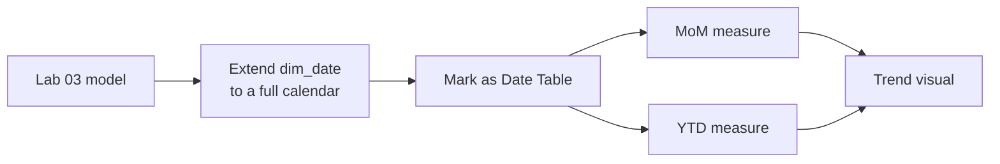

# Lab 04: Time Intelligence and Growth Metrics

## Objectives

- **Part 1:** Extend the dataset's date range so time comparisons are meaningful
- **Part 2:** Write month-over-month and period-to-date DAX measures
- **Part 3:** Diagnose why time intelligence fails without a proper date table
- **Part 4:** Build a trend visual with a comparison baseline

## Background / Scenario

The Maven Roasters export covers a few months. Real growth questions like
"is this month better than last month" or "are we ahead of where we were
this time last year" need `dim_date` to behave like a real calendar, not
just a list of dates that happen to appear in the fact table.

## Required Resources

- Power BI Desktop
- The `.pbix` file from Lab 03
- Approximately 2.5 hours

## Topology



---

## Part 1: Extend the Date Range

### Step 1: Confirm the problem

Try `SAMEPERIODLASTYEAR` against the current `dim_date` (built in Lab 02
from only the dates present in `fact_sales`). It returns blank for every
row, because there's no data, and no *date rows*, a year earlier.

<details>
<summary>Hint</summary>

Write a throwaway measure that just wraps `Total Revenue` in
`CALCULATE(..., SAMEPERIODLASTYEAR(dim_date[Date]))` and drop it on a
card. Blank everywhere confirms the table itself doesn't reach back far
enough, rather than a mistake in how you wrote the DAX.

</details>

### Step 2: Rebuild dim_date as a full calendar

Replace the Lab 02 `dim_date` query with a DAX calculated table (**Modeling
→ New Table**):

```dax
dim_date =
ADDCOLUMNS(
    CALENDAR( DATE(2022,1,1), DATE(2023,12,31) ),
    "Year", YEAR([Date]),
    "MonthNumber", MONTH([Date]),
    "MonthName", FORMAT([Date], "MMMM"),
    "DayOfWeek", FORMAT([Date], "dddd")
)
```

> **A date table needs to span more than the fact table's actual dates.**
> `SAMEPERIODLASTYEAR` looks up rows in `dim_date` that may have zero
> matching fact rows. That's expected and correct, not a bug. The
> comparison period showing "no sales" is itself sometimes the answer.

### Step 3: Mark it as the official date table

**Model view → right-click dim_date → Mark as Date Table** → select
`Date` as the key column.

### Step 4: Relate it

Confirm `fact_sales[transaction_date]` → `dim_date[Date]`, many-to-one,
single direction. Delete the old relationship first if Power BI created a
duplicate.

<details>
<summary>Expected result, Part 1</summary>

`dim_date` now has 730 rows (two full calendar years), while `fact_sales`
still only has activity against a handful of months within that range.
The `SAMEPERIODLASTYEAR` throwaway measure from Part 1 Step 1 should now
return blank only for genuinely out-of-range dates, not for every row.

</details>

---

## Part 2: Month-over-Month and Period-to-Date

### Step 1: Month-over-month revenue

```dax
Revenue MoM % =
VAR CurrentRevenue = [Total Revenue]
VAR PriorMonthRevenue =
    CALCULATE( [Total Revenue], DATEADD(dim_date[Date], -1, MONTH) )
RETURN
    DIVIDE( CurrentRevenue - PriorMonthRevenue, PriorMonthRevenue )
```

### Step 2: Understand DATEADD

| Piece | What it does |
|---|---|
| `DATEADD(dim_date[Date], -1, MONTH)` | Shifts the current filter context back one month |
| `CALCULATE([Total Revenue], ...)` | Re-evaluates Total Revenue inside that shifted context |
| The `VAR`s | Compute each side once, so the DIVIDE is readable and the values are inspectable while debugging |

### Step 3: Revenue year-to-date

Write a measure called `Revenue YTD` that totals `Total Revenue` from the
start of the calendar year up to whatever date (or month) is currently in
filter context. Power BI has a purpose-built time intelligence function
for exactly this running-total-since-January pattern, using the same
`dim_date[Date]` column every measure in this lab relates through.

<details>
<summary>Hint</summary>

```dax
Revenue YTD = TOTALYTD( [Total Revenue], dim_date[Date] )
```

`TOTALYTD` is shorthand for `CALCULATE([Total Revenue], DATESYTD(dim_date[Date]))`.
Either form works; `TOTALYTD` just reads better on a page with a lot of
other measures on it.

</details>

### Step 4: Confirm both against the real calendar

Put `Revenue MoM %` and `Revenue YTD` on a card visual, filtered to a
month partway into the dataset's actual range. Sanity-check the YTD number
by summing the visible months by hand.

<details>
<summary>Expected result, Part 2</summary>

`Revenue MoM %` for the first month with data in range should be blank
(there's no prior month to compare against, that's correct, not a bug).
For later months it should be a modest positive or negative percentage,
not a huge swing, unless a specific month genuinely had a big event.
`Revenue YTD` filtered to, say, March should roughly equal January's
revenue plus February's plus March's, summed by hand from the visuals
built in Lab 03.

</details>

---

## Part 3: Diagnose the Failure Mode

### Step 1: Break it on purpose

Change the `dim_date` relationship's cross-filter direction to **Both**.

**Record what happens** to `Revenue MoM %` on a matrix broken out by
`product_category`.

**Expected result:** the measure may still compute a number, but it's now
ambiguous which direction is filtering which. Bidirectional filtering
against a date table with `DATEADD` inside a measure is a well-known
source of circular or double-counted results once a second relationship
touches the same date table.

Set it back to **Single**.

### Step 2: Remove the Mark as Date Table setting

**Model view → dim_date → un-mark as date table.**

**Expected result:** `DATEADD`, `TOTALYTD`, and `SAMEPERIODLASTYEAR` either
error outright or silently return wrong results, because these functions
require Power BI to know which column is the authoritative, contiguous
date axis. That's exactly what marking the table declares.

Re-mark it before continuing.

### Step 3: Record the symptom

| Symptom | Likely cause |
|---|---|
| Time intelligence functions error or return blank everywhere | dim_date not marked as a date table |
| Time intelligence numbers look plausible but don't match manual math | Bidirectional relationship on the date table |
| MoM shows blank for the first month in range | Correct, there's no prior month to compare against |

<details>
<summary>Expected result, Part 3</summary>

With the relationship set back to single-direction and `dim_date` marked
again as a date table, `Revenue MoM %` should return to the same values
you recorded in Part 2 Step 4. If it doesn't match, something else besides
the two settings tested here changed along the way, worth tracking down
before Part 4.

</details>

---

## Part 4: Trend Visual with a Baseline

### Step 1: Line chart with a comparison line

Line chart: axis `dim_date[Date]`, values `Total Revenue` and
`Revenue MoM %` (add as a second measure, format on a secondary axis).

### Step 2: Read it correctly

**Expected result:** the MoM line is blank for the first month (Part 3's
expected symptom, now visible in the actual visual, not just a card), a
useful check that the measure and the chart agree.

<details>
<summary>Expected result, Part 4</summary>

The revenue line should show whatever seasonal or weekly pattern the raw
data actually has (coffee shops usually dip on weekends if the locations
are office-adjacent, or spike on weekends if they're not, depending on the
neighborhood). The MoM line should track roughly in the same direction as
the revenue line's slope, up when revenue is climbing, down when it's
falling, not the reverse.

</details>

---

## Troubleshooting

| Symptom | Cause | Fix |
|---|---|---|
| MoM % is blank everywhere | dim_date range too short, or not marked as date table | Redo Part 1 Steps 2–3 |
| MoM % looks inverted (positive when revenue fell) | DIVIDE numerator/denominator swapped | Check Part 2 Step 1 against the formula exactly |
| YTD resets unexpectedly mid-year | Fiscal year setting mismatch, TOTALYTD defaults to calendar year | Pass a fiscal year-end date as TOTALYTD's third argument if the business uses one |

---

## Reflection

1. Why does extending `dim_date` beyond the fact table's actual dates make
   `SAMEPERIODLASTYEAR` more correct, not less?
2. What's the practical difference between `DATEADD(..., -1, MONTH)` and
   `PARALLELPERIOD(..., -1, MONTH)`?
3. If the coffee shop chain's actual fiscal year starts in April, what
   would you need to change in `Revenue YTD`?

---

## What Went Wrong When I Did This

- **Built `dim_date` from `CALENDAR()` but forgot to mark it as a date
  table.** Every time-intelligence measure returned blank, and the error
  message didn't point at the actual cause. I spent longer than I'd like
  to admit checking the DAX syntax before checking the model setting.
- **Left the old Lab 02 date relationship in place** alongside the new
  calculated table, creating two `dim_date`-shaped tables in the model at
  once. Power BI let me build measures against the wrong one without
  complaint.
- **DIVIDE numerator and denominator the wrong way round** on the first
  draft of `Revenue MoM %`. Every month showed the negative of the real
  change. Caught it by comparing one card's number to hand arithmetic, the
  same check Part 2 Step 4 tells you to do.

---

## Where This Breaks

- The comparison periods are synthetic. The real chain has been open
  longer than this dataset covers, so "last year" is partly fabricated
  calendar structure, not fabricated sales figures
- The model still only refreshes from an on-premises SQL Server instance
  through a gateway
- Nothing yet asks "what if" a store changed its hours or pricing, Lab 05

**Next:** [Lab 05: What-If Analysis and Row-Level Security](05-what-if-rls.md)
