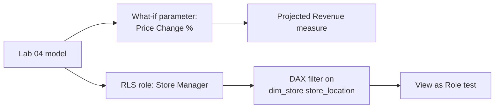

# Lab 05: What-If Analysis and Row-Level Security

## Objectives

- **Part 1:** Build a what-if parameter for a proposed price change
- **Part 2:** Project revenue impact with the parameter driving a measure
- **Part 3:** Implement row-level security so each store manager sees only their store
- **Part 4:** Test RLS as a restricted user, not just as the report author

## Background / Scenario

Two questions close this series out: "what happens if we raise coffee
prices by X%," and "how do we let three store managers use the same report
without each seeing the other two stores' numbers." Neither is answerable
with what Labs 01–04 built.

## Required Resources

- Power BI Desktop
- The `.pbix` file from Lab 04
- Approximately 3 hours

## Topology



---

## Part 1: The What-If Parameter

### Step 1: Create the parameter

**Modeling → New Parameter → Numeric range.** Name `Price Change %`, min
-20, max 20, increment 1, default 0. Check **Add slicer to this page**.

**Expected result:** Power BI creates a new table with one column and a
measure called `Price Change % Value`.

### Step 2: Inspect what it built

Open the generated measure:

```dax
Price Change % Value = SELECTEDVALUE('Price Change %'[Price Change %], 0)
```

> **A what-if parameter is a disconnected table, not a relationship.** It
> has no key into `fact_sales` or `dim_product`, the slicer just sets a
> value that a measure reads with `SELECTEDVALUE`. Nothing about the model
> "knows" this is a price scenario; the measures you write next are what
> make it mean anything.

<details>
<summary>Expected result, Part 1</summary>

A new table named `Price Change %` appears in the Fields pane with no
relationship lines connecting it to anything else in Model view, that
absence is correct. The slicer on the page shows values from -20 to 20 in
steps of 1.

</details>

---

## Part 2: Project the Revenue Impact

### Step 1: Write the projected revenue measure

```dax
Projected Revenue =
[Total Revenue] * (1 + 'Price Change %'[Price Change % Value] / 100)
```

### Step 2: Restrict the scenario to coffee only

The real question is about coffee pricing specifically, not bakery or tea.

```dax
Projected Coffee Revenue =
VAR CoffeeRevenue =
    CALCULATE( [Total Revenue], dim_product[product_category] = "Coffee" )
VAR OtherRevenue = [Total Revenue] - CoffeeRevenue
RETURN
    OtherRevenue + CoffeeRevenue * (1 + 'Price Change %'[Price Change % Value] / 100)
```

### Step 3: Build the comparison visual

Card visuals: `Total Revenue` next to `Projected Coffee Revenue`, with the
parameter's slicer on the page. Move the slider and watch both update.

> **This measure assumes demand doesn't change with price.** It's a
> mechanical projection, not an elasticity model. That's a real limitation
> worth stating on the report page itself, not just in this lab. A 20%
> price increase almost certainly changes how much coffee people buy, and
> this measure has no way to represent that.

<details>
<summary>Expected result, Part 2</summary>

With the slider at 0%, `Projected Coffee Revenue` should equal `Total
Revenue` exactly. Moving the slider to +10% should raise the projected
card by roughly 10% of whatever the Coffee category alone contributes,
not 10% of the whole store's revenue, since bakery and tea pass through
unchanged in the `OtherRevenue` variable.

</details>

---

## Part 3: Row-Level Security

### Step 1: Create the role

**Modeling → Manage roles → Create.** Name it `Store Manager`.

### Step 2: Write the filter

On `dim_store`, add a DAX filter:

```dax
[store_location] = USERPRINCIPALNAME()
```

This assumes each manager's Power BI Service login matches a value in
`store_location`, which it won't, out of the box. For this lab, use a
mapping table instead.

<details>
<summary>Hint</summary>

Think about what's actually missing: `dim_store` has no column that holds
an email address, and it shouldn't gain one just for this. What you need
is a small separate table that pairs each manager's email with the store
name they're allowed to see, related into the existing model the same way
any other dimension table relates in.

</details>

### Step 3: Build a proper mapping table

**Modeling → New Table**:

```dax
dim_store_access =
DATATABLE(
    "UserEmail", STRING,
    "store_location", STRING,
    {
        {"manager.downtown@example.com", "Downtown"},
        {"manager.uptown@example.com", "Uptown"},
        {"manager.eastside@example.com", "Eastside"}
    }
)
```

Relate `dim_store_access[store_location]` to `dim_store[store_location]`,
many-to-one, single direction.

### Step 4: Filter the role through the mapping table

Replace the Step 2 filter with one on `dim_store_access`:

```dax
[UserEmail] = USERPRINCIPALNAME()
```

> **Filter the access table, not the data table directly, whenever the
> access rule isn't itself a column on the data.** `store_location` has no
> email column and shouldn't. Mixing access control into a dimension
> table that Lab 02 built for an unrelated purpose is how a model ends up
> with columns nobody remembers the reason for.

<details>
<summary>Expected result, Part 3</summary>

`dim_store_access` has 3 rows, one per manager, and the relationship to
`dim_store` shows many-to-one, single direction, with no warning icon.
The role itself has no visible effect yet on the report page, that only
shows up once you actually view as a restricted user in Part 4.

</details>

---

## Part 4: Test as a Restricted User

### Step 1: View as role, inside Power BI Desktop

**Modeling → View as → check Store Manager → Other user →** enter one of
the three test emails.

**Expected result:** every visual on every page filters down to that one
store, including the ones built in Labs 02–04 that were never told
anything about RLS.

> **RLS applies model-wide, retroactively, to visuals built before the
> role existed.** That's the point of building it in the model layer
> rather than filtering each visual by hand. It's also the reason to test
> it against a page you didn't design with RLS in mind, which is exactly
> what Part 4 does.

### Step 2: Confirm the what-if parameter still works under RLS

With the role still active, move the price-change slider.

**Expected result:** `Projected Coffee Revenue` recalculates against only
the visible store's data. The two features compose without extra work,
because both operate through the filter context, not through hard-coded
scope.

### Step 3: Publish and assign the role for real

After publishing to Power BI Service: **dataset settings → Security →**
add each manager's actual email under the `Store Manager` role.

**Troubleshooting:** RLS in Desktop's "View as" is a simulation. The real
test is a second person, signed in with their own account, opening the
published report. If that's not practical for this lab, state plainly
that RLS was verified in Desktop only, not against a live second account.

<details>
<summary>Expected result, Part 4</summary>

Each of the three test emails, viewed as, sees exactly one store's data
everywhere on every page, including pages built in Labs 02-04 before RLS
existed. The what-if slider still moves `Projected Coffee Revenue` while a
role is active, scoped to that one store's coffee revenue only.

</details>

---

## Troubleshooting

| Symptom | Cause | Fix |
|---|---|---|
| Projected Revenue doesn't move with the slider | Measure references `[Price Change %]` (the column) instead of the generated Value measure | Use `'Price Change %'[Price Change % Value]` |
| View as Role shows all stores | Role filter on the wrong table, or relationship direction wrong | Confirm filter sits on `dim_store_access`, relationship is single-direction toward `dim_store` |
| RLS works in Desktop but not after publishing | Role has no members assigned in Service | Add emails under dataset Security settings |

---

## Reflection

1. Why does `Projected Coffee Revenue` split coffee and non-coffee revenue
   into two variables instead of applying the percentage to the whole
   total?
2. What real-world factor does the what-if measure ignore, and what would
   a more realistic version need?
3. If a fourth store opens, what has to change for RLS to cover it, anything
   in the DAX, or only the mapping table?

---

## What Went Wrong When I Did This

- **Applied the price change to total revenue**, not just coffee, on the
  first version of the measure. The projection overstated the impact
  because bakery and tea prices were rising in the simulation along with
  coffee, which was never the question.
- **Wrote the RLS filter directly on `dim_store`** using
  `USERPRINCIPALNAME()`, matching against `store_location` text like
  "Downtown", which no login email will ever equal. Reworked it through
  a proper mapping table once I noticed "View as Role" was returning zero
  rows for every test user.
- **Never tested with a second real account**, only Desktop's simulated
  "View as." Said so directly instead of implying it was fully verified,
  because it wasn't.

---

## Where This Breaks

The model can price-simulate coffee revenue and restrict each store
manager to their own numbers, but the what-if measure has no demand
elasticity, and the RLS mapping table is maintained by hand. A proper
source of truth for store-to-manager mapping would come from wherever
staff accounts already live, not a hard-coded DAX table.

The model also still assumes the three stores it already knows about are
the only three it will ever need to know about. Lab 06 tests that
assumption directly.

**Next:** [Lab 06: Capstone, A New Store and a Messy Backfill](06-capstone.md)
