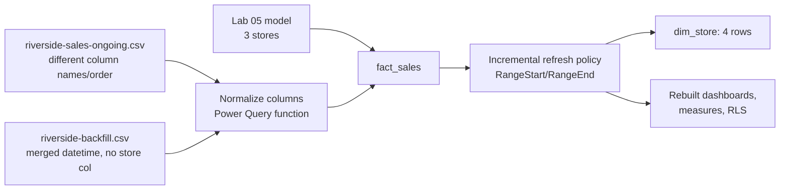

# Lab 06: Capstone, A New Store and a Messy Backfill

## Objectives

- **Part 1:** Rebuild the full Labs 01-05 model as one clean starting point
- **Part 2:** Onboard a fourth store from a CSV with a different column
  layout than the original export
- **Part 3:** Handle a backfilled month of historical transactions that
  arrives late, in yet another column layout, for the new store
- **Part 4:** Make the Power Query layer resilient to column order and
  naming drift, not just today's two files
- **Part 5:** Convert the model to incremental refresh so a growing fact
  table doesn't reload from scratch every time
- **Part 6:** Rebuild every dashboard, measure, and RLS role from Labs
  02-05 against the four-store model and confirm nothing broke

## Background / Scenario

The chain opens a fourth location, Riverside, in April. Riverside runs the
same POS software as the other three, but it was provisioned by a
different regional IT contractor, and their export template doesn't match
the original. The columns are the same data, renamed and reordered:
`txn_id` instead of `transaction_id`, `store` instead of `store_location`,
`qty` instead of `transaction_qty`, and the date/time fields merged into
one `txn_datetime` column instead of split into `transaction_date` and
`transaction_time`.

Worse: Riverside's first six weeks of sales were logged locally and not
uploaded anywhere, because nobody told the contractor about the existing
export pipeline until the store had already been open a month and a half.
That backlog arrives as a separate backfill file in mid-May, covering
transactions from Riverside's opening day through the day before the
regular export picked it up, in a third slightly different shape (it has
`txn_datetime` like the ongoing Riverside export, but no `store` column at
all, because the whole file is Riverside).

This is the scenario every one of the last five labs has been quietly
building toward. Lab 01 flagged that a fourth store would mean redoing
work by hand. Lab 02's compound key assumed every source it would ever see
matched the shape of `clean_sales`. Lab 03's refresh setup assumed one
database, one gateway. Nothing built so far survives a file showing up
with different column names in a different order, and nothing survives a
growing fact table without a full reload getting slower every month. This
lab fixes both, using the model from Labs 01-05 as the base rather than
starting over.

## Required Resources

- Power BI Desktop
- The `.pbix` file from Lab 05
- `data/coffee-shop-sales.csv`, the original file from Lab 01
- `data/riverside-sales-ongoing.csv` (synthetic, provided with this lab):
  same data shape as the original export, different column names and
  order, Riverside's regular exports from its onboarding date onward
- `data/riverside-backfill.csv` (synthetic, provided with this lab):
  Riverside's pre-onboarding transactions, merged datetime column, no
  store column
- Approximately 4 hours

## Topology



---

## Part 1: Rebuild the Base Model

### Step 1: Open the Lab 05 file and confirm it still works

Open the `.pbix` from Lab 05. Check the store bar chart, the Category
Share matrix, the MoM/YTD cards, and the what-if slider all still show
sensible numbers with no relationship warnings in Model view.

<details>
<summary>Hint</summary>

If anything looks wrong before you've changed a single thing, stop and
fix it here rather than building Part 2 on top of a broken base. A model
that's already inconsistent will make every later step in this lab
impossible to debug, because you won't know whether a new problem is from
Riverside or was there already.

</details>

### Step 2: Save a copy for this lab

**File → Save As** → `coffee-shop-capstone.pbix`. Keep the Lab 05 file
untouched in case you need to compare against it later.

<details>
<summary>Expected result, Part 1</summary>

The saved copy opens cleanly, has three stores in `dim_store`, and every
visual from Labs 02-05 still renders with the same numbers you'd expect
from that lab's own expected-result notes.

</details>

---

## Part 2: Onboard Riverside's Ongoing Export

### Step 1: Look at the new file before touching Power Query

Open `riverside-sales-ongoing.csv` in a text editor or Excel, not Power
Query yet. Compare its header row against `coffee-shop-sales.csv`'s
header row from Lab 01.

<details>
<summary>Hint</summary>

Same data, different names and order is the pattern to look for:
`txn_id`/`transaction_id`, `store`/`store_location`, `qty`/
`transaction_qty`, and a single `txn_datetime` where the original file had
`transaction_date` and `transaction_time` as two columns. Write down the
mapping before you open Power Query. Guessing at the mapping while also
fighting the UI is how a wrong column gets renamed to the wrong thing.

</details>

### Step 2: Why appending this file directly would break the model

If you tried **Append Queries** right now, straight from
`riverside-sales-ongoing.csv` into `fact_sales`, explain to yourself what
would go wrong before doing it. (You don't need to actually do it and
watch it fail, though you can if you want to see it.)

<details>
<summary>Hint</summary>

Append matches columns by name. A column named `txn_id` doesn't merge
with a column named `transaction_id`, Power Query adds a brand new column
called `txn_id` instead, and every existing row gets a blank in it while
every new row gets a blank in `transaction_id`. The row count goes up, but
the data underneath is now full of holes, and no error tells you this
happened.

</details>

### Step 3: Build a normalizing step for the Riverside query

Load `riverside-sales-ongoing.csv` as its own query. Before appending
anything, use **Table.RenameColumns** to map its column names onto the
original schema, and **Table.SelectColumns** (or reorder manually) to put
them in the same order and set as the same final column list as
`fact_sales` expects. Split `txn_datetime` into a date part and a time
part matching `transaction_date` and `transaction_time`.

<details>
<summary>Hint</summary>

```
Table.RenameColumns(Source, {
    {"txn_id", "transaction_id"},
    {"store", "store_location"},
    {"qty", "transaction_qty"}
})
```

For splitting `txn_datetime`: right-click the column → **Split Column →
By Delimiter**, or add two custom columns using `DateTime.Date([txn_datetime])`
and `DateTime.Time([txn_datetime])`, then remove the original column.
`Table.SelectColumns` at the end, naming every column `fact_sales` needs
in the order it needs them, both catches anything you missed and gives
you an error immediately if a name doesn't match, instead of a silent
blank column three steps later.

</details>

### Step 4: Add store_id and append

Riverside needs a `store_id` value that doesn't collide with the existing
three (1, 2, 3). Add a custom column setting `store_id` to 4 for every row
in this query. Append the normalized query into `fact_sales`.

### Step 5: Update dim_store and the compound key

Add Riverside to `dim_store`. Confirm the `StoreProductKey` (or whatever
you named the compound key in Lab 02 Part 2) is still being built the same
way for Riverside's rows as for the original three, since that logic
lives in a Power Query step that needs to run against the appended data
too, not just the original file.

<details>
<summary>Expected result, Part 2</summary>

`dim_store` has 4 rows. `fact_sales` includes Riverside transactions with
no blank columns anywhere, sitting in the same column structure as the
original three stores' rows. Filtering the Lab 02 bar chart to Riverside
shows nonzero coffee revenue starting from whatever date the ongoing
export begins, not from January.

</details>

---

## Part 3: The Messy Backfill

### Step 1: Look at the backfill file's shape

Open `riverside-backfill.csv`. It has `txn_datetime` like the ongoing
export, but no `store` column at all.

<details>
<summary>Hint</summary>

No store column doesn't mean the data is incomplete, it means every row
in this file is implicitly Riverside, because the whole file only ever
existed because Riverside was being tracked locally before it had a
regular export. The fix isn't to reject the file for missing a column,
it's to add the column back in with a fixed value, the same move as Part
2 Step 4.

</details>

### Step 2: Build a second normalizing query

Using the pattern from Part 2 Step 3, build a normalizing query for the
backfill file. It needs the same renames, the same datetime split, and
an added `store_location`/`store_id` column set to Riverside/4 for every
row, since the source file has no such column to rename.

### Step 3: Check for a transaction_id collision

The backfill and the ongoing export were generated independently before
anyone realized they'd need to coexist. Check whether any `transaction_id`
appears in both files.

<details>
<summary>Hint</summary>

Reference both normalized queries, keep only `transaction_id`, append one
into the other, and run the same duplicate check from Lab 01 Part 1 Step
5. If you find overlap, decide which copy is authoritative (the backfill,
since it's the original local record; the ongoing export's copy of the
same sale, if it exists, is the duplicate) before you append into
`fact_sales`, not after.

</details>

### Step 4: Append the backfill and re-run every validation from Lab 01-02

Append the backfill into `fact_sales`. Re-run the duplicate check, and
re-verify the compound key covers the backfilled rows too.

<details>
<summary>Expected result, Part 3</summary>

`fact_sales` now includes Riverside transactions going back to its actual
opening date, not just the date its regular export started. No duplicate
`transaction_id` values exist across the combined file. The earliest
Riverside date in `fact_sales` is now noticeably earlier than the date you
found in Part 2, by roughly six weeks, matching the scenario.

</details>

---

## Part 4: Make Power Query Defensive, Not Just Working

### Step 1: Name the actual risk

Two ad-hoc normalizing queries work for these two specific files. They
won't survive a third file with yet another column order, or the same
file re-exported with one column dropped. What would silently break if a
future file were missing `qty` entirely, or had `store` renamed to
`location` instead of `store`?

<details>
<summary>Hint</summary>

`Table.RenameColumns` by default throws an error if you ask it to rename
a column that doesn't exist, which is actually the safer failure mode
here (loud, not silent) compared to a plain positional rename. The
`RenameColumns` third argument, `MissingField.Ignore`, exists specifically
to suppress that error, and that's exactly the setting you do NOT want
here even though it's tempting to add it to stop errors. Let a
schema-shape mismatch fail loudly in Power Query rather than loading
successfully with a blank column that only gets noticed three measures
downstream.

</details>

### Step 2: Consolidate into one parameterized function

Turn the normalizing logic from Parts 2 and 3 into a single Power Query
function (**Home → New Source → Blank Query**, then convert to a function,
or **right-click a query → Create Function**) that takes a table and a
column-name mapping and returns a table in the standard `fact_sales`
shape. Apply it to both the ongoing and backfill sources instead of
maintaining two near-duplicate query chains.

<details>
<summary>Hint</summary>

A function that takes `(SourceTable as table, ColumnMap as list)` and
does the `Table.RenameColumns(SourceTable, ColumnMap)` plus the datetime
split plus `Table.SelectColumns` internally means the next store's onboard
is "call the function with a new mapping," not "copy forty steps of M
code and hope you remember every place `txn_id` appears."

</details>

<details>
<summary>Expected result, Part 4</summary>

Two calls to the same custom function, one per source file, replace the
separate step-by-step queries you built in Parts 2 and 3. Both still
produce identical output to what you had before, so nothing in
`fact_sales` should change: this step is about maintainability, not new
data.

</details>

---

## Part 5: Incremental Refresh

### Step 1: Why a full reload stops working here

With four stores and a backfill, `fact_sales` is bigger than it was in
Lab 03, and it will keep growing every day the chain stays open. Lab 03's
refresh model reloads the entire source on every refresh. State, in your own
words, what happens to refresh time as the fact table grows from
thousands of rows to millions, and why re-reading January's transactions
every single night is wasted work when January's data never changes.

### Step 2: Why incremental refresh is the right tool here, specifically

Power BI offers a few ways to handle a large, growing model: incremental
refresh, composite models with DirectQuery for the recent data, and
aggregation tables. This lab uses incremental refresh, because the
problem here is squarely "a transactional fact table that only grows,
where old rows are immutable once written," which is exactly the case
incremental refresh is built for. A composite model would be the right
call if some of this data needed to stay live-queried against a source
system rather than imported; it's not warranted here since the appended
files load once and then behave like the rest of the historical data.

### Step 3: Add RangeStart and RangeEnd parameters

**Manage Parameters → New**. Create two Date/Time parameters named
exactly `RangeStart` and `RangeEnd` (the exact names Power BI's
incremental refresh policy looks for). Set reasonable defaults, such as
the first date in your data for `RangeStart` and today for `RangeEnd`.

### Step 4: Filter fact_sales by the range parameters

In the `fact_sales` query, add a filter step on `transaction_date` (or
your split date column) using `RangeStart` and `RangeEnd`:

```
= Table.SelectRows(PreviousStep, each [transaction_date] >= RangeStart and [transaction_date] < RangeEnd)
```

<details>
<summary>Hint</summary>

This filter step has to come after all the normalizing and appending from
Parts 2-4, not before, since `RangeStart`/`RangeEnd` need to filter the
final combined table, not just the original three-store data.

</details>

### Step 5: Configure the incremental refresh policy

Right-click `fact_sales` in the Fields pane → **Incremental refresh**.
Turn it on. Set "Archive data starting" to a period that covers the
dataset's full history (2 years, matching Lab 04's calendar), and
"Incrementally refresh data starting" to something like 1 month, so only
the most recent month reloads on each scheduled refresh instead of the
whole table.

<details>
<summary>Expected result, Part 5</summary>

The policy dialog accepts the settings with no error about the
RangeStart/RangeEnd parameters. In Desktop, incremental refresh only
partitions and applies fully once published to Power BI Service with a
Pro or Premium capacity behind it, refreshing in Desktop still reloads
everything, that's expected. What you're checking here is that the
policy is configured correctly and the model still produces the same
numbers as before with the filter step added, not that partitioning
visibly speeds anything up locally.

</details>

---

## Part 6: Rebuild Everything Against Four Stores

### Step 1: Dashboards

Confirm the Lab 03 dashboard, slicers, bookmarks, and conditional
formatting all pick up Riverside automatically, with no manual edits to
any visual.

### Step 2: Time intelligence

Confirm Lab 04's MoM and YTD measures compute sensible numbers for
Riverside, keeping in mind Riverside's first MoM comparison will be blank
for a different reason than the other three stores: it didn't exist a
month earlier, not just that the calendar hasn't reached that point yet.

<details>
<summary>Hint</summary>

Filter the MoM card to Riverside and to the month right after its opening.
A blank result there is correct, and different in cause from the Lab 04
Part 2 blank (no prior month exists in the calendar) versus this one (a
prior month exists in the calendar, but Riverside has zero rows in it).
Worth having language ready for anyone who asks why the same-looking blank
means two different things.

</details>

### Step 3: What-if and RLS

Confirm the price-change parameter still projects Riverside's coffee
revenue correctly, and add a fourth row to `dim_store_access` mapping a
Riverside manager's email to the new store. Test with **View as Role**.

<details>
<summary>Expected result, Part 6</summary>

Every visual across every page shows four stores where it showed three
before, with no broken relationships or blank categories. The Riverside
manager's RLS test shows only Riverside data. `Category Share` and
`Projected Coffee Revenue` both still sum correctly across all four stores
when no role is active.

</details>

---

## Troubleshooting

| Symptom | Cause | Fix |
|---|---|---|
| Riverside rows show blank in every original column after append | Appended before renaming, so Power Query created new columns instead of matching existing ones | Redo Part 2 Step 3: rename first, append second |
| Duplicate revenue for some Riverside transactions in May | Same sale present in both the ongoing export and the backfill | Redo Part 3 Step 3, decide which file is authoritative and drop the duplicate from the other |
| Incremental refresh policy won't save | RangeStart/RangeEnd not named exactly that, or not both Date/Time type | Rename/retype the parameters in Manage Parameters |
| Riverside missing from RLS entirely | dim_store_access not updated with the new manager's row | Redo Part 6 Step 3 |
| A future new file breaks the whole load with an M error | This is the correct failure mode for a genuine schema mismatch (see Part 4 Step 1) | Check which column is missing or renamed in the new source, update the mapping passed to the normalizing function |

---

## Reflection

1. Why does renaming columns before appending matter more than filtering
   or deduplicating in what order you do them?
2. The backfill file has no `store` column at all, while the ongoing
   export has a `store` column that just needs renaming. Why does the
   fix for "missing a column" look different in Power Query from the fix
   for "wrong name for a column," even though both end with the same
   correct output?
3. What would have to change in this lab's incremental refresh policy if
   transactions actually could be edited or refunded after the fact,
   rather than being immutable once written?
4. Looking back across all six labs: which Lab 01 decision (typing the
   staging load defensively, then promoting only validated rows) turned
   out to matter most by the time you reached Lab 06, and why?

---

## What Went Wrong When I Did This

- **Appended the ongoing Riverside file before renaming its columns**,
  exactly the mistake Part 2 Step 2 warns about, because I wanted to see
  what Power Query would do with the mismatch rather than trusting the
  explanation. Six new blank-heavy columns later, I redid it renaming
  first.
- **Missed the transaction_id overlap between the backfill and the
  ongoing export** on the first pass, because I checked each file for
  internal duplicates (the Lab 01 check) but not for duplicates against
  each other. Revenue for the overlap week was roughly double for a few
  days before I caught it comparing a daily total against what felt like
  a plausible number for a single store.
- **Set "Archive data starting" too short** on the first incremental
  refresh attempt, shorter than the actual date range in the data, and
  Power BI Desktop's validation caught it before publish rather than
  failing silently in the service later. Widened the archive window to
  cover the full 2-year calendar range from Lab 04.

---

## Looking Back at the Series

Six labs, one dataset, one growing problem. Lab 01 answered one question
with a query that had to be rewritten for the next question. Lab 02 turned
that into a measure that answers any question in its shape, once. Lab 03
made the numbers visible to someone who wasn't the person who built them.
Lab 04 made "compared to when" a real, correct concept instead of a manual
recalculation. Lab 05 made the model answer a hypothetical and restrict
who sees what, at the same time, without those two features knowing about
each other. Lab 06 took everything that only worked because the input was
one clean source from one place, and made it survive contact with a
second source that didn't match, arriving late, in a shape nobody agreed
on in advance, on a fact table too big to reload from scratch every night.

That last part is the actual skill this series was building toward. Real
data doesn't arrive in the shape your first file trained you to expect,
and a model that only works for the source it was built against isn't
finished, it's just untested. The techniques in this lab (defensive
renaming, a parameterized normalizing function, incremental refresh) exist
because production data eventually does exactly what Riverside's data did
here, and a model built to Lab 01's standard of "correct for what I have
in front of me right now" breaks the first time reality disagrees with
the source.
