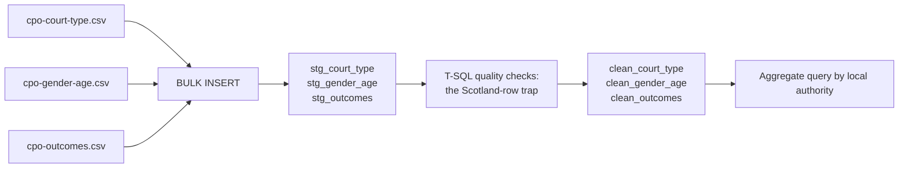

# Lab 01: Loading Community Payback Order Statistics into SQL Server

## Objectives

- **Part 1:** Load three real Scottish Government statistics tables into staging via BULK INSERT
- **Part 2:** Find and understand the row that breaks every naive aggregate in this dataset
- **Part 3:** Fix data types, build validated tables, and decide what "local authority" means here
- **Part 4:** Answer a first real question with a GROUP BY query

## Background / Scenario

Scotland's 32 councils each run a Justice Social Work service, and Community
Payback Orders (CPOs) are the main community sentence Scottish courts use
instead of custody: unpaid work, supervision, or both, imposed by a court and
delivered locally. The Scottish Government publishes a national bulletin every
year with local-authority-level breakdowns of how many orders were made,
what they were made up of, and how many finished successfully.

Before writing a single query, one scoping decision needs to be explicit,
the same way it was for the healthcare series in this collection: **this is
aggregate statistics, not case data.** Every figure here is a local
authority's count or rate for a whole year, not a row per offender.
Nothing in this series touches an individual's name, address, or case file,
because nothing in the published data does either. The Scottish Government's
own crosstabs of gender by age and gender by ethnicity (tables CPO_1 to
CPO_3 in the source workbook) are published at Scotland level only, with no
local authority breakdown at all. That's not this series choosing to
withhold detail. It's a real limit in what the government itself publishes
at that grain, and this series respects it rather than inventing a
local-authority split that doesn't exist in the source.

The business question this series answers: **which local authorities get
people through a Community Payback Order successfully, and where does that
break down, by court type or by how the order was constructed?**

## Required Resources

- SQL Server (Developer or Express edition, both free) and SQL Server
  Management Studio (SSMS). SQL Server is the database engine, a background
  service with no interface of its own. SSMS is the client you connect with
  to write and run queries against it. They are two separate downloads;
  installing SSMS alone gets you nowhere without a running SQL Server
  instance to point it at.
- The source workbook: search "Justice Social Work Statistics" on
  [gov.scot](https://www.gov.scot/collections/criminal-justice-social-work/)
  and open the latest **Justice Social Work Statistics in Scotland**
  bulletin. From its "Additional datasets" link, download **Community
  Payback Orders - Part 2**, an Excel workbook, Open Government Licence
  v3.0, no login needed. It contains 26 tables (`CPO_1` to `CPO_26`); this
  lab uses three: `CPO_9` (orders by court type), `CPO_10` (orders by
  gender and age), and `CPO_23` (orders finished, by reason and completion
  rate). Export each of those three sheets to its own CSV (**File → Save
  As → CSV**, one file per sheet), since `BULK INSERT` reads a flat file,
  not a native workbook, and reads one sheet at a time regardless.
- Approximately 2.5 hours

## Topology



---

## Part 1: Load Three Tables into Staging

### Step 1: Get the files

Each of the three sheets covers the same shape: one row per year, per local
authority, ten years (2015-16 to 2024-25), 32 councils, plus one row per
year for Scotland as a whole. Save each exported sheet with a name that
matches its content, not its sheet code: `cpo-court-type.csv`,
`cpo-gender-age.csv`, `cpo-outcomes.csv`.

### Step 2: Create a database and three staging tables

```sql
CREATE DATABASE CommunityPayback;
GO

USE CommunityPayback;
GO

CREATE TABLE stg_court_type (
    FiscalYear    NVARCHAR(20),
    LocalAuthority NVARCHAR(100),
    TotalOrders   NVARCHAR(50),
    HighAppeal    NVARCHAR(50),
    SheriffSolemn NVARCHAR(50),
    SheriffSummary NVARCHAR(50),
    StipendiaryMagistrates NVARCHAR(50),
    JusticeOfPeace NVARCHAR(50),
    CourtOutwithScotland NVARCHAR(50),
    NotKnown     NVARCHAR(50)
);

CREATE TABLE stg_gender_age (
    FiscalYear    NVARCHAR(20),
    LocalAuthority NVARCHAR(100),
    TotalOrders   NVARCHAR(50),
    Males         NVARCHAR(50),
    Females       NVARCHAR(50),
    Age16to17     NVARCHAR(50),
    Age18to20     NVARCHAR(50),
    Age21to25     NVARCHAR(50),
    Age26to30     NVARCHAR(50),
    Age31to40     NVARCHAR(50),
    AgeOver40     NVARCHAR(50)
);

CREATE TABLE stg_outcomes (
    FiscalYear    NVARCHAR(20),
    LocalAuthority NVARCHAR(100),
    TotalFinished NVARCHAR(50),
    SuccessfullyCompleted NVARCHAR(50),
    EarlyDischarge NVARCHAR(50),
    RevokedReview NVARCHAR(50),
    RevokedBreach NVARCHAR(50),
    TransferOutOfArea NVARCHAR(50),
    Death         NVARCHAR(50),
    Other         NVARCHAR(50),
    CompletionRate NVARCHAR(50)
);
```

<details>
<summary>Hint</summary>

Every column is `NVARCHAR` in staging, even the ones that are obviously
numbers, for the same reason the retail series does it: a staging table's
job is to accept whatever the file actually contains without the load
failing on the first bad row. `CompletionRate` in the real file is a decimal
fraction like `0.7077381777839412`, not a formatted percentage string, keep
that in mind for Part 3.

</details>

### Step 3: Bulk insert all three files

```sql
BULK INSERT stg_court_type
FROM 'C:\data\cpo-court-type.csv'
WITH (FORMAT = 'CSV', FIRSTROW = 2, FIELDTERMINATOR = ',',
      ROWTERMINATOR = '0x0a', CODEPAGE = '65001', TABLOCK);

BULK INSERT stg_gender_age
FROM 'C:\data\cpo-gender-age.csv'
WITH (FORMAT = 'CSV', FIRSTROW = 2, FIELDTERMINATOR = ',',
      ROWTERMINATOR = '0x0a', CODEPAGE = '65001', TABLOCK);

BULK INSERT stg_outcomes
FROM 'C:\data\cpo-outcomes.csv'
WITH (FORMAT = 'CSV', FIRSTROW = 2, FIELDTERMINATOR = ',',
      ROWTERMINATOR = '0x0a', CODEPAGE = '65001', TABLOCK);
```

Adjust `FIRSTROW` if your exported CSV kept any of the workbook's title rows
above the actual header. The published sheet has a title, a "back to index"
link, and a filter note above the real header row, Excel's CSV export
usually drops merged title rows but check the file before loading, since
that changes what row number the header actually lands on.

<details>
<summary>Hint</summary>

If `BULK INSERT` fails claiming the wrong number of columns, open the CSV in
a text editor, not Excel, and check the first two or three lines directly.
The published workbook has multi-row headers (a merged category label like
"Gender" spanning two columns, with the real column names one row below),
and CSV export flattens that badly if you export from the wrong starting
cell.

</details>

### Step 4: Check what actually landed

```sql
SELECT COUNT(*) AS row_count FROM stg_court_type;
SELECT COUNT(*) AS row_count FROM stg_gender_age;
SELECT COUNT(*) AS row_count FROM stg_outcomes;

SELECT TOP 20 * FROM stg_outcomes ORDER BY FiscalYear DESC;
```

<details>
<summary>Expected result, Part 1</summary>

Each table lands at 330 rows: 33 rows per year (32 councils plus Scotland),
across 10 years. If any table comes in noticeably short, the export likely
missed the multi-year filter note in the source sheet, which claims the
sheet shows only the current year until you clear the filter, re-check the
workbook rather than the load.

</details>

---

## Part 2: The Row That Breaks Everything

### Step 1: Look at what `LocalAuthority` actually contains

```sql
SELECT DISTINCT LocalAuthority
FROM stg_outcomes
ORDER BY LocalAuthority;
```

<details>
<summary>Hint</summary>

Count what comes back. Scotland has 32 councils. If this query returns 33
distinct values, one of them isn't a council.

</details>

### Step 2: Confirm the trap

```sql
SELECT FiscalYear, LocalAuthority, TotalFinished, SuccessfullyCompleted
FROM stg_outcomes
WHERE LocalAuthority = 'Scotland'
ORDER BY FiscalYear DESC;
```

> **`Scotland` is a row, not a separate sheet.** Every one of the three
> source tables carries a national total sitting in the same column, at the
> same grain, as the 32 real local authorities, one row per year. A `GROUP
> BY LocalAuthority` that doesn't exclude it doesn't fail, doesn't error,
> and doesn't look wrong. It just quietly returns 33 "local authorities,"
> one of which is really the sum of the other 32, and every SUM or AVG that
> includes it as a peer is double-counted at the national level for anyone
> who doesn't know to look. This is the same shape of problem the sibling
> waste-data series in this collection has (a council code that isn't
> really a council), it just takes a different specific form here.

### Step 3: Prove the double-count with a query, not by eye

```sql
SELECT
    SUM(CASE WHEN LocalAuthority = 'Scotland' THEN CAST(TotalFinished AS INT) ELSE 0 END)
        AS scotland_row_total,
    SUM(CASE WHEN LocalAuthority <> 'Scotland' THEN CAST(TotalFinished AS INT) ELSE 0 END)
        AS sum_of_32_councils
FROM stg_outcomes
WHERE FiscalYear = '2024-25';
```

<details>
<summary>Expected result, Part 2</summary>

The two numbers come out close to identical (national rounding and
cross-boundary cases account for any small gap). That confirms `Scotland`
is a rollup of the 32 councils, not a 33rd council, and settles how Part 3
has to treat it: it's real, useful data for a Scotland-level trend, but it
must never sit in the same dimension as the 32 real councils, or every
report built on that dimension silently doubles the national figure.

</details>

---

## Part 3: Build Validated Tables and Decide What a Local Authority Is

### Step 1: Create the validated tables with real types

```sql
CREATE TABLE clean_court_type (
    FiscalYear      CHAR(7)       NOT NULL,
    LocalAuthority  NVARCHAR(100) NOT NULL,
    IsScotlandTotal BIT           NOT NULL,
    TotalOrders     INT           NOT NULL,
    HighAppeal      INT           NOT NULL,
    SheriffSolemn   INT           NOT NULL,
    SheriffSummary  INT           NOT NULL,
    StipendiaryMagistrates INT    NOT NULL,
    JusticeOfPeace  INT           NOT NULL,
    CourtOutwithScotland INT      NOT NULL,
    NotKnown        INT           NOT NULL
);

CREATE TABLE clean_gender_age (
    FiscalYear      CHAR(7)       NOT NULL,
    LocalAuthority  NVARCHAR(100) NOT NULL,
    IsScotlandTotal BIT           NOT NULL,
    TotalOrders     INT           NOT NULL,
    Males           INT           NOT NULL,
    Females         INT           NOT NULL,
    Age16to17       INT           NOT NULL,
    Age18to20       INT           NOT NULL,
    Age21to25       INT           NOT NULL,
    Age26to30       INT           NOT NULL,
    Age31to40       INT           NOT NULL,
    AgeOver40       INT           NOT NULL
);

CREATE TABLE clean_outcomes (
    FiscalYear      CHAR(7)       NOT NULL,
    LocalAuthority  NVARCHAR(100) NOT NULL,
    IsScotlandTotal BIT           NOT NULL,
    TotalFinished   INT           NOT NULL,
    SuccessfullyCompleted INT     NOT NULL,
    EarlyDischarge  INT           NOT NULL,
    RevokedReview   INT           NOT NULL,
    RevokedBreach   INT           NOT NULL,
    TransferOutOfArea INT         NOT NULL,
    Death           INT           NOT NULL,
    Other           INT           NOT NULL,
    CompletionRate  DECIMAL(6,4)  NOT NULL
);
```

<details>
<summary>Hint</summary>

`IsScotlandTotal` carries the Part 2 finding forward as a real column rather
than something every later query has to rediscover by string-matching
`'Scotland'`. `FiscalYear` stays `CHAR(7)`, not a date type: `'2015-16'`
isn't a calendar date, it's a Scottish fiscal year label, forcing it into
`DATE` would either lose information or require inventing a day and month
that don't mean anything.

</details>

### Step 2: Insert, typed, with the flag set

```sql
INSERT INTO clean_outcomes
    (FiscalYear, LocalAuthority, IsScotlandTotal, TotalFinished,
     SuccessfullyCompleted, EarlyDischarge, RevokedReview, RevokedBreach,
     TransferOutOfArea, Death, Other, CompletionRate)
SELECT
    FiscalYear,
    LocalAuthority,
    CASE WHEN LocalAuthority = 'Scotland' THEN 1 ELSE 0 END,
    TRY_CAST(TotalFinished AS INT),
    TRY_CAST(SuccessfullyCompleted AS INT),
    TRY_CAST(EarlyDischarge AS INT),
    TRY_CAST(RevokedReview AS INT),
    TRY_CAST(RevokedBreach AS INT),
    TRY_CAST(TransferOutOfArea AS INT),
    TRY_CAST(Death AS INT),
    TRY_CAST(Other AS INT),
    TRY_CAST(CompletionRate AS DECIMAL(6,4))
FROM stg_outcomes
WHERE TRY_CAST(TotalFinished AS INT) IS NOT NULL;
```

Repeat the same pattern for `clean_court_type` and `clean_gender_age`,
matching each column to its staging source.

<details>
<summary>Hint</summary>

Don't filter `WHERE LocalAuthority <> 'Scotland'` at insert time. The
Scotland rows are real, correct data, useful for a national trend line, the
problem was never that they exist, it's that they must never be summed
alongside the 32 councils as if they were a 33rd one. Keep them in the
table with the flag set, and let every later query decide whether it wants
`IsScotlandTotal = 0` (local authority comparison) or `= 1` (national
trend), the same flag-don't-drop principle the retail series uses for
cancelled orders.

</details>

### Step 3: Confirm the row counts split as expected

```sql
SELECT IsScotlandTotal, COUNT(*) AS row_count
FROM clean_outcomes
GROUP BY IsScotlandTotal;
```

<details>
<summary>Expected result, Part 3</summary>

`IsScotlandTotal = 0` returns 320 rows (32 councils times 10 years).
`IsScotlandTotal = 1` returns 10 rows, one per year. 320 plus 10 is 330,
matching Part 1's total load count exactly, confirming nothing was lost or
duplicated in the type conversion.

</details>

---

## Part 4: A First Aggregate Query

### Step 1: Completion rate by local authority, most recent year, councils only

```sql
SELECT
    LocalAuthority,
    TotalFinished,
    SuccessfullyCompleted,
    CompletionRate
FROM clean_outcomes
WHERE FiscalYear = '2024-25'
  AND IsScotlandTotal = 0
ORDER BY CompletionRate DESC;
```

### Step 2: Compare against what happens if you forget the flag

```sql
SELECT AVG(CompletionRate) AS naive_average
FROM clean_outcomes
WHERE FiscalYear = '2024-25';

SELECT AVG(CompletionRate) AS councils_only_average
FROM clean_outcomes
WHERE FiscalYear = '2024-25' AND IsScotlandTotal = 0;
```

<details>
<summary>Hint</summary>

The two averages won't be wildly different, since Scotland's rate is itself
roughly the population-weighted average of the 32 councils, but they won't
match exactly either, and the gap is a real number you can point to, not a
rounding artefact. `AVG` over 33 rows where one row is already an aggregate
of the other 32 is a genuinely different calculation from `AVG` over 32
peers, even though nothing about the query looks obviously wrong.

</details>

<details>
<summary>Expected result, Part 4</summary>

Completion rates across councils in the most recent year mostly fall
between 60% and 85%, with smaller island authorities showing more
year-to-year swing than large councils, a low-volume-count effect that
Lab 03's dashboard has to guard against the same way the retail series
guards low-volume cancellation rates. The two averages in Step 2 differ by
a small but real amount, confirming the Scotland row was influencing the
naive version.

</details>

---

## Troubleshooting

| Symptom | Cause | Fix |
|---|---|---|
| `SELECT DISTINCT LocalAuthority` returns 34 or more values | A stray title, footnote, or filter-note row got exported into the CSV as data | Open the CSV in a text editor and check rows before the real header |
| `BULK INSERT` fails on column count | Multi-row header in the source sheet flattened badly on export | Re-export starting from the actual header row, not the sheet's title row |
| `TRY_CAST(CompletionRate AS DECIMAL(6,4))` returns NULL for every row | Source value is a formatted percentage string like `"70.77%"`, not a decimal fraction | Confirm the export kept the underlying numeric value, not Excel's display format |
| Council-only row count isn't 320 | The `IsScotlandTotal` flag logic ran before trimming whitespace from `LocalAuthority` | Add `LTRIM(RTRIM(LocalAuthority))` to the comparison and re-run the insert |
| Two averages in Part 4 Step 2 come out identical | The `IsScotlandTotal` filter didn't actually exclude anything | Confirm the column holds `0`/`1`, not leftover text from a copy-pasted staging query |

---

## Reflection

1. Why does a "row that doesn't error" cause more damage over time than a
   row that fails to load at all?
2. `IsScotlandTotal` is a flag, not a filter applied at load time. What
   would be lost if Scotland rows were simply excluded from
   `clean_outcomes` entirely, rather than kept and flagged?
3. The source data can only answer the gender/age question at Scotland
   level, never by local authority. What does that constrain about any
   dashboard built on this data later in the series, and how should a
   report be honest about that limit rather than hiding it?

---

## What Went Wrong When I Did This

- **Exported `CPO_10` from the wrong starting row** on the first attempt,
  catching the merged "Gender" and "Age" category header instead of the
  real column names one row below it. The load succeeded, every column just
  landed one row too high, so `Males` actually held the word `"Gender"` for
  every row and every `TRY_CAST` in Part 3 silently returned `NULL`. Only
  noticed when `clean_gender_age` came back with zero rows after the insert
  and traced it back to the staging table holding text where numbers should
  be.
- **Assumed the Scotland row would sort to the top or bottom alphabetically**
  and wrote an early query filtering `WHERE LocalAuthority NOT LIKE 'S%'` to
  exclude it quickly. That also silently dropped `Scottish Borders`,
  `Shetland Islands`, and `South Ayrshire` and `South Lanarkshire`, four
  real councils, from every result. The completion-rate ranking in Part 4
  looked plausible with four fewer rows, which is exactly why this kind of
  mistake is dangerous: nothing about a wrong count of 28 instead of 32
  local authorities looks obviously broken until you count them.
- **Compared `CompletionRate` values across the three source tables**
  assuming they'd all round to the same precision, and got a completion
  rate of `0.7077381777839412` in one query and `0.71` in another for what
  should have been the same figure. The difference was only display
  formatting, `DECIMAL(6,4)` versus a rounded output in a report tool, not
  a data problem, but it cost twenty minutes of re-checking the load before
  realising the underlying stored value was identical both times.

---

## Where This Breaks

The database answers today's question but not the next ones:

- Three separate tables share the same `FiscalYear` and `LocalAuthority`
  columns with no formal relationship between them, joining them means
  repeating the join condition in every query rather than pointing at a
  shared model
- `IsScotlandTotal` works as a flag inside SQL, but nothing stops a report
  built directly on these tables from summing across it by accident, the
  same risk that existed before the flag, just one step further downstream
- There's no reusable "completion rate" calculation, every report that
  needs it has to repeat the `DIVIDE`-shaped logic from scratch

**Next:** [Lab 02: Building a Power BI Data Model](02-data-model.md)
