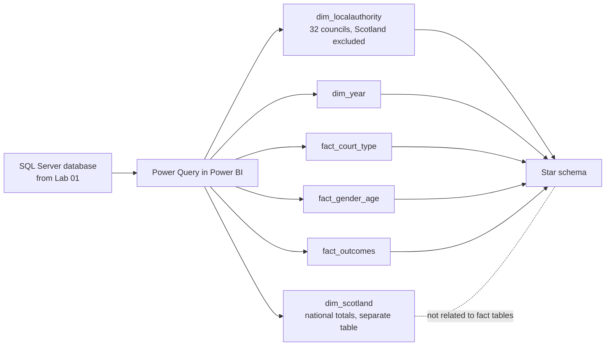

# Lab 02: Building a Power BI Data Model

## Objectives

- **Part 1:** Import the three SQL Server tables and plan the grain
- **Part 2:** Build dim_localauthority properly, with the Scotland row handled at the model level
- **Part 3:** Build the fact tables and dim_year
- **Part 4:** Wire up relationships and write the first DAX measures

## Background / Scenario

Lab 01 left three flat tables in SQL Server, each carrying the same
`IsScotlandTotal` flag as protection against double-counting, and no shared
model between them. Every question so far has meant writing a fresh T-SQL
query from scratch. This lab turns that into a star schema: one shared
local authority dimension, one shared year dimension, and fact tables that
hang off both, so a report can filter by council or by year once and have
every measure respond correctly.

The Scotland row from Lab 01 gets handled differently here than it was in
SQL. In T-SQL, a flag on the fact rows was enough, because every query
explicitly chose whether to include it. In a Power BI model, anyone dragging
`LocalAuthority` onto a visual doesn't see the flag unless they think to
check for it, so this lab moves the decision earlier: **Scotland doesn't
belong in `dim_localauthority` at all.** It becomes its own small table, so
including it in a report is a deliberate choice (adding a second table to a
visual) rather than an easy mistake (not noticing the flag).

## Required Resources

- Power BI Desktop
- The `CommunityPayback` database from Lab 01, containing `clean_court_type`,
  `clean_gender_age`, `clean_outcomes`
- Approximately 3 hours

## Topology



---

## Part 1: Import and Plan the Grain

### Step 1: Get the data

**Home → Get Data → SQL Server** → enter the server name and
`CommunityPayback` as the database → tick `clean_court_type`,
`clean_gender_age`, `clean_outcomes` → **Transform Data**.

### Step 2: Plan the grain

Each row in each source table is one local-authority-year, or one
Scotland-year. That's the grain of every fact table this lab builds: one
row per area per fiscal year, never split further, since the published
statistics don't go below that level. `fact_court_type`,
`fact_gender_age`, and `fact_outcomes` will sit side by side sharing the
same two dimensions rather than being forced into a single wide fact table.

> **Three narrow fact tables beats one wide one here.** A single fact table
> combining court type, gender/age, and outcome columns for every
> local-authority-year would work, since they already share the same key,
> but it would blur three genuinely separate questions (how orders were
> imposed, who they were imposed on, how they ended) into one table where
> a measure written carelessly for one topic can accidentally pull columns
> from another. Keeping them separate, joined only through the shared
> dimensions, keeps each fact table's purpose legible on its own.

<details>
<summary>Expected result, Part 1</summary>

Three queries in the Power Query editor, each showing 330 rows (320 council
rows plus 10 Scotland rows), matching Lab 01's `clean_*` table counts
exactly.

</details>

---

## Part 2: dim_localauthority and the Scotland Split

### Step 1: Build the council-only dimension

Reference `clean_outcomes` → keep only `LocalAuthority` → **Filter**
`IsScotlandTotal = FALSE` → **Remove Duplicates**. Rename this query
`dim_localauthority`.

<details>
<summary>Expected result, Part 2, Step 1</summary>

32 rows, one per Scottish council, matching the distinct local authority
count confirmed in Lab 01. If this comes back at 33, the filter step ran
after Remove Duplicates instead of before, or didn't run at all.

</details>

### Step 2: Build the Scotland-only table

Reference `clean_outcomes` again → keep `LocalAuthority`, `FiscalYear` →
**Filter** `IsScotlandTotal = TRUE`. Rename `dim_scotland`. This table
exists to hold the national row, it is not related to the fact tables in
this model.

> **Why not relate it.** Relating `dim_scotland` to the fact tables the
> normal way would put Power BI right back in Lab 01's original trap: a
> visual that includes both `dim_localauthority` and `dim_scotland` context
> at once would sum council figures and the national figure together,
> silently double-counting exactly as the raw SQL query did before the
> flag existed. Keeping it unrelated forces anyone who wants a Scotland
> trend to build that visual deliberately, filtered to `dim_scotland` on
> its own, never mixed with council-level detail.

### Step 3: Add a council-code column for a later relationship

Local authority names in this data are the official ONS/gov.scot naming
convention (`"Edinburgh, City of"`, not `"City of Edinburgh"`; `"Na
h-Eileanan Siar"` for the Western Isles). If this model is ever joined to
another Scottish open dataset, like the household waste series elsewhere
in this collection, those names won't match without cleanup.

**Add Column → Custom Column** on `dim_localauthority`:

```
= Text.Trim([LocalAuthority])
```

<details>
<summary>Hint</summary>

This lab doesn't join to another dataset, so this step looks like it does
nothing visible yet. It matters anyway: trimming whitespace here, once,
before any relationship exists, is cheaper than discovering a silent
join failure later because one source has a trailing space and another
doesn't. The waste-data series in this collection hit exactly this kind
of naming mismatch joining council data to population figures.

</details>

<details>
<summary>Expected result, Part 2</summary>

`dim_localauthority` has exactly 32 rows. `dim_scotland` has exactly 10
rows, one per fiscal year, and is not connected to anything else in the
model yet.

</details>

---

## Part 3: Fact Tables and dim_year

### Step 1: Build the three fact tables

Reference each of the three source queries, keep every numeric column plus
`FiscalYear` and `LocalAuthority`, **filter `IsScotlandTotal = FALSE`** on
all three (the flag has done its job now that `dim_localauthority` exists
without it; the fact tables only need the 320 council rows, the 10
Scotland rows already live in `dim_scotland`). Rename the queries
`fact_court_type`, `fact_gender_age`, `fact_outcomes`.

<details>
<summary>Hint</summary>

Filtering the fact tables to council rows only doesn't lose the Scotland
figures, they're preserved separately in `dim_scotland` from Part 2. It
does mean `fact_court_type`, `fact_gender_age`, and `fact_outcomes` each
drop from 330 to 320 rows here, that's expected, not a bug.

</details>

### Step 2: Build dim_year

**Modeling → New Table**:

```dax
dim_year =
DATATABLE(
    "FiscalYear", STRING,
    "YearStart", INTEGER,
    "SortOrder", INTEGER,
    {
        {"2015-16", 2015, 1}, {"2016-17", 2016, 2}, {"2017-18", 2017, 3},
        {"2018-19", 2018, 4}, {"2019-20", 2019, 5}, {"2020-21", 2020, 6},
        {"2021-22", 2021, 7}, {"2022-23", 2022, 8}, {"2023-24", 2023, 9},
        {"2024-25", 2024, 10}
    }
)
```

> **Why not `CALENDAR()`.** The waste-data and retail series in this
> collection build a real date table with `CALENDAR()`, because their data
> has actual dates in it. This data doesn't: `"2015-16"` is a fiscal-year
> label covering April to March, not a single calendar date, and every
> published figure is already aggregated to that whole-year grain. A real
> date table here would invent a precision the source data doesn't have.
> `dim_year` is a small manually-built table instead, with `SortOrder` doing
> the job a real date column would do automatically: keeping
> `"2024-25"` from sorting alphabetically before `"2015-16"` on a chart axis.

### Step 3: Set the sort order

**Model view → click `FiscalYear` column in `dim_year` → Column tools →
Sort by column → `SortOrder`.**

<details>
<summary>Hint</summary>

Skip this step and every chart using `FiscalYear` on an axis sorts the
years alphabetically: `2015-16`, `2016-17`, ... `2024-25` happens to sort
correctly alphabetically in this specific case since the years are
sequential without a century rollover, but relying on that accident is
fragile. Set the explicit sort now so it's correct regardless.

</details>

<details>
<summary>Expected result, Part 3</summary>

Three fact tables, 320 rows each. `dim_year`, 10 rows, sorting correctly
oldest to newest on any axis it's placed on once Step 3 is applied.

</details>

---

## Part 4: Relationships and First Measures

### Step 1: Wire up the relationships

```
fact_court_type[LocalAuthority]  -> dim_localauthority[LocalAuthority]  (many-to-one)
fact_gender_age[LocalAuthority]  -> dim_localauthority[LocalAuthority]  (many-to-one)
fact_outcomes[LocalAuthority]    -> dim_localauthority[LocalAuthority]  (many-to-one)
fact_court_type[FiscalYear]      -> dim_year[FiscalYear]                (many-to-one)
fact_gender_age[FiscalYear]      -> dim_year[FiscalYear]                (many-to-one)
fact_outcomes[FiscalYear]        -> dim_year[FiscalYear]                (many-to-one)
```

All single direction, filtering from dimension to fact. Leave
`dim_scotland` unrelated, as decided in Part 2.

### Step 2: First measures, on fact_outcomes

```dax
Orders Finished = SUM(fact_outcomes[TotalFinished])

Orders Completed Successfully = SUM(fact_outcomes[SuccessfullyCompleted])

Completion Rate =
DIVIDE(
    [Orders Completed Successfully],
    [Orders Finished]
)
```

> **`Completion Rate` recalculates from the row-level totals, it doesn't
> average the stored `CompletionRate` column.** The source workbook
> publishes a `CompletionRate` figure already calculated per row, and it
> would be simpler to just `AVERAGE()` that column across whatever's in
> context. That average would be wrong the moment two councils of very
> different sizes are compared: a straight average of two percentages
> treats a council with 900 orders the same as one with 30, when the real
> combined rate needs to weight by volume. `DIVIDE` over the summed
> numerators and denominators gets that right automatically, the same
> reason the waste-data series recalculates its recycling rate from tonnes
> rather than averaging a stored percentage column.

### Step 3: Confirm the two approaches actually differ

Build a table visual: `dim_localauthority[LocalAuthority]`, then add both
`AVERAGE(fact_outcomes[CompletionRate])` as a quick measure and your
`[Completion Rate]` measure side by side, filtered to a single fiscal year
that includes both large and small councils.

<details>
<summary>Hint</summary>

For a single local authority in a single year the two numbers should match
closely, since there's only one row involved either way. The divergence
only shows up once you remove the `LocalAuthority` filter and look at a
region or multi-year total, that's the case Part 4's warning is actually
about, and it's worth checking directly rather than taking it on faith.

</details>

### Step 4: A measure on fact_court_type

```dax
Total Orders (Court) = SUM(fact_court_type[TotalOrders])

Summary Court Share =
DIVIDE(
    SUM(fact_court_type[SheriffSummary]),
    [Total Orders (Court)]
)
```

### Step 5: Sanity-check against Lab 01

Build a table visual: `dim_localauthority[LocalAuthority]`, `[Orders
Finished]`, `[Completion Rate]`, filtered to `dim_year[FiscalYear] =
"2024-25"`. Compare against the T-SQL query from Lab 01 Part 4. Figures
should match exactly.

<details>
<summary>Expected result, Part 4</summary>

`Completion Rate` for individual councils falls mostly between 60% and 85%,
matching Lab 01's SQL results row for row. `Summary Court Share` sits
noticeably above 80% nationally: Sheriff Summary courts handle the large
majority of Community Payback Orders, which lines up with these being
lower-tier criminal cases rather than the most serious offences. If your
figures don't match Lab 01, check that the fact tables were filtered to
`IsScotlandTotal = FALSE` in Part 3, not left at 330 rows each.

</details>

---

## Troubleshooting

| Symptom | Cause | Fix |
|---|---|---|
| A visual mixing dim_localauthority and dim_scotland shows inflated totals | dim_scotland was related to a fact table despite Part 2's warning | Remove the relationship; dim_scotland stays unrelated by design |
| Completion Rate returns blank for every row | DIVIDE's denominator measure evaluated to 0 or BLANK in the current filter context, likely a broken relationship | Check both fact_outcomes relationships in Model view |
| Years sort alphabetically on a chart axis | Sort by column step in Part 3 wasn't applied, or was applied to the wrong table | Re-check Model view → dim_year[FiscalYear] → Sort by column |
| fact tables show 330 rows instead of 320 | IsScotlandTotal filter in Part 3 Step 1 didn't run, or ran on the wrong query | Re-check the filter step in each of the three fact queries |
| AVERAGE and DIVIDE completion rate measures match exactly at every grain | Test was only run at single-local-authority grain, where they're expected to match | Remove the LocalAuthority filter and compare at a multi-council or Scotland-wide grain instead |

---

## Reflection

1. Why does moving the Scotland row out of `dim_localauthority` entirely
   protect against the double-counting risk more reliably than the
   `IsScotlandTotal` flag did in SQL?
2. A council merges with a neighbour partway through this data's ten-year
   range (this hasn't happened in Scotland in this period, but consider
   it as a hypothetical). What would break in this model, and where would
   you have to intervene?
3. Why does `AVERAGE` of a stored rate column diverge from `DIVIDE` of
   summed numerator and denominator, and which one answers "what is
   Scotland's actual combined completion rate"?

---

## What Went Wrong When I Did This

- **Built `dim_localauthority` from `clean_court_type` instead of
  `clean_outcomes`** on the first pass, then separately built
  `dim_scotland` from `clean_outcomes`. Both tables used the same
  `LocalAuthority` column name, so the mismatch didn't surface as an error,
  Power BI happily related `fact_gender_age` and `fact_outcomes` to a
  dimension that came from a different source table entirely. Everything
  looked fine until a spot-check of council names revealed `dim_localauthority`
  was missing an island authority that happened to load in a different
  row order in `clean_court_type`'s export. Standardised on building every
  shared dimension from one source table, `clean_outcomes`, for
  consistency.
- **Related `dim_scotland` to the fact tables anyway**, on the reasoning
  that leaving a table sitting in the model unconnected felt like leaving
  work unfinished. The very first table visual built afterwards, meant to
  show completion rate by council, silently included the Scotland row as
  a 33rd bar and the total at the bottom of the visual came out roughly
  double what Lab 01's SQL query had already confirmed. Removed the
  relationship and left `dim_scotland` deliberately unrelated, exactly as
  planned in Part 2 before the second-guessing.
- **Wrote the first `Completion Rate` measure as
  `AVERAGE(fact_outcomes[CompletionRate])`** because the column already
  existed in the source and averaging felt like the obvious move.
  Scotland's overall rate computed this way came out noticeably different
  from the rate in the published bulletin's own Scotland-level summary
  table, small councils were pulling the average away from the true
  volume-weighted figure. Rewrote it with `DIVIDE` over the summed
  columns once the mismatch against the published national figure made
  the averaging bug obvious.

---

## Where This Breaks

The star schema is sound and every figure ties back to Lab 01's SQL
queries, but:

- There's no dashboard yet: every question still means building a one-off
  visual by hand
- `Summary Court Share` and `Completion Rate` exist as overall numbers
  with no way yet to see which specific local authorities are driving a
  low or high figure without manually filtering one at a time
- Nothing in this model yet shows a trend across the ten years available,
  every measure so far has only been checked at a single fiscal year

**Next:** [Lab 03: Building the Interactive Dashboard](03-dashboard.md)
