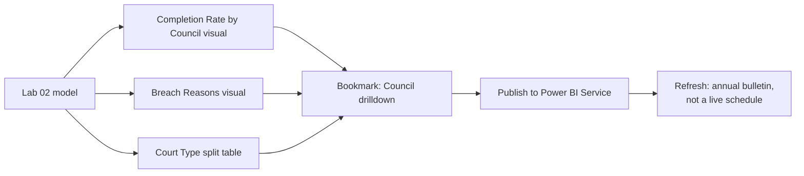

# Lab 03: Building the Interactive Dashboard

## Objectives

- **Part 1:** Build the core dashboard page: completion rate by council, breach reasons, court type split
- **Part 2:** Add bookmarks for a council-drilldown view
- **Part 3:** Conditional-format completion rate, gated against low-volume councils
- **Part 4:** Publish, and be honest about what "refresh" means for an annual government bulletin

## Background / Scenario

Lab 02 left off with a clean star schema and a handful of measures, but no
dashboard: every question still meant opening the model view and building
a one-off table. `Completion Rate` existed as a single overall number, with
no way to see at a glance which councils were driving a low or high figure.

This lab turns the model into something a Justice Social Work manager could
actually open and use: a page they can filter by council or year and read
at a glance, without knowing what a star schema is.

## Required Resources

- Power BI Desktop
- The `.pbix` file from Lab 02
- A Power BI Service account (free or trial licence) for the publish step
- Approximately 3 hours

## Topology



---

## Part 1: The Core Visuals

### Step 1: Completion rate by council

Bar chart: `dim_localauthority[LocalAuthority]` on axis, `[Completion
Rate]` as value, sorted descending, filtered to the most recent
`dim_year[FiscalYear]`. Do not add `dim_scotland` to this visual, per
Lab 02's warning, it stays unrelated for exactly this reason.

<details>
<summary>Expected result</summary>

32 bars, no obviously missing council, rates clustering broadly between
60% and 85% with a handful of outliers at either end. If a bar is
missing entirely, check `dim_localauthority`'s row count from Lab 02
Part 2 rather than assuming the source data is incomplete.

</details>

### Step 2: Breach reasons, nationally

Lab 02 didn't build a measure for individual termination reasons, only the
overall completion rate. Add:

```dax
Orders Revoked (Breach) = SUM(fact_outcomes[RevokedBreach])

Orders Revoked (Review) = SUM(fact_outcomes[RevokedReview])

Orders Ended Early (Positive) = SUM(fact_outcomes[EarlyDischarge])
```

Stacked bar chart: `dim_year[FiscalYear]` on axis, the three reason
measures above plus `[Orders Completed Successfully]` from Lab 02 as
values.

> **Not every non-completion is the same kind of outcome.** `Early
> Discharge` is early release for good progress, a positive outcome despite
> not running the full order length. `Revoked Due to Breach` is a
> compliance failure. Stacking both under one generic "did not complete"
> bucket would flatten a genuine distinction the source data already makes,
> and that a Justice Social Work manager reading this dashboard would
> immediately want kept separate.

### Step 3: Court type split, by council

Table visual: `dim_localauthority[LocalAuthority]`, `[Total Orders
(Court)]`, and:

```dax
High Court Share =
DIVIDE(
    SUM(fact_court_type[HighAppeal]) + SUM(fact_court_type[SheriffSolemn]),
    [Total Orders (Court)]
)
```

Filtered to the most recent year.

<details>
<summary>Hint</summary>

`HighAppeal` and `SheriffSolemn` together represent the more serious end of
the court system relative to `SheriffSummary` and `JusticeOfPeace`. A
council with a high `High Court Share` is seeing Community Payback Orders
used for more serious cases than the national pattern, worth surfacing as
its own measure rather than leaving buried inside the raw court-type
columns.

</details>

### Step 4: Check for councils with too few orders to be meaningful

Add `[Orders Finished]` as a column next to the completion-rate bar chart's
underlying table. Sort by `Completion Rate` ascending and descending in
turn.

<details>
<summary>Hint</summary>

The councils sitting at the extreme ends of the completion-rate ranking are
very likely to be the smallest island authorities, Orkney, Shetland, Na
h-Eileanan Siar, where a total of 30-70 orders finished in a year means a
handful of cases can swing the rate by several percentage points. This is
the same low-volume trap the retail series hits with low-order-count
products; Part 3 fixes it properly, for now just confirm you can see it.

</details>

<details>
<summary>Expected result, Part 1</summary>

Completion rate by council matches Lab 02's table visual exactly for the
same fiscal year. The breach-reasons chart shows `Orders Completed
Successfully` as the largest segment nationally, with `Revoked (Breach)`
the largest of the non-completion categories, ahead of `Revoked (Review)`
and `Early Discharge`. The smallest island authorities sit at both extremes
of the completion-rate ranking, expected at this stage and the reason
Part 3 exists.

</details>

---

## Part 2: Bookmarks for Council Drilldown

### Step 1: Set the default view

With no filters applied beyond the most recent fiscal year, **View →
Bookmarks → Add**. Name it `All Councils`.

### Step 2: Filter to one council and capture a second bookmark

Click a bar for a single local authority, for example Glasgow City, the
largest council by order volume, to cross-filter the page. **Add** a new
bookmark, name it `Council Detail`. Check **Data** is included in the
bookmark's captured state, not just the visual selection.

### Step 3: Build the toggle

Add two buttons, "All Councils" and "Council Detail", each with **Action →
Type: Bookmark** pointing at the matching bookmark.

> **A bookmark captures filter state at the moment it's saved, not a live
> selection.** `Council Detail` here is frozen on whichever council was
> clicked when the bookmark was captured, Glasgow City if you followed
> Step 2 exactly. Clicking a different bar afterward cross-filters the page
> normally, but doesn't update what the `Council Detail` button itself
> restores, that stays fixed until the bookmark is re-saved.

<details>
<summary>Hint</summary>

If clicking "Council Detail" doesn't restore the filter, the bookmark was
probably captured with the **Data** option unchecked in the bookmark pane.
Open the bookmark's options and confirm Data is included, then re-capture.

</details>

<details>
<summary>Expected result, Part 2</summary>

Clicking "Council Detail" cross-filters every visual on the page to the
single council captured in Step 2, with order counts and completion rate
dropping to match that council's own figures. Clicking "All Councils"
restores the unfiltered national view exactly. Toggling back and forth a
few times should return identical numbers each time.

</details>

---

## Part 3: Conditional Formatting, Gated by Volume

### Step 1: Apply conditional formatting to the completion-rate visual

Select the `Completion Rate` value in the bar chart or an accompanying
table → **Conditional formatting → Background color → Rules**. Format
rule: green above 80%, amber 60-80%, red below 60%.

### Step 2: Suppress the low-volume false positives from Part 1 Step 4

```dax
Completion Rate (Filtered) =
VAR FinishedCount =
    CALCULATE( SUM(fact_outcomes[TotalFinished]), ALLEXCEPT(fact_outcomes, dim_localauthority[LocalAuthority]) )
RETURN
    IF( FinishedCount >= 100, [Completion Rate], BLANK() )
```

Use this measure, not the raw one, for the conditional formatting rule and
for the completion-rate bar chart itself.

> **A red bar on 40 finished orders is not the same finding as a red bar on
> 900.** The three smallest island authorities finish somewhere between 25
> and 70 orders in a typical year, low enough that two or three additional
> breaches shift the completion rate by several percentage points on their
> own. Flagging them the same visual shade of red as a large council with a
> genuinely low completion rate at real volume would mislead a manager
> scanning the dashboard quickly, exactly the kind of thing this series has
> already gated once, for the retail series' return rate.

### Step 3: Verify against a known case

Compare a small island authority's raw and filtered completion rate against
a large council's. Confirm the island authority drops out of the
color-coded visual (or shows blank/grey) while the large council keeps its
color.

<details>
<summary>Expected result, Part 3</summary>

After switching to the filtered measure, the smallest 2-3 councils drop out
of the colour-coded ranking entirely for the years where their order count
falls under 100. Every remaining coloured council has enough volume that a
handful of individual cases can't swing the rate by more than a percentage
point or two, which is the actual bar this gate is trying to hold.

</details>

---

## Part 4: Publish and the Refresh Question

### Step 1: Publish

**Home → Publish**, sign in, choose a workspace.

### Step 2: State plainly what "refresh" means for this data

> **This is an annual government bulletin, not a live operational
> feed.** Justice Social Work Statistics in Scotland is published once a
> year, typically covering the fiscal year that ended the previous March.
> There is no live source to schedule a frequent refresh against, and
> configuring one that checks hourly or daily would just mean Power BI
> Service repeatedly re-querying a SQL Server table that a human updates,
> at most, once every twelve months. The honest configuration is a manual
> or annual refresh, timed to when the next bulletin is expected, not a
> schedule that implies the underlying numbers move more often than they
> actually do.

### Step 3: What updating this model for next year's bulletin actually involves

When the next annual bulletin publishes, the workflow is: download the new
workbook, re-run Lab 01's `BULK INSERT` process against the new file,
appending or replacing the affected fiscal year's rows, then refresh the
Power BI model. `dim_year` needs a new row added by hand (it's a manually
built `DATATABLE`, not a generated calendar), everything else in the model
picks up the new year automatically once the fact tables are refreshed.
Lab 06 covers what happens when a new bulletin also revises a prior year's
already-published figures, which does happen in practice and is a
different problem from simply adding a new year.

### Step 4: Confirm the published report works cross-filtered

Open the published report in a browser, click through both bookmarks, and
confirm conditional formatting rendered the same as in Desktop.

<details>
<summary>Expected result, Part 4</summary>

The published report loads with the "All Councils" bookmark state as
default. Both bookmark buttons work identically to Desktop. Conditional
formatting colours match, though exact shades can render slightly
differently in a browser than in Desktop, the threshold behaviour (which
councils show green, amber, red, or blank) is what actually matters.

</details>

---

## Troubleshooting

| Symptom | Cause | Fix |
|---|---|---|
| A visual mixing council and Scotland bars shows an inflated national bar | dim_scotland was added to a visual alongside dim_localauthority | Remove dim_scotland from the visual; it stays deliberately unrelated |
| Conditional formatting shows red on the smallest island authorities every year | Used the unfiltered Completion Rate measure | Switch the visual to `Completion Rate (Filtered)` |
| Bookmark doesn't restore the council filter | "Data" checkbox was unchecked when the bookmark was captured | Re-capture the bookmark with Data included |
| Breach-reasons chart total doesn't match Orders Finished | One of the reason measures (Transfer, Death, Other) was left out of the stack | Confirm all reason categories from `clean_outcomes` are represented, even small ones |
| Publish fails with a data source error | Power BI Service can't reach the local SQL Server instance without a gateway registered | Install and register an On-premises data gateway, or accept the report works from Desktop only for this lab |

---

## Reflection

1. Why does gating `Completion Rate` on order volume change which councils
   get flagged red, without changing the underlying completion counts at
   all?
2. What's the actual difference between "this report has a refresh
   schedule configured" and "this report's source data changes once a
   year", and would a viewer of the published report be able to tell
   which one they're looking at?
3. A manager asks for the completion-rate ranking sorted with no volume
   gate, so every council appears. What would you tell them about why
   that ranking would be misleading for the smallest authorities?

---

## What Went Wrong When I Did This

- **Added `dim_scotland` to the completion-rate bar chart** to give
  readers a "national average" reference bar alongside the 32 councils,
  reasoning it would be a convenient at-a-glance comparison. The bar for
  Scotland came out roughly the height of the largest individual council
  rather than looking like an aggregate, and it took a moment of confusion
  before remembering Lab 02's warning about exactly this. Removed it from
  the visual and added the national figure as a separate card instead,
  built from `dim_scotland` on its own.
- **Set the volume gate threshold to 10, copying the retail series'
  pattern directly**, without checking whether 10 finished orders meant
  the same thing in this dataset as 10 orders meant there. It didn't: even
  the smallest island authorities finish well over 10 orders most years,
  so the gate did nothing, every council still showed a colour. Went back
  to the actual order-count range in Part 1 Step 4 and set the threshold
  at 100, which is where the smallest authorities' figures actually start
  swinging on small case counts.
- **Built the breach-reasons stacked chart with only two categories,
  Successfully Completed and Revoked (Breach)**, on the assumption those
  were the two outcomes that mattered. The chart's total for each year
  came out visibly lower than `[Orders Finished]`, which should have been
  an immediate signal something was missing, but it took comparing the
  two totals directly to notice `Early Discharge`, `Revoked (Review)`,
  `Transfer Out of Area`, `Death`, and `Other` were all silently excluded.

---

## Where This Breaks

The dashboard reads well but has real gaps:

- Completion rate by council is a single-year snapshot: there's no way
  yet to see whether a council's rate is improving or worsening across
  the ten years of data available
- The volume gate hides small councils from the colour-coded ranking, but
  says nothing about how those same small councils are trending, which a
  manager overseeing them still needs to see
- Nothing on this page shows the gender/age split that the source data
  does provide, at Scotland level, the model has the measures but no
  visual built for them yet

**Next:** [Lab 04: Time Intelligence](04-time-intelligence.md)
