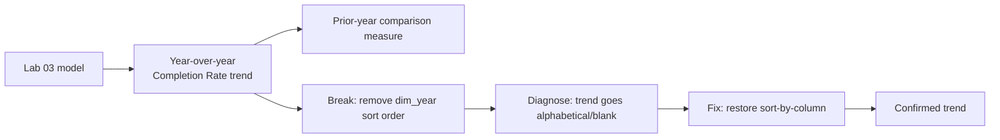

# Lab 04: Time Intelligence

## Objectives

- **Part 1:** Build a year-over-year completion-rate trend across all ten fiscal years
- **Part 2:** Add prior-year comparison and a rolling trend measure
- **Part 3:** Break the model on purpose, then diagnose why the year-over-year comparison failed
- **Part 4:** Fix it and confirm the trend is trustworthy again

## Background / Scenario

Lab 03 left off with a dashboard that answers "how good, and by which
council" as a single-year snapshot. Nothing on that page shows whether a
council's completion rate is improving or getting worse over the ten years
of published data.

This data has no calendar dates in it at all, every figure is already
aggregated to a fiscal year before it's ever published, which is a real
constraint, not a limitation of this model. The standard `DATEADD` and
`SAMEPERIODLASTYEAR` functions the sibling series in this collection use
depend on a genuine calendar date table with a day-level grain underneath
the year. `dim_year` from Lab 02 doesn't have that, it's ten rows, each
already representing a whole fiscal year. Building year-over-year
comparisons here means working directly against `dim_year[SortOrder]`
instead, which is the correct approach for genuinely year-grained data, not
a workaround for missing something the calendar-based pattern needs.

This lab also deliberately breaks the model partway through, on purpose,
because the way this kind of comparison fails silently is worth seeing
once under controlled conditions.

## Required Resources

- Power BI Desktop
- The `.pbix` file from Lab 03
- Approximately 2.5 hours

## Topology



---

## Part 1: The Year-over-Year Trend

### Step 1: Confirm dim_year is fit for purpose

Open `dim_year` from Lab 02. Confirm `FiscalYear`'s sort-by-column is still
set to `SortOrder` (**Model view → click `FiscalYear` → Column tools →
Sort by column**). Confirm every `fact_outcomes[FiscalYear]` value has a
match in `dim_year[FiscalYear]`, there are exactly ten distinct fiscal
years on both sides.

### Step 2: Build the trend visual

Line chart: `dim_year[FiscalYear]` on the axis, `[Completion Rate
(Filtered)]` from Lab 03 as value, filtered to `dim_localauthority` left
unfiltered (national view across all 32 councils).

**Expected result:** a real trend, not a flat line, though the shape may
be gentler than a typical seasonal sales trend since this is a policy
outcome measure, not a demand curve. Watch for a dip or step change around
2020-21, the a year affected nationally by pandemic-era court and service
disruption, worth naming on the chart rather than leaving as an
unexplained anomaly.

### Step 3: Add year-over-year change

Write a measure, `Completion Rate YoY`, that returns the percentage-point
change in `[Completion Rate (Filtered)]` between the fiscal year in
context and the one before it, using `dim_year[SortOrder]` rather than a
calendar function.

<details>
<summary>Hint</summary>

```dax
Completion Rate YoY =
VAR CurrentOrder = SELECTEDVALUE(dim_year[SortOrder])
VAR PriorYearTable =
    FILTER( ALL(dim_year), dim_year[SortOrder] = CurrentOrder - 1 )
VAR PriorRate =
    CALCULATE( [Completion Rate (Filtered)], PriorYearTable )
RETURN
    [Completion Rate (Filtered)] - PriorRate
```

`ALL(dim_year)` clears any existing year filter before re-applying the
shifted one, the same role `DATEADD` plays against a calendar table, just
written explicitly since there's no calendar structure for a built-in
function to walk. Subtracting rates directly gives a percentage-point
difference, which reads more naturally for a rate metric than a percentage
change of a percentage would.

</details>

### Step 4: Sanity-check the earliest year

`dim_year`'s first row, 2015-16, has no prior year in the data at all.
Confirm `Completion Rate YoY` returns blank for that year rather than a
wrong number.

<details>
<summary>Expected result, Part 1</summary>

The trend line shows a broadly stable completion rate across most years,
commonly in the high 60s to low 70s percent nationally, with a visible dip
around 2020-21. `Completion Rate YoY` is blank for 2015-16 and shows a
real percentage-point figure, positive or negative, for every year after
it. A YoY value for 2015-16 signals `ALL(dim_year)` isn't correctly
clearing the filter before the `SortOrder - 1` lookup.

</details>

---

## Part 2: Prior-Year Comparison and a Rolling Trend

### Step 1: A dedicated prior-year value measure

Some visuals need the raw prior-year rate, not just the change. Write
`Completion Rate (Prior Year)`, reusing the same `SortOrder - 1` pattern
from Part 1 Step 3 but returning `PriorRate` directly instead of the
difference.

Add both the current-year and prior-year measures to a combo chart, so a
reader sees this year against last year at a glance without doing the
subtraction themselves.

### Step 2: A 3-year rolling average

```dax
Completion Rate 3Y Avg =
VAR CurrentOrder = SELECTEDVALUE(dim_year[SortOrder])
VAR WindowYears =
    FILTER( ALL(dim_year), dim_year[SortOrder] > CurrentOrder - 3 && dim_year[SortOrder] <= CurrentOrder )
RETURN
    AVERAGEX( WindowYears, CALCULATE([Completion Rate (Filtered)]) )
```

<details>
<summary>Hint</summary>

`AVERAGEX` iterates the three-year window row by row, re-evaluating
`[Completion Rate (Filtered)]` inside each year's own filter context via
`CALCULATE`. A plain `AVERAGE(fact_outcomes[CompletionRate])` filtered to
the same three years would average the stored per-row rate instead, the
same mistake Lab 02 already ruled out for a single year, and it compounds
here across three years of differently-sized councils instead of one.

</details>

Add as a third line on the trend chart. It should smooth the year-to-year
noise, including flattening some of the 2020-21 dip's sharpness relative
to the raw annual line.

### Step 3: Apply the same pattern to a council, not just the national view

Filter the trend to a single mid-sized council (not the smallest island
authorities, which Lab 03's volume gate already excludes from most of
this). Confirm `Completion Rate YoY` and `Completion Rate 3Y Avg` both
recompute correctly for that one council rather than silently falling back
to the national figure.

<details>
<summary>Hint</summary>

If the council-filtered trend looks identical to the national one, the
`SortOrder`-based `FILTER(ALL(dim_year), ...)` pattern is correctly
clearing the year filter, but something in the measure is also clearing
the council filter it shouldn't touch. Check that `ALL()` is applied only
to `dim_year`, never to `dim_localauthority`.

</details>

<details>
<summary>Expected result, Part 2</summary>

At council level, `Completion Rate YoY` and `Completion Rate 3Y Avg` both
show more year-to-year volatility than the national trend, expected for
any smaller population, but should never silently revert to matching the
national figures exactly, that would indicate the council filter is being
cleared somewhere it shouldn't be.

</details>

---

## Part 3: Break It on Purpose

### Step 1: Remove the sort-by-column

**Model view → click `dim_year[FiscalYear]` → Column tools → Sort by
column → (None).**

### Step 2: Watch what happens to the trend

Return to the Part 1 Step 2 line chart.

> **The chart doesn't error, it reorders.** `FiscalYear` is a text column,
> and without an explicit sort-by-column, Power BI falls back to sorting it
> alphabetically. `"2015-16"` through `"2024-25"` happens to still sort
> correctly alphabetically for single-digit-safe years in this specific
> range, so the *chart axis* may look unaffected. What actually breaks is
> the `SortOrder`-based logic inside the YoY and rolling-average measures
> themselves, since `SortOrder` is a separate column from the display
> sort, removing the column's display sort doesn't touch it directly, but
> it's worth confirming that directly rather than assuming, which Step 3
> does.

### Step 3: Confirm what actually broke, and what didn't

1. Does the line chart's axis still read oldest-to-newest, left to right?
2. Do `Completion Rate YoY` and `Completion Rate 3Y Avg` still return the
   same values as Part 1 and Part 2?
3. Is `dim_year[SortOrder]` itself still populated correctly, independent
   of whether anything is using it as a display sort?

<details>
<summary>Hint</summary>

This break is deliberately a near-miss: removing the sort-by-column changes
how the axis *displays*, but the YoY and rolling measures reference
`dim_year[SortOrder]` directly in their own `FILTER` logic, not the display
sort setting. If your measures still compute correctly here, that's the
actual finding: the measures were written defensively enough not to depend
on the same setting the chart axis does. Confirm that's genuinely true
rather than assuming it, by checking the measures' output values, not just
glancing at the chart.

</details>

<details>
<summary>Expected result, Part 3</summary>

The chart axis likely still reads correctly for this specific ten-year
range, since alphabetical and chronological order happen to coincide here.
`Completion Rate YoY` and `Completion Rate 3Y Avg` values are unchanged,
because they were built against `SortOrder` directly rather than relying
on the column's display-sort setting. This is a genuinely different
outcome from the retail series' equivalent break, worth noticing rather
than assuming every date-like break behaves the same way.

</details>

### Step 4: Break something that actually does break the measures

Model view → `dim_year` → change `SortOrder` for `"2020-21"` from `6` to
`60` (simulating a data-entry mistake in the manually built `DATATABLE`
from Lab 02).

**Expected result:** `Completion Rate YoY` for `"2021-22"` now returns
blank or a wrong figure, since `SortOrder - 1` for `"2021-22"` (`7 - 1 =
6`) no longer matches any row, `"2020-21"`'s row now claims `SortOrder =
60`. This is the failure Step 2's near-miss was building toward: a wrong
value in the small manually-maintained `dim_year` table breaks the
measures directly, exactly where Step 2 confirmed the display-sort
setting alone couldn't.

---

## Part 4: Fix and Confirm

### Step 1: Restore the sort-by-column

**Model view → `dim_year[FiscalYear]` → Column tools → Sort by column →
`SortOrder`.**

### Step 2: Restore the correct SortOrder value

Change `"2020-21"`'s `SortOrder` back to `6` in the `dim_year` DATATABLE
definition from Lab 02.

### Step 3: Confirm the trend matches Part 1 and Part 2

Rebuild both visuals. They should match exactly, same shape, same
2020-21 dip, same YoY and rolling-average values for every year.

<details>
<summary>Expected result, Part 4</summary>

The trend, YoY, and rolling-average visuals all match their Part 1/Part 2
values exactly. If `"2021-22"`'s YoY figure is still wrong after Step 2,
`SortOrder` wasn't actually restored, `DATATABLE` definitions require a
full re-entry of the literal values, not a single-cell edit, unlike a
table loaded from SQL Server.

</details>

---

## Troubleshooting

| Symptom | Cause | Fix |
|---|---|---|
| Completion Rate YoY is blank for every year, not just 2015-16 | ALL(dim_year) missing from the FILTER, leaving the current year's filter still active | Confirm the FILTER wraps ALL(dim_year), not dim_year alone |
| Council-filtered YoY matches the national figure exactly | ALL() applied too broadly, clearing the council filter as well as the year filter | Scope ALL() to dim_year only, never dim_localauthority |
| Chart axis reorders after removing the sort-by-column | Expected for this data's specific year range; the axis relies on the sort-by-column, the measures don't | Restore the sort-by-column for a correct axis; measures are unaffected either way |
| YoY breaks after editing dim_year's SortOrder | DATATABLE values are static text in the DAX formula, a single wrong value breaks any row referencing it | Re-enter the full DATATABLE definition from Lab 02, don't assume a partial edit survived |
| 3-year rolling average matches the raw annual figure exactly | WindowYears FILTER condition uses only `= CurrentOrder`, not the `> CurrentOrder - 3` range | Re-check both bounds of the FILTER condition |

---

## Reflection

1. Why did removing `dim_year`'s sort-by-column not break the YoY and
   rolling-average measures, when the equivalent break in a
   calendar-based series elsewhere in this collection breaks its
   `DATEADD` measures directly?
2. What does building year-over-year comparisons against `SortOrder`
   instead of `DATEADD` cost, in terms of what this model could answer if
   it somehow gained month-level data later?
3. The 2020-21 dip is a real, explainable event. What would you need to
   check before including a note about it on the dashboard, versus
   leaving the chart to speak for itself?

---

## What Went Wrong When I Did This

- **Assumed removing the sort-by-column would break the YoY measure the
  same way the retail series' equivalent break works**, and was surprised
  when the numbers came back unchanged. Took a while to realise this
  series' YoY logic was written against `SortOrder` directly rather than
  relying on any Power BI-managed date hierarchy, which is exactly why it
  survived a break that would have broken a `DATEADD`-based measure. Had
  to rewrite Part 3 around a break that actually exercises the real
  dependency, editing `SortOrder` itself, rather than reusing the sibling
  series' break unmodified.
- **Edited a single cell in the `dim_year` Power Query view expecting it
  to persist**, not realising `dim_year` is a DAX `DATATABLE`, not a
  Power Query table. The "edit" didn't stick because there was no
  underlying query to edit, the values live inside the table's DAX
  formula in Model view. Had to go back to Lab 02's table definition and
  edit the literal value there instead.
- **Wrote the first version of `Completion Rate 3Y Avg` with `>=
  CurrentOrder - 3` instead of `> CurrentOrder - 3`**, which pulled in a
  four-year window instead of three for every year after the first. The
  smoothing looked plausible, a rolling average does smooth things out
  either way, so it took comparing the measure's output against a
  manually calculated three-year average in a spare cell to notice the
  window was one year too wide.

---

## Where This Breaks

The year-over-year trend is real and the diagnosis exercise is done, but:

- There's still no way to ask "what would completion rate look like if a
  council reduced its breach rate by a fifth", every measure so far
  describes what happened, not what could happen
- Anyone with access to this report sees every council's numbers, there's
  no way yet to restrict a regional Justice Social Work manager to their
  own council's data
- The rolling average and YoY measures both assume a single unfiltered
  view was tested carefully, but haven't been checked yet under
  row-level security, which changes what "unfiltered" means for a given
  viewer

**Next:** [Lab 05: What-If Analysis and Row-Level Security](05-what-if-rls.md)
