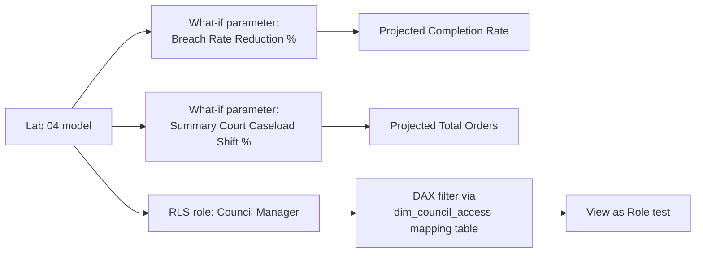

# Lab 05: What-If Analysis and Row-Level Security

## Objectives

- **Part 1:** Build a what-if parameter projecting the effect of a breach-rate reduction on completion rate
- **Part 2:** Extend it to a caseload scenario using the court-type split
- **Part 3:** Implement row-level security so each council's Justice Social Work manager sees only their own council
- **Part 4:** Test RLS as a restricted user, not just as the report author

## Background / Scenario

Two questions close this series out. First: if a council reduced its breach
rate, how much would completion rate actually move, a real question a
Justice Social Work manager would ask before committing to a compliance
initiative aimed at reducing breaches. Second: Scotland's 32 Justice Social
Work services each report to their own council, and a national dashboard
built the way Labs 01-04 built it shows every council's figures to
everyone, which isn't how these services actually govern their own data.

Neither is answerable with what Labs 01-04 built.

## Required Resources

- Power BI Desktop
- The `.pbix` file from Lab 04
- Approximately 3 hours

## Topology



---

## Part 1: What-If on the Breach Rate

### Step 1: Create the parameter

**Modeling → New Parameter → Numeric range.** Name `Breach Rate Reduction
%`, min 0, max 50, increment 5, default 0. Check **Add slicer to this
page**.

<details>
<summary>Expected result, Part 1 setup</summary>

Power BI creates a new table, `Breach Rate Reduction %`, with a generated
measure `Breach Rate Reduction % Value`, and a slicer on the page showing
0 to 50 in steps of 5. It has no relationship line to any other table in
the model view. That absence is expected, not a mistake to fix.

</details>

### Step 2: Inspect what it built

```dax
Breach Rate Reduction % Value =
SELECTEDVALUE('Breach Rate Reduction %'[Breach Rate Reduction %], 0)
```

> **A what-if parameter is a disconnected table, not a relationship.** It
> has no key into `fact_outcomes` or `dim_localauthority`, the slicer just
> sets a value that a measure reads with `SELECTEDVALUE`. Nothing about the
> model "knows" this represents a policy scenario; the measure written
> next is what gives it meaning.

### Step 3: Write the projected completion rate measure

Some breach cases, moved to a successful completion, are the direct
mechanical effect of reducing the breach rate. Others, moved to a
different non-completion category (early discharge, review-based
revocation), aren't a completion at all. This scenario assumes reduced
breaches convert entirely to successful completions, the most optimistic
and simplest version of the policy question, and says so on the report
page rather than implying a more sophisticated model exists.

<details>
<summary>Hint</summary>

```dax
Projected Completion Rate =
VAR ReductionPct = 'Breach Rate Reduction %'[Breach Rate Reduction % Value]
VAR CurrentBreaches = SUM(fact_outcomes[RevokedBreach])
VAR BreachesAvoided = CurrentBreaches * (ReductionPct / 100)
VAR ProjectedCompleted = [Orders Completed Successfully] + BreachesAvoided
RETURN
    DIVIDE( ProjectedCompleted, [Orders Finished] )
```

`[Orders Finished]` doesn't change in this scenario, a breach that becomes
a successful completion is still one finished order, it just finishes in
a different outcome category. Only the numerator moves.

</details>

Card visuals: `[Completion Rate (Filtered)]` from Lab 03 next to
`Projected Completion Rate`, with the parameter's slicer on the page. Move
the slider from 0 toward 50 and confirm the projected rate rises.

<details>
<summary>Expected result, Part 1</summary>

At 0% reduction, `Projected Completion Rate` equals `[Completion Rate
(Filtered)]` exactly. At 50%, the projected rate rises by an amount
proportional to how large a share `RevokedBreach` was of total finished
orders for whatever's in filter context, commonly a few percentage points
nationally, more for councils where breach was a larger share of
non-completions to begin with.

</details>

> **This is a mechanical projection, not a forecast.** It assumes every
> avoided breach converts directly to a successful completion, with no
> account for why breaches happen or whether a compliance initiative would
> actually achieve a uniform percentage reduction across every case type.
> State that plainly next to the card, the same limitation the sibling
> retail series names for its own what-if measures.

---

## Part 2: What-If on Court-Type Caseload

### Step 1: Create the second parameter

**Modeling → New Parameter → Numeric range.** Name `Summary Court Caseload
Shift %`, min -20, max 20, increment 5, default 0.

### Step 2: Frame the real question

Sheriff Summary courts handle the large majority of Community Payback
Orders nationally, confirmed back in Lab 02. If summary-court referral
practice shifted, more or fewer cases routed to summary procedure rather
than solemn, what would that do to total order volume for a council,
assuming the underlying offending rate stayed flat? This is a caseload
planning question, not an outcome question, useful for a manager
budgeting staff capacity rather than one assessing compliance.

### Step 3: Write the projected volume measure

Split `[Total Orders (Court)]` into its summary-court and non-summary
parts first, then scale only the summary share, mirroring the retail
series' seasonal/standard revenue split in structure.

<details>
<summary>Hint</summary>

```dax
Projected Total Orders =
VAR ShiftPct = 'Summary Court Caseload Shift %'[Summary Court Caseload Shift % Value]
VAR SummaryOrders = SUM(fact_court_type[SheriffSummary])
VAR OtherOrders = [Total Orders (Court)] - SummaryOrders
VAR ProjectedSummary = SummaryOrders * (1 + ShiftPct / 100)
RETURN
    OtherOrders + ProjectedSummary
```

Applying the shift to the whole total instead of the isolated summary
share would move Sheriff Solemn, High Court, and Justice of the Peace
volume too, none of which this scenario has anything to say about.

</details>

Card visuals: `[Total Orders (Court)]` next to `Projected Total Orders`.

<details>
<summary>Expected result, Part 2</summary>

At 0% shift, `Projected Total Orders` equals `[Total Orders (Court)]`
exactly. Moving the slider to +20% raises the projected total by less than
20% of the whole figure, since Summary Court's share, while large, isn't
100% of orders. If +20% moves the total by close to 20% outright, the
split in Step 3 isn't actually isolating the summary-court share.

</details>

---

## Part 3: Row-Level Security

### Step 1: Create the role

**Modeling → Manage roles → Create.** Name it `Council Manager`.

### Step 2: Why a direct filter on dim_localauthority won't work cleanly

The naive approach is a DAX filter directly on `dim_localauthority`:

```dax
[LocalAuthority] = USERPRINCIPALNAME()
```

This assumes each manager's Power BI Service login email literally equals
a council name, which it never will. Use a mapping table instead.

### Step 3: Build the mapping table

**Modeling → New Table**:

```dax
dim_council_access =
DATATABLE(
    "UserEmail", STRING,
    "LocalAuthority", STRING,
    {
        {"manager.edinburgh@example.gov.scot", "Edinburgh, City of"},
        {"manager.glasgow@example.gov.scot", "Glasgow City"},
        {"manager.aberdeen@example.gov.scot", "Aberdeen City"}
    }
)
```

Relate `dim_council_access[LocalAuthority]` to
`dim_localauthority[LocalAuthority]`, many-to-one, single direction toward
`dim_localauthority`.

<details>
<summary>Hint</summary>

`LocalAuthority` values here have to match `dim_localauthority`'s naming
exactly, `"Edinburgh, City of"`, not `"City of Edinburgh"` or
`"Edinburgh"`. This is the same official gov.scot naming convention Lab 02
Part 2 Step 3 trimmed and flagged as a future join risk, it applies here
too: a typo in this mapping table fails silently, the relationship simply
matches zero rows for that manager rather than raising an error.

</details>

### Step 4: Filter the role through the mapping table

```dax
[UserEmail] = USERPRINCIPALNAME()
```

Applied on `dim_council_access`, not on `dim_localauthority` directly.

> **Filter the access table, not the data table, whenever the access rule
> isn't itself a column on the data.** `dim_localauthority` has no email
> column and shouldn't gain one. Justice Social Work is a statutory
> council function; who has access to which council's figures is an
> administrative fact about staffing, not a fact about the local
> authority itself, and belongs in its own table for exactly that reason.

<details>
<summary>Expected result, Part 3</summary>

The model view shows a new single-direction relationship from
`dim_council_access` to `dim_localauthority`, and the `Council Manager`
role in **Manage roles** shows one DAX filter expression on
`dim_council_access`, not on `dim_localauthority` itself. Nothing changes
yet in the report view. RLS has no visible effect until you actually view
as that role in Part 4.

</details>

---

## Part 4: Test as a Restricted User

### Step 1: View as role, inside Power BI Desktop

**Modeling → View as → check Council Manager → Other user →** enter
`manager.glasgow@example.gov.scot`.

**Expected result:** every visual on every page filters to Glasgow City
only, the completion-rate chart, the breach-reasons chart, the court-type
table, the year-over-year trend, and both what-if cards from Parts 1 and
2, none of which were built with RLS in mind.

> **RLS applies model-wide, retroactively, to visuals built before the
> role existed.** That's the entire point of building it at the model
> layer instead of filtering each visual by hand, and testing it against
> pages designed in Labs 03 and 04, with no awareness RLS would exist
> later, is exactly what proves that.

### Step 2: Confirm dim_scotland's isolation holds under RLS too

With the Glasgow role active, check any card built from `dim_scotland`
(the national completion-rate reference card from Lab 03).

**Expected result:** the Scotland-level card is unaffected by the Glasgow
filter, since `dim_scotland` was deliberately left unrelated to the rest
of the model back in Lab 02. A Glasgow manager can still see the national
figure for context, they just can't see any other individual council's
breakdown. Confirm this is the behaviour you actually want, not an
oversight: a manager comparing their own council against the national
average is a reasonable thing to allow, comparing against a named
neighbouring council may not be, depending on local policy, and this
model's current design permits the first and blocks the second as a
direct consequence of Lab 02's original unrelated-table decision.

<details>
<summary>Hint</summary>

If the Scotland card also disappeared or zeroed out under the Glasgow
role, RLS is reaching a table it was never related to, which would mean
something changed the `dim_scotland` relationship since Lab 02. Check
Model view for any relationship touching `dim_scotland` before assuming
the RLS role definition itself is at fault.

</details>

### Step 3: Confirm the what-if parameters still work under RLS

With the role active, move both sliders from Parts 1 and 2.

**Expected result:** `Projected Completion Rate` and `Projected Total
Orders` both recalculate against Glasgow City's own figures only, since
both measures read from `fact_outcomes` and `fact_court_type`, which
relate directly to `dim_localauthority`, unlike the retail series'
synthetic inventory table, which had no such path. Confirm this directly
by comparing the projected values against Glasgow's own unrestricted
numbers rather than assuming it, the same check Lab 04 already established
as the standing habit for this kind of claim.

<details>
<summary>Expected result, Part 4</summary>

Both what-if measures recalculate correctly under the Glasgow role, moving
from Glasgow's own baseline rather than the national one. The Scotland
reference card stays at the national figure throughout, unaffected by the
council-level RLS filter, by design.

</details>

### Step 4: Publish and assign the role for real

After publishing to Power BI Service: **dataset settings → Security →**
add each manager's actual email under the `Council Manager` role.

**Troubleshooting:** RLS in Desktop's "View as" is a simulation. The real
test is a second person, signed in with their own account, opening the
published report. If that's not practical to arrange, state plainly that
RLS was verified in Desktop only, not against a live second account.

---

## Troubleshooting

| Symptom | Cause | Fix |
|---|---|---|
| Projected Completion Rate doesn't move with the slider | Measure references the parameter column instead of the generated Value measure | Use `'Breach Rate Reduction %'[Breach Rate Reduction % Value]` |
| Projected Total Orders changes by close to the full shift percentage | Shift applied to the whole total instead of the isolated summary-court share | Re-check the OtherOrders/ProjectedSummary split in Part 2 Step 3 |
| View as Role shows all councils | Role filter applied to dim_localauthority directly instead of dim_council_access | Move the filter onto dim_council_access, confirm relationship direction |
| A manager's council shows zero rows under View as Role | LocalAuthority spelling in dim_council_access doesn't exactly match dim_localauthority (e.g. "Edinburgh" vs "Edinburgh, City of") | Copy the exact spelling from dim_localauthority, not a shorthand version |
| dim_scotland card disappears under a council role | dim_scotland picked up a relationship to the rest of the model since Lab 02 | Check Model view; dim_scotland should remain unrelated by design |
| RLS works in Desktop but not after publishing | Role has no members assigned in Service | Add emails under dataset Security settings |

---

## Reflection

1. Why does `Projected Completion Rate` assume avoided breaches convert
   entirely to successful completions, and what would a more cautious
   version of this measure need to account for instead?
2. `dim_scotland` stays visible under every council's RLS role by design,
   is that the right default for every Scottish council, or could a
   local policy reasonably want the national comparison hidden too, and
   what would change in the model if it did?
3. If a council merges with a neighbour (hypothetically, as raised in Lab
   02's reflection), what has to change in `dim_council_access` for RLS
   to stay correct, versus what changes elsewhere in the model?

---

## What Went Wrong When I Did This

- **Applied the breach-rate reduction to `[Orders Finished]` as well as
  the numerator**, on the first version of `Projected Completion Rate`,
  reasoning that fewer breaches might mean fewer orders reaching a
  termination decision at all. That's a different and much harder claim
  than the one this lab actually needed. Reworked it so `[Orders
  Finished]` stays fixed and only the completed/non-completed split
  moves, which matches the simpler, statable assumption in Part 1 Step 3.
- **Wrote the RLS filter directly on `dim_localauthority`** using
  `USERPRINCIPALNAME()` matched against council name text, the same
  mistake the retail series' own build log records for country names.
  "View as Role" returned zero rows for every test manager before
  reworking it through `dim_council_access`.
- **Typed `"City of Edinburgh"` into the access mapping table** instead of
  the official `"Edinburgh, City of"` naming `dim_localauthority` actually
  uses. The Edinburgh test manager saw an empty report, no error, just
  every visual returning blank, which took longer to diagnose than it
  should have because a relationship matching zero rows looks identical
  in the model view to one matching correctly.

---

## Where This Breaks, and What's Next

The model can project a breach-reduction scenario and a caseload shift,
and restrict each council manager to their own local authority's figures,
but neither what-if measure accounts for why breaches or caseload actually
change, both are mechanical projections stated as such, and the RLS
mapping table is maintained by hand rather than sourced from wherever
council staff accounts actually live.

One gap this lab hasn't touched at all: everything so far assumes the
published bulletin never revises a year it already published. Scottish
Government statistics do get revised, a later bulletin can restate a
prior year's figures without warning, and nothing in this model can tell
the difference between a genuine year-over-year change and a silent
correction to last year's number. Lab 06 changes that setup.

**Next:** [Lab 06: Capstone, When a Published Year Gets Revised](06-capstone.md)
