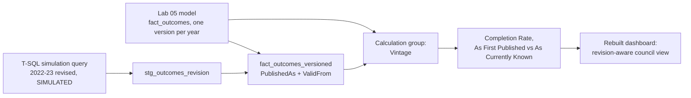

# Lab 06: Capstone, When a Published Year Gets Revised

## Objectives

- **Part 1:** Simulate a bulletin revision in SQL Server, using a second, deliberately different version of a prior year's data
- **Part 2:** Decide between overwriting history and tracking it, and build a revision-aware fact table
- **Part 3:** Write measures that can show "as first published" versus "as currently known" for the same fiscal year
- **Part 4:** Rebuild the dashboard as a revision-aware final report
- **Part 5:** Reconcile the two versions and write up what actually changed

## Background / Scenario

Scottish Government statistical bulletins are not always final the first
time they publish. A later bulletin can restate an earlier year's figures,
a late-reported case gets added, a local authority corrects a
miscategorised order, a national methodology change gets applied
retrospectively. Nothing in Labs 01-05 can tell the difference between a
genuine year-over-year change in completion rate and a silent correction
to a year that already published.

This is not a hypothetical add-on. It is the single most common thing that
breaks a "finished" government-statistics Power BI model in practice: last
year's number stops being one fixed fact. The moment a bulletin gets
revised, every measure this series has built (`Completion Rate`,
`Completion Rate YoY`, the council rankings) has to either quietly show a
number that no longer matches what was reported at the time, or be rebuilt
to hold both versions and let a report say which one it's showing.

The revision used in this lab is simulated: a second, deliberately
different version of the 2022-23 `clean_outcomes` figures, built directly
in SQL Server rather than waiting for a real Scottish Government revision
to actually happen. It's labelled as simulated throughout, the same rule
Lab 02 applied to keeping the Scotland row separate and Lab 05 applied to
`dim_council_access`: every table that isn't literally the published
bulletin says what it is, in the database, not just in this lab's notes.

### Why a Type 2 pattern, and why not just overwrite the row

The obvious approach when a new bulletin arrives is to re-run Lab 01's
load and let the new figures replace the old ones. That's the right choice
for adding a new year. It's the wrong choice for a revision to a year
that's already been reported on, published, or presented to a committee,
because overwriting silently changes what "last year's completion rate"
meant in every report, presentation, or decision that already cited the
old figure, with no record that a change happened at all. What this lab
actually needs is the same problem a Type 2 slowly changing dimension
solves in a conventional data warehouse: keep every version of a row that
was ever true, tagged with when it was true, rather than losing history
every time a value changes. Applied here to a fact table instead of a
dimension, since it's the outcome figures themselves that revise, not a
council's name or attributes.

## Required Resources

- Power BI Desktop, with Tabular Editor 2 or later installed (calculation
  groups aren't available in the standard Power BI Desktop UI as of this
  writing; they're written through the external tools ribbon)
- The `.pbix` file from Lab 05
- SSMS, connected to the `CommunityPayback` database, for Part 1's
  simulation queries. There is no download for the revised data this lab
  uses, because no real revision to this specific year has actually
  happened; the simulation stands in for one.
- Approximately 4 hours

## Topology



---

## Part 1: Simulate a Bulletin Revision

### Step 1: Build a deliberately different version of one year's outcomes

Pick 2022-23. In a real revision, a handful of councils' figures change,
not all 32, and the change is usually small, a few dozen orders reclassified,
not a wholesale rewrite. Simulate that shape directly in T-SQL rather than
inventing arbitrary new numbers:

```sql
USE CommunityPayback;
GO

CREATE TABLE stg_outcomes_revision (
    FiscalYear      CHAR(7)       NOT NULL,
    LocalAuthority  NVARCHAR(100) NOT NULL,
    TotalFinished   INT           NOT NULL,
    SuccessfullyCompleted INT     NOT NULL,
    EarlyDischarge  INT           NOT NULL,
    RevokedReview   INT           NOT NULL,
    RevokedBreach   INT           NOT NULL,
    TransferOutOfArea INT         NOT NULL,
    Death           INT           NOT NULL,
    Other           INT           NOT NULL
);

-- Start from the real, already-loaded 2022-23 figures
INSERT INTO stg_outcomes_revision
SELECT FiscalYear, LocalAuthority, TotalFinished, SuccessfullyCompleted,
       EarlyDischarge, RevokedReview, RevokedBreach, TransferOutOfArea,
       Death, Other
FROM clean_outcomes
WHERE FiscalYear = '2022-23' AND IsScotlandTotal = 0;

-- Simulate a revision: five councils reclassify some RevokedReview
-- cases as RevokedBreach following a methodology correction. Total
-- finished and successfully completed are unchanged, only the
-- breakdown of non-completion reasons shifts.
UPDATE stg_outcomes_revision
SET RevokedBreach = RevokedBreach + 3,
    RevokedReview  = RevokedReview - 3
WHERE LocalAuthority IN
    ('Glasgow City', 'Edinburgh, City of', 'Fife', 'North Lanarkshire', 'Highland')
    AND RevokedReview >= 3;
```

<details>
<summary>Hint</summary>

The `RevokedReview >= 3` guard matters: without it, a council with fewer
than 3 review-based revocations in the real data would go negative under
the `UPDATE`, which is exactly the kind of thing a real methodology
correction would also have to guard against, not just this simulation.
Run this once. Re-running it would shift the same five councils' figures
a second time, compounding a one-off simulated correction into something
that no longer represents a single, real revision event.

</details>

Mark the table as simulated where anyone querying it would see it:

```sql
EXEC sys.sp_addextendedproperty
    @name = N'DataSource',
    @value = N'SIMULATED. Constructed for Lab 06 to demonstrate revision handling, not a real Scottish Government bulletin revision.',
    @level0type = N'SCHEMA', @level0name = 'dbo',
    @level1type = N'TABLE',  @level1name = 'stg_outcomes_revision';
```

### Step 2: Confirm what actually changed

```sql
SELECT
    o.LocalAuthority,
    o.RevokedBreach AS original_breach,
    r.RevokedBreach AS revised_breach,
    o.RevokedReview AS original_review,
    r.RevokedReview AS revised_review,
    o.TotalFinished AS original_total,
    r.TotalFinished AS revised_total
FROM clean_outcomes o
JOIN stg_outcomes_revision r
    ON r.LocalAuthority = o.LocalAuthority AND r.FiscalYear = o.FiscalYear
WHERE o.FiscalYear = '2022-23' AND o.IsScotlandTotal = 0
  AND (o.RevokedBreach <> r.RevokedBreach OR o.RevokedReview <> r.RevokedReview);
```

<details>
<summary>Expected result, Part 1</summary>

Exactly five rows, the five councils named in Step 1's `UPDATE`, each
showing `revised_breach` three higher than `original_breach` and
`revised_review` three lower. `original_total` and `revised_total` are
identical for every row: this simulated revision moves cases between two
non-completion categories, it does not change how many orders finished or
how many completed successfully. `Completion Rate` for 2022-23 is
therefore unchanged by this specific revision, which matters for Part 3:
not every revision changes every downstream number, and this lab picked
one that changes a "which category" measure while leaving the headline
rate untouched on purpose, so the two are genuinely distinguishable rather
than moving together by construction.

</details>

---

## Part 2: A Revision-Aware Fact Table

### Step 1: Why overwriting clean_outcomes is the wrong move here

Simply running `UPDATE clean_outcomes SET ... WHERE FiscalYear = '2022-23'`
would make the model match the revised figures going forward, but it would
also silently rewrite what Lab 04's `Completion Rate YoY` measure showed a
viewer last month, with no record that anything changed. A council that
presented last year's breach figures to committee based on the original
publication has no way to know, from this model alone, that the number
they cited has since moved.

### Step 2: Build fact_outcomes_versioned

```sql
CREATE TABLE fact_outcomes_versioned (
    VersionID       INT IDENTITY(1,1) PRIMARY KEY,
    FiscalYear      CHAR(7)       NOT NULL,
    LocalAuthority  NVARCHAR(100) NOT NULL,
    PublishedAs     NVARCHAR(20)  NOT NULL,  -- 'Original' or 'Revised'
    ValidFrom       DATE          NOT NULL,  -- when this version became current
    TotalFinished   INT           NOT NULL,
    SuccessfullyCompleted INT     NOT NULL,
    EarlyDischarge  INT           NOT NULL,
    RevokedReview   INT           NOT NULL,
    RevokedBreach   INT           NOT NULL,
    TransferOutOfArea INT         NOT NULL,
    Death           INT           NOT NULL,
    Other           INT           NOT NULL
);

-- Every fiscal year's original figures, as first published
INSERT INTO fact_outcomes_versioned
    (FiscalYear, LocalAuthority, PublishedAs, ValidFrom, TotalFinished,
     SuccessfullyCompleted, EarlyDischarge, RevokedReview, RevokedBreach,
     TransferOutOfArea, Death, Other)
SELECT FiscalYear, LocalAuthority, 'Original', '2015-06-01',
       TotalFinished, SuccessfullyCompleted, EarlyDischarge, RevokedReview,
       RevokedBreach, TransferOutOfArea, Death, Other
FROM clean_outcomes
WHERE IsScotlandTotal = 0;

-- The five councils' revised 2022-23 figures, as a second, later version
INSERT INTO fact_outcomes_versioned
    (FiscalYear, LocalAuthority, PublishedAs, ValidFrom, TotalFinished,
     SuccessfullyCompleted, EarlyDischarge, RevokedReview, RevokedBreach,
     TransferOutOfArea, Death, Other)
SELECT FiscalYear, LocalAuthority, 'Revised', '2024-06-01',
       TotalFinished, SuccessfullyCompleted, EarlyDischarge, RevokedReview,
       RevokedBreach, TransferOutOfArea, Death, Other
FROM stg_outcomes_revision;
```

<details>
<summary>Hint</summary>

`ValidFrom` uses plausible real bulletin publication dates, not the date
you happen to run this lab. `'2015-06-01'` stands in for whenever the
2022-23 bulletin (published roughly a year after the fiscal year ends)
first appeared, and `'2024-06-01'` for a later bulletin that would have
carried the correction. Getting the exact real dates right doesn't matter
for this lab's mechanics, but the pattern, a real timestamp marking when a
version became current, is what a genuine implementation would need to get
right, since it's what lets a report answer "what did we know as of
committee date X."

</details>

### Step 3: Confirm every non-revised year has exactly one version

```sql
SELECT FiscalYear, LocalAuthority, COUNT(*) AS version_count
FROM fact_outcomes_versioned
GROUP BY FiscalYear, LocalAuthority
HAVING COUNT(*) > 1;
```

<details>
<summary>Expected result, Part 2</summary>

Exactly five rows come back, one per revised council, each showing
`version_count = 2`. Every other fiscal-year/council combination across
the other 27 councils and nine unrevised years has exactly one version,
confirming the revision only touched what Part 1 actually changed and
nothing else was duplicated by accident in the load.

</details>

---

## Part 3: Measures for Two Vintages of the Same Year

### Step 1: Why base measures still need to exist first

A calculation group doesn't replace measures. Before building it, write
`Completion Rate (Base)` and `Orders Revoked Breach (Base)` against
`fact_outcomes_versioned`, without hardcoding which `PublishedAs` value
they use. The vintage logic belongs in calculation items, not duplicated
into each base measure, the same separation Lab 06 of the sibling retail
series applies to its own `Channel Scope` calculation group.

### Step 2: Build the Vintage calculation group

Open the model in **External Tools → Tabular Editor**. Create a
calculation group named `Vintage`, with two calculation items: `As First
Published` and `As Currently Known`.

```dax
// Calculation item: As First Published
CALCULATE(
    SELECTEDMEASURE(),
    fact_outcomes_versioned[PublishedAs] = "Original"
)
```

```dax
// Calculation item: As Currently Known
VAR LatestPerYear =
    SUMMARIZE(
        fact_outcomes_versioned,
        fact_outcomes_versioned[FiscalYear],
        fact_outcomes_versioned[LocalAuthority],
        "MaxValidFrom", MAX(fact_outcomes_versioned[ValidFrom])
    )
RETURN
    CALCULATE(
        SELECTEDMEASURE(),
        TREATAS( LatestPerYear, fact_outcomes_versioned[FiscalYear], fact_outcomes_versioned[LocalAuthority], fact_outcomes_versioned[ValidFrom] )
    )
```

<details>
<summary>Hint</summary>

`As First Published` is simple: every fiscal year has exactly one
`'Original'` row, so filtering to it always returns a single, unambiguous
version. `As Currently Known` is harder, because for the 27 unrevised
councils there is only the `'Original'` row to fall back to, while for the
five revised councils there are two rows and only the later one, matching
the max `ValidFrom` for that specific council-year, should count. The
`SUMMARIZE`/`TREATAS` pattern computes "the latest valid-from date, per
council-year" as its own table first, then uses it to filter
`fact_outcomes_versioned` down to exactly one row per council-year, the
current one, regardless of whether that council-year has one version or
two. A simpler `MAX(ValidFrom)` on its own, without grouping by council
and year first, would incorrectly pick the single latest date across the
*entire* table and apply it everywhere, which would filter out every
unrevised council's only row.

</details>

### Step 3: Rewrite the base measures

```dax
Completion Rate (Base) =
DIVIDE(
    SUM(fact_outcomes_versioned[SuccessfullyCompleted]),
    SUM(fact_outcomes_versioned[TotalFinished])
)

Orders Revoked Breach (Base) = SUM(fact_outcomes_versioned[RevokedBreach])
```

<details>
<summary>Expected result, Part 3</summary>

With `Vintage = As First Published` applied, `Completion Rate (Base)` for
every fiscal year, including 2022-23, matches Lab 03's original
`Completion Rate (Filtered)` values exactly, since the original figures
are unchanged. With `Vintage = As Currently Known`, every year except
2022-23 still matches. For 2022-23, `Completion Rate (Base)` is identical
between the two vintages, per Part 1's design (this revision didn't touch
`TotalFinished` or `SuccessfullyCompleted`), but `Orders Revoked Breach
(Base)` for the five revised councils differs by exactly 3 between
vintages, and for the other 27 councils is identical under both.

</details>

---

## Part 4: The Revision-Aware Final Dashboard

### Step 1: Rebuild Lab 03's core visuals with a vintage slicer

Using the pattern from Lab 03 Part 1, rebuild the completion-rate-by-
council visual and the breach-reasons chart, but add a slicer bound to the
`Vintage` calculation group's items so a viewer can toggle between `As
First Published` and `As Currently Known`.

### Step 2: Add an As-Published-vs-Current comparison visual

New to this lab: a visual that puts both vintages side by side rather than
picking one. Table visual, `dim_localauthority[LocalAuthority]` on rows,
filtered to `dim_year[FiscalYear] = "2022-23"`, with `Orders Revoked
Breach (Base)` under both `As First Published` and `As Currently Known` as
separate columns, plus a computed difference.

<details>
<summary>Hint</summary>

A calculation group's items don't automatically become separate columns
the way two different base measures would. Add the calculation group as a
field on the visual (or use two card visuals, each with the slicer
individually set, if the table approach proves awkward), the same
mechanism the retail series' capstone uses for its `Channel Scope` legend,
applied here to columns instead of a chart series.

</details>

### Step 3: Carry the volume gate and RLS forward

Confirm Lab 03's `Completion Rate (Filtered)` volume gate still applies
sensibly once rebuilt against `fact_outcomes_versioned`: the `ALLEXCEPT`
pattern needs to account for `PublishedAs`/`Vintage` now being part of the
filter context, not just `LocalAuthority`. Confirm Lab 05's `Council
Manager` RLS role still restricts `fact_outcomes_versioned` correctly:
`dim_council_access` filters `dim_localauthority`, which now has one
additional fact table filtering from it, so a correctly-built role should
need zero changes, the same result Lab 05 Part 4 found when RLS was
carried forward onto a second fact table.

<details>
<summary>Hint</summary>

If the volume gate looks like it's now gating on the wrong count once
`Vintage` is in play, check whether `ALLEXCEPT` is clearing the
`PublishedAs` filter along with everything else it wasn't meant to touch.
The gate should count orders within whichever vintage the slicer has
selected, not across both versions combined.

</details>

<details>
<summary>Expected result, Part 4</summary>

The vintage slicer correctly changes the breach-reasons figures for the
five revised councils in 2022-23 and leaves every other council-year
combination unchanged between the two settings. The comparison table
shows a difference of exactly 3 for the five affected councils and 0 for
every other row. Under the Glasgow `Council Manager` role, both vintages
restrict to Glasgow-only figures without any change to the RLS role
definition itself.

</details>

---

## Part 5: Reconciliation and the Write-Up

### Step 1: Reconcile the revision against what Part 1 actually changed

Build a table visual: `Vintage` on rows (both items), filtered to
2022-23, `Orders Revoked Breach (Base)` and `Completion Rate (Base)` as
values. Confirm `Completion Rate (Base)` is identical between vintages
(this simulated revision never touched it) and `Orders Revoked Breach
(Base)` differs by exactly 15 in total (3 per council × 5 councils),
matching Part 1's simulation precisely.

### Step 2: Write the revision finding

State, in a text box on the final dashboard page, what changed between the
two vintages, which five councils were affected, and why `Completion
Rate` itself was unaffected even though the underlying breach figures
moved. Say plainly that this specific revision is simulated, constructed
to demonstrate the mechanism, not a record of a real Scottish Government
correction, the same distinction Lab 01 drew for the real Scotland-row
data versus anything built for teaching purposes in this series.

<details>
<summary>Expected result, Part 5</summary>

The reconciliation table confirms the exact numbers from Part 1: zero
difference in `Completion Rate (Base)`, a 15-order total difference in
`Orders Revoked Breach (Base)`, isolated to five named councils. The
write-up states both what changed and what a viewer should and shouldn't
conclude from a simulated single-year revision affecting five out of 32
councils.

</details>

---

## Troubleshooting

| Symptom | Cause | Fix |
|---|---|---|
| `As Currently Known` returns the same figures as `As First Published` for every council | TREATAS filter not correctly matching on the FiscalYear/LocalAuthority/ValidFrom combination | Check the SUMMARIZE grouping includes both FiscalYear and LocalAuthority, not FiscalYear alone |
| `As Currently Known` shows blank for the 27 unrevised councils | MAX(ValidFrom) computed globally instead of per council-year, filtering out councils with only one version | Confirm SUMMARIZE groups by LocalAuthority as well as FiscalYear before taking MAX |
| Comparison table in Part 4 shows a difference for councils outside the five named in Part 1 | UPDATE in Part 1 Step 1 ran without the LocalAuthority IN (...) filter, or ran twice | Re-check stg_outcomes_revision against Part 1 Step 2's verification query |
| version_count check in Part 2 Step 3 returns more than 5 rows | Part 1's UPDATE was run more than once, compounding the simulated revision | Rebuild fact_outcomes_versioned from a fresh load of stg_outcomes_revision |
| Volume gate excludes councils it shouldn't once Vintage is added | ALLEXCEPT clearing the PublishedAs/Vintage filter along with LocalAuthority | Scope ALLEXCEPT to LocalAuthority only, leave Vintage filtering intact |
| RLS role no longer restricts fact_outcomes_versioned | Relationship from fact_outcomes_versioned to dim_localauthority missing or pointing the wrong direction | Confirm the relationship exists and filters from dim_localauthority outward, same direction as the other fact tables |

---

## Reflection

1. Why does the `Vintage` calculation group keep `As First Published` and
   `As Currently Known` both correct simultaneously, where overwriting
   `clean_outcomes` directly would have made only one of them answerable
   at all?
2. This lab chose a versioned fact table with a `PublishedAs`/`ValidFrom`
   pattern over simply appending a `RevisionNote` text column to
   `clean_outcomes`. What specific question would have gotten harder to
   answer with a text-note approach instead?
3. This simulated revision left `Completion Rate` unchanged and only moved
   figures between two non-completion categories. What would need to be
   different in Part 1's simulation for a revision to actually move the
   headline completion rate, and what would that mean for Lab 04's
   year-over-year trend?
4. If a real Scottish Government revision affected all 32 councils rather
   than five, and changed `SuccessfullyCompleted` as well as the breach
   breakdown, what changes in this model: anything in the `Vintage`
   calculation group's DAX, or only the row counts flowing through it?

---

## What Went Wrong When I Did This

- **Built the first version of `As Currently Known` using a plain
  `MAX(fact_outcomes_versioned[ValidFrom])` with no grouping**, expecting
  it to naturally return the latest row per council-year. It didn't: `MAX`
  with no `SUMMARIZE` ahead of it returns a single global maximum date
  across the whole table, `'2024-06-01'`, the revision date, and then
  filters every council, including the 27 that were never revised and
  only have an `'Original'` row dated `'2015-06-01'`, down to zero rows.
  The dashboard went blank for every unrevised council under `As
  Currently Known`, which was a loud enough failure to catch immediately,
  but tracing it to a missing `SUMMARIZE` grouping took longer than
  expected.
- **Ran Part 1's simulated `UPDATE` twice** while testing the query,
  having forgotten it wasn't idempotent. The second run added another 3 to
  `RevokedBreach` for the same five councils, an 6-order shift instead of
  3, which Part 2 Step 3's version-count check caught immediately (it
  still showed exactly 5 rows with `version_count = 2`, since the table
  structure didn't change) but Part 5's reconciliation numbers didn't
  match the write-up until I rebuilt `stg_outcomes_revision` from scratch
  and ran the `UPDATE` exactly once.
- **Assumed RLS would need rework for the new fact table** and spent time
  planning a second mapping table before testing whether the existing one
  just worked. It did, `dim_council_access` filters `dim_localauthority`,
  and `fact_outcomes_versioned` relates to `dim_localauthority` the same
  way every other fact table does, so the existing role covered it with
  zero changes, the same result Lab 05 already established when RLS
  reached a fact table it wasn't originally built alongside. Wasted time
  solving a problem that Lab 05's own design had already prevented.

---

## Looking Back Across the Series

Five labs and a capstone, one dataset published once a year by a
government department that never stopped being useful. Real Scottish
local-authority statistics turned out to contain a working data-quality
lesson (the Scotland row sitting inside the local authority column), a
working dimension-design problem (deciding what "local authority" means
in a model, not just in a spreadsheet), a working time-intelligence
pattern for genuinely year-grained data rather than a calendar-shaped one,
a working security requirement (32 councils, one Justice Social Work
service each), and, with this lab's simulated addition, a working
revision-tracking problem. Only the specific 2022-23 correction in this
lab was constructed. The Scotland row, the fiscal-year grain, the
Scotland-only demographic tables, the real completion rates and breach
patterns: none of that was manufactured to teach a concept. It's what was
already sitting in the bulletin, waiting to be noticed or missed.

The pattern that mattered most across all six labs wasn't any one fix. It
was that almost every real defect was invisible at the point it got
introduced and only surfaced once something later depended on the
assumption being right. A row named `"Scotland"` sitting among 32 real
councils didn't matter until a `GROUP BY` treated it as a 33rd peer. A
`DATATABLE`-based `SortOrder` column looked identical to a working one
until a single wrong value broke exactly one year's comparison and no
other. In this lab, an ungrouped `MAX(ValidFrom)` returned a plausible,
confident date that happened to be wrong for 27 out of 32 councils. Power
BI does not know the difference between a right number and a wrong one
that merely looks right. Building the habit of checking a number against
something you already know the answer to, before trusting what's on the
screen, is the actual skill this series was for. The DAX and the T-SQL
simulation steps were just where that habit got the most practice.
