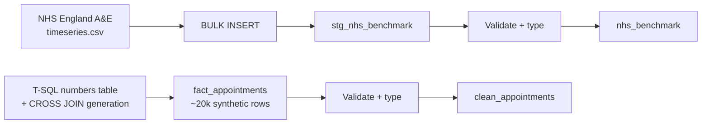

# Lab 01: Generating and Cleaning Hospital Operations Data in SQL Server

## Objectives

- **Part 1:** Generate a synthetic appointment dataset directly in T-SQL, at hospital scale
- **Part 2:** Load the real NHS England trust-level benchmark file via BULK INSERT
- **Part 3:** Fix data types and resolve obvious quality problems with T-SQL queries
- **Part 4:** Answer a first real question with a GROUP BY query

## Background / Scenario

A fictional hospital (call it **Fictional NHS-style Trust**, a name invented
for this series and not a real trust) wants to know which department has the
worst no-show rate and where patients wait longest. No one has built anything
to answer that; appointment data sits in whatever system scheduled it, and
nobody has pulled it into one place.

Before touching any of that, one scoping decision needs to be explicit,
because it shapes every lab that follows: **this BI team is scoped out of
clinical data by policy.** No diagnosis codes, no treatment records, no
patient names, no NHS numbers, nothing that identifies an individual or what
was wrong with them. The brief is operations only: did the appointment
happen, how late, which department, how busy was the place. That's a real
and common split in hospital BI teams: clinical data has its own governance,
its own systems, and usually its own analysts. Scheduling and throughput
data is a different, lower-sensitivity problem, and it's the one this series
solves.

This lab is the same first step as any series in this collection: get raw
data into a shape a human can read. Here there are two sources instead of
one: synthetic row-level appointments this lab builds with T-SQL, and a real
published NHS statistics file loaded into SQL Server and validated with
queries instead of Excel formulas.

## Required Resources

- SQL Server (Developer or Express edition, both free) and SQL Server
  Management Studio (SSMS). These are two different downloads: SQL Server is
  the database engine, a background service with no interface of its own.
  SSMS is the client you use to write and run queries against it. Installing
  one without the other is the single most common first-timer mistake in
  this series; confirm both are installed and that SSMS can connect to your
  local instance before starting Part 1.
- Internet access, once, to download the real benchmark file: go to
  <https://www.england.nhs.uk/statistics/statistical-work-areas/ae-waiting-times-and-activity/>
  and download the latest **A&E Attendances and Emergency Admissions**
  monthly time series (published as an Excel workbook, OGL v3.0 licence, no
  login required). Save it as `ae-attendances-timeseries.xlsx`, then export
  the data sheet as `ae-attendances-timeseries.csv` (Excel: **File → Save
  As → CSV**) since `BULK INSERT` reads a flat file, not a workbook.
- No other internet access is needed: the appointment data is generated
  locally in this lab
- Approximately 2.5 hours

## Topology



---

## Part 1: Generate the Synthetic Appointment Data

### Step 1: Create the database and a numbers table

```sql
CREATE DATABASE HospitalOps;
GO
USE HospitalOps;
GO

CREATE TABLE dbo.numbers (n INT PRIMARY KEY);

;WITH seq AS (
    SELECT 1 AS n
    UNION ALL
    SELECT n + 1 FROM seq WHERE n < 20000
)
INSERT INTO dbo.numbers (n)
SELECT n FROM seq
OPTION (MAXRECURSION 20000);
```

A numbers table is a plain table holding one row per integer from 1 to
20000. It exists so the next step can generate 20,000 appointment rows with
one `INSERT ... SELECT` instead of 20,000 individual `INSERT` statements. The
recursive CTE builds it once; every later query in this lab just reads from
it.

<details>
<summary>Hint</summary>

`OPTION (MAXRECURSION 20000)` raises SQL Server's default recursion limit of
100. Leave it off and the CTE stops at row 100 with no error message loud
enough to notice immediately, just a numbers table that's far too short for
what Step 2 needs.

</details>

### Step 2: Build a department lookup

```sql
CREATE TABLE dbo.department_seed (department_id INT PRIMARY KEY, department_name VARCHAR(50));

INSERT INTO dbo.department_seed (department_id, department_name) VALUES
(1, 'Emergency'),
(2, 'Outpatients'),
(3, 'Radiology'),
(4, 'Cardiology'),
(5, 'Orthopaedics'),
(6, 'General Surgery');
```

Nothing clinical is stored per appointment beyond this label: no diagnosis,
no reason for visit.

### Step 3: Generate appointment rows

```sql
CREATE TABLE dbo.raw_appointments (
    appointment_id   VARCHAR(10),
    department       VARCHAR(50),
    scheduled_time    DATETIME,
    actual_time       DATETIME NULL,
    status            VARCHAR(20),
    wait_minutes      INT NULL
);

INSERT INTO dbo.raw_appointments (appointment_id, department, scheduled_time, status)
SELECT
    'APT' + RIGHT('00000' + CAST(n AS VARCHAR(5)), 5),
    d.department_name,
    DATEADD(MINUTE,
        (ABS(CHECKSUM(NEWID())) % 600) + 480,
        DATEADD(DAY, ABS(CHECKSUM(NEWID())) % 365, '2025-01-01')
    ),
    CASE
        WHEN ABS(CHECKSUM(NEWID())) % 100 < 12 THEN 'no-show'
        WHEN ABS(CHECKSUM(NEWID())) % 100 < 20 THEN 'cancelled'
        ELSE 'attended'
    END
FROM dbo.numbers n
CROSS APPLY (
    SELECT department_name FROM dbo.department_seed
    WHERE department_id = (ABS(CHECKSUM(NEWID())) % 6) + 1
) d
WHERE n.n <= 20000;
```

`CHECKSUM(NEWID())` is this lab's stand-in for a random number generator:
`NEWID()` produces a fresh GUID per row, `CHECKSUM()` turns it into an
integer, and `ABS(...) % 100` maps that to a 0-99 range for the threshold
checks. It's the T-SQL equivalent of Excel's `RAND()`, evaluated once per
row at insert time rather than recalculating on every open.

> **Why random thresholds instead of a fixed count per status.** Hard-coding
> "2,400 no-shows exactly" would produce a suspiciously uniform dataset:
> every department would show close to the same no-show rate by
> construction, defeating the entire point of Lab 01's question. A random
> threshold per row lets some departments drift higher and lower by chance,
> the way a real no-show rate actually would.

<details>
<summary>Hint</summary>

If every row shows the same `department`, check that `CROSS APPLY` is
re-evaluating `NEWID()` per outer row rather than being folded into a single
constant. SQL Server sometimes needs the `CHECKSUM(NEWID())` call inlined,
not pulled into a variable, to force a fresh value on every row: a variable
assigned once before the `INSERT` gives every row the same "random" pick.

</details>

### Step 4: Fill in actual_time and wait_minutes for attended appointments

```sql
UPDATE dbo.raw_appointments
SET actual_time = DATEADD(MINUTE, (ABS(CHECKSUM(NEWID())) % 51) - 5, scheduled_time)
WHERE status = 'attended';

UPDATE dbo.raw_appointments
SET wait_minutes = DATEDIFF(MINUTE, scheduled_time, actual_time)
WHERE status = 'attended';
```

`status` was set first in Step 3 so a no-show or cancellation correctly
leaves `actual_time` and `wait_minutes` NULL. Nobody arrives late to an
appointment they never attended. `(ABS(CHECKSUM(NEWID())) % 51) - 5`
reproduces the `-5` to `45` minute spread the Excel track built with
`RANDBETWEEN(-5,45)`: a negative value means the patient was seen slightly
early, not a data error.

<details>
<summary>Hint</summary>

Run the two `UPDATE` statements in order. The second one reads `actual_time`
from the first, so swapping them or running them in one batch with a stale
plan leaves `wait_minutes` computed against the row's old, unset
`actual_time`.

</details>

<details>
<summary>Expected result, Part 1</summary>

`SELECT COUNT(*) FROM dbo.raw_appointments` returns 20000. Roughly 12%
`no-show`, roughly 8% `cancelled`, the rest `attended` with a
`wait_minutes` value between roughly -5 and 45. Six distinct values in
`department`, roughly even in count (check with
`SELECT department, COUNT(*) FROM dbo.raw_appointments GROUP BY department`).
`actual_time` and `wait_minutes` are NULL for every `no-show` and
`cancelled` row: confirm with
`SELECT COUNT(*) FROM dbo.raw_appointments WHERE status <> 'attended' AND wait_minutes IS NOT NULL`,
which should return 0.

</details>

---

## Part 2: Load the Real NHS Benchmark via BULK INSERT

### Step 1: Create a staging table

```sql
CREATE TABLE dbo.stg_nhs_benchmark (
    period_raw          VARCHAR(50),
    total_attendances    VARCHAR(50),
    attendances_over_4h  VARCHAR(50),
    pct_within_4h        VARCHAR(50),
    emergency_admissions VARCHAR(50)
);
```

Every column in the staging table is `VARCHAR`. NHS England's export won't
have duplicate rows or garbled encoding, but it will have footnote markers
stuck to numbers, blank rows between sections, and a header that spans two
merged cells before conversion to CSV. Loading everything as text first
means a malformed row lands safely instead of failing the whole load; typing
happens after, once the junk rows are gone.

> **National statistics files are clean in a different way than they're
> ready to load.** "Clean" and "typed correctly for SQL Server" are not the
> same thing, and staging as text is what keeps a stray footnote character
> from failing an entire `BULK INSERT` over one bad cell in row 40.

### Step 2: Load the CSV into staging

```sql
BULK INSERT dbo.stg_nhs_benchmark
FROM 'C:\path\to\ae-attendances-timeseries.csv'
WITH (
    FIRSTROW = 2,
    FIELDTERMINATOR = ',',
    ROWTERMINATOR = '0x0a',
    CODEPAGE = '65001'
);
```

Adjust `FIRSTROW` to match wherever the actual header row lands in your
downloaded file; NHS England's export often has several cover-sheet or
notes rows above the real header even after saving as CSV. Adjust the file
path to wherever you saved the CSV.

<details>
<summary>Hint</summary>

If `BULK INSERT` fails with a row-length or conversion error, the file
probably still has cover-sheet or notes text in the rows above the real
data. Open the CSV in a text editor, count down to the actual header row,
and set `FIRSTROW` to one past it. `BULK INSERT` reads from the SQL Server
service account, not your own login, so also confirm the file sits
somewhere that account can read, not just somewhere visible in your own
file explorer.

</details>

### Step 3: Check what actually landed

```sql
SELECT TOP 20 * FROM dbo.stg_nhs_benchmark;

SELECT COUNT(*) FROM dbo.stg_nhs_benchmark WHERE period_raw IS NULL OR period_raw = '';
```

| Column | Expected content | What to check |
|---|---|---|
| period_raw | Month/year text | Consistent format across all rows? |
| total_attendances | Numeric text | Any blank rows for months not yet published? |
| attendances_over_4h | Numeric text | Present for every month? |
| pct_within_4h | Percentage, possibly with a `%` sign or footnote marker | Does it need stripping before it converts to a number? |
| emergency_admissions | Numeric text | Consistent column position across sheet versions? |

### Step 4: Note the grain mismatch now

This file is **one row per month, for the whole trust or region**, not one
row per attendance. That's a completely different grain from the 20,000-row
appointment table built in Part 1. Nothing to fix yet; this is the fact
this lab's design has to respect, and it's why Lab 04 uses this table for
benchmarking rather than blending it row-for-row into `fact_appointments`.

<details>
<summary>Expected result, Part 2</summary>

`stg_nhs_benchmark` holds one row per calendar month, going back several
years, every column still text. A percentage column sitting somewhere in
the high-80s to mid-90s for most recent months. NHS England's published
national 4-hour performance has been below the 95% constitutional standard
for years, so don't be surprised if your downloaded file shows that.

</details>

---

## Part 3: Fix Types and Resolve Quality Problems

### Step 1: Promote the appointment data with explicit types

```sql
CREATE TABLE dbo.clean_appointments (
    appointment_id  VARCHAR(10) PRIMARY KEY,
    department      VARCHAR(50) NOT NULL,
    scheduled_time  DATETIME NOT NULL,
    actual_time     DATETIME NULL,
    status          VARCHAR(20) NOT NULL,
    wait_minutes    INT NULL
);

INSERT INTO dbo.clean_appointments
SELECT
    appointment_id,
    LTRIM(RTRIM(department)),
    scheduled_time,
    actual_time,
    status,
    wait_minutes
FROM dbo.raw_appointments;
```

### Step 2: Find the actual problem

```sql
SELECT department, COUNT(*) AS row_count
FROM dbo.clean_appointments
GROUP BY department
ORDER BY row_count ASC;
```

<details>
<summary>Hint</summary>

Sort ascending, not descending, and look at the top of the result, not the
bottom: a stray duplicate label shows up as a small group sitting apart
from the six real departments, not folded into one of them.

</details>

**Expected result:** roughly even counts across six departments. If a
department label got fat-fingered or generated with inconsistent casing
somewhere in Part 1, you'll see a seventh, near-empty group here, like
`'Radiology '` with a trailing space sitting apart from `'Radiology'`. The
`LTRIM(RTRIM(...))` in Step 1 already handles a trailing-space version of
this; if a seventh group still shows up after that, it's a genuine label
typo, not whitespace, and needs a targeted `UPDATE` to fix.

> **Why check before aggregating.** A no-show rate computed on data with a
> stray duplicate category will quietly split one department's numbers
> into two rows in every `GROUP BY` from here on. Catching it here costs
> one `UPDATE` statement. Catching it after Lab 02's star schema is built
> costs a rebuild.

### Step 3: Clean and type the NHS benchmark table

```sql
CREATE TABLE dbo.nhs_benchmark (
    period_month          DATE NOT NULL,
    total_attendances     INT NULL,
    attendances_over_4h   INT NULL,
    pct_within_4h         DECIMAL(5,2) NULL,
    emergency_admissions  INT NULL
);

INSERT INTO dbo.nhs_benchmark
SELECT
    TRY_CONVERT(DATE, period_raw, 103),
    TRY_CONVERT(INT, REPLACE(total_attendances, ',', '')),
    TRY_CONVERT(INT, REPLACE(attendances_over_4h, ',', '')),
    TRY_CONVERT(DECIMAL(5,2), REPLACE(pct_within_4h, '%', '')),
    TRY_CONVERT(INT, REPLACE(emergency_admissions, ',', ''))
FROM dbo.stg_nhs_benchmark
WHERE TRY_CONVERT(DATE, period_raw, 103) IS NOT NULL;
```

`TRY_CONVERT` returns NULL instead of erroring on a row that doesn't parse,
which is exactly what a cover-sheet or notes row does: it fails the
conversion quietly, and the `WHERE` clause drops it rather than the whole
`INSERT` failing over one bad row. Adjust the date style code (`103` is
`DD/MM/YYYY`) to match whatever format the downloaded file actually uses;
check `stg_nhs_benchmark.period_raw` directly if rows come back unexpectedly
empty.

<details>
<summary>Hint</summary>

If `nhs_benchmark` ends up with zero rows, the date style code is wrong for
your file's format, not the data itself. Run
`SELECT TOP 5 period_raw FROM dbo.stg_nhs_benchmark` and match what you see
against the `TRY_CONVERT` style code table in SQL Server's documentation
before assuming the file is unusable.

</details>

<details>
<summary>Expected result, Part 3</summary>

`clean_appointments` holds exactly six distinct department values and
roughly 20,000 rows (fewer only if a genuinely mistyped label got corrected
in place rather than dropped). `nhs_benchmark` holds no NULL rows in
`period_month`, and `pct_within_4h` sorts and filters as a number, not
text. Confirm with
`SELECT * FROM dbo.nhs_benchmark WHERE pct_within_4h > 90 ORDER BY period_month`;
if that query errors on a type mismatch, `pct_within_4h` didn't convert
correctly in Step 3.

</details>

---

## Part 4: A First GROUP BY Query

### Step 1: Count appointments by department and status

```sql
SELECT
    department,
    status,
    COUNT(*) AS appointment_count
FROM dbo.clean_appointments
GROUP BY department, status
ORDER BY department, status;
```

This is the SQL equivalent of the Excel track's pivot table: one row per
department/status combination, ready to reshape into a rate.

### Step 2: Compute a no-show rate per department

```sql
SELECT
    department,
    COUNT(*) AS total_appointments,
    SUM(CASE WHEN status = 'no-show' THEN 1 ELSE 0 END) AS no_shows,
    CAST(SUM(CASE WHEN status = 'no-show' THEN 1 ELSE 0 END) AS DECIMAL(10,4))
        / COUNT(*) AS no_show_rate
FROM dbo.clean_appointments
GROUP BY department
ORDER BY no_show_rate DESC;
```

`CAST(... AS DECIMAL(10,4))` on the numerator forces a decimal division;
without it, SQL Server performs integer division on two `INT` expressions
and truncates every rate to 0. It's the T-SQL equivalent of the Excel
track's manual `GETPIVOTDATA` formula copied six times, correct, but a
one-off query that has to be rerun by hand every time someone asks the
question again: exactly what Lab 02 replaces with a DAX measure.

<details>
<summary>Hint</summary>

If every row in `no_show_rate` shows `0.0000`, the `CAST` is missing or
placed on the wrong side of the division. `SUM(CASE ...) / COUNT(*)` with
no explicit cast performs integer division in T-SQL, the same way it would
in most C-family languages, and silently floors every result to zero.

</details>

### Step 3: Answer the question this lab set out to answer

Which department has the highest no-show rate? The `ORDER BY no_show_rate
DESC` in Step 2 already sorts it to the top row.

**Expected result:** with random thresholds per row, one or two departments
will sit visibly above the rest by chance. Note which one, because Lab 02
recomputes this properly with DAX and it's worth checking the numbers
agree.

<details>
<summary>Expected result, Part 4</summary>

Six no-show rates, each somewhere close to 0.12 (the `< 12` threshold from
Part 1 Step 3), scattered by a couple of percentage points either side
purely from randomness across roughly 3,300 rows per department. No
department should be wildly off this range: if one shows above 0.20 or
below 0.05, recheck that the `CASE` expression in Part 1 Step 3 evaluated
the thresholds in the right order and that `CHECKSUM(NEWID())` is actually
varying per row rather than reusing one value.

</details>

---

## Troubleshooting

| Symptom | Cause | Fix |
|---|---|---|
| Every department shows the same department label | `CHECKSUM(NEWID())` folded to one value by SQL Server's query optimizer | Inline the `NEWID()` call directly in the expression rather than assigning it to a variable first |
| no_show_rate is 0.0000 for every department | Integer division: `SUM(...)` and `COUNT(*)` are both `INT` | Cast the numerator to `DECIMAL` before dividing |
| BULK INSERT fails with a conversion or row-length error | FIRSTROW still points at a cover-sheet or notes row above the real header | Open the CSV directly, count the real header row, set FIRSTROW to one past it |
| BULK INSERT fails with "cannot be opened" or access denied | File saved somewhere the SQL Server service account can't read | Move the CSV to a folder the service account has permission on, or grant read access explicitly |
| A department count looks abnormally low | Trailing space or case mismatch splitting one department into two labels | LTRIM/RTRIM and standardize case when promoting into clean_appointments |
| nhs_benchmark has zero rows after Part 3 Step 3 | TRY_CONVERT date style code doesn't match the file's actual date format | Check a raw sample of period_raw and match the style code to the actual format |

---

## Reflection

1. What no-show rate did the highest department show, and is the
   difference from the lowest department large enough to be a real
   operational signal, or small enough to be noise from the random
   generation?
2. Why does the NHS benchmark table sit at a different grain than
   `clean_appointments`, and what problem would blending them into one flat
   table right now cause?
3. If a real trust's scheduling system exported this file monthly, which
   Part 3 checks would need to run every time, not just once?

---

## What Went Wrong When I Did This

- **Assigned `CHECKSUM(NEWID())` to a variable before the INSERT**, thinking
  it would be cleaner to read than three inline calls. SQL Server evaluated
  it once and every one of the 20,000 rows got the same department and the
  same status. Had to inline the expression directly in the `SELECT` so it
  evaluated fresh per row.
- **Forgot the DECIMAL cast on the no-show rate query** and stared at a
  column of zeroes for several minutes before remembering that
  `SUM(int)/COUNT(int)` truncates in T-SQL the same way it does in most
  languages I've used, just not the one I was thinking in that morning.
- **Downloaded the wrong NHS file on the first pass.** The England-level
  summary page links to several different time series (attendances,
  admissions, ambulance handover), and I grabbed the wrong one, which had
  no department-shaped breakdown at all. Had to reread what Lab 04 actually
  needed (trust-level 4-hour performance over time) before re-downloading
  the correct series, then hit a second problem: `BULK INSERT` needs a flat
  file, and the download is a workbook, so the CSV export step wasn't
  optional the way it might have seemed on a first skim.

---

## Where This Breaks

- No-show rate required a hand-written GROUP BY query with a DECIMAL cast
  that's easy to get wrong: correct, but it doesn't recalculate cleanly if
  anyone wants to slice it a different way without rewriting the query
- `clean_appointments` and `nhs_benchmark` are separate, unrelated tables:
  nothing connects a department's synthetic wait time to the trust's real
  published 4-hour performance
- The department list was typed once, by hand, with no protection against
  a department being renamed or restructured later, which is exactly
  what happens by the start of Lab 02

**Next:** [Lab 02: Building a Power BI Data Model](02-data-model.md)
