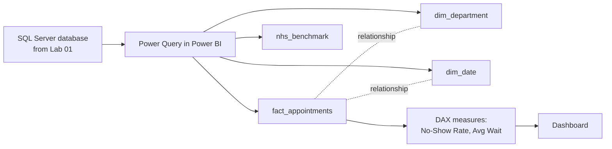

# Lab 02: Building a Power BI Data Model

## Objectives

- **Part 1:** Import the Lab 01 SQL Server database into Power BI and split it into a star schema
- **Part 2:** Resolve the department reorganization problem found in Lab 01
- **Part 3:** Write DAX measures for no-show rate and average wait time
- **Part 4:** Build a dashboard answering Lab 01's question properly
- **Part 5:** Validate against the Lab 01 query results

## Background / Scenario

Lab 01 answered "which department has the highest no-show rate" with a
hand-written GROUP BY query and a DECIMAL cast easy to get wrong: correct,
but fragile, and it told us nothing about wait times or how the synthetic
hospital compares to a real published benchmark.

It also left one thing unresolved: the department list was typed once, by
hand, into a seed table. Real hospitals reorganize departments:
`Cardiology` might split, merge, or simply get renamed mid-year when a new
directorate structure rolls out. This lab plants that exact problem into
the dataset before fixing it, because it's a realistic dimension-table
failure mode, not a hypothetical one.

## Required Resources

- Power BI Desktop (free, Windows)
- The `HospitalOps` SQL Server database from Lab 01, containing
  `clean_appointments` and `nhs_benchmark`
- Approximately 3 hours

## Topology



---

## Part 1: Split into a Star Schema

### Step 1: Load both tables

**Get Data → SQL Server** → server name of your local instance, database
`HospitalOps` → tick `clean_appointments` and `nhs_benchmark` → **Transform
Data**.

### Step 2: Build fact_appointments

From `clean_appointments`, keep: `appointment_id`, `department`,
`scheduled_time`, `actual_time`, `status`, `wait_minutes`. Rename the query
`fact_appointments`.

### Step 3: Build dim_department

Reference `fact_appointments` (right-click → **Reference**, the same
pattern the coffee shop series uses: a fix upstream in `fact_appointments`
should flow through here automatically) → keep `department` only →
**Remove Duplicates**. Rename `dim_department`.

<details>
<summary>Hint</summary>

**Duplicate** copies the query's steps as they stand right now.
**Reference** points a new query at the *output* of the source query, so
any later fix to `fact_appointments` flows through automatically. Pick
wrong here and Part 2's fix won't reach this table without redoing it.

</details>

### Step 4: Build dim_date

Reference `fact_appointments` → keep `scheduled_time` only → extract the
date component → **Remove Duplicates** → rename column to `Date`. Rename
query `dim_date`. Add columns: `Year`, `MonthNumber`, `MonthName`,
`DayOfWeek` via **Add Column → Date** menu options.

<details>
<summary>Expected result, Part 1</summary>

`fact_appointments`: roughly 20,000 rows, matching Lab 01's
`clean_appointments`. `dim_department`: exactly 6 rows. `dim_date`: one row
per distinct calendar date actually present in the appointment data,
close to 365, not 366, since Lab 01 generated dates across a single
non-leap year. `nhs_benchmark`: however many months the downloaded NHS
file covers, untouched and unrelated to the other three tables.

</details>

> **Why a date table, even before Lab 04 needs it.** Building `dim_date`
> properly now, rather than retrofitting it later, is what let the coffee
> shop series and this one both reach Lab 04 without a model rebuild.
> Marking it and relating it correctly is cheap today and expensive to fix
> once forty measures depend on it.

### Step 5: Load the NHS benchmark as its own table

Load `nhs_benchmark` as-is. **Do not** relate it to `fact_appointments` yet:
it's monthly, trust-level, and Lab 01 Part 2 Step 4 already flagged the
grain mismatch. It stays an unrelated table for now; Lab 04 handles the
comparison properly, without a relationship forcing a join that doesn't
really exist.

### Step 6: Close and apply

**Home → Close & Apply**.

---

## Part 2: Resolve the Department Reorganization Problem

### Step 1: Introduce the problem deliberately

Real trusts reorganize mid-year. Simulate it: back in SSMS, run

```sql
UPDATE dbo.raw_appointments
SET department = 'Trauma & Orthopaedics'
WHERE department = 'Orthopaedics'
  AND scheduled_time >= '2025-07-01';

UPDATE dbo.clean_appointments
SET department = 'Trauma & Orthopaedics'
WHERE department = 'Orthopaedics'
  AND scheduled_time >= '2025-07-01';
```

Same department, renamed partway through the year as part of a fictional
directorate merger. Refresh the Power BI model.

### Step 2: Confirm the effect on dim_department

Look at `dim_department` after the refresh.

<details>
<summary>Hint</summary>

If `dim_department` still shows six rows after refreshing, the SQL Server
update didn't take, or Power BI refreshed against a cached result. Confirm
the `UPDATE` actually ran against `clean_appointments` in SSMS (`SELECT
DISTINCT department FROM dbo.clean_appointments` should already show seven
values before you touch Power BI), then confirm `Home → Refresh` (not just
reopening the file) ran in Power BI.

</details>

**Expected result:** seven rows instead of six. `Orthopaedics` and
`Trauma & Orthopaedics` sit as two separate dimension rows, even though
every reasonable business question ("how many appointments did
Orthopaedics have this year") means them as one department.

> **This is a slowly-changing-dimension problem, not a data-entry error.**
> Nothing about this is "dirty data" in the Lab 01 sense: every row is
> internally consistent and spelled correctly. The department genuinely
> was renamed partway through the year. A star schema that treats the old
> and new names as two unrelated dimension rows will silently understate
> Orthopaedics' full-year no-show rate, because half its appointments are
> now filed under a name nothing else points to.

### Step 3: Build a mapping table

**Modeling → New Table**:

```dax
dim_department_map =
DATATABLE(
    "SourceLabel", STRING,
    "CanonicalDepartment", STRING,
    {
        {"Emergency", "Emergency"},
        {"Outpatients", "Outpatients"},
        {"Radiology", "Radiology"},
        {"Cardiology", "Cardiology"},
        {"Orthopaedics", "Trauma & Orthopaedics"},
        {"Trauma & Orthopaedics", "Trauma & Orthopaedics"},
        {"General Surgery", "General Surgery"}
    }
)
```

### Step 4: Add a canonical department column to the fact table

Back in Power Query, on `fact_appointments`, **Merge Queries** with
`dim_department_map` on `department` = `SourceLabel`, keeping only
`CanonicalDepartment`. Rename it `department_canonical`.

<details>
<summary>Hint</summary>

**Merge Queries** needs both queries selected and a join column picked in
each before it lets you choose the join kind. Use a **Left Outer** join:
every row in `fact_appointments` should keep its place even if a label
somehow doesn't match the mapping table, which is a problem worth seeing
rather than silently losing rows over.

</details>

### Step 5: Rebuild dim_department from the canonical column

Using the same reference-not-duplicate pattern from Part 1 Step 3, build a
new `dim_department` sourced from `department_canonical` instead of the
original `department` column. This replaces the Part 1 Step 3 version.

<details>
<summary>Hint</summary>

Reference `fact_appointments`, keep only the canonical column, deduplicate,
and rename the column back to `department` so downstream measures and
visuals don't need to change. The steps are the same shape as Part 1 Step
3, just pointed at a different source column.

</details>

> **Fix the grain at the fact table, not with a filter in every measure.**
> It would be possible to patch this with `SWITCH()` inside every DAX
> measure that touches department, but that means remembering the
> rename in every future measure, forever. Merging the canonical label
> into the fact table once means every measure downstream is correct by
> default, with no special-casing.

### Step 6: Relate and reload

Delete the old `department`-based relationship if Power BI kept one.
Relate `fact_appointments[department_canonical]` to
`dim_department[department]`, many-to-one, single direction. Close &
Apply.

**Expected result:** `dim_department` is back to six rows, and every
appointment that was ever labelled `Orthopaedics` or `Trauma &
Orthopaedics` now rolls up under one canonical department.

<details>
<summary>Expected result, Part 2</summary>

`dim_department`: 6 rows, with `Trauma & Orthopaedics` as the label (not
`Orthopaedics`). `fact_appointments[department_canonical]`: no blanks. If
you see blanks, a label in the source data didn't match any `SourceLabel`
in the mapping table exactly (a stray space is the usual cause, same as Lab
01 Part 3 Step 2). Total row count in `fact_appointments` is unchanged
from Part 1: the merge should add a column, never drop or duplicate rows.

</details>

---

## Part 3: Write the Measures

### Step 1: Total Appointments and No-Shows

```dax
Total Appointments = COUNTROWS(fact_appointments)

No-Shows = CALCULATE( [Total Appointments], fact_appointments[status] = "no-show" )
```

### Step 2: No-Show Rate, the measure Lab 01 couldn't produce cleanly

```dax
No-Show Rate =
DIVIDE( [No-Shows], [Total Appointments] )
```

### Step 3: Average wait time, attended appointments only

```dax
Avg Wait Minutes =
CALCULATE(
    AVERAGE( fact_appointments[wait_minutes] ),
    fact_appointments[status] = "attended"
)
```

> **Why filter to `attended` explicitly.** `wait_minutes` is NULL for
> no-shows and cancellations by construction (Lab 01 Part 1 Step 4).
> `AVERAGE` ignores blanks on its own, so this filter looks redundant
> until the day someone adds a `"rescheduled"` status with a wait time
> that shouldn't count either. Filtering explicitly states the intent
> instead of relying on today's data happening to be blank in the right
> places.

### Step 4: Format both measures

`No-Show Rate` → **Percentage**, 1 decimal place. `Avg Wait Minutes` →
**Whole Number**.

<details>
<summary>Expected result, Part 3</summary>

Six No-Show Rate values clustered close to 12%, matching Lab 01 Part 4
(they should agree closely, not exactly: Part 2 of this lab changed the
Orthopaedics label after Lab 01's figure was computed). Avg Wait
Minutes should land somewhere in the high teens to low twenties across
most departments, since Lab 01's wait-time generation centres around 20.

</details>

---

## Part 4: Build the Dashboard

### Step 1: Add visuals answering Lab 01's question properly

| Visual | Fields | Answers |
|---|---|---|
| Bar chart | `dim_department[department]`, value `No-Show Rate` | Which department has the highest no-show rate |
| Bar chart | `dim_department[department]`, value `Avg Wait Minutes` | Which department keeps patients waiting longest |
| Slicer | `dim_date[MonthName]` | (none) |

### Step 2: Confirm the reorganization fix actually worked

Filter the date slicer to before July 2025, then to after. Check that
`Trauma & Orthopaedics` (the canonical name) shows consistent, additive
totals across both periods, rather than splitting into two bars.

**Expected result:** one bar for Trauma & Orthopaedics across the whole
year, not two: the fix from Part 2 showing up as a correct visual, not
just a correct row count.

<details>
<summary>Hint</summary>

If you still see two bars after filtering, the bar chart's department
field is probably still bound to `dim_department` from before Part 2's
rebuild. Remove and re-add the field, or check the visual's field pane
against the current relationship.

</details>

---

## Part 5: Validate Against Lab 01

### Step 1: Cross-check the no-show rate

Pick the department Lab 01 flagged as highest. Confirm `No-Show Rate`
here is close to the GROUP BY query result from Lab 01 Part 4.

**Troubleshooting:** if Orthopaedics/Trauma & Orthopaedics is the
department in question, the numbers won't match exactly. Lab 01's query
ran *before* the reorganization was introduced in Part 2 of this lab.
That's expected, not a bug; note it rather than chasing a mismatch that
isn't one.

<details>
<summary>Expected result, Part 5</summary>

For any department other than Trauma & Orthopaedics, the two figures
should agree to within a fraction of a percentage point. Both are reading
the same underlying rows, just through different tools. A gap of several
points on an unrelated department points to a mistake in one of the two
calculations, not natural variance, and is worth tracing back rather than
shrugging off.

</details>

---

## Troubleshooting

| Symptom | Cause | Fix |
|---|---|---|
| dim_department still shows 7 rows | Rebuilt from the old `department` column instead of `department_canonical` | Redo Part 2 Step 5, confirm the reference points at the new column |
| No-Show Rate shows blank for a department | Relationship still points at the pre-Part-2 dim_department | Delete stale relationship, rebuild on `department_canonical` |
| Avg Wait Minutes looks too low | Blanks from no-shows/cancellations being counted as zero somewhere upstream | Confirm AVERAGE, not SUM/COUNT, and the attended filter is applied |
| nhs_benchmark visuals show no data alongside fact_appointments visuals | No relationship exists between the two, which is correct (mixing them into one visual needs Lab 04's approach) | Keep them on separate visuals for now |

---

## Reflection

1. Why does merging the canonical department label into the fact table
   fix every future measure, while a `SWITCH()` inside one measure would
   only fix that one measure?
2. What would have happened to full-year No-Show Rate for Trauma &
   Orthopaedics if Part 2 had never been done?
3. Why does `nhs_benchmark` stay unrelated to `fact_appointments` in this
   model, when `dim_date` is related to it?

---

## What Went Wrong When I Did This

- **Tried to fix the reorganization with a DAX `SWITCH()` inside the
  No-Show Rate measure first**, mapping old and new labels inline. It
  worked for that one measure and immediately broke the plain department
  bar chart, which still showed seven bars, because nothing about the
  visual's own grouping had changed. Reworked it as a fact-table merge in
  Part 2 instead, which fixed every visual at once.
- **Rebuilt `dim_department` from the wrong column** on the first pass:
  referenced `fact_appointments[department]` (the original label) instead
  of `department_canonical`. Got six rows, but the relationship silently
  matched on the pre-merge text and half of Trauma & Orthopaedics'
  appointments came up blank in the bar chart until I traced it back to
  Part 2 Step 5.
- **Related `nhs_benchmark` to `dim_date` out of habit**, the same way
  every other table in the model gets related to something. Power BI let
  the relationship exist, but it wasn't at a grain that meant anything:
  one trust-wide monthly row joined against a full calendar produced
  nonsense totals the moment both tables appeared in the same visual.
  Removed the relationship; Lab 04 handles the comparison a different way.

---

## Where This Breaks

- The model works for one SQL Server database, refreshed by hand
- The department mapping table is typed by hand and only covers the one
  rename this lab planted. A second reorganization needs a second row
  added manually, with no warning if someone forgets
- No-Show Rate and Avg Wait Minutes are correct but nothing yet flags
  *which* departments are a problem at a glance, or lets someone drill
  into a specific week

**Next:** [Lab 03: Interactive Operations Dashboard](03-dashboard.md)
