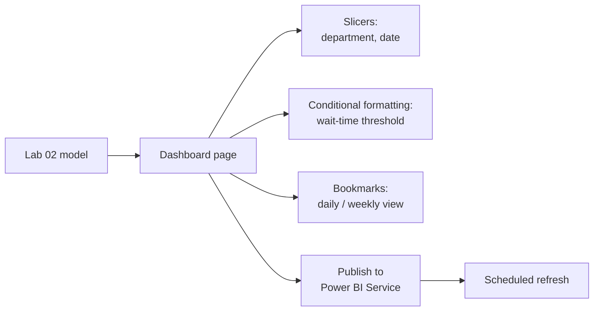

# Lab 03: Interactive Operations Dashboard

## Objectives

- **Part 1:** Design a dashboard page around one operational decision, not a wall of charts
- **Part 2:** Add cross-filtering slicers and a bookmark-based view toggle
- **Part 3:** Apply conditional formatting to flag departments over a wait-time threshold
- **Part 4:** Publish to Power BI Service and set a scheduled refresh

## Background / Scenario

Lab 02 fixed the department reorganization and produced two correct bar
charts. A dashboard is a different job: someone running the department,
not the person who built the model, needs to open it and answer *is
anything wrong right now* without reading a single DAX formula.

Everything on this page stays operational: wait times, no-show rates,
appointment counts. Nothing clinical, nothing patient-identifiable. That
constraint hasn't loosened since Lab 01 and it isn't going to.

## Required Resources

- Power BI Desktop
- The `.pbix` file from Lab 02
- A free Power BI Service account (Microsoft 365 email works, or a free
  Fabric trial) for Part 4
- Approximately 3 hours

## Topology



---

## Part 1: Design Around One Decision

### Step 1: Write down the decision before building anything

A department head opening this dashboard each morning needs to answer one
thing: *is my department's wait time trending worse than its own recent
normal?* Everything on the page should serve that.

### Step 2: Build the core visual

Add a line chart: axis `dim_date[Date]`, values `[Avg Wait Minutes]`,
legend `dim_department[department]`.

### Step 3: Add a reference line

**Format the visual → Analytics → Average line**, applied per department
(Format → set "per category").

> **A single number is not a warning sign. A comparison is.** "38
> minutes today" means nothing on its own. "38 minutes against a 22-minute
> average" is the actual answer to the question Part 1 Step 1 asked.

<details>
<summary>Hint</summary>

If the average line looks identical across every department's line, check
that "per category" is actually selected in the Analytics pane rather than
a single average line across the whole chart. The setting resets to
off by default each time a new analytics line is added.

</details>

<details>
<summary>Expected result, Part 1</summary>

Six lines, one per department, each with its own reference line sitting
near that department's own long-run average (roughly the low-to-mid 20s
in minutes, per Lab 02 Part 3). A department's line should visibly cross
above and below its own reference line at different points across the
year, not sit flat against it. Flat lines usually mean the average line
is computed across all departments rather than per category.

</details>

---

## Part 2: Slicers and a Bookmark Toggle

### Step 1: Add cross-filtering slicers

Add slicers for `dim_department[department]` and `dim_date[MonthName]`.
Confirm **Format → Edit interactions** leaves cross-filtering on for the
Lab 02 bar charts and the Part 1 line chart.

### Step 2: Build two views with bookmarks

Capture the line chart at daily granularity as one bookmark, and again at
weekly granularity (drill up one level on the date hierarchy) as a second.
Name them so a button label in Step 3 can refer to them sensibly.

<details>
<summary>Hint</summary>

**View → Bookmarks → Add** captures whatever state the report is in right
now, including chart drill level. Change the chart's granularity
*first*, then add the bookmark, not the other way round.

</details>

### Step 3: Add buttons that apply each bookmark

Add two buttons to the page, one per bookmark, so a viewer can switch
between daily and weekly views without touching the chart directly.

<details>
<summary>Hint</summary>

**Insert → Buttons → Blank** for the button itself, then **Format →
Action → Bookmark** to wire it to one of the two bookmarks from Step 2.
Both buttons need this done separately: assigning one doesn't carry over
to the other.

</details>

> **A bookmark captures visual state, not data.** Switching between Daily
> and Weekly doesn't requery anything: it's the same model, displayed two
> ways. This matters for a dashboard someone checks every morning: the
> toggle needs to feel instant, and it does, because nothing behind it is
> recalculating from scratch.

<details>
<summary>Expected result, Part 2</summary>

Clicking "Daily" shows the line chart at day-level granularity across the
full year (a dense, spiky line); clicking "Weekly" shows the same data
smoothed to one point per week. Both slicers still filter both bookmarked
states. If switching bookmarks resets an active department filter, the
bookmark was captured with "Data" unchecked in its settings, which is
worth noticing rather than working around.

</details>

---

## Part 3: Conditional Formatting

### Step 1: Define what "over threshold" means as a measure, not a number

```dax
Wait Threshold Flag =
VAR CurrentWait = [Avg Wait Minutes]
RETURN
    IF( CurrentWait > 30, 1, 0 )
```

Thirty minutes is a stand-in policy threshold for this lab, not a
published NHS target. State that plainly on the report page rather than
implying it's an official figure.

### Step 2: Format the department bar chart by threshold

Apply `Wait Threshold Flag` as a conditional formatting rule on the
Avg Wait Minutes bar chart, so departments over threshold stand out
visually without anyone reading the axis.

<details>
<summary>Hint</summary>

**Conditional formatting → Background color** on the value field, then
**Format by: Field value** rather than a fixed rule, pointed at
`Wait Threshold Flag`. Map 0 to the default color and 1 to a red band:
the measure is already a clean 0/1 switch, so the mapping is direct.

</details>

### Step 3: Confirm it responds to filters

Apply the date slicer to a single busy week. Watch which departments
flip into the red band.

**Expected result:** the flag is relative to the fixed 30-minute
threshold, not to each department's own average. A genuinely quiet
department that's briefly above 30 minutes for one week will still flag
red, which is different from Lab 02's per-department comparison and worth
noticing as a real design choice, not an inconsistency.

> **A fixed threshold and a relative-average comparison answer different
> questions.** Part 1's reference line asks "worse than usual for this
> department." Conditional formatting here asks "worse than an
> across-the-board policy line." A real dashboard often needs both, and
> conflating them is a common way a "why is this red" conversation goes
> sideways in a real handover meeting.

<details>
<summary>Expected result, Part 3</summary>

At least one department flags red for at least one week in the dataset,
given wait times centred in the low-to-mid 20s with real spread, but no
department should sit red for the entire year, since that would mean its
average wait was implausibly high across all twelve months. If every bar
is red all the time, or none ever are, recheck the 30-minute threshold
against the measure's actual output rather than assuming the data itself
is wrong.

</details>

---

## Part 4: Publish and Schedule Refresh

### Step 1: Publish

**Home → Publish** → sign in → choose your workspace (My Workspace is
fine for a personal account).

### Step 2: Set up scheduled refresh

In Power BI Service, open the dataset's settings → **Scheduled refresh**.
Because the source is a local SQL Server instance, this requires the
**On-premises data gateway** (free download, installed on the same
machine as the SQL Server instance, or one that can reach it).

> **Why this matters, and where it breaks.** Publishing shares the
> report; it does not automatically keep the data current. A locally-hosted
> SQL Server source means a gateway running permanently and reachable from
> wherever the SQL Server service actually lives. For a real trust, this is
> the difference between a dashboard that's trustworthy at 9am and one
> that's quietly three days stale with no warning visible anywhere on the
> page.

### Step 3: Set gateway or acknowledge the limitation

If installing the gateway is impractical for this lab, set refresh to
manual and note it. That's the finding itself, not a shortcut being
skipped.

<details>
<summary>Expected result, Part 4</summary>

The report opens in Power BI Service showing the same visuals and colors
as Desktop. Scheduled refresh either succeeds on a defined schedule (with
a gateway installed and pointed at the SQL Server instance) or is
explicitly set to manual with a note on why. Either outcome is a valid
result for this lab, but "refresh configured and never checked again" is
not, since that's exactly the silent-staleness failure mode the callout
above describes.

</details>

---

## Troubleshooting

| Symptom | Cause | Fix |
|---|---|---|
| Buttons don't switch views | Bookmark captured the wrong visual state | Redo Part 2 Step 2, confirm "All visuals" is selected when adding the bookmark |
| Conditional formatting shows every bar the same color | Rule set to a fixed value instead of the Wait Threshold Flag measure | Rebuild using "Format by: Field value" referencing the measure |
| A department flags red every single day, even quiet ones | 30-minute threshold genuinely too low for that department's caseload, or the flag measure filtered on the wrong status | Confirm the underlying Avg Wait Minutes measure filters to `attended`, per Lab 02 Part 3 Step 3 |
| Scheduled refresh fails | No gateway, or the gateway machine can't reach the SQL Server instance | Install gateway on a machine with network access to SQL Server, or accept manual refresh and document it |

---

## Reflection

1. Why does the dashboard need both a per-department average-line
   comparison and a fixed policy threshold, rather than just one or the
   other?
2. What would you tell a department head who asks why their department is
   flagged red on a day that felt normal to them?
3. Is a locally-gatewayed SQL Server instance an acceptable long-term
   source for a dashboard a department head checks every morning? What
   would you tell them?

---

## What Went Wrong When I Did This

- **Set the conditional formatting threshold to compare against each
  department's own average** on the first attempt, essentially
  duplicating Part 1's reference line inside the bar chart's color rule.
  It looked reasonable but meant a chronically slow department could
  never flag red, because it was only ever compared to its own bad
  normal. Reworked it as a fixed 30-minute policy line, which is a
  different and more honest question.
- **Built the bookmark before switching the chart to weekly**, so the
  "Weekly" bookmark just re-captured the daily view. Bookmarks record
  whatever state the visual is in *at the moment you click Add*: order
  matters, and I'd made the same mistake in an earlier project without
  writing it down that time.
- **No gateway installed**, and scheduled refresh silently failed for two
  days before I noticed the dashboard was showing stale wait-time data
  with nothing on the page indicating it.

---

## Where This Breaks

- Refresh depends on a gateway reachable from wherever SQL Server runs, or
  a human remembering to re-upload manually
- The 30-minute threshold is a guess, not a validated operational target.
  Nothing in the model checks it against what the real NHS data
  considers acceptable
- The model still has no way to compare this synthetic hospital's
  performance to the real trust-level NHS benchmark loaded back in Lab 01,
  the reason Lab 04 exists

**Next:** [Lab 04: Time Intelligence and NHS Benchmarking](04-time-intelligence.md)
