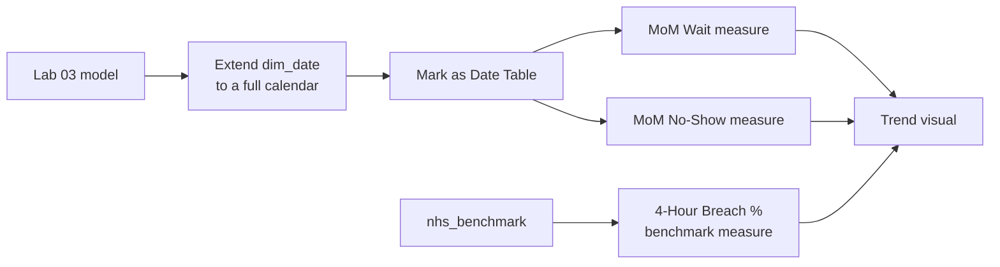

# Lab 04: Time Intelligence and NHS Benchmarking

## Objectives

- **Part 1:** Extend `dim_date` to a full calendar so time comparisons are meaningful
- **Part 2:** Write month-over-month wait time and no-show trend measures
- **Part 3:** Compare the synthetic hospital against the real NHS 4-hour benchmark
- **Part 4:** Diagnose why time intelligence fails without a proper date table

## Background / Scenario

Lab 03 shipped a dashboard that flags a department the moment its wait
time crosses 30 minutes today. It says nothing about *trend*: is this
department getting worse over months, or was today just a bad day, and
it never once looked at the real NHS benchmark table sitting unused in the
model since Lab 01.

This lab does both: proper month-over-month trend measures, and a real
comparison against NHS England's published trust-level 4-hour performance
figures. The synthetic data still describes a fictional hospital; the
benchmark it's compared against is real, published, aggregate NHS
statistics: trust-level, not identifiable to any patient.

## Required Resources

- Power BI Desktop
- The `.pbix` file from Lab 03
- Approximately 3 hours

## Topology



---

## Part 1: Extend the Date Range

### Step 1: Confirm the problem

Try `SAMEPERIODLASTYEAR` against the current `dim_date` (built in Lab 02
from only the dates present in `fact_appointments`, which spans one
calendar year). It returns blank for every row, because there's no data,
and no *date rows*, a year earlier.

<details>
<summary>Hint</summary>

Build a quick measure, `CALCULATE([Avg Wait Minutes],
SAMEPERIODLASTYEAR(dim_date[Date]))`, on a card and watch it return blank
regardless of which month is filtered. The function isn't broken; think
about what it needs to exist in `dim_date` that Lab 02's version never
built.

</details>

### Step 2: Rebuild dim_date as a full calendar

Replace the Lab 02 `dim_date` query with a DAX calculated table (**Modeling
→ New Table**):

```dax
dim_date =
ADDCOLUMNS(
    CALENDAR( DATE(2024,1,1), DATE(2025,12,31) ),
    "Year", YEAR([Date]),
    "MonthNumber", MONTH([Date]),
    "MonthName", FORMAT([Date], "MMMM"),
    "YearMonth", FORMAT([Date], "YYYY-MM"),
    "DayOfWeek", FORMAT([Date], "dddd")
)
```

> **A date table needs to span more than the fact table's actual dates.**
> `SAMEPERIODLASTYEAR` looks up rows in `dim_date` that may have zero
> matching fact rows. That's expected and correct, not a bug. A
> comparison period showing "no appointments" is itself sometimes the
> answer, and here it's the honest one: this synthetic dataset genuinely
> doesn't have a real prior year.

### Step 3: Mark it as the official date table

**Model view → right-click dim_date → Mark as Date Table** → select
`Date` as the key column.

### Step 4: Relate it, following the pattern from Lab 02

The new `dim_date` needs the same kind of relationship the old one had:
`fact_appointments[scheduled_time]` (date portion) to `dim_date[Date]`,
many-to-one, single direction. Power BI may have auto-created a
relationship to the new table already, or left a stale one pointing at the
deleted query. Check the model diagram rather than assuming either.

<details>
<summary>Hint</summary>

If Model view shows two relationships touching `fact_appointments` and a
date table, one of them is almost certainly a dangling reference to the
Lab 02 `dim_date` query that no longer exists under that name. Delete it
before relating the new one, the same "delete the stale one first" move
from Lab 02 Part 2 Step 6.

</details>

<details>
<summary>Expected result, Part 1</summary>

`dim_date` now has 731 rows (two full calendar years, 2024 and 2025, 2024
being a leap year). Exactly one relationship connects it to
`fact_appointments`. A test card with `SAMEPERIODLASTYEAR` against any
month in 2025 now returns blank for a specific, correct reason: there are
2024 appointment rows to compare against, but Lab 01 generated data for
2025 only, so the comparison period exists in `dim_date` but has zero
matching fact rows. That's different from Step 1's blank, and worth being
able to explain the difference between the two.

</details>

---

## Part 2: Month-over-Month Trend Measures

### Step 1: Month-over-month wait time

```dax
Avg Wait MoM % =
VAR CurrentWait = [Avg Wait Minutes]
VAR PriorMonthWait =
    CALCULATE( [Avg Wait Minutes], DATEADD(dim_date[Date], -1, MONTH) )
RETURN
    DIVIDE( CurrentWait - PriorMonthWait, PriorMonthWait )
```

### Step 2: Month-over-month no-show rate, write this one yourself

`No-Show Rate MoM %` needs the same shape as Step 1's measure, swapping in
`[No-Show Rate]` for `[Avg Wait Minutes]`. Write it before checking the
hint.

<details>
<summary>Hint</summary>

Same three-part structure as Step 1: a `CurrentRate` variable holding
`[No-Show Rate]` in the current filter context, a `PriorMonthRate`
variable wrapping the same measure in `CALCULATE(... DATEADD(dim_date[Date],
-1, MONTH))`, and a `DIVIDE` of their difference over the prior month. Only
the measure name inside each variable changes.

</details>

### Step 3: Understand DATEADD

| Piece | What it does |
|---|---|
| `DATEADD(dim_date[Date], -1, MONTH)` | Shifts the current filter context back one month |
| `CALCULATE([Avg Wait Minutes], ...)` | Re-evaluates the wait-time measure inside that shifted context |
| The `VAR`s | Compute each side once, so the DIVIDE is readable and inspectable while debugging |

### Step 4: Confirm both against manual arithmetic

Put both measures on a card visual, filtered to a month partway into the
dataset's range. Sanity-check by pulling the two months' raw
`Avg Wait Minutes` figures and doing the percentage change by hand.

<details>
<summary>Expected result, Part 2</summary>

Both MoM measures return blank for January 2025 (no prior month exists in
range) and a real percentage, typically single digits in either direction,
for every month after. With random per-row generation and no seasonal
pattern built into Lab 01's data, don't expect a consistent upward or
downward trend across the year: month-to-month swings driven by chance
are the expected shape here, not a sign of a broken measure.

</details>

---

## Part 3: Compare Against the Real NHS Benchmark

### Step 1: Write a benchmark measure

```dax
NHS 4-Hour Breach % =
1 - CALCULATE(
    AVERAGE( nhs_benchmark[pct_within_4h] ),
    ALLSELECTED( nhs_benchmark )
)
```

`pct_within_4h`, as loaded in Lab 01 Part 3, tracks attendances seen
*within* four hours, not the breach itself. A measure named "Breach %"
has to invert that fraction, or it silently reports the opposite of what
its own name claims.

<details>
<summary>Hint</summary>

If you're adapting this pattern to a `nhs_benchmark` table where the
column was loaded with the opposite framing (a genuine breach/over-4-hours
percentage rather than a within-4-hours one), drop the `1 -` and average
the column directly. Check which framing your own Lab 01 Part 3 Step 3
actually produced before copying this measure as-is.

</details>

### Step 2: Build a combo visual, side by side, not blended

Line chart: axis `dim_date[YearMonth]`, values `No-Show Rate` (from the
synthetic hospital) on one axis and `NHS 4-Hour Breach %` (from the real
benchmark) on a secondary axis.

> **These two lines are not the same metric, and the chart must not
> pretend they are.** No-show rate measures patients who didn't turn up
> at all; the NHS 4-hour breach figure measures how long attendees waited
> once they were being seen, aggregated across an entire real trust, not
> six fictional departments. Putting them on one chart is useful for
> *shape* comparison (is the trend direction similar), not for claiming
> the synthetic hospital's numbers are validated against the real one.
> Say this directly on the report page, not just in this lab.

### Step 3: Confirm the relationship-free design still works

Because `nhs_benchmark` was deliberately left unrelated to
`fact_appointments` back in Lab 02 Part 1 Step 5, both measures on this
visual filter independently by `dim_date[YearMonth]` through separate,
parallel paths: there's no join forcing a false row-level match between
a real trust-month and a fictional department-appointment.

<details>
<summary>Expected result, Part 3</summary>

Two lines on one chart, different scales on the primary and secondary
axes, both spanning the same set of months on the shared x-axis. The
synthetic No-Show Rate line stays roughly flat with random noise (per Part
2). The real NHS Breach % line reflects actual published trust
performance and may show a genuine seasonal pattern (English A&E
performance is typically worse in winter months) that the synthetic line
has no reason to share. That divergence in shape is itself worth noting
in the reflection, not a bug to chase.

</details>

---

## Part 4: Diagnose the Failure Mode

### Step 1: Break it on purpose

Change the `dim_date`-to-`fact_appointments` relationship's cross-filter
direction to **Both**.

**Record what happens** to `Avg Wait MoM %` on a matrix broken out by
`dim_department[department]`.

**Expected result:** the measure may still compute a number, but it's now
ambiguous which direction is filtering which. Bidirectional filtering
against a date table with `DATEADD` inside a measure is a well-known
source of circular or double-counted results once a second relationship
touches the same date table.

Set it back to **Single**.

### Step 2: Remove the Mark as Date Table setting

**Model view → dim_date → un-mark as date table.**

**Expected result:** `DATEADD`, `SAMEPERIODLASTYEAR`, and related
functions either error outright or silently return wrong results, because
these functions require Power BI to know which column is the
authoritative, contiguous date axis. That's exactly what marking the
table declares.

Re-mark it before continuing.

### Step 3: Record the symptom

| Symptom | Likely cause |
|---|---|
| Time intelligence functions error or return blank everywhere | dim_date not marked as a date table |
| Time intelligence numbers look plausible but don't match manual math | Bidirectional relationship on the date table |
| MoM shows blank for the first month in range | Correct: there's no prior month to compare against |

---

## Troubleshooting

| Symptom | Cause | Fix |
|---|---|---|
| Avg Wait MoM % is blank everywhere | dim_date range too short, or not marked as date table | Redo Part 1 Steps 2-3 |
| NHS 4-Hour Breach % shows one flat number across all months | ALLSELECTED applied too broadly, or nhs_benchmark not actually related to dim_date | Confirm nhs_benchmark has its own date column filtering through dim_date's YearMonth, or a direct relationship on month |
| No-Show Rate MoM % looks inverted (positive when the rate improved) | DIVIDE numerator/denominator swapped | Check Part 2 Step 2 against the formula exactly |
| Combo chart secondary axis makes both lines look flat | Axis scales too different (percentage vs. percentage but very different ranges); not a bug, a formatting choice | Fix the secondary axis min/max manually, or use two stacked charts instead |

---

## Reflection

1. Why does extending `dim_date` beyond the fact table's actual dates make
   `SAMEPERIODLASTYEAR` more correct, not less?
2. What would it take to make the NHS benchmark comparison a genuinely
   valid statistical comparison, rather than a shape-only visual check?
3. If this were a real trust, what governance step would need to happen
   before its own 4-hour performance could be compared publicly against
   NHS England's published figures?

---

## What Went Wrong When I Did This

- **Tried to relate `nhs_benchmark` directly to `dim_date` on exact date
  match** rather than year-month, and the relationship silently matched
  nothing, because `nhs_benchmark[period_month]` parsed to the first of
  each month while `dim_date` had one row per day. The combo chart showed
  a flat zero for the benchmark line until I checked the relationship
  diagnostics and noticed zero rows were matching.
- **Compared No-Show Rate directly against NHS 4-Hour Breach %** on the
  first version of the chart as if they measured the same thing, and
  described it in a report caption as "hospital performance vs. NHS
  average", which overstated what the comparison actually shows. Reworded
  it once I reread Lab 01 Part 2 Step 4's own note about the grain and
  meaning mismatch.
- **Left the bidirectional relationship on from the Part 4 diagnostic
  step** and moved on to the next lab's setup without setting it back to
  single. The wait-time matrix looked fine until a department filter
  produced a number bigger than the unfiltered total, which is how I
  caught it.

---

## Where This Breaks

- The NHS comparison is a shape check, not a statistically valid
  benchmark: the two datasets measure genuinely different things at
  different grains
- The 30-minute threshold from Lab 03 was never checked against what the
  real NHS data considers an acceptable wait
- Nothing yet asks "what if we added staff to a department" or restricts
  which department head can see which department's numbers: Lab 05

**Next:** [Lab 05: What-If Analysis and Row-Level Security](05-what-if-rls.md)
