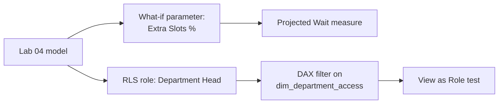

# Lab 05: What-If Analysis and Row-Level Security

## Objectives

- **Part 1:** Build a what-if parameter for proposed extra appointment slots
- **Part 2:** Project the effect on wait times with the parameter driving a measure
- **Part 3:** Implement row-level security so each department head sees only their department
- **Part 4:** Test RLS as a restricted user, not just as the report author

## Background / Scenario

Two questions close this series out: "what happens to wait times if we
add staff and open more appointment slots in a department," and "how do
we let six department heads use the same report without each seeing the
other five departments' numbers." Neither is answerable with what Labs
01-04 built.

Both questions stay firmly on the operations side of the line drawn in
Lab 01. A department head needs their own wait-time and no-show numbers,
not another department's, and certainly not any patient's clinical
record, which was never in this model to begin with.

## Required Resources

- Power BI Desktop
- The `.pbix` file from Lab 04
- Approximately 3 hours

## Topology



---

## Part 1: The What-If Parameter

### Step 1: Create the parameter

**Modeling → New Parameter → Numeric range.** Name `Extra Slots %`, min 0,
max 50, increment 5, default 0. Check **Add slicer to this page**.

**Expected result:** Power BI creates a new table with one column and a
measure called `Extra Slots % Value`.

### Step 2: Inspect what it built

Open the generated measure:

```dax
Extra Slots % Value = SELECTEDVALUE('Extra Slots %'[Extra Slots %], 0)
```

> **A what-if parameter is a disconnected table, not a relationship.** It
> has no key into `fact_appointments` or `dim_department`. The slicer
> just sets a value that a measure reads with `SELECTEDVALUE`. Nothing
> about the model "knows" this is a staffing scenario; the measures
> written next are what make it mean anything.

<details>
<summary>Expected result, Part 1</summary>

A slicer on the page with steps 0, 5, 10, ... 50, and a new table in the
Fields pane holding one column plus the generated measure. Moving the
slicer changes what `SELECTEDVALUE` returns, but nothing else on the
report reacts yet. That's expected, since no other measure references it
until Part 2.

</details>

---

## Part 2: Project the Wait Time Impact

### Step 1: Write the projected wait measure

Modelling assumption for this lab: adding capacity reduces average wait
time roughly proportionally, up to the added-slots percentage. A
simplification, stated plainly, not a validated queueing model.

```dax
Projected Avg Wait Minutes =
VAR CurrentWait = [Avg Wait Minutes]
VAR SlotIncrease = 'Extra Slots %'[Extra Slots % Value] / 100
RETURN
    CurrentWait * (1 - SlotIncrease)
```

### Step 2: Restrict the scenario to one department at a time, write this measure yourself

The real question is departmental: "if Radiology got 20% more slots," not
"if every department did," since staffing decisions get made department by
department. Write `Projected Wait (Selected Department)` so it only
returns a value when exactly one department is in context, and returns
blank otherwise: a scenario shown for "all departments blended together"
would misrepresent a decision that's actually made one department at a
time.

<details>
<summary>Hint</summary>

`HASONEVALUE(dim_department[department])` is true only when the current
filter context has narrowed to a single department, from a slicer
selection or a matrix row, for instance. Wrap Step 1's measure in an `IF`
keyed on that check, returning `BLANK()` in the false branch.

</details>

### Step 3: Build the comparison visual

Card visuals: `Avg Wait Minutes` next to `Projected Wait (Selected
Department)`, with the parameter's slicer and a department slicer both on
the page. Move the slider and watch both update.

> **This measure assumes wait time scales linearly with capacity, and it
> almost certainly doesn't.** A department at 95% capacity behaves very
> differently from one at 60%: queueing systems degrade non-linearly
> near saturation. That's a real limitation worth stating on the report
> page itself, not just in this lab: a department head reading "20% more
> slots, 20% shorter waits" as a guarantee is exactly the kind of
> overclaim a mechanical projection like this can produce if it isn't
> labelled as one.

<details>
<summary>Expected result, Part 2</summary>

With the slider at 0%, `Projected Wait (Selected Department)` matches
`Avg Wait Minutes` exactly for the selected department. Moving the slider
to 20% drops the projected figure by roughly a fifth of the current wait
time. With no department selected (or more than one), the projected card
goes blank while the actual wait time card keeps showing a value. That
asymmetry is Step 2's `HASONEVALUE` guard working as intended, not a
missing filter.

</details>

---

## Part 3: Row-Level Security

### Step 1: Create the role

**Modeling → Manage roles → Create.** Name it `Department Head`.

### Step 2: Write the filter, and see why the obvious version fails

On `dim_department`, the tempting first filter:

```dax
[department] = USERPRINCIPALNAME()
```

This assumes each department head's Power BI Service login matches a
value in `department`, which it won't: a login is an email address, a
department is a name like "Radiology". For this lab, use a mapping table
instead.

### Step 3: Build a proper mapping table

**Modeling → New Table**:

```dax
dim_department_access =
DATATABLE(
    "UserEmail", STRING,
    "department", STRING,
    {
        {"head.emergency@example.nhs.uk", "Emergency"},
        {"head.outpatients@example.nhs.uk", "Outpatients"},
        {"head.radiology@example.nhs.uk", "Radiology"},
        {"head.cardiology@example.nhs.uk", "Cardiology"},
        {"head.trauma-ortho@example.nhs.uk", "Trauma & Orthopaedics"},
        {"head.surgery@example.nhs.uk", "General Surgery"}
    }
)
```

Every email here is a placeholder `example.nhs.uk` address invented for
this lab, not a real person or a real trust domain.

Relate `dim_department_access[department]` to `dim_department[department]`,
many-to-one, single direction.

<details>
<summary>Hint</summary>

Get the relationship direction backwards and RLS will appear to do
nothing at all in testing. Power BI won't error, it'll just show every
department to every test user. The filter needs to flow from the access
table into the data table, which means `dim_department_access` is the
"one" side pointing at `dim_department`, not the other way round.

</details>

### Step 4: Filter the role through the mapping table

Replace the Step 2 filter with one on `dim_department_access`:

```dax
[UserEmail] = USERPRINCIPALNAME()
```

> **Filter the access table, not the data table directly, whenever the
> access rule isn't itself a column on the data.** `dim_department` has no
> email column and shouldn't: mixing access control into a dimension
> table Lab 02 built to solve the reorganization problem is how a model
> ends up with columns nobody remembers the reason for.

<details>
<summary>Expected result, Part 3</summary>

`dim_department_access` has exactly 6 rows, one per department, each a
placeholder `@example.nhs.uk` address. The `Department Head` role exists
under Manage Roles with one DAX filter expression attached. Nothing
visible changes yet in Desktop's normal view. The role only takes effect
under "View as," which is Part 4.

</details>

---

## Part 4: Test as a Restricted User

### Step 1: View as role, inside Power BI Desktop

**Modeling → View as → check Department Head → Other user →** enter one
of the six test emails.

**Expected result:** every visual on every page filters down to that one
department, including the ones built in Labs 02-04 that were never told
anything about RLS.

> **RLS applies model-wide, retroactively, to visuals built before the
> role existed.** That's the point of building it in the model layer
> rather than filtering each visual by hand, and also the reason to test
> it against pages that weren't designed with RLS in mind, which is
> exactly what Part 4 does.

### Step 2: Confirm the what-if parameter still works under RLS

With the role still active, move the extra-slots slider.

**Expected result:** `Projected Wait (Selected Department)` recalculates
against only the visible department's data. The two features compose
without extra work, because both operate through the filter context, not
through hard-coded scope.

### Step 3: Publish and assign the role for real

After publishing to Power BI Service: **dataset settings → Security →**
add each department head's actual email under the `Department Head` role.

**Troubleshooting:** RLS in Desktop's "View as" is a simulation. The real
test is a second person, signed in with their own account, opening the
published report. If that's not practical for this lab, state plainly
that RLS was verified in Desktop only, not against a live second account.

<details>
<summary>Expected result, Part 4</summary>

Under "View as" with `head.radiology@example.nhs.uk`, every visual across
every page (dashboard, trend charts, RLS-unaware Lab 02/03/04 visuals
included) shows only Radiology's rows. No other department appears
anywhere, including in slicers, which should list Radiology alone rather
than six greyed-out options. Switching test emails changes which single
department is visible; no combination of test email should ever show more
than one department at once.

</details>

---

## Troubleshooting

| Symptom | Cause | Fix |
|---|---|---|
| Projected Wait doesn't move with the slider | Measure references `[Extra Slots %]` (the column) instead of the generated Value measure | Use `'Extra Slots %'[Extra Slots % Value]` |
| View as Role shows all departments | Role filter on the wrong table, or relationship direction wrong | Confirm filter sits on `dim_department_access`, relationship is single-direction toward `dim_department` |
| RLS works in Desktop but not after publishing | Role has no members assigned in Service | Add emails under dataset Security settings |
| Projected Wait (Selected Department) shows blank | No single department selected, or HASONEVALUE evaluated across the whole table | Apply a department slicer or filter before reading the card |

---

## Reflection

1. Why does `Projected Wait (Selected Department)` return blank rather
   than a number when no single department is filtered?
2. What real-world factor does the what-if measure ignore, and what would
   a more realistic version need?
3. If a seventh department is created next year, what has to change for
   RLS to cover it: anything in the DAX, or only the mapping table?

---

## What Went Wrong When I Did This

- **Applied the linear capacity assumption without stating it anywhere on
  the report page**, only in this lab's own notes. A colleague reviewing
  a draft read "20% more slots" as a firm operational promise rather than
  a rough projection, which was exactly the overclaiming risk the Part 2
  callout warns about. Added the caveat directly to the report page as a
  text box, not just documentation nobody viewing the dashboard would see.
- **Wrote the RLS filter directly on `dim_department`** using
  `USERPRINCIPALNAME()`, matching against department text like
  "Radiology", which no login email will ever equal. Reworked it through
  a proper mapping table once "View as Role" returned zero rows for every
  test user.
- **Never tested with a second real account**, only Desktop's simulated
  "View as." Said so directly instead of implying it was fully verified,
  because it wasn't.

---

## Where This Breaks

- The model works for one site and one source system. Lab 06 introduces
  a second site with a genuinely different export schema, which nothing
  built so far can ingest without a rebuild
- Five measures now exist around wait time and no-shows; crossing them
  against a second site by hand would mean doubling that count, and
  doubling again for a third site: a sign that measure-by-measure
  duplication has reached its limit
- The what-if projection and RLS compose cleanly through filter context,
  which is exactly the property Lab 06 needs to hold once a second
  dimension (site) sits alongside department

**Next:** [Lab 06: Capstone: A Second Site, Two Source Systems, One Model](06-capstone.md)
