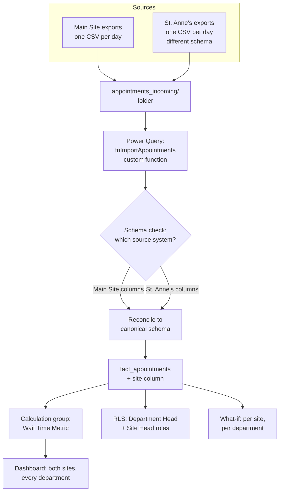

# Lab 06: Capstone: A Second Site, Two Source Systems, One Model

## Objectives

- **Part 1:** Stand up a second site's appointment feed from a different
  source system, with a different export schema
- **Part 2:** Build a parameterized Power Query function that ingests
  either site's files from one folder, reconciling both schemas into one
  fact table
- **Part 3:** Replace the wait-time measure family with a calculation
  group, so site- and department-level cuts don't need one measure each
- **Part 4:** Rebuild the dashboard, RLS, and what-if model across two
  sites without duplicating a single measure
- **Part 5:** Ship a final report and write down what the six-lab model
  can and can't do

## Background / Scenario

Fictional NHS-style Trust (the same invented name used throughout this
series, not a real trust) has opened a second site. Call it St. Anne's;
the original building from Labs 01-05 is now "Main Site" to distinguish
it. Two buildings, two appointment books, and (this is the part that
actually causes work) two different scheduling systems, because St.
Anne's was acquired from a smaller trust that never migrated off its own
software.

Both systems export a CSV per day. Main Site's export looks like the
`fact_appointments` shape from every lab so far. St. Anne's looks similar
but not identical: column names differ (`apt_id` instead of
`appointment_id`), `wait_minutes` isn't a stored column at all (it has to
be derived from two timestamp columns the way Lab 01 first calculated it
in T-SQL), and status values are capitalized differently (`No Show`
instead of `no-show`). Nobody is going to rename columns in a legacy
scheduling system to make a Power BI report's life easier. The ingestion
has to bend to meet both exports, not the other way round.

This is also the reason Lab 06 exists rather than Lab 05 being the last
one: everything through Lab 05 assumed one source, one shape, one Power
Query path hard-coded to it. A second site with a different export format
is exactly the kind of change a real trust's BI function encounters
constantly (a new site, a new supplier, a new subcontracted service), and
it's the point at which "one query per source" stops scaling and a
function-based ingestion pattern earns its complexity.

The second technique this lab introduces is a **calculation group**. By
Lab 05 the model has `Avg Wait Minutes`, `No-Show Rate`, `Avg Wait MoM %`,
`No-Show Rate MoM %`, and `Projected Wait (Selected Department)`: five
measures, and adding a site dimension on top would tempt a naive build
into ten (`Avg Wait Minutes (Main Site)`, `Avg Wait Minutes (St.
Anne's)`...) or worse, twenty once department is crossed with site by hand.
A calculation group applies one reusable calculation (a "run this measure
per site" pattern) across every base measure in the model without
duplicating a single one of them. It's the correct tool for exactly this
kind of multiplicative-measure problem, and it's advanced enough that
Power BI Desktop doesn't expose it in the standard ribbon: it needs
Tabular Editor, an external free tool, to author.

**The scope has not changed.** Everything in this lab is still hospital
operations data only: appointment scheduling, wait times, no-show rates,
site and department throughput. No diagnosis codes, no treatment records,
no patient names, no NHS numbers, nothing that identifies an individual or
what was wrong with them, at either site. St. Anne's being a different
legal entity's legacy system before acquisition doesn't change what's
collected here. The operations/clinical split from Lab 01 holds exactly
as it did on day one.

## Required Resources

- Power BI Desktop
- The `.pbix` file from Lab 05
- **Tabular Editor 2** (free, open source), required for Part 3;
  calculation groups aren't buildable from the standard Power BI Desktop
  UI
- SQL Server Management Studio, to generate St. Anne's synthetic export
  the same way Lab 01 generated Main Site's
- Approximately 4 hours: this is the longest lab in the series

## Topology



---

## Part 1: Stand Up the Second Site's Feed

### Step 1: Generate St. Anne's synthetic export

In SSMS, build a second synthetic dataset the same way Lab 01 Part 1 built
Main Site's (a numbers table driving a bulk `INSERT`, `CHECKSUM(NEWID())`
for the random elements), but with St. Anne's actual export shape:

| Column | Main Site (`fact_appointments`) | St. Anne's export |
|---|---|---|
| Row identifier | `appointment_id` (`APT00001`) | `apt_id` (`SA-00001`) |
| Department | `department` | `department` (same six canonical names: Trust policy required St. Anne's to adopt the post-merger department list on acquisition) |
| Scheduled time | `scheduled_time` | `sched_dt` |
| Actual arrival | `actual_time` | `arrival_dt` |
| Status | `status` (`attended` / `no-show` / `cancelled`) | `status` (`Attended` / `No Show` / `Cancelled`, different capitalization, different no-show spelling) |
| Wait time | `wait_minutes` (stored) | *(not present; derive from `arrival_dt` minus `sched_dt`)* |

St. Anne's is a smaller site: generate roughly 6,000 rows, same date range
as Main Site, same six departments. Use a slightly different no-show rate
(`% 100 < 15` instead of `< 12`): real sites don't perform identically,
and a capstone where both sites happen to have the exact same underlying
rate would understate why anyone bothers building this comparison at all.

Once the rows exist in a `stannes_appointments` table, export them to CSV
(SSMS: right-click the query results → **Save Results As**, or **Tasks →
Export Data**) rather than reading from SQL Server directly in Part 2:
this lab is about ingesting daily file exports the way a real second
site's legacy system would actually hand data over, not about a live
database connection.

<details>
<summary>Hint</summary>

Reuse the Lab 01 Part 1 generation pattern directly: same numbers-table
join for row count, same `CHECKSUM(NEWID())` approach for department and
status, just swap the column names and the no-show threshold. You already
know this pattern works; the point of this step is the schema difference,
not reinventing the random generation.

</details>

### Step 2: Export both sites as dated CSV files, one folder, both sources

Export Main Site's `clean_appointments` (from Lab 01) and St. Anne's new
table as separate CSV files, named the way a real daily export would be:
`mainsite_appointments_2025-MM-DD.csv` and
`stannes_appointments_2025-MM-DD.csv`. For this lab, two or three files
per site is enough to prove the pattern. A real trust would have one file
per site per day, hundreds across a year.

Put all files, from both sites, in one folder: `appointments_incoming/`.

> **Why one folder, not one per site.** A folder-per-site design would let
> Part 2 skip the schema-detection problem entirely: just point two
> separate queries at two separate folders. That's not what a real trust's
> IT setup looks like: exports commonly land in one shared drop location
> regardless of source, sorted by date rather than by system, because
> whoever set up the file transfer wasn't thinking about the BI team's
> Power Query folder structure. Solving the harder, more realistic version
> is the point of this lab.

<details>
<summary>Expected result, Part 1</summary>

A folder containing CSV files from both sites, distinguishable only by
filename prefix and by looking inside, not by folder location. Main
Site's files match the Lab 01 column shape (six columns, `wait_minutes`
present). St. Anne's files have six columns too, but different names, no
`wait_minutes`, and different status capitalization. Total combined row
count across all files: Main Site's existing ~20,000 plus roughly 6,000
new St. Anne's rows.

</details>

---

## Part 2: A Function-Based Ingestion Pattern

### Step 1: Understand why a single query can't do this

Try loading the whole folder with **Get Data → Folder → Combine & Load**
using Power Query's default behavior, without modification.

**Expected result:** Power Query picks one file as the schema template
and either drops or nulls out columns from files that don't match it.
`apt_id` and `sched_dt` show as entirely blank if a Main Site file was
sampled, or `appointment_id` and `wait_minutes` show blank if a St. Anne's
file was sampled. Neither is correct. A single default combine can't
reconcile two genuinely different schemas; something has to look at each
file and decide which shape it's in before combining.

<details>
<summary>Hint</summary>

Open a couple of the individual files' Power Query steps (not the combined
result) to see this clearly. The "Sample File" step in a default folder
combine is the one silently picking a template. That's the mechanism worth
understanding here, not just the wrong final output.

</details>

### Step 2: Write a custom function that transforms one file

**Home → New Source → Blank Query**, then open the Advanced Editor and
write a function that takes a table (one file's already-parsed content)
and returns it in the canonical schema:

```
let
    fnImportAppointments = (SourceTable as table) as table =>
    let
        Columns = Table.ColumnNames(SourceTable),
        IsStAnnes = List.Contains(Columns, "apt_id"),

        Result =
            if IsStAnnes then
                let
                    Renamed = Table.RenameColumns(SourceTable, {
                        {"apt_id", "appointment_id"},
                        {"sched_dt", "scheduled_time"},
                        {"arrival_dt", "actual_time"}
                    }),
                    StatusNormalized = Table.TransformColumns(Renamed, {
                        {"status", each
                            if _ = "Attended" then "attended"
                            else if _ = "No Show" then "no-show"
                            else if _ = "Cancelled" then "cancelled"
                            else _, type text}
                    }),
                    WaitAdded = Table.AddColumn(StatusNormalized, "wait_minutes", each
                        if [status] = "attended" then
                            Duration.TotalMinutes([actual_time] - [scheduled_time])
                        else null, Int64.Type),
                    SiteAdded = Table.AddColumn(WaitAdded, "site", each "St. Anne's", type text)
                in
                    SiteAdded
            else
                Table.AddColumn(SourceTable, "site", each "Main Site", type text)
    in
        Result
in
    fnImportAppointments
```

Name this query `fnImportAppointments`.

> **Why detect the schema from the columns present, not the filename.** A
> filename prefix (`mainsite_`/`stannes_`) is tempting to key off, but
> filenames are a human convention with no enforcement behind it. A
> renamed file, or a third site added later with an unexpected prefix,
> would silently route through the wrong branch. Checking for a column
> that only exists in one source's real schema (`apt_id`) ties the
> detection to the actual structure of the data, which is what will still
> be true even if someone renames the file.

<details>
<summary>Hint</summary>

If the function errors on `Duration.TotalMinutes`, check that both
`actual_time` and `scheduled_time` were typed as Date/Time *before* the
subtraction. Subtracting two text columns, or a text and a datetime,
produces a type error, not a wrong number, so this usually fails loudly
rather than silently.

</details>

### Step 3: Apply the function across the whole folder

**Get Data → Folder**, point at `appointments_incoming/`, but instead of
**Combine & Load**, use **Transform Data** to get the file list as a
table. Add a custom column that invokes `fnImportAppointments` on each
row's `[Content]`, then expand the resulting tables.

<details>
<summary>Hint</summary>

`Table.AddColumn(#"Previous Step", "Parsed", each fnImportAppointments(
Table.PromoteHeaders(Csv.Document([Content]))))` is the shape of the
custom column formula: read the file's binary content, promote its first
row to headers, then hand the resulting table to the function. This is
the same "invoke a function per row of a table" pattern used anywhere
Power Query applies one transformation across many files.

</details>

### Step 4: Confirm both schemas landed in one consistent shape

Check the expanded result's columns: `appointment_id`, `department`,
`scheduled_time`, `actual_time`, `status`, `wait_minutes`, `site`. Every
row, from either source system, should now carry exactly these seven
columns with consistent types and consistent status text.

Rename the query `fact_appointments`, replacing the single-source version
from every prior lab. Set types explicitly on `wait_minutes` (Whole
Number): the St. Anne's rows compute it via `Duration.TotalMinutes`,
which can return a decimal, so round it or set the type deliberately
rather than letting a fractional minute drift into the average.

<details>
<summary>Expected result, Part 2</summary>

`fact_appointments` holds roughly 26,000 rows total (Main Site's ~20,000
plus St. Anne's ~6,000), with a `site` column showing exactly two distinct
values. Grouping by `site` and `status`, no row should show a blank
`status` or an out-of-range `wait_minutes` (negative beyond the -5 minimum
Lab 01 established, or implausibly large). If any St. Anne's row shows a
blank `wait_minutes` where `status = "attended"`, the datetime subtraction
in Step 2 didn't run. Check the column types on the St. Anne's source
columns before the function was invoked, not after.

</details>

### Step 5: Rebuild dim_department and relationships

`dim_department` and the Lab 02 canonical-department mapping still apply:
St. Anne's already exports the post-merger department names per the Trust
policy noted in Part 1 Step 1, so no new mapping row is needed there. Add
a `dim_site` table (two rows: Main Site, St. Anne's) and relate it to
`fact_appointments[site]`, many-to-one, single direction. Reconfirm
`dim_date`'s relationship survived the fact table rebuild. Power BI
sometimes drops a relationship silently when a query is replaced rather
than edited in place.

---

## Part 3: A Calculation Group for Wait-Time Metrics

### Step 1: Understand the problem a calculation group solves

By the end of Lab 05, the model has five measures built around wait time
and no-shows. Crossing each against two sites and six departments doesn't
require new measures, filter context already handles that, but a
request like "show Avg Wait Minutes, and next to it, Avg Wait Minutes as a
percent of the trust-wide average" does, because that's a genuinely
different *calculation*, not just a different filter. Without a
calculation group, that means writing a variant measure per base measure:
`Avg Wait Minutes % of Trust`, `No-Show Rate % of Trust`, and so on,
multiplying every future base measure by however many variants exist.

<details>
<summary>Hint</summary>

If this still feels abstract, count how many measures a naive build would
need for "every wait-time-family measure, shown both as its raw value and
as a percent of the trust-wide figure, split by site." That count is
what a calculation group collapses to one reusable item.

</details>

### Step 2: Open the model in Tabular Editor

With the Lab 06 `.pbix` open in Power BI Desktop, launch Tabular Editor
and connect to the live model (**External Tools → Tabular Editor** in the
Desktop ribbon, if installed, or connect manually via the model's
localhost port).

### Step 3: Create the calculation group

In Tabular Editor: right-click the model → **Create New** → **Calculation
Group**. Name it `Wait Time Metric`. Add two calculation items:

```
// Calculation item: "Value"
SELECTEDMEASURE()

// Calculation item: "% of Trust Average"
DIVIDE(
    SELECTEDMEASURE(),
    CALCULATE( SELECTEDMEASURE(), ALLSELECTED( dim_site ), ALLSELECTED( dim_department ) )
)
```

`SELECTEDMEASURE()` is the calculation group's core idea: it stands in for
whichever base measure (`Avg Wait Minutes`, `No-Show Rate`, either MoM
variant) is actually on the visual, so one calculation item applies to
every one of them without being written against any specific measure by
name.

<details>
<summary>Hint</summary>

If "% of Trust Average" returns the same number as "Value" everywhere, the
`ALLSELECTED` arguments probably aren't removing the site/department
filter the way intended, check that both `dim_site` and `dim_department`
are named exactly as they exist in the model, since Tabular Editor won't
warn about a typo in a table name inside a calculation item the way DAX
in Power BI Desktop sometimes highlights errors inline.

</details>

### Step 4: Save changes back to the model

**File → Save**, or the equivalent "Save to Power BI" action. Tabular
Editor writes directly back to the running Desktop session's model.
Return to Power BI Desktop and confirm a new `Wait Time Metric` field
appears in the Fields pane, with `Value` and `% of Trust Average` as its
items.

### Step 5: Use it on a matrix

Build a matrix: rows = `dim_site[site]` and `dim_department[department]`
nested, values = `Avg Wait Minutes` and `No-Show Rate`, columns =
`Wait Time Metric[Name]` filtered to both items. Every cell in the matrix
now shows both the raw figure and its share of the trust-wide average,
for both measures, across every site/department combination, without a
single new measure having been written for any of it.

<details>
<summary>Expected result, Part 3</summary>

A matrix with site and department nested on rows, `Avg Wait Minutes` and
`No-Show Rate` as two value columns, each split further into "Value" and
"% of Trust Average" by the calculation group. Every "% of Trust Average"
column should average out to roughly 100% (1.0) across all rows for a
given measure, since it's expressed relative to the trust-wide figure,
individual department/site cells will sit above and below that, which is
the entire point.

</details>

---

## Part 4: Rebuild the Dashboard, RLS, and What-If Across Two Sites

### Step 1: Extend the dashboard with a site slicer

Add `dim_site[site]` as a slicer on the main dashboard page from Lab 03,
alongside the existing department and date slicers. Confirm cross-filtering
behaves the same way it did with department alone, check this rather
than assuming a new dimension slots in cleanly.

### Step 2: Extend RLS with a second role

Lab 05 built a `Department Head` role scoped to one department across
whichever site(s) that department has appointments at. A trust with two
sites also needs a role for someone whose remit is one whole site, all
departments. Using the pattern from Lab 05 Part 3 (a mapping table, not a
filter written directly against `USERPRINCIPALNAME()` on the dimension
table), build a `Site Head` role scoped to `dim_site`.

<details>
<summary>Hint</summary>

This is structurally the same problem Lab 05 solved for department: a
login email doesn't equal a site name, so the role needs its own mapping
table (`dim_site_access`, shaped like `dim_department_access`) related to
`dim_site`, not a direct filter on `dim_site[site]`.

</details>

**Troubleshooting:** if a Department Head at St. Anne's sees Main Site
data too, check whether that department head's row in
`dim_department_access` was meant to be site-specific. As built, the
Lab 05 role scopes by department name alone, which is correct if the same
person heads that department at both sites, and wrong if St. Anne's has
its own separate Radiology head. Decide which is true for this trust and
adjust the mapping table's grain accordingly (department alone, or
department + site) rather than picking one without stating the
assumption.

### Step 3: Confirm the what-if parameter still composes correctly

With `Site Head` active as St. Anne's, move the Extra Slots slider and
confirm `Projected Wait, Selected Department` only recalculates against
St. Anne's departments' data, the same filter-context composition Lab 05
Part 4 Step 2 demonstrated for department-only RLS, now under a second
layer of row-level restriction.

<details>
<summary>Expected result, Part 4</summary>

Under `Site Head` for St. Anne's, every visual (including the calculation
group matrix from Part 3, which was never designed with RLS in mind),
shows only St. Anne's six departments, never Main Site's. The what-if
slider still moves the projected figure for whichever single department
is additionally selected, scoped further within the site restriction.
Switching to a `Department Head` role for a department that exists at
both sites shows that department's combined figures across both sites,
unless Step 2's mapping table was built at the department+site grain
instead.

</details>

---

## Part 5: Ship the Final Report

### Step 1: Build one report page that answers the trust-wide question

Assemble a final page: the calculation-group matrix from Part 3, the
site/department wait-time trend line from Lab 03/04's pattern extended
with the site slicer, and the NHS benchmark comparison from Lab 04 Part 3
, still one real, published, trust-level statistic, still not blended
row-for-row with the synthetic data, for the same grain-mismatch reason
stated back in Lab 01.

### Step 2: Add the two things every page in this series has needed stated on it, not just in a lab doc

A text box stating: the 30-minute wait threshold from Lab 03 is a
lab-invented policy stand-in, not a published NHS target; the what-if
projection assumes linear capacity scaling, which real queueing behavior
doesn't follow near saturation. Both caveats have existed since Lab 03 and
Lab 05 respectively. Restate them here because a capstone report is the
one a reader is most likely to actually share past this exercise.

### Step 3: Publish and do a final refresh check

Publish to Power BI Service. Confirm the folder-based ingestion refreshes
correctly. A gateway pointed at a folder needs the folder itself
reachable from wherever the gateway runs, which is a different
requirement than the single-source gateway setup from Lab 03.

<details>
<summary>Expected result, Part 5</summary>

The published report opens with both sites visible to an unrestricted
viewer, both caveats readable as text on the page without opening any
lab documentation, and a successful (or explicitly-manual, per Lab 03's
own precedent) refresh against the two-source folder.

</details>

---

## Troubleshooting

| Symptom | Cause | Fix |
|---|---|---|
| St. Anne's rows show blank for every column after the folder combine | Default "Combine & Load" used instead of the custom function pattern | Redo Part 2 Steps 2-3, applying `fnImportAppointments` per file rather than relying on Power Query's auto-detected sample schema |
| `wait_minutes` is fractional for St. Anne's rows (e.g. 14.5 instead of 14 or 15) | `Duration.TotalMinutes` returns a decimal, and the column type wasn't rounded or set to Whole Number | Wrap in `Number.Round(..., 0)` or set the type explicitly to Whole Number in the function or in a later step |
| No-Show Rate looks different from Lab 05's figure for a department that exists at both sites | Correct, if the department is now aggregating Main Site and St. Anne's together, check whether that's the intended read | Add a site filter or split the visual by `dim_site` to see each site's own rate separately |
| Calculation group items don't appear in the Fields pane | Change wasn't saved from Tabular Editor back to the live model | Re-run Save/"Save to Power BI" in Tabular Editor, then refresh the Fields pane in Desktop (may need to close and reopen the Fields pane) |
| "% of Trust Average" always shows exactly 100% | `ALLSELECTED` arguments in the calculation item aren't matching the actual table names in this model | Confirm `dim_site` and `dim_department` are spelled exactly as in Model view. Tabular Editor won't catch a mismatched table name automatically |
| A Site Head sees only one department instead of the whole site | `dim_site_access` mapping table built at too fine a grain, or related to the wrong table | Confirm the mapping table relates to `dim_site`, not `dim_department`, and that the DAX filter targets `dim_site_access[UserEmail]` |

---

## Reflection

1. Why does detecting St. Anne's schema by checking for the `apt_id`
   column work better than checking the filename, and what's a concrete
   scenario where filename-based detection would have failed silently?
2. What would happen to every wait-time measure in this model if a third
   site were added with yet another export schema, how much of Part 2
   would need to change, versus how much of Part 3?
3. The `Department Head` role from Lab 05 and the new `Site Head` role
   both filter the same fact table through different mapping tables. What
   happens if a user is assigned to both roles at once, and did this lab's
   build actually test that?
4. Calculation groups apply retroactively to every existing measure, the
   same way Lab 05's RLS applied retroactively to every existing visual.
   Is that a coincidence, or does it say something general about where in
   a Power BI model this kind of cross-cutting logic belongs?

---

## What Went Wrong When I Did This

- **Let Power Query's default folder combine pick a sample file** before
  reading Part 2 Step 1 closely enough to expect it to fail. Spent twenty
  minutes convinced St. Anne's export itself was broken (every one of its
  rows showed blank `appointment_id` and `wait_minutes`) before
  realizing the combine had sampled a Main Site file as the template and
  was applying Main Site's column list to every file in the folder.
- **Wrote the schema check against the filename prefix first**, exactly
  the shortcut the Part 2 callout warns against, because it felt simpler
  than inspecting columns. It worked until I renamed one test file without
  its site prefix while tidying the folder, and that file silently routed
  through the wrong branch of the function with no error, the kind of
  failure that stays invisible until someone checks a specific site's row
  count months later and finds it short.
- **Built the calculation group's "% of Trust Average" item with
  `ALL()` instead of `ALLSELECTED()`** on the first pass. It worked
  correctly on the dashboard's unfiltered view and produced flat, wrong
  100%-adjacent numbers the moment I applied a date slicer, because `ALL()`
  strips every filter including ones the reader deliberately set, while
  `ALLSELECTED()` only strips the ones inside the visual's own context.
  Cost about half an hour of comparing against manual arithmetic before I
  traced it to the wrong DAX function.
- **Never decided whether `dim_department_access` should be
  department-only or department+site grained** before building the Site
  Head role, and only noticed the ambiguity while writing Part 4 Step 2's
  troubleshooting note above, at which point I had to go back and
  actually decide, rather than let the lab imply a decision had already
  been made. Chose department-only for this trust's fictional structure
  (one department head per department, covering both sites) and said so
  explicitly rather than leaving it unstated.

---

## Reflection on the Six-Lab Arc

Lab 01 started with a numbers table driving a bulk `INSERT` and a
hand-written GROUP BY query easy to get the DECIMAL cast wrong on. Lab 06
ends with a function-based ingestion pipeline reconciling two live
source-system schemas into one fact table, and a calculation group
applying a family of metrics across both sites and six departments without
a single duplicated measure. Every step in between was a specific, real
failure mode getting fixed at the layer where it actually belonged: a
department rename fixed at the fact table in Lab 02, not patched into
every measure; RLS built once in the model layer in Lab 05, not filtered
into every visual by hand; a second source schema reconciled once in a
Power Query function in Lab 06, not copy-pasted into a second parallel set
of queries.

The operations-only scope never moved. Six labs, two sites, two source
systems, and at no point did any of it need a diagnosis code, a treatment
record, or a patient's name to answer a single one of its questions,
which department has the highest no-show rate, which site has longer
waits, what a proposed staffing change would project, who should be
allowed to see which numbers. That scoping decision from Lab 01 held
under more pressure here than anywhere else in the series, because a real
second-site acquisition is exactly the kind of event that tempts a BI team
into scope creep, new system, new data, "while we're in there, let's pull
everything", and the discipline of staying operations-only was worth
demonstrating under that pressure, not just stating once at the start.

What this model still doesn't have, stated as plainly as every other open
gap in this series: a validated queueing model behind the what-if
projection, a real second-account test of RLS against a live Site Head
login rather than Desktop's simulation, and a plan for what happens when a
third site arrives with a third schema. Part 2's function handles two
source shapes by name; a third would need the detection logic
generalized rather than extended with another `if`. None of that is
hidden. A six-lab series that ended by pretending it was finished, rather
than naming what it would still take to hand this to a real trust, would
be a worse capstone than one that says clearly what's left.
