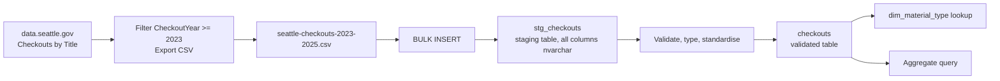

# Lab 01: Loading Seattle Library Checkout Data into SQL Server

## Objectives

- **Part 1:** Load a filtered slice of the Seattle Public Library
  checkouts dataset into a SQL Server staging table and assess data quality
- **Part 2:** Promote validated, typed rows into a real table and
  standardise the messy `MaterialType` column
- **Part 3:** Build a lookup table for material types
- **Part 4:** Produce a first aggregate query answering a real question

## Background / Scenario

Seattle Public Library publishes every title's monthly checkout count going
back to April 2005: physical books, ebooks, audiobooks, everything the
system tracks, aggregated by title and month rather than by borrower. It is
public, free, and enormous: the full history runs into tens of millions of
rows.

Nobody at a branch is going to open that file directly, and nobody should
be running ad hoc formulas against it in a spreadsheet either, once a real
BULK INSERT is on the table as an option. This lab is the same first step
as any of these five series: pull a reasonable slice of a real export, get
it into a shape a human (and later, Power BI) can query, using SQL Server
and T-SQL instead of Excel.

## Required Resources

- SQL Server (Developer or Express edition, free) and SQL Server
  Management Studio (SSMS). These are two separate downloads: SQL Server
  is the database engine, a background service with no interface of its
  own, and SSMS is the client you use to connect to it and write queries.
  Installing one does not install the other, and a surprising number of
  first attempts at this lab stall out on that exact confusion.
- Internet access to download the source data
- **Seattle Public Library, Checkouts by Title**, City of Seattle Open Data
  Portal: <https://data.seattle.gov/Community/Checkouts-by-Title/tmmm-ytt6>
  (mirrored on data.gov at
  <https://catalog.data.gov/dataset/checkouts-by-title>). Public dataset, no
  login required.
- Approximately 2 hours

### Getting a workable file

The full dataset is multiple gigabytes and neither BULK INSERT nor any
reasonable local SQL Server instance wants that in one pass for a training
lab. On the Socrata data portal page, use **Filter** (top of the table
view) to add a condition: `CheckoutYear` is at least `2023`. Then
**Export → CSV**. That keeps the download to a few hundred thousand rows
instead of tens of millions, and the filter step is exactly the kind of
thing worth writing down in your own notes, because you'll want to repeat
it in Lab 03 when the question of refresh comes up.

If the portal's export times out on a filtered request that large, drop the
filter to `CheckoutYear >= 2024` instead: one year is still enough data to
show every pattern this series needs.

Save the download as `data/seattle-checkouts-2023-2025.csv`, somewhere SQL
Server's service account can actually read it. This trips people up more
than the filter does: BULK INSERT runs inside the SQL Server process, not
your own login, so a file sitting in your personal Downloads folder can be
invisible to it even though you can open it yourself in Explorer. A folder
like `C:\data\` with read access granted broadly is the path of least
resistance for a training environment.

## Topology



---

## Part 1: Load to Staging and Assess

### Step 1: Create a database and staging table

Open SSMS, connect to your local instance, and run:

```sql
CREATE DATABASE SeattleLibrary;
GO

USE SeattleLibrary;
GO

CREATE TABLE dbo.stg_checkouts (
    UsageClass        NVARCHAR(50),
    CheckoutType      NVARCHAR(50),
    MaterialType      NVARCHAR(50),
    CheckoutYear      NVARCHAR(10),
    CheckoutMonth     NVARCHAR(10),
    Checkouts         NVARCHAR(20),
    Title             NVARCHAR(1000),
    ISBN              NVARCHAR(50),
    Creator           NVARCHAR(500),
    Subjects          NVARCHAR(2000),
    Publisher         NVARCHAR(500),
    PublicationYear   NVARCHAR(50)
);
GO
```

> **Every column is text in staging, on purpose.** A CSV row that fails to
> parse as a number during BULK INSERT doesn't get skipped quietly, it
> fails the whole batch unless you've told SQL Server what to do about it,
> and at a few hundred thousand rows from a real government export, at
> least one row will not be what you expect. Staging as text first means
> the load itself can't fail on a type mismatch. Typing happens as a
> separate, visible step in Part 2, where a bad row shows up as a row you
> can look at instead of a batch that silently didn't load.

### Step 2: Bulk insert the CSV

```sql
BULK INSERT dbo.stg_checkouts
FROM 'C:\data\seattle-checkouts-2023-2025.csv'
WITH (
    FIRSTROW = 2,
    FIELDTERMINATOR = ',',
    ROWTERMINATOR = '0x0a',
    TABLOCK,
    CODEPAGE = '65001'
);
GO
```

<details>
<summary>Hint</summary>

`ROWTERMINATOR = '0x0a'` (line feed only) rather than the Windows default
of `\r\n` is deliberate here, not a typo. A CSV exported from a web portal
frequently arrives with Unix-style line endings even when everything else
about the environment is Windows. If the load either fails outright or
succeeds but leaves every row's last column carrying a stray `\r`, that
mismatch is exactly what's happening: check with
`SELECT TOP 5 PublicationYear FROM stg_checkouts` and look for the
column values ending in something that doesn't print but shows up as
extra characters in a length check.

</details>

### Step 3: Confirm the load

```sql
SELECT COUNT(*) AS RowCount FROM dbo.stg_checkouts;
```

**Expected result:** hundreds of thousands of rows, not millions, and not
a suspiciously round number like exactly the file's line count minus one
header (a sign FIRSTROW is off) or a number that looks truncated partway
through the file (a sign the row terminator didn't match and the load
stopped early or merged rows together).

### Step 4: Check the columns you actually have

| Column | Expected content | What to check with T-SQL |
|---|---|---|
| UsageClass | Text | `SELECT DISTINCT UsageClass FROM stg_checkouts`, should be a small set |
| CheckoutType | Text | Physical vs. digital checkout systems |
| MaterialType | Text | `SELECT MaterialType, COUNT(*) FROM stg_checkouts GROUP BY MaterialType ORDER BY COUNT(*) DESC`, this is the problem column |
| CheckoutYear | Numeric text | `SELECT DISTINCT CheckoutYear FROM stg_checkouts`, matches the filter you applied? |
| CheckoutMonth | Numeric text | `SELECT DISTINCT CheckoutMonth FROM stg_checkouts ORDER BY 1`, 1 through 12 only? |
| Checkouts | Numeric text | `SELECT MIN(TRY_CAST(Checkouts AS INT)), MAX(TRY_CAST(Checkouts AS INT)) FROM stg_checkouts`, any zero or negative values, any NULL from a failed cast? |
| Title | Text | Any rows with extra punctuation jammed into the field? |
| Creator | Text | `SELECT COUNT(*) FROM stg_checkouts WHERE Creator IS NULL OR Creator = ''` |
| Subjects | Text | Same NULL/blank check |
| Publisher | Text | Same NULL/blank check |
| PublicationYear | Text | This column ships as text in the source, not a number, and stays that way here too |

> **Why check before promoting.** A validated table built on staging data
> you haven't looked at will produce a number that's wrong in a way you
> can't see. It will just look like an answer. This dataset in particular
> rewards checking first: it's real, it's messy, and none of the mess
> announces itself.

<details>
<summary>Hint</summary>

`ISBN` is worth a look too even though it isn't in the table above. Run
`SELECT CheckoutYear, COUNT(*) AS Total, SUM(CASE WHEN ISBN IS NULL OR
ISBN = '' THEN 1 ELSE 0 END) AS BlankISBN FROM stg_checkouts GROUP BY
CheckoutYear ORDER BY CheckoutYear`. The blank rate is not constant across
the years in the file, and that's worth knowing before Lab 06.

</details>

### Step 5: Find the actual problems

Count distinct `MaterialType` spellings:

```sql
SELECT COUNT(DISTINCT MaterialType) AS DistinctSpellings
FROM dbo.stg_checkouts;
```

**Expected result:** more distinct values than there are real material
types. Run the full breakdown to see why:

```sql
SELECT MaterialType, COUNT(*) AS Rows
FROM dbo.stg_checkouts
GROUP BY MaterialType
ORDER BY Rows DESC;
```

The source data mixes casing and formatting inconsistently, and you'll see
entries like `BOOK`, `Book`, and `book` sitting as separate groups, and
similarly for audiobooks and video formats. None of this is a data entry
error in the traditional sense; it's what 20 years of a library catalogue
system exporting through different code paths looks like.

Check `Subjects` for blanks:

```sql
SELECT
    COUNT(*) AS TotalRows,
    SUM(CASE WHEN Subjects IS NULL OR Subjects = '' THEN 1 ELSE 0 END) AS BlankSubjects
FROM dbo.stg_checkouts;
```

**Expected result:** a meaningful share of rows, often close to a third,
have no `Subjects` value at all. Older catalogue records and some digital
formats were never tagged.

Scan `Title` for entries containing a `/` or a `;` partway through, for
example `"Some Book Title / a novel"` or `"Series Name ; book 3"`. The
Title field sometimes carries subtitle or series information jammed in
with the main title rather than in a separate field.

```sql
SELECT Title, COUNT(*) AS Rows
FROM dbo.stg_checkouts
WHERE Title LIKE '%/%' OR Title LIKE '%;%'
GROUP BY Title
ORDER BY Title;
```

<details>
<summary>Hint</summary>

Sort the result alphabetically, as the query above already does, and read
down it. A title fragmenting across near-duplicate spellings tends to sit
close together once sorted, since the shared prefix before the `/` or `;`
is identical. Watch specifically for the same prefix appearing two or
three times with slightly different trailing text.

</details>

> **None of these three problems is a bug you fix by deleting rows.** A
> blank `Subjects` value is a real fact about that catalogue record, not
> missing data to be imputed. `MaterialType` casing is a formatting
> inconsistency you *can* fix safely. The Title field's jammed-in subtitle
> is somewhere in between: worth normalising for display, but the raw
> value is still the source of truth if you need to match back to the
> original record.

<details>
<summary>Expected result, Part 1</summary>

Row count for a `CheckoutYear >= 2023` filter runs into the hundreds of
thousands, not millions. `MaterialType` shows more than a dozen distinct
spellings before cleanup, more than the true number of formats. `Subjects`
blank rate sits close to a third. `ISBN` blank rate is low for recent rows
and much higher the further back you sample, because Seattle added the
field to this dataset partway through its history and never backfilled
older records. The `/`-filtered `Title` query should surface at least one
well-known, high-volume title split across two or three spelling variants.

</details>

---

## Part 2: Validate, Type, and Standardise MaterialType

### Step 1: Create the validated table

```sql
CREATE TABLE dbo.checkouts (
    UsageClass        NVARCHAR(50)  NOT NULL,
    CheckoutType      NVARCHAR(50)  NOT NULL,
    MaterialType       NVARCHAR(50)  NOT NULL,
    CheckoutYear       INT           NOT NULL,
    CheckoutMonth      INT           NOT NULL,
    Checkouts          INT           NOT NULL,
    Title              NVARCHAR(1000) NOT NULL,
    ISBN               NVARCHAR(50)  NULL,
    Creator            NVARCHAR(500) NULL,
    Subjects           NVARCHAR(2000) NULL,
    Publisher          NVARCHAR(500) NULL,
    PublicationYear    NVARCHAR(50)  NULL
);
GO
```

`PublicationYear` stays `NVARCHAR` here too. It's genuinely inconsistent in
the source (some rows carry a range like `"1998-1999"`, some carry
`"c1987"`) and forcing it to a number in the validated table would null out
exactly the rows worth investigating later.

### Step 2: Find rows that would fail typing, before you promote them

```sql
SELECT *
FROM dbo.stg_checkouts
WHERE TRY_CAST(CheckoutYear AS INT) IS NULL
   OR TRY_CAST(CheckoutMonth AS INT) IS NULL
   OR TRY_CAST(Checkouts AS INT) IS NULL
   OR Title IS NULL OR Title = '';
```

<details>
<summary>Hint</summary>

`TRY_CAST` returns `NULL` instead of erroring when a value can't convert,
which is exactly what makes this query useful: it surfaces the bad rows
without taking the whole batch down the way a plain `CAST` would the
moment it hit one. Run this before Step 3, not after, so you know what
you're excluding and why.

</details>

**Expected result:** a small number of rows, likely zero to a handful out
of a few hundred thousand, fail one of these casts. Government exports are
generally clean on structural columns even when they're messy on text
columns; the numeric fields are where the portal itself validates before
publishing.

### Step 3: Promote validated, typed rows

```sql
INSERT INTO dbo.checkouts (
    UsageClass, CheckoutType, MaterialType, CheckoutYear, CheckoutMonth,
    Checkouts, Title, ISBN, Creator, Subjects, Publisher, PublicationYear
)
SELECT
    UsageClass,
    CheckoutType,
    UPPER(LEFT(LTRIM(RTRIM(MaterialType)), 1))
        + LOWER(SUBSTRING(LTRIM(RTRIM(MaterialType)), 2, LEN(MaterialType))) AS MaterialType,
    TRY_CAST(CheckoutYear AS INT),
    TRY_CAST(CheckoutMonth AS INT),
    TRY_CAST(Checkouts AS INT),
    Title,
    NULLIF(ISBN, ''),
    NULLIF(Creator, ''),
    NULLIF(Subjects, ''),
    NULLIF(Publisher, ''),
    PublicationYear
FROM dbo.stg_checkouts
WHERE TRY_CAST(CheckoutYear AS INT) IS NOT NULL
  AND TRY_CAST(CheckoutMonth AS INT) IS NOT NULL
  AND TRY_CAST(Checkouts AS INT) IS NOT NULL
  AND Title IS NOT NULL AND Title <> '';
GO
```

> **Fixing casing is not the same as fixing meaning.** The
> `UPPER(LEFT(...)) + LOWER(SUBSTRING(...))` pattern above makes `BOOK` and
> `book` collapse into the same value, the same thing Excel's Capitalize
> Each Word does. It does nothing for two values that mean the same thing
> but are spelled differently on purpose in the source, like `"EBOOK"` and
> `"E-Book"`. Check the distinct value count again after this step; if
> it's still higher than expected, there's a second pass needed, and Lab
> 02's dimension table is where that gets handled properly rather than
> patched here row by row.

### Step 4: Re-count distinct MaterialType values

```sql
SELECT COUNT(DISTINCT MaterialType) AS DistinctSpellings
FROM dbo.checkouts;
```

**Expected result:** the count drops noticeably (casing was doing most of
the damage), but doesn't necessarily land on the "true" number of material
types yet. Note the remaining count; it matters in Lab 02.

### Step 5: Confirm nothing important got silently dropped

```sql
SELECT
    (SELECT COUNT(*) FROM dbo.stg_checkouts) AS StagingRows,
    (SELECT COUNT(*) FROM dbo.checkouts) AS ValidatedRows;
```

<details>
<summary>Expected result, Part 2</summary>

The distinct `MaterialType` count after Step 3 should be noticeably lower
than Part 1's raw count, typically cut by a third to a half, but still
above the true number of formats. `ValidatedRows` should be at most a
handful of rows below `StagingRows`, matching whatever Step 2 flagged.
`CheckoutYear` and `CheckoutMonth` load as `INT` with no cast errors on
the promoted rows. `PublicationYear` still shows text values like
`"1998-1999"` and `"c1987"` sitting alongside plain four-digit years in
the same column. That's expected, not a failed conversion.

</details>

---

## Part 3: Build the Material Type Lookup

### Step 1: Extract distinct material types

```sql
SELECT DISTINCT MaterialType
INTO dbo.dim_material_type
FROM dbo.checkouts;
GO
```

**Expected result:** a short list, roughly a dozen or fewer rows: book,
ebook, audiobook, video, music CD, and similar physical/digital formats.

### Step 2: Check for a specific problem: near-duplicate spellings

```sql
SELECT MaterialType FROM dbo.dim_material_type ORDER BY MaterialType;
```

Read down the sorted list by eye. Watch for pairs that are clearly the
same format under two spellings: `"Audiobook"` next to `"Audio Book"`, or
`"Videodisc"` next to `"Video Disc"`.

**Troubleshooting:** if you find pairs like this, note them but don't merge
them here yet. Part 2's cleaning only fixed casing, not wording. A proper
merge belongs in Lab 02's dimension table, where it can be done once and
tied to every fact row correctly, rather than as an ad hoc `UPDATE` in this
lookup.

### Step 3: Add a surrogate key

```sql
ALTER TABLE dbo.dim_material_type
ADD MaterialTypeId INT IDENTITY(1,1);
GO
```

<details>
<summary>Expected result, Part 3</summary>

`dim_material_type` lands somewhere around a dozen rows, not many more.
Write down every near-duplicate pair you spotted in Step 2, with the exact
spelling of each, before moving on. Lab 02 Part 3 asks you to finish this
merge and it goes faster if you already have the list.

</details>

---

## Part 4: A First Aggregate Query

### Step 1: Answer the question this lab set out to answer

Which `MaterialType` had the most checkouts?

```sql
SELECT MaterialType, SUM(Checkouts) AS TotalCheckouts
FROM dbo.checkouts
GROUP BY MaterialType
ORDER BY TotalCheckouts DESC;
```

<details>
<summary>Expected result</summary>

Which `MaterialType` had the most checkouts is what you're after here, and
Seattle's overall lending mix runs heavily digital system-wide (physical
print sat under a third of total checkouts by 2024). That citywide
split doesn't automatically apply to your own filtered result at this
`MaterialType` grain. Read what your query actually returns rather than
assuming the system-wide pattern holds for one slice.

</details>

### Step 2: Add a second dimension

```sql
SELECT MaterialType, UsageClass, SUM(Checkouts) AS TotalCheckouts
FROM dbo.checkouts
GROUP BY MaterialType, UsageClass
ORDER BY MaterialType, TotalCheckouts DESC;
```

<details>
<summary>Hint</summary>

If a `MaterialType` you expected to be purely physical (or purely digital)
shows rows under both `UsageClass` values, that's not a query error. Some
formats genuinely span both, which is exactly the overlap worth noticing
before Lab 02 builds a dimension table around these two fields.

</details>

**Expected result:** a breakdown of each material type by physical vs.
digital usage class, which starts to reveal that `MaterialType` and
`UsageClass` overlap in ways that aren't fully redundant. An ebook is
always digital `UsageClass`, but a `MaterialType` of "Book" can appear
under both, which is worth noticing now.

### Step 3: Ask the question the query can't cleanly answer

Which *title* had the most checkouts in the filtered period?

```sql
SELECT Title, SUM(Checkouts) AS TotalCheckouts
FROM dbo.checkouts
GROUP BY Title
ORDER BY TotalCheckouts DESC;
```

**Expected result:** it technically runs, but the near-duplicate title
spellings flagged in Part 1 mean the same book is very likely splitting
its checkout count across two or three rows instead of one, because
`GROUP BY Title` groups on the literal text value with no idea two rows
mean the same book. That fragmentation is the gap Lab 02 exists to close.

<details>
<summary>Expected result, Part 4</summary>

The MaterialType-level sort in Step 1 should show one format with a clear,
non-marginal lead over the rest, not a near-tie. In Step 3, look up the
same well-known title you flagged as split in Part 1: it should appear as
two or three separate rows here, each with a smaller `TotalCheckouts`,
none of which is the title's true total.

</details>

---

## Troubleshooting

| Symptom | Cause | Fix |
|---|---|---|
| BULK INSERT fails with a row terminator error, or loads but merges rows oddly | CSV uses Unix-style line feeds, not Windows CRLF | Set `ROWTERMINATOR = '0x0a'` explicitly, as in Part 1 Step 2 |
| BULK INSERT fails with "cannot bulk load, operating system error 5 (access is denied)" | SQL Server's service account can't read the file's location | Move the CSV to a folder with broad read access, e.g. `C:\data\` |
| MaterialType still shows many distinct values after Part 2 Step 3 | Casing fixed but wording still differs (e.g. "Audio Book" vs. "Audiobook") | Note the pairs for Lab 02; don't hand-merge here |
| `ValidatedRows` in Part 2 Step 5 is noticeably lower than expected | CheckoutYear filter wasn't applied before export, or the row terminator issue silently truncated the load | Re-run Part 1 Step 3's row count check against the raw CSV's line count |
| A GROUP BY Title query is slow | Too many distinct titles grouped as raw text | Expected at this stage: this is the reason Lab 02 builds a proper dim_title |

---

## Reflection

1. How many distinct `MaterialType` values did staging contain, versus
   after standardising casing in the validated table? What does the gap
   tell you about how the source system produces this field?
2. Which material type actually won on checkouts in your filtered period?
   Does it match what you expected before loading the file?
3. Why stage every column as text and validate afterward, rather than
   typing columns directly in the `BULK INSERT` and letting bad rows fail
   the load?

---

## What Went Wrong When I Did This

- **Left `ROWTERMINATOR` at its default** on the first BULK INSERT attempt,
  assuming a CSV downloaded on Windows would have Windows line endings.
  The load completed without an error, which was the deceptive part: row
  counts looked plausible, but `PublicationYear` on every row carried a
  trailing carriage return that only showed up once I ran a `LEN()` check
  against a value I already knew should be four characters long. Setting
  `ROWTERMINATOR = '0x0a'` fixed it cleanly.
- **Set the database collation to a case-sensitive one** while testing a
  restore on a second machine, without thinking about what that would do
  to the `GROUP BY MaterialType` query from Part 4. Distinct counts nearly
  doubled overnight for no reason I could see until I checked
  `SELECT DATABASEPROPERTYEX('SeattleLibrary', 'Collation')` and realized
  `Book` and `book` were no longer being treated as duplicates for
  anything except the explicit `UPPER`/`LOWER` standardisation in Part 2,
  which happened to mask it there but not in ad hoc queries against
  `stg_checkouts`. Matched the collation to the default
  case-insensitive one and re-ran the checks.
- **Tried to BULK INSERT directly into a typed table** on my first pass,
  skipping staging entirely, because it looked like less work. A single
  row with a stray non-numeric character in `Checkouts` failed the entire
  batch with no indication of which row caused it. Rebuilt the process
  with a text-only staging table so a bad row is something I can find
  with a query, not something that takes down the whole load.

---

## Where This Breaks

- `MaterialType` casing is fixed but near-duplicate wording (Audiobook vs.
  Audio Book) is only flagged, not resolved
- The same title can appear under slightly different spellings across
  rows, meaning a naive `GROUP BY Title` undercounts or fragments a
  popular title's true checkout total
- Every new question is a new ad hoc query with no shared model behind it,
  and a Title-by-MaterialType query is already showing the scaling problem
  a real dimension table would solve

**Next:** [Lab 02: Building a Power BI Data Model](02-data-model.md)
