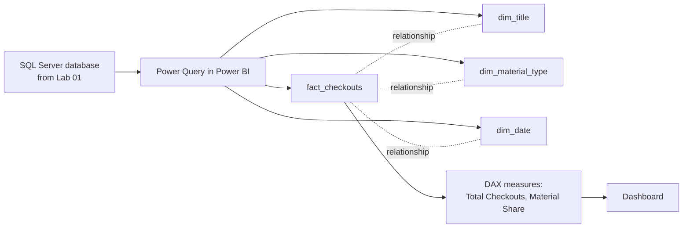

# Lab 02: Building a Power BI Data Model

## Objectives

- **Part 1:** Import the Lab 01 SQL Server tables into Power BI and split
  them into a star schema
- **Part 2:** Resolve the title fragmentation problem found in Lab 01
- **Part 3:** Finish the MaterialType near-duplicate merge Lab 01 flagged
- **Part 4:** Write DAX measures for total checkouts and material share
- **Part 5:** Validate against the Lab 01 query results

## Background / Scenario

Lab 01 answered "which material type had the most checkouts" but got stuck
the moment it tried to answer "which *title* had the most checkouts." The
same book was splitting its count across multiple rows because of small
spelling differences in the `Title` field, and a plain `GROUP BY` has no
way to tell those rows they're the same book.

Power BI fixes this differently than T-SQL alone would: a proper dimension
table built with a normalised join key groups those rows together once,
and every measure downstream inherits the fix automatically.

## Required Resources

- Power BI Desktop (free, Windows)
- The `SeattleLibrary` SQL Server database from Lab 01, containing
  `dbo.checkouts` and `dbo.dim_material_type`
- Approximately 3 hours

## Topology



---

## Part 1: Split into a Star Schema

### Step 1: Connect to SQL Server

**Get Data → SQL Server database.** Enter the server name (`localhost` or
your instance name) and database `SeattleLibrary`. Select **Import** mode,
not DirectQuery, for this series. Tick `dbo.checkouts` and
`dbo.dim_material_type` → **Transform Data**.

### Step 2: Build fact_checkouts

From `dbo.checkouts`, keep: `Title`, `Creator`, `MaterialType`,
`UsageClass`, `CheckoutType`, `CheckoutYear`, `CheckoutMonth`, `Checkouts`.
Rename the query `fact_checkouts`.

### Step 3: Build dim_date

Reference `fact_checkouts` → keep `CheckoutYear`, `CheckoutMonth` only →
**Remove Duplicates** → rename query `dim_date`. Add a `MonthName` column:
**Add Column → Custom Column**:

```
MonthName = Date.MonthName(#date([CheckoutYear], [CheckoutMonth], 1))
```

> **Why a real date key, not just year and month as two separate numbers.**
> This dataset has no day-level granularity at all. It's monthly by
> design, aggregated at the source. That's fine for `dim_date`, but it
> means Lab 04's month-over-month measures need to reason in whole months
> from the start; there's no daily grain to fall back on if a monthly
> comparison isn't specific enough.

### Step 4: Add a proper Date column for sorting and relationships

**Add Column → Custom Column**:

```
Date = #date([CheckoutYear], [CheckoutMonth], 1)
```

Set its type to Date.

### Step 5: Close and apply

**Home → Close & Apply**.

<details>
<summary>Expected result, Part 1</summary>

Four tables in Model view: `fact_checkouts`, `dim_material_type`,
`dim_date`, and whatever you named the raw reference before splitting.
`dim_date` has one row per distinct CheckoutYear/CheckoutMonth pair
actually present in the filtered export, at most 36 rows for a
2023-through-2025 pull, not one row per fact row. Power BI will have
auto-guessed a relationship between `fact_checkouts` and `dim_date` off
matching year/month columns; check the Model view diagram before Part 2
rather than assuming the guess is right.

</details>

---

## Part 2: Resolve the Title Fragmentation Problem

### Step 1: Confirm the collision in Power BI

Build a quick table visual: `Title`, sum of `Checkouts`, filtered to a
well-known book. Compare the row count against what you'd expect for one
title.

**Expected result:** more than one row for what is clearly a single title.
One row might read `"Some Book Title"`, another `"Some Book Title / a
novel"`, another with trailing whitespace or a different capitalisation of
a subtitle. Lab 01 Part 4 Step 3 hit exactly this and set it aside; this is
where it gets fixed.

<details>
<summary>Hint</summary>

Before writing anything, list out loud what makes two `Title` values the
same book: casing differences, a subtitle after `/` or `;`, leading or
trailing whitespace. Each of those is a separate transform. The formula in
Step 2 chains them in that order for a reason, worth understanding before
you copy it.

</details>

### Step 2: Build a normalised join key

In Power Query, reference `fact_checkouts` (not duplicate) to build
`dim_title`. Keep `Title`, `Creator`. **Remove Duplicates** first on the
raw `Title`. This still leaves near-duplicates in, but shrinks the table
before the next step runs.

**Add Column → Custom Column**, a normalised key that strips the kind of
noise found in Lab 01:

```
TitleKey =
Text.Trim(
    Text.Lower(
        Text.BeforeDelimiter(
            Text.BeforeDelimiter([Title], "/"),
            ";"
        )
    )
)
```

This takes everything before a `/` or `;` (where subtitle or series
information tends to get jammed in), lowercases it, and trims whitespace.

> **A normalised key is not the same as a clean display value.** `TitleKey`
> exists to *group* rows that are the same book under different spellings.
> It is not what you'd want showing on a report page, because
> lowercasing and stripping subtitles throws away real information a
> reader wants to see. Keep the original `Title` as a separate display
> column; `TitleKey` is a join and grouping key only.

### Step 3: Group on the normalised key

**Group By** on `TitleKey`, aggregating: keep the first `Title` value (as
`DisplayTitle`) and the first `Creator` value per group.

**Expected result:** the row count drops. The previously fragmented title
now groups to one row under one `TitleKey`.

<details>
<summary>Hint</summary>

If the row count barely changes, check that `TitleKey` was actually added
before you ran Remove Duplicates on raw `Title` in Step 2, and that
Group By is grouping on `TitleKey`, not still on `Title`.

</details>

### Step 4: Relate fact to dim_title

Add the same `TitleKey` custom column to `fact_checkouts`, using the
identical formula from Step 2. Relate `fact_checkouts[TitleKey]` to
`dim_title[TitleKey]`, many-to-one, single direction.

> **This is the exact trap Lab 01 flagged and did not fix.** A `GROUP BY`
> in T-SQL has no equivalent of a normalised join key unless you build one
> yourself, and Lab 01 deliberately didn't. Power BI's model doesn't fix
> this automatically either; the `TitleKey` transform is the fix, done
> once in Power Query, and every visual built against `dim_title` from
> here on inherits it for free.

### Step 5: Confirm the fix

Rebuild the Step 1 table visual using `dim_title[DisplayTitle]` instead of
the raw `fact_checkouts[Title]`.

**Expected result:** the same well-known book now shows as a single row
with its full, correctly summed checkout count.

**Troubleshooting:** if `TitleKey` still produces more than one group for
a title you know is duplicated, the delimiter split isn't catching every
case in this dataset. Check for a `:` used the same way `/` and `;` are,
and extend the `Text.BeforeDelimiter` chain if so. Some fragmentation is
genuinely due to different editions or formats of the same work, not a
key problem. That's a real distinction, not a bug, and worth leaving
alone.

<details>
<summary>Expected result, Part 2</summary>

`dim_title`'s row count after grouping should be noticeably lower than the
Remove-Duplicates count from Step 2, and it should be much lower than
`fact_checkouts`'s row count, since one title spans many months of
checkouts. The relationship in Model view shows as many-to-one with no
warning icon. The well-known title from Lab 01 Part 1 now sums to one
number across the whole filtered period, matching the total you'd get by
manually adding its fragments from the Lab 01 `GROUP BY Title` query.

</details>

---

## Part 3: Finish the MaterialType Merge

Lab 01 Part 3 Step 2 flagged near-duplicate `MaterialType` spellings
(`"Audiobook"` vs. `"Audio Book"`) that casing normalisation alone didn't
catch.

### Step 1: List the remaining values

In Power Query, open `dim_material_type`. With a small table like this,
read it directly rather than writing a formula.

### Step 2: Merge near-duplicates with Replace Values

Using the pairs you wrote down in Lab 01 Part 3 Step 2, pick one canonical
spelling for each pair and use **Transform → Replace Values** to map the
other spelling onto it.

<details>
<summary>Hint</summary>

Replace Values only changes exact matches, so replace the less common
spelling with the more common one rather than trying to handle both
directions at once. If you didn't note the pairs in Lab 01, re-sort
`dim_material_type` alphabetically now and look for the same kind of
near-miss: same format, different wording.

</details>

### Step 3: Remove duplicates again

After the replace, **Remove Duplicates** on `dim_material_type` once more.
The replace step can produce two rows with the same value.

**Expected result:** the material type list is now genuinely one row per
real-world format, which matters for Part 4's share measure. A merge left
undone here would silently split one material type's checkouts across two
rows in every visual downstream.

<details>
<summary>Expected result, Part 3</summary>

`dim_material_type`'s row count should drop by however many near-duplicate
pairs you merged, landing at roughly ten or fewer rows, one per genuinely
distinct format. Cross-check: summing `Total Checkouts` (once you've built
it in Part 4) across every remaining `MaterialType` row should equal the
unfiltered total, confirming the merge didn't silently drop any rows.

</details>

---

## Part 4: Write the Measures

### Step 1: Total Checkouts

```dax
Total Checkouts = SUM(fact_checkouts[Checkouts])
```

### Step 2: Material Share, the measure Lab 01 couldn't produce

```dax
Material Share =
DIVIDE(
    [Total Checkouts],
    CALCULATE( [Total Checkouts], ALL(dim_material_type[MaterialType]) )
)
```

### Step 3: Understand what ALL does here

| Function | What it does |
|---|---|
| `[Total Checkouts]` in the numerator | Checkouts in whatever material type/title the visual currently shows |
| `ALL(dim_material_type[MaterialType])` | Removes the material type filter only, so the denominator sums every type |
| `CALCULATE(..., ALL(...))` | The standard "percent of a wider total" pattern in DAX |

> **This is the same gap Lab 01 hit with Title, generalised.** A `GROUP
> BY`'s percentages only work if you write a second query for the wider
> total and join it back yourself. A measure using `ALL()` computes the
> same ratio but stays correct in any visual (a card, a matrix, a chart
> with a slicer applied) without redefining it per view.

### Step 4: Format as a percentage

Select `Material Share` → **Measure tools → Format → Percentage**, 1
decimal place.

### Step 5: Top titles measure

```dax
Top Title Checkouts =
CALCULATE(
    [Total Checkouts],
    TOPN( 1, ALL(dim_title[DisplayTitle]), [Total Checkouts] )
)
```

<details>
<summary>Expected result, Part 4</summary>

`Total Checkouts` on a blank card should be within a small rounding margin
of the sum you'd get from Lab 01's `SUM(Checkouts)` query across every
MaterialType (exact equality isn't guaranteed since Part 3's merge may
have grouped a couple of Lab 01's categories together). `Material Share`
on an unfiltered card reads 100%; filtered to one material type it reads
well under 100%. `Top Title Checkouts` should match whatever title led the
Lab 01 Part 4 Step 3 query, now as one correct number instead of split
fragments.

</details>

---

## Part 5: Validate Against Lab 01

### Step 1: Cross-check the material type totals

Pick one material type. Confirm `Total Checkouts` filtered to it matches
the Lab 01 `GROUP BY MaterialType` query's result exactly.

**Troubleshooting:** a mismatch usually means Part 3's merge changed which
rows count toward which material type. Recheck the Replace Values mapping
against the Lab 01 query's original category list.

### Step 2: Spot-check the title fix

Pick the title that was fragmented in Lab 01 Part 4 Step 3. Confirm its
Power BI total equals the sum of its fragments in the original T-SQL
`GROUP BY Title` result, not just one of the fragment rows.

<details>
<summary>Expected result, Part 5</summary>

Both checks should match the Lab 01 numbers exactly, or within a small,
explainable gap tied to a Part 3 merge decision you can point to. An
unexplained mismatch means retracing Parts 2-3, not adjusting the Lab 01
number to fit.

</details>

---

## Troubleshooting

| Symptom | Cause | Fix |
|---|---|---|
| A known title still shows as two rows | TitleKey delimiter list doesn't cover a separator used in this dataset | Extend Part 2 Step 2's Text.BeforeDelimiter chain |
| Material Share always shows 100% | ALL() applied to the wrong column | Confirm it targets `MaterialType`, not the whole table |
| Total Checkouts doesn't match Lab 01 query result | MaterialType merge in Part 3 changed grouping after the Lab 01 numbers were taken | Re-run the Lab 01 query against the Part 3 mapping, or treat Power BI's number as the corrected one and note why |
| dim_title relationship won't create | TitleKey column missing or differently cased between fact and dim | Confirm the identical formula was used in both places |
| SQL Server connection fails from Power BI | SQL Server Browser service not running, or the instance doesn't allow remote/local TCP connections | Confirm the instance name matches SSMS exactly, and that TCP/IP is enabled in SQL Server Configuration Manager |

---

## Reflection

1. Why does grouping on a normalised `TitleKey` fix undercounting that a
   plain `GROUP BY Title` couldn't, even though both are ultimately just
   grouping rows?
2. What real-world cases would make two `TitleKey` values legitimately
   different even though they look like "the same book": different
   editions, different formats, something else?
3. If a new checkout row arrives next month with yet another spelling
   variant of a known title, does it join `dim_title` correctly without
   any manual intervention? Why or why not?

---

## What Went Wrong When I Did This

- **Wrote the first `TitleKey` formula splitting only on `/`**, not `;`. It
  fixed most of the fragmentation but left a smaller cluster of rows
  split on a semicolon-separated series note. Found it by re-running the
  Part 5 Step 2 spot check against a title I already knew was fragmented,
  not by noticing it on my own.
- **Grouped `dim_title` before adding the matching `TitleKey` column to
  `fact_checkouts`**, so the relationship silently failed to match any
  rows. Every checkout showed as unrelated in the visual. The dimension
  table looked fine in isolation, which is what made this easy to miss;
  the fact table's key has to be built with the exact same formula, not
  just something similar.
- **Merged two MaterialType values in Part 3 that were not actually the
  same format**: collapsed a specific video format into the general
  "Video" bucket without checking what it represented first. Caught it
  when the Material Share numbers didn't match Lab 01's original query
  result and had to trace back which merge caused the drift.

---

## Where This Breaks

- The model works for one loaded database, refreshed by hand
- No connection to the live open data portal. Someone has to re-filter,
  re-export, re-load into SQL Server, and re-point Power Query every time
- Material Share and title totals are correct but the model has no way to
  compare this period to a prior one yet

**Next:** [Lab 03: Interactive Checkouts Dashboard](03-dashboard.md)
