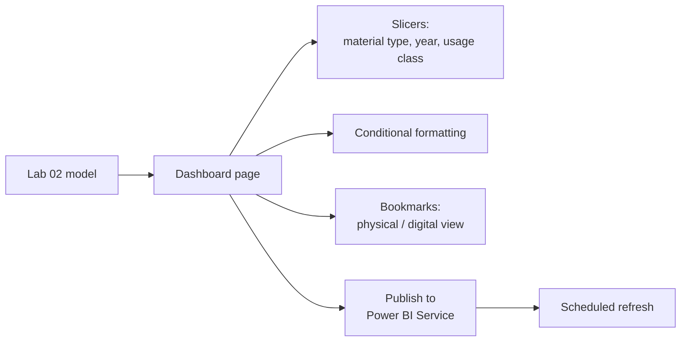

# Lab 03: Interactive Checkouts Dashboard

## Objectives

- **Part 1:** Design a dashboard page around one decision, not a wall of charts
- **Part 2:** Add cross-filtering slicers and a bookmark-based view toggle
- **Part 3:** Apply conditional formatting to surface standout titles
- **Part 4:** Publish to Power BI Service and set a scheduled refresh

## Background / Scenario

Lab 02 built the data model and fixed two real problems, fragmented
titles and messy material types, but the visuals so far only answer the
specific questions those labs asked. A dashboard is different: it has to
work for a question nobody has asked yet, at a glance, and that changes what
"add a chart" means.

## Required Resources

- Power BI Desktop
- The `.pbix` file from Lab 02
- A free Power BI Service account (Microsoft 365 email works, or a free
  Fabric trial) for Part 4
- Approximately 3 hours

## Topology

---

## Part 1: Design Around One Decision

### Step 1: Write down the decision before building anything

Someone deciding where to put next quarter's acquisitions budget needs to
answer one thing: *which material types and subjects are actually growing
in checkouts, and which are flat or declining?* Everything on the page
should serve that.

### Step 2: Build the core visual

Add a line chart: axis `dim_date[Date]`, values `[Total Checkouts]`,
legend `dim_material_type[MaterialType]`.

### Step 3: Add a reference line

**Format the visual → Analytics → Average line**, applied per material type
(Format → set "per category").

> **A single number is not a trend signal. A comparison is.** "42,000
> checkouts this month" means nothing on its own. "42,000 against a
> 31,000 average for this material type" is the actual answer to the
> question Part 1 Step 1 asked.

Expected result, Part 1

The line chart shows one line per material type, each with its own
average reference line rather than one shared average across all types.
"Per category" in Step 3 is what makes that split happen. A format with a
naturally larger base (books, say) should sit well above a smaller-volume
digital format on the same axis, which can make the smaller lines look
flat by comparison; that's the chart doing its job, not a bug.

---

## Part 2: Slicers and a Bookmark Toggle

### Step 1: Add cross-filtering slicers

Add slicers for `dim_material_type[MaterialType]`, `dim_date[CheckoutYear]`,
and `fact_checkouts[UsageClass]`. Confirm **Format → Edit interactions**
leaves cross-filtering on for all three visuals from Lab 02 and Part 1.

### Step 2: Build two views with bookmarks

Filter the line chart's legend to physical material types only (Book,
Audiobook CD, and similar). **View → Bookmarks → Add**, name it
`Physical`.

Change the filter to digital material types only (Ebook, Digital
Audiobook). **Bookmarks → Add**, name it `Digital`.

### Step 3: Add buttons that apply each bookmark

**Insert → Buttons → Blank**, add two buttons labelled "Physical" and
"Digital". **Format → Action → Bookmark**, assign each button its
bookmark.

> **A bookmark captures visual state, not data.** Switching between
> Physical and Digital doesn't requery anything. It's the same model,
> filtered two ways. This is why it's instant, unlike a slicer change on
> a large model, which does requery.

Expected result, Part 2

Clicking each button switches the line chart's legend instantly, with no
visible delay, and the slicers from Step 1 still cross-filter correctly on
top of whichever bookmark is active. If a slicer selection doesn't survive
a bookmark switch, the bookmark was saved with "All visuals" data state
included when it shouldn't have been, or excluded when it should. Check
the bookmark's data settings against what you intended it to capture.

---

## Part 3: Conditional Formatting

### Step 1: Format the top-titles table by checkout volume

Build a table visual: `dim_title[DisplayTitle]`, `[Total Checkouts]`, top
20 by checkouts. Select `Total Checkouts` → **Conditional formatting →
Data bars**.

### Step 2: Add a rule-based background for standout growth

A subject specialist wants to spot titles that are pulling unusually hard
for their material type at a glance, without reading every row. Write a
measure that flags a title as a standout, then apply **Background color →
Format by: Field value**, referencing that measure on the table from Step
1.

The proper year-over-year version of this comparison needs a measure Lab 04
hasn't built yet, so keep this one simple: compare each visible title's
checkouts against the average checkouts across whatever titles are
currently in the table, using `AVERAGEX` and the same `ALL()` pattern from
Part 4 of Lab 02.

Hint

`Checkout Growth Flag` needs two things: an average to compare against
(`AVERAGEX(ALL(dim_title[DisplayTitle]), [Total Checkouts])` computed
inside the current material-type filter, not stripped of it entirely) and
a threshold that decides what counts as a standout, not merely above
average. Three times the average is a reasonable bar for "standout" rather
than "slightly ahead". Build the measure to return a text value like
`"Standout"` or `""` and format the background on that.

### Step 3: Confirm it responds to filters

Apply the material type slicer to Ebook only. Watch the highlighted rows
change.

**Expected result:** the formatting is relative to whatever's currently
filtered, not a fixed threshold. A title that's unremarkable across the
whole collection can correctly stand out within one material type, because
the comparison recalculates in context too.

Expected result, Part 3

With no slicer applied, only a small number of the top 20 titles should
flag as standouts, not most of them. If most did, the threshold is too
low. Filtering to Ebook only should change which specific titles flag,
since the comparison average itself shifts to the ebook-only average, not
just which rows are visible.

---

## Part 4: Publish and Schedule Refresh

### Step 1: Publish

**Home → Publish** → sign in → choose your workspace (My Workspace is
fine for a personal account).

### Step 2: Set up scheduled refresh

In Power BI Service, open the dataset's settings → **Scheduled refresh**.
Because the source is an on-premises SQL Server instance, this requires
the **On-premises data gateway** (free download, installed on the same
machine as SQL Server or one that can reach it), configured with
credentials for the `SeattleLibrary` database.

> **This dataset actually gets updated at the source, which makes the
> refresh story real rather than hypothetical.** Seattle's open data
> portal refreshes Checkouts by Title on a regular cycle. New months of
> checkout data land there without anyone touching this database. A
> scheduled refresh only helps if something re-runs Lab 01's BULK INSERT
> against the live portal on a schedule, which a plain gateway refresh of
> a SQL Server table does not do by itself. Publishing shares the report;
> it does not automatically go back and re-pull the source.

### Step 3: Set gateway or acknowledge the limitation

If installing the gateway is impractical for this lab, set refresh to
manual and note it. This is itself the finding, not a shortcut being
skipped. A more complete fix would call the portal's API directly from a
scheduled SQL Server job or Power Query instead of relying on a manually
re-run BULK INSERT at all; that's worth naming as a known gap even if
it's out of scope here.

Expected result, Part 4

The report opens in Power BI Service and every visual, slicer, and
bookmark button from Parts 1-3 works identically to Desktop. If a gateway
is installed and configured with valid SQL Server credentials, a manual
refresh from the dataset settings page should complete without error and
the "last refreshed" timestamp should update. If no gateway is installed,
the settings page should show refresh as manual only, with no scheduled
refresh option available, and that's the correct state to document rather
than a misconfiguration to chase.

---

## Troubleshooting

| Symptom | Cause | Fix |
|---|---|---|
| Buttons don't switch views | Bookmark captured the wrong visual state | Redo Part 2 Step 2, check "All visuals" is selected when adding the bookmark |
| Conditional formatting looks static | Rule set to fixed values instead of a measure-based rule | Rebuild using "Format by: Field value" referencing a rule measure |
| Scheduled refresh fails | No gateway, or gateway can't reach the SQL Server instance | Install gateway on a machine that can reach SQL Server, or accept manual refresh and document it |
| Physical/Digital bookmark shows the wrong material types | UsageClass and MaterialType don't map 1:1 (an ebook is always digital, but "Book" as MaterialType is not always the right proxy) | Filter the bookmark on MaterialType explicitly, not on UsageClass as a stand-in |

---

## Reflection

1. Why does the bookmark toggle feel instant while a slicer change on a
   large model can take a second or two?
2. What would you have to change if a subject specialist wanted the
   standout-growth threshold to be configurable without editing the
   report?
3. Given that the source data genuinely updates monthly, is a manually
   re-run BULK INSERT an acceptable long-term source for this dashboard?
   What would actually need to change to make refresh trustworthy?

---

## What Went Wrong When I Did This

- **Built the Digital bookmark by filtering on `UsageClass` instead of
  `MaterialType`**, assuming they were interchangeable. They're not:
  `UsageClass` only distinguishes physical from digital broadly, while a
  format like large-print books is still physical `UsageClass` but a
  distinct `MaterialType` some digital-focused analysis wanted excluded
  either way. Reworked both bookmarks to filter on `MaterialType`
  directly.
- **Set the conditional formatting threshold as a fixed number** eyeballed
  from one material type's chart, so it stopped making sense the moment I
  filtered to Ebook, where checkout volumes run much lower. Had to rebuild
  it as a relative, filtered-average-based rule to make it contextual.
- **No gateway installed**, and scheduled refresh silently failed for
  several days before I noticed the dashboard was showing a stale
  CheckoutYear filter with no warning visible anywhere on the page.

---

## Where This Breaks

- Refresh depends on a gateway that can reach the SQL Server instance, or
  a human remembering to re-filter, re-export, and re-run the BULK INSERT
  from the open data portal
- The model still has no way to compare this period to the same period
  last year, the reason Lab 04 exists
- Nothing prevents someone from editing the underlying SQL Server tables
  in a way that silently breaks the title or material-type keys built in
  Lab 02

**Next:** [Lab 04: Time Intelligence and Checkout Trends](04-time-intelligence.md)
