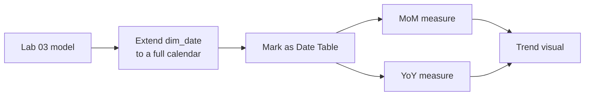

# Lab 04: Time Intelligence and Checkout Trends

## Objectives

- **Part 1:** Extend the dataset's date range so time comparisons are meaningful
- **Part 2:** Write month-over-month and year-to-date DAX measures
- **Part 3:** Diagnose why time intelligence fails without a proper date table
- **Part 4:** Build a trend visual with a comparison baseline

## Background / Scenario

The filtered export covers CheckoutYear 2023 onward. Real trend questions,
like "is this month better than last month" or "are we ahead of where we were this
time last year," need `dim_date` to behave like a real calendar, not just
a list of year/month pairs that happen to appear in the fact table.

## Required Resources

- Power BI Desktop
- The `.pbix` file from Lab 03
- Approximately 2.5 hours

## Topology



---

## Part 1: Extend the Date Range

### Step 1: Confirm the problem

Try `SAMEPERIODLASTYEAR` against the current `dim_date` (built in Lab 02
from only the CheckoutYear/CheckoutMonth pairs present in
`fact_checkouts`). If the filtered export starts at 2023 and you're
looking at early 2023 data, it returns blank, because there's no data,
and no *date rows*, a year earlier.

### Step 2: Rebuild dim_date as a full calendar

Replace the Lab 02 `dim_date` query with a DAX calculated table (**Modeling
→ New Table**):

```dax
dim_date =
ADDCOLUMNS(
    CALENDAR( DATE(2022,1,1), DATE(2025,12,31) ),
    "CheckoutYear", YEAR([Date]),
    "CheckoutMonth", MONTH([Date]),
    "MonthName", FORMAT([Date], "MMMM"),
    "YearMonth", FORMAT([Date], "YYYY-MM")
)
```

Starting the calendar a year before the filtered export's earliest
CheckoutYear is deliberate: it gives `SAMEPERIODLASTYEAR` something to
compare 2023 against, even though those 2022 rows will show zero
checkouts, because the fact table simply doesn't reach that far back.

> **A date table needs to span more than the fact table's actual dates.**
> `SAMEPERIODLASTYEAR` looks up rows in `dim_date` that may have zero
> matching fact rows. That's expected and correct, not a bug. In this
> dataset specifically, the comparison period showing "no checkouts" for
> 2022 isn't a data problem, it's an honest reflection of the fact that
> Lab 01's filter chose not to pull that year.

### Step 3: Mark it as the official date table

**Model view → right-click dim_date → Mark as Date Table** → select `Date`
as the key column.

### Step 4: Relate it

Delete the old `dim_date` relationship built on `CheckoutYear`/
`CheckoutMonth`. Confirm `fact_checkouts[Date]` → `dim_date[Date]`,
many-to-one, single direction, using the `Date` column added back in Lab
02 Part 1 Step 4.

<details>
<summary>Hint</summary>

If Power BI won't let the new relationship activate, it's very likely
because the old CheckoutYear/CheckoutMonth relationship to the previous
`dim_date` is still sitting there. A fact table can only have one active
relationship to a given dimension table at a time; the older one has to go
before the new one activates, not just alongside it.

</details>

<details>
<summary>Expected result, Part 1</summary>

`dim_date` now has one row per calendar day across the full four-year
range, which is roughly 1,460 rows, not the couple dozen year/month pairs
the old version had. The relationship diagram shows exactly one active
line between `fact_checkouts` and `dim_date`. `SAMEPERIODLASTYEAR` against
early-2023 data now returns a number (likely zero, since 2022 has no fact
rows) instead of erroring.

</details>

---

## Part 2: Month-over-Month and Year-to-Date

### Step 1: Month-over-month checkouts

```dax
Checkouts MoM % =
VAR CurrentCheckouts = [Total Checkouts]
VAR PriorMonthCheckouts =
    CALCULATE( [Total Checkouts], DATEADD(dim_date[Date], -1, MONTH) )
RETURN
    DIVIDE( CurrentCheckouts - PriorMonthCheckouts, PriorMonthCheckouts )
```

### Step 2: Understand DATEADD

| Piece | What it does |
|---|---|
| `DATEADD(dim_date[Date], -1, MONTH)` | Shifts the current filter context back one month |
| `CALCULATE([Total Checkouts], ...)` | Re-evaluates Total Checkouts inside that shifted context |
| The `VAR`s | Compute each side once, so the DIVIDE is readable and the values are inspectable while debugging |

### Step 3: Year-over-year checkouts

Write `Checkouts YoY %` yourself, following the same `VAR`/`RETURN` shape
as Step 1's MoM measure. It needs the same year a year ago instead of the
same month a month ago. `SAMEPERIODLASTYEAR()` is the function for that,
used the same way `DATEADD` was used above.

<details>
<summary>Hint</summary>

`SAMEPERIODLASTYEAR(dim_date[Date])` takes only the date column, no offset
argument, because "last year" is unambiguous in a way "one period back"
isn't. Structure it exactly like `Checkouts MoM %`: one `VAR` for the
current value, one for the prior-year value wrapped in `CALCULATE`, then a
`DIVIDE` in the `RETURN`.

</details>

### Step 4: Checkouts year-to-date

```dax
Checkouts YTD = TOTALYTD( [Total Checkouts], dim_date[Date] )
```

### Step 5: Confirm all three against the real calendar

Put `Checkouts MoM %`, `Checkouts YoY %`, and `Checkouts YTD` on a card
visual, filtered to a month partway into the dataset's actual range.
Sanity-check the YTD number by summing the visible months by hand.

<details>
<summary>Expected result, Part 2</summary>

For a month filter somewhere in the middle of the dataset's real range,
`Checkouts MoM %` should be a modest swing, typically within plus or minus
15%, not a multiple. `Checkouts YoY %` for any month before the filtered
export's earliest CheckoutYear should show blank rather than a number, not
an error. `Checkouts YTD` should equal your own hand sum of every month
from January through the filtered month, to within rounding.

</details>

---

## Part 3: Diagnose the Failure Mode

### Step 1: Break it on purpose

Change the `dim_date` relationship's cross-filter direction to **Both**.

**Record what happens** to `Checkouts MoM %` on a matrix broken out by
`dim_material_type[MaterialType]`.

**Expected result:** the measure may still compute a number, but it's now
ambiguous which direction is filtering which. Bidirectional filtering
against a date table with `DATEADD` inside a measure is a well-known
source of circular or double-counted results once a second relationship
touches the same date table.

Set it back to **Single**.

### Step 2: Remove the Mark as Date Table setting

**Model view → dim_date → un-mark as date table.**

**Expected result:** `DATEADD`, `TOTALYTD`, and `SAMEPERIODLASTYEAR` either
error outright or silently return wrong results, because these functions
require Power BI to know which column is the authoritative, contiguous
date axis, which is exactly what marking the table declares.

Re-mark it before continuing.

### Step 3: Record the symptom

| Symptom | Likely cause |
|---|---|
| Time intelligence functions error or return blank everywhere | dim_date not marked as a date table |
| Time intelligence numbers look plausible but don't match manual math | Bidirectional relationship on the date table |
| YoY shows blank throughout 2023 | Correct: there's no 2022 fact data behind the extended calendar to compare against |

<details>
<summary>Expected result, Part 3</summary>

With the relationship set back to Both, `Checkouts MoM %` on the material
type matrix should produce numbers that don't reconcile with a manual
month-over-month calculation done outside Power BI. The mismatch itself is
the expected symptom. After un-marking `dim_date` as a date table, the
same measure should either throw a function-specific error naming
`DATEADD` or `SAMEPERIODLASTYEAR`, or return blank across the board. Both
states get reversed before Part 4.

</details>

---

## Part 4: Trend Visual with a Baseline

### Step 1: Line chart with a comparison line

Line chart: axis `dim_date[Date]`, values `Total Checkouts` and
`Checkouts MoM %` (add as a second measure, format on a secondary axis).

### Step 2: Read it correctly

**Expected result:** the MoM line is blank for the first month in the
dataset's real range (Part 3's expected symptom, now visible in the actual
visual, not just a card), a useful check that the measure and the chart
agree.

### Step 3: Add YoY once the filtered range covers a full second year

If the export includes a full CheckoutYear 2024 alongside 2023, add
`Checkouts YoY %` to the same chart. Where the range is 2023 onward only
with no full prior year, note that YoY is structurally unavailable rather
than broken. This is a limitation of the filtered export from Lab 01, not
the DAX.

<details>
<summary>Expected result, Part 4</summary>

The chart's MoM line has a visible gap or blank point at the leftmost
month, matching Part 3's expected symptom. If YoY is plotted, it stays
blank for the entire first calendar year in the filtered range and only
starts producing values once a full prior year of fact data exists behind
it, then tracks a plausible year-over-year swing, not a wild or negative
value in the thousands of percent (a sign the wrong column got compared).

</details>

---

## Troubleshooting

| Symptom | Cause | Fix |
|---|---|---|
| MoM % is blank everywhere | dim_date range too short, or not marked as date table | Redo Part 1 Steps 2-3 |
| MoM % looks inverted (positive when checkouts fell) | DIVIDE numerator/denominator swapped | Check Part 2 Step 1 against the formula exactly |
| YoY % is blank for the entire filtered range | Export only covers one full year (e.g. CheckoutYear >= 2024 with no earlier data) | Expected: extend the Lab 01 filter back a year if YoY is required |
| YTD resets unexpectedly mid-year | Fiscal year setting mismatch, TOTALYTD defaults to calendar year | Pass a fiscal year-end date as TOTALYTD's third argument if the library's reporting year differs |

---

## Reflection

1. Why does extending `dim_date` beyond the fact table's actual dates make
   `SAMEPERIODLASTYEAR` more correct, not less?
2. What's the practical difference between `DATEADD(..., -1, MONTH)` and
   `PARALLELPERIOD(..., -1, MONTH)`?
3. If Lab 01's filter had used `CheckoutYear >= 2024` instead of `>= 2023`,
   what would happen to `Checkouts YoY %`, and would you notice the
   problem from the measure alone or only from the chart?

---

## What Went Wrong When I Did This

- **Built `dim_date` from `CALENDAR()` but forgot to mark it as a date
  table.** Every time-intelligence measure returned blank, and the error
  message didn't point at the actual cause. I spent longer than I'd like
  to admit checking the DAX syntax before checking the model setting.
- **Left the old Lab 02 date relationship in place**, built on
  `CheckoutYear`/`CheckoutMonth`, alongside the new `Date`-keyed
  relationship, creating two competing paths from fact to date at once.
  Power BI let me build measures against the ambiguous model without
  complaint until a matrix started double-counting.
- **Started the calendar at `DATE(2023,1,1)` instead of a year earlier**,
  matching the fact table's actual range exactly rather than extending
  past it. YoY was blank everywhere and I initially assumed the DAX was
  wrong, before realising the calendar itself needed to reach back further
  than the filtered data did.

---

## Where This Breaks

- The comparison periods depend entirely on how far back Lab 01's filter
  reached. YoY is only as good as the export, not the model
- The model still only refreshes from SQL Server tables loaded by hand,
  not the live open data portal
- Nothing yet asks "what if" a popular material type's collection grew, or
  who should be allowed to see which branch's or usage class's numbers,
  Lab 05

**Next:** [Lab 05: What-If Analysis and Row-Level Security](05-what-if-rls.md)
