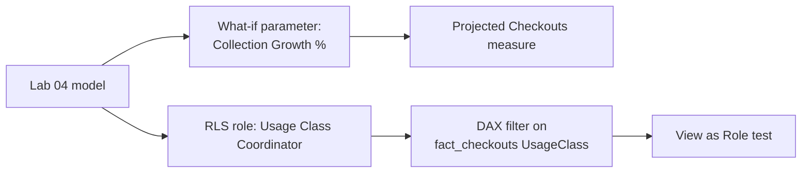

# Lab 05: What-If Analysis and Row-Level Security

## Objectives

- **Part 1:** Build a what-if parameter for a proposed collection expansion
- **Part 2:** Project checkout impact with the parameter driving a measure
- **Part 3:** Implement row-level security so each usage-class coordinator sees only their scope
- **Part 4:** Test RLS as a restricted user, not just as the report author

## Background / Scenario

Two questions close this series out: "what happens to projected checkouts
if we grow the ebook collection by X%," and "how do we let a physical-
collection coordinator and a digital-collection coordinator use the same
report without either seeing budget detail for the other's scope."
Neither is answerable with what Labs 01-04 built.

The real dataset has no branch column. `Checkouts by Title` is aggregated
by title and month across the whole system, not per location. `UsageClass`
(Physical / Digital) is the closest real split the data actually supports,
so that's what this lab uses for RLS rather than inventing a branch
field that doesn't exist in the source.

## Required Resources

- Power BI Desktop
- The `.pbix` file from Lab 04
- Approximately 3 hours

## Topology



---

## Part 1: The What-If Parameter

### Step 1: Create the parameter

**Modeling → New Parameter → Numeric range.** Name `Collection Growth %`,
min 0, max 50, increment 5, default 0. Check **Add slicer to this page**.

<details>
<summary>Expected result</summary>

Power BI creates a new table with one column and a measure called
`Collection Growth % Value`, visible in the Fields pane as a standalone
table with no relationship lines connecting it to anything else in the
model.

</details>

### Step 2: Inspect what it built

Open the generated measure:

```dax
Collection Growth % Value = SELECTEDVALUE('Collection Growth %'[Collection Growth %], 0)
```

> **A what-if parameter is a disconnected table, not a relationship.** It
> has no key into `fact_checkouts` or `dim_material_type`. The slicer
> just sets a value that a measure reads with `SELECTEDVALUE`. Nothing
> about the model "knows" this is a collection-expansion scenario; the
> measures you write next are what make it mean anything.

---

## Part 2: Project the Checkout Impact

### Step 1: Write the projected checkouts measure

```dax
Projected Checkouts =
[Total Checkouts] * (1 + 'Collection Growth %'[Collection Growth % Value] / 100)
```

### Step 2: Restrict the scenario to ebooks only

The real question is about growing the ebook collection specifically, not
every material type uniformly. Write `Projected Ebook Checkouts` yourself:
it needs to split `Total Checkouts` into an ebook portion and an
everything-else portion, apply the growth percentage to the ebook portion
only, and add the two back together.

<details>
<summary>Hint</summary>

Two `VAR`s: one isolates ebook checkouts with `CALCULATE` and a filter on
`dim_material_type[MaterialType]`, the other gets everything else by
subtracting the first from `[Total Checkouts]` rather than writing a
second `CALCULATE` with a negated filter. `RETURN` the untouched portion
plus the ebook portion scaled by
`(1 + 'Collection Growth %'[Collection Growth % Value] / 100)`, the same
scaling expression as `Projected Checkouts` in Step 1.

</details>

### Step 3: Build the comparison visual

Card visuals: `Total Checkouts` next to `Projected Ebook Checkouts`, with
the parameter's slicer on the page. Move the slider and watch both update.

<details>
<summary>Expected result, Part 2</summary>

At the parameter's default of 0%, `Projected Ebook Checkouts` should equal
`Total Checkouts` exactly, growth applied to zero is no change. Moving the
slider to 50% should move `Projected Ebook Checkouts` up by less than 50%
of the total (since only the ebook slice is growing, not everything), and
the gap between the two cards should widen smoothly as the slider
increases, not jump.

</details>

> **This measure assumes checkouts scale linearly with collection size,
> and that's a real limitation worth stating on the report page itself,
> not just in this lab.** Growing an ebook collection by 20% doesn't
> necessarily produce 20% more checkouts. Titles compete for the same
> reader attention, and simultaneous-user licensing caps on digital
> checkouts mean the relationship between "more copies" and "more
> checkouts" isn't linear the way it might be for shelf space. State that
> plainly rather than letting a clean-looking number imply more precision
> than the model actually has.

---

## Part 3: Row-Level Security

### Step 1: Create the role

**Modeling → Manage roles → Create.** Name it `Usage Class Coordinator`.

### Step 2: Write the filter

On `fact_checkouts`, add a DAX filter:

```dax
[UsageClass] = USERPRINCIPALNAME()
```

This assumes each coordinator's Power BI Service login matches a value in
`UsageClass`, which it won't, out of the box. For this lab, use a simpler
mapping table instead.

### Step 3: Build a proper mapping table

**Modeling → New Table**:

```dax
dim_usage_class_access =
DATATABLE(
    "UserEmail", STRING,
    "UsageClass", STRING,
    {
        {"coordinator.physical@example.org", "Physical"},
        {"coordinator.digital@example.org", "Digital"}
    }
)
```

Relate `dim_usage_class_access[UsageClass]` to a `UsageClass` column
exposed on `fact_checkouts`, many-to-one, single direction.

<details>
<summary>Hint</summary>

`fact_checkouts` already carries `UsageClass` as a plain column from Lab
02 Part 1 Step 2, it was never split into its own dimension table. Relating
directly from `dim_usage_class_access[UsageClass]` to
`fact_checkouts[UsageClass]` works fine here; a separate `dim_usage_class`
table would be needless for a two-value field.

</details>

### Step 4: Filter the role through the mapping table

Replace the Step 2 filter with one on `dim_usage_class_access`:

```dax
[UserEmail] = USERPRINCIPALNAME()
```

> **Filter the access table, not the data table directly, whenever the
> access rule isn't itself a column on the data.** `fact_checkouts` has no
> email column and shouldn't. Mixing access control into a fact table
> Lab 02 built for an unrelated purpose is how a model ends up with
> columns nobody remembers the reason for.

<details>
<summary>Expected result, Part 3</summary>

Manage Roles shows one role, `Usage Class Coordinator`, with a table icon
next to `dim_usage_class_access` indicating the filter lives there. No
warning icon appears on the relationship between `dim_usage_class_access`
and `fact_checkouts` in Model view.

</details>

---

## Part 4: Test as a Restricted User

### Step 1: View as role, inside Power BI Desktop

**Modeling → View as → check Usage Class Coordinator → Other user →**
enter one of the two test emails.

**Expected result:** every visual on every page filters down to that one
usage class, including the ones built in Labs 02-04 that were never told
anything about RLS.

> **RLS applies model-wide, retroactively, to visuals built before the
> role existed.** That's the point of building it in the model layer
> rather than filtering each visual by hand, and also the reason to test
> it against a page you didn't design with RLS in mind, which is exactly
> what Part 4 does.

### Step 2: Confirm the what-if parameter still works under RLS

With the role still active, move the collection-growth slider.

**Expected result:** `Projected Ebook Checkouts` recalculates against only
the visible usage class's data. The two features compose without extra
work, because both operate through the filter context, not through
hard-coded scope.

### Step 3: Publish and assign the role for real

After publishing to Power BI Service: **dataset settings → Security →**
add each coordinator's actual email under the `Usage Class Coordinator`
role.

**Troubleshooting:** RLS in Desktop's "View as" is a simulation. The real
test is a second person, signed in with their own account, opening the
published report. If that's not practical for this lab, state plainly
that RLS was verified in Desktop only, not against a live second account.

<details>
<summary>Expected result, Part 4</summary>

Under "View as" with the Physical test email, every visual across every
page, including Lab 03's dashboard and Lab 04's trend chart, shows only
physical-UsageClass data, and card totals are visibly lower than the
unrestricted totals. Switching to the Digital test email flips which rows
show, not just which are highlighted. The what-if slider still moves
`Projected Ebook Checkouts` while a role is active, recalculated against
the restricted subset only.

</details>

---

## Troubleshooting

| Symptom | Cause | Fix |
|---|---|---|
| Projected Checkouts doesn't move with the slider | Measure references `[Collection Growth %]` (the column) instead of the generated Value measure | Use `'Collection Growth %'[Collection Growth % Value]` |
| View as Role shows both usage classes | Role filter on the wrong table, or relationship direction wrong | Confirm filter sits on `dim_usage_class_access`, relationship is single-direction toward `fact_checkouts` |
| RLS works in Desktop but not after publishing | Role has no members assigned in Service | Add emails under dataset Security settings |

---

## Reflection

1. Why does `Projected Ebook Checkouts` split ebook and non-ebook
   checkouts into two variables instead of applying the growth percentage
   to the whole total?
2. What real-world factor does the what-if measure ignore, and what would
   a more realistic version need? What does digital lending's
   simultaneous-user licensing model change about that answer compared to
   physical stock?
3. If the library later got branch-level data from a different system,
   what would have to change for RLS to scope by branch instead of
   UsageClass? Anything in the DAX pattern itself, or only the mapping
   table's contents?

---

## What Went Wrong When I Did This

- **Applied the growth percentage to total checkouts**, not just ebooks,
  on the first version of the measure. The projection overstated the
  impact because print and audiobook checkouts were scaling in the
  simulation along with ebooks, which was never the question being asked.
- **Wrote the RLS filter directly on `fact_checkouts`** using
  `USERPRINCIPALNAME()`, matching against `UsageClass` text like
  "Digital", which no login email will ever equal. Reworked it through a
  proper mapping table once "View as Role" was returning zero rows for
  every test user.
- **Never tested with a second real account**, only Desktop's simulated
  "View as." Said so directly instead of implying it was fully verified,
  because it wasn't.

---

## Where This Breaks

- The what-if projection assumes checkouts scale linearly with collection
  size and has no way to represent digital lending's simultaneous-user
  licensing caps
- The RLS mapping table is a hand-maintained `DATATABLE`, not sourced from
  wherever the library's real staff directory actually lives
- Every fix across all five labs so far (`TitleKey` in Lab 02, the mapping
  table in this lab) was worth more than any amount of careful handling
  downstream, and the same pattern shows up again in Lab 06: the model
  still only refreshes from a SQL Server database someone reloads by
  hand, which is the last real gap this series has left to close

**Next:** [Lab 06, Capstone: Parameterized Refresh and a Board-Ready Report](06-capstone.md)
