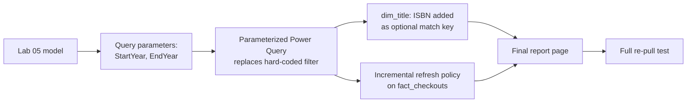

# Lab 06, Capstone: Parameterized Refresh and a Board-Ready Report

## Objectives

- **Part 1:** Pull a second year of real data into SQL Server and find the
  schema drift Labs 01-05 never had to deal with
- **Part 2:** Replace every hard-coded year filter with a query parameter
- **Part 3:** Handle the ISBN schema drift without breaking `dim_title`
- **Part 4:** Move the model toward incremental refresh instead of a full
  reload on every pull
- **Part 5:** Assemble one polished report page from everything built across
  Labs 01-05
- **Part 6:** Stress-test the finished model against a full re-pull

## Background / Scenario

Every lab so far worked from one loaded database, filtered once in Lab 01
and never touched again. That's not how this would actually run. A
library's BI person pulls fresh data on a schedule, not once, and the
portal doesn't hand back a static file twice in a row. Two things about
Seattle's Checkouts by Title dataset make that concrete rather than
hypothetical.

First, the `ISBN` column doesn't go back to 2005. Seattle added it to this
dataset in June 2022 and didn't backfill older checkout records, so a
checkout row from 2019 simply has no ISBN, an empty field, not a data entry
gap. Lab 01 Part 1 asked you to check the blank rate on this column and
notice it wasn't constant across the file; this lab is where that becomes a
real problem, because ISBN is exactly the kind of clean external key a real
title-matching project would eventually want, and every model built so far
routes around it.

Second, the dataset keeps growing. Re-running Lab 01's export today pulls
months of checkouts that didn't exist when Labs 01-05 were built. A model
that requires manually re-filtering, re-exporting, and reloading SQL
Server by hand every time doesn't scale past a demo, and Lab 03 already
flagged this as the thing it couldn't fix.

This lab does both fixes at once: a query parameter replaces the hard-coded
`CheckoutYear >= 2023` filter so pulling a new year means changing one value
instead of rebuilding the query, and an incremental refresh policy means
only new months get reloaded instead of the whole history every time. Power
BI's parameter and incremental-refresh features exist for exactly this
shape of problem, a dataset with a natural date boundary that grows on a
schedule, which is why they fit here better than a fancier alternative like
a separate staging database would for a portfolio-scale project (and this
series already has one, from Lab 01).

## Required Resources

- Power BI Desktop, Power BI Pro or Premium/Fabric capacity for the
  incremental refresh policy to actually apply on publish (Desktop will let
  you configure and test the policy locally either way)
- The `.pbix` file from Lab 05
- A second CSV export from the portal covering a year not in your original
  pull: <https://data.seattle.gov/Community/Checkouts-by-Title/tmmm-ytt6>,
  filtered to whatever `CheckoutYear` your Lab 01 export didn't cover
- Approximately 4 hours

## Topology



---

## Part 1: Pull a Second Year and Find the Drift

### Step 1: Export and stage a year you don't already have

Repeat Lab 01's portal filter and export process, this time for a
`CheckoutYear` outside your original range. If your Lab 01 pull was
2023-2025, pull 2022 instead, since 2022 straddles the ISBN introduction
and is the more interesting year for Part 3. BULK INSERT it into a new
staging table, `stg_checkouts_2022`, using the same column layout and load
pattern as Lab 01 Part 1.

### Step 2: Load it as a second table, not a replacement

```sql
SELECT *
INTO dbo.checkouts_2022_raw
FROM dbo.stg_checkouts_2022;
```

Do not merge it into `dbo.checkouts` yet.

### Step 3: Diff the column lists

Compare `checkouts_2022_raw`'s columns against `checkouts`'s columns side
by side.

```sql
SELECT COLUMN_NAME
FROM INFORMATION_SCHEMA.COLUMNS
WHERE TABLE_NAME = 'checkouts_2022_raw'
EXCEPT
SELECT COLUMN_NAME
FROM INFORMATION_SCHEMA.COLUMNS
WHERE TABLE_NAME = 'checkouts';
```

<details>
<summary>Hint</summary>

Run the query both directions, once with `checkouts_2022_raw EXCEPT
checkouts` and once with the two table names swapped, so you catch a
column present in either one and absent in the other, not just one
direction of the mismatch. You're looking for a column present in one and
not the other, not a renamed column, both exports come from the same
portal dataset schema.

</details>

**Expected result:** both `EXCEPT` queries return zero rows. The column
lists match exactly, both include `ISBN`, because the column has existed
in the source dataset since June 2022, before either of your exports. The
drift here isn't a missing column, it's a column that's present but
inconsistently populated depending on how far back the checkout row goes.
Confirm that by checking `ISBN`'s blank rate on the 2022 pull specifically:

```sql
SELECT
    DATEPART(QUARTER, DATEFROMPARTS(TRY_CAST(CheckoutYear AS INT), TRY_CAST(CheckoutMonth AS INT), 1)) AS CalendarQuarter,
    COUNT(*) AS TotalRows,
    SUM(CASE WHEN ISBN IS NULL OR ISBN = '' THEN 1 ELSE 0 END) AS BlankISBN
FROM dbo.checkouts_2022_raw
GROUP BY DATEPART(QUARTER, DATEFROMPARTS(TRY_CAST(CheckoutYear AS INT), TRY_CAST(CheckoutMonth AS INT), 1))
ORDER BY CalendarQuarter;
```

Expect it to be substantially higher in the first half of 2022 than the
second, since the field didn't exist yet for checkouts recorded before its
introduction, and lower still if you compare against a 2024 pull's blank
rate.

<details>
<summary>Expected result, Part 1</summary>

Both exports carry the same twelve columns; nothing is structurally
missing. `ISBN` blank rate on the 2022 file should show a visible split
between checkouts recorded before and after roughly mid-2022, this is the
real drift: not an added or dropped column, but a field whose meaning
("do we have this") changes partway through the file you're holding. Total
row count for a single filtered year should be well under the multi-year
pull from Lab 01, roughly a third to a half of it depending which years you
chose.

</details>

---

## Part 2: Parameterize the Year Filter

### Step 1: Create two parameters

**Manage Parameters → New Parameter.** Create `StartYear` (Decimal Number,
current value matching your original Lab 01 filter, e.g. `2023`) and
`EndYear` (Decimal Number, e.g. `2025`).

### Step 2: Rebuild the source query to use them

The cleanest way to make this real rather than cosmetic is to have Power
Query call the portal's API directly, filtered by the parameters, instead
of reading from the SQL Server table you loaded by hand. The Socrata API
backing this portal accepts a SoQL `$where` clause over HTTP:

```
Source = Json.Document(Web.Contents(
    "https://data.seattle.gov/resource/tmmm-ytt6.json",
    [Query=[
        #"$where" = "CheckoutYear >= " & Text.From(StartYear) & " and CheckoutYear <= " & Text.From(EndYear),
        #"$limit" = "500000"
    ]]
))
```

<details>
<summary>Hint</summary>

`Web.Contents` with a `Query` record is how Power Query builds a URL query
string safely, letting it handle encoding rather than concatenating a raw
URL string yourself. The `$limit` parameter matters: Socrata's default page
size is much smaller than the row counts this dataset produces for a full
year, and without it you'll get a silently truncated result that looks
like a successful refresh.

</details>

> **This is the fix Lab 03 named and didn't build.** A scheduled refresh
> against a SQL Server table loaded once by hand never re-touches the
> source, no matter how often it runs. Querying the API directly,
> parameterized by year, means a refresh actually asks the portal for
> current data instead of replaying whatever was true the day someone ran
> BULK INSERT.

### Step 3: Point fact_checkouts at the parameterized source

Redirect `fact_checkouts`'s source step to the new API-backed query,
replacing the SQL Server connection built in Lab 02. Confirm the row count
roughly matches what your original loaded table had for the same year
range, small differences are expected since the portal has kept
accumulating corrections and late-arriving records since your original
load.

### Step 4: Confirm the parameter actually drives the query

Change `EndYear` to a smaller value, refresh, and confirm the row count
drops. Change it back.

<details>
<summary>Expected result, Part 2</summary>

Refreshing with `StartYear`/`EndYear` set to your original Lab 01 range
returns a row count within a few percent of the original loaded table, not
identical (the API reflects the portal's current state, the SQL Server
load was a snapshot), but the same order of magnitude. Narrowing `EndYear`
by one year and refreshing measurably reduces the row count. If it
doesn't change at all, the query text still has the hard-coded filter
somewhere upstream of where the parameters are substituted in.

</details>

---

## Part 3: Handle the ISBN Drift

### Step 1: Decide what ISBN is for in this model

`ISBN` is not needed to fix anything `dim_title`'s `TitleKey` already
solves, Lab 02's fragmentation problem is about spelling variants of the
same title, and ISBN doesn't help there since two rows with the identical
messy `Title` text usually share the same ISBN or the same blank. What
ISBN offers instead is a path to matching this dataset against an external
source later (Open Library, a publisher catalogue), which is out of scope
here but worth building the column so it doesn't require a model rebuild
later.

### Step 2: Add ISBN to dim_title without letting blanks break anything

Add `ISBN` to the `dim_title` Group By from Lab 02 Part 2 Step 3, using the
same "keep first value" aggregation already used for `Title` and `Creator`.

<details>
<summary>Hint</summary>

A blank `ISBN` grouped alongside a populated one for the same `TitleKey`
(same book, checked out both before and after ISBN existed in the source)
will keep whichever value Group By happens to pick first, arbitrarily.
Sort the pre-group table by `Date` descending before grouping, so "first"
consistently means "most recent," and a title with any post-2022 checkout
row reliably gets its ISBN instead of an arbitrary blank.

</details>

### Step 3: Add a data quality flag

Add a calculated column to `dim_title`: `Has ISBN = NOT ISBLANK([ISBN])`.
This is the honest version of "do we have this," rather than letting a
blank silently read as "no ISBN exists."

### Step 4: Measure the coverage gap

```dax
ISBN Coverage % =
DIVIDE(
    CALCULATE( DISTINCTCOUNT(dim_title[TitleKey]), dim_title[Has ISBN] = TRUE ),
    DISTINCTCOUNT(dim_title[TitleKey])
)
```

<details>
<summary>Expected result, Part 3</summary>

`ISBN Coverage %` should land well under 100%, and specifically lower for
`dim_title` rows whose checkouts skew toward years before mid-2022. A title
that only ever circulated before June 2022 should show `Has ISBN = FALSE`
even after the "most recent row" grouping fix, because it genuinely has no
ISBN anywhere in its history, that's a correct result, not a bug to chase.

</details>

---

## Part 4: Incremental Refresh

### Step 1: Understand why a full reload doesn't scale here

Every refresh so far reloads the entire filtered range from scratch. That's
fine at a few hundred thousand rows. It stops being fine as `StartYear` gets
pushed further back or the dataset accumulates another year, and it means
every scheduled refresh re-downloads years of data that didn't change to
pick up one new month.

### Step 2: Add RangeStart and RangeEnd parameters

Incremental refresh requires exactly two parameters named `RangeStart` and
`RangeEnd`, both Date/Time type. **Manage Parameters → New Parameter**,
create both, with placeholder values covering a short recent window (for
example the most recent two months of your data).

### Step 3: Filter fact_checkouts by the range parameters

Add a filter step on `fact_checkouts`'s `Date` column (the one built in Lab
02 Part 1 Step 4):
`each [Date] >= RangeStart and [Date] < RangeEnd`. This filter is what
Power BI looks for to recognize the query as eligible for incremental
refresh, it has to be structured this way, not as a differently-shaped date
comparison.

### Step 4: Configure the policy

Right-click `fact_checkouts` in the Fields pane → **Incremental refresh**.
Set: archive data starting 3 years before refresh date, incrementally
refresh data starting 1 month before refresh date. Leave "detect data
changes" off, this dataset has no last-modified column to detect against.

<details>
<summary>Hint</summary>

The archive and incremental windows are about how much history stays
untouched versus how much gets reloaded on each refresh, not about how much
data the report can show. A 3-year archive window with a 1-month
incremental window means the most recent month reloads every refresh and
everything older than that is left alone until it ages out of the 3-year
archive entirely.

</details>

### Step 5: Publish and confirm the policy applied

Incremental refresh partitioning only actually happens in Power BI
Service, not Desktop. Publish, then check the dataset's refresh history
after a scheduled or manual refresh completes.

**Troubleshooting:** if the option to configure incremental refresh is
greyed out, confirm the workspace has Pro or Premium capacity, incremental
refresh partitioning is not available on a plain free workspace, this is a
real limitation to name rather than something you did wrong.

<details>
<summary>Expected result, Part 4</summary>

The Power Query filter step correctly restricts `fact_checkouts` to the
placeholder RangeStart/RangeEnd window when previewed in Desktop, a small
slice of recent months, not the full multi-year range. In Service, on a
workspace with Pro or Premium capacity, the dataset's refresh history after
a refresh should show a shorter duration and smaller processed-row count
than the very first full load, since only the incremental window is being
reprocessed on each subsequent refresh.

</details>

---

## Part 5: The Final Report

### Step 1: Assemble, don't rebuild

Every visual, measure, bookmark, and role from Labs 02-05 should carry
forward unchanged, this Part is about arrangement and polish, not new
DAX. Build a single report with:

- The Lab 03 trend and top-titles page
- A new summary page combining the Lab 04 YoY card, the Lab 05 what-if
  slider and projection cards, and the Part 3 `ISBN Coverage %` card
- The Lab 05 RLS role still active and tested against the finished model

### Step 2: Add a data quality note visible on the report itself

Add a text box or card on the summary page stating the `ISBN Coverage %`
figure and one sentence on why it isn't 100%, the same explanation from
Part 3. A board member looking at this report has no reason to already
know Seattle added the ISBN field partway through the dataset's history,
and a coverage number with no context reads as a data problem instead of
an accurately reported limitation.

### Step 3: Confirm the whole thing still holds under RLS

**View as → Usage Class Coordinator**, either test email. Confirm the new
summary page, not just the pages that existed when the role was built,
respects the restriction.

<details>
<summary>Expected result, Part 5</summary>

Every page, including the new summary page, filters correctly under the
Usage Class Coordinator role without any page-specific RLS configuration,
model-level RLS from Lab 05 applies retroactively to pages that didn't
exist yet when the role was created, the same behavior Lab 05 Part 4
called out, now holding true one lab later on a page built after the role
existed.

</details>

---

## Part 6: Stress-Test the Finished Model

### Step 1: Simulate a full re-pull

Set `StartYear` back to a wide range, e.g. `2019`, and `EndYear` to the
current year. Refresh the full model, not just the incremental window.

### Step 2: Watch what breaks, if anything

Check: does `dim_title`'s Group By still complete in reasonable time at the
larger row count? Does `ISBN Coverage %` drop further, as expected, once
years further before 2022 enter the model? Does the RLS role still
restrict correctly?

<details>
<summary>Expected result, Part 6</summary>

The model should still function end to end at the wider range, this is the
point of building it on parameters and a proper key from Lab 02 onward
rather than anything hard-coded. `ISBN Coverage %` should drop measurably
compared to Part 3's number, since a wider StartYear range pulls in more
pre-2022 checkouts with no ISBN by design, not by data loss. If Group By
performance becomes noticeably slow at this range, that's a real, honest
finding about where this model's design stops scaling gracefully, worth
stating plainly rather than working around.

</details>

---

## Troubleshooting

| Symptom | Cause | Fix |
|---|---|---|
| API query returns far fewer rows than expected | Socrata's default page size truncated the result | Add `$limit` to the query, checked in Part 2 Step 2 |
| Parameter change doesn't affect row count on refresh | Source step still references the old SQL Server connection or a hard-coded filter upstream of the parameter | Confirm every filter traces back to StartYear/EndYear, not a leftover connection to `dbo.checkouts` |
| dim_title's ISBN column is blank for a title you know has post-2022 checkouts | Group By picked an arbitrary row instead of the most recent one | Sort by Date descending before grouping, per Part 3 Step 2 |
| Incremental refresh option is greyed out | Workspace is on a free plan | Note the limitation; policy still configures correctly in Desktop even if Service won't apply it |
| Incremental refresh configured but every refresh still reprocesses everything | RangeStart/RangeEnd filter not applied to the table, or applied to the wrong column | Confirm the filter step from Part 4 Step 3 is present and targets the Date column, not CheckoutYear |
| Full re-pull in Part 6 times out or errors | Socrata's `$limit` cap or a timeout on a very wide multi-year API call | Page the request in smaller StartYear/EndYear chunks, or fall back to the Lab 01 BULK INSERT path for the wide historical pull |

---

## Reflection

1. Why is the ISBN gap a schema drift problem worth solving with a data
   quality flag, rather than a bug worth "fixing" by dropping rows with no
   ISBN?
2. What would have broken in Lab 02's `dim_title` if the ISBN column had
   been added to the Group By without first deciding how to pick a value
   for titles with both blank and populated ISBN rows?
3. Incremental refresh and query parameters solve two different problems
   here, one is about not re-filtering by hand, the other is about not
   reprocessing unchanged history. Could this model have one without the
   other? What would be lost?
4. The RLS role, the what-if parameter, and the ISBN coverage flag all sit
   on top of the same `fact_checkouts`/`dim_title` foundation built in Lab
   02. What about that foundation made all three possible without
   redesigning the model each time?

---

## What Went Wrong When I Did This

- **Built the API query without a `$limit` clause first**, and the refresh
  completed suspiciously fast with a row count that didn't match the
  original loaded table at all. Took a direct look at Socrata's API docs
  before realizing the default page size was silently capping the result,
  not the `$where` filter doing something wrong.
- **Grouped ISBN into `dim_title` without sorting first**, so a well-known
  title that circulated both before and after June 2022 kept showing
  `Has ISBN = FALSE`, because Group By happened to keep an arbitrary early,
  blank row. Found it by spot-checking a title I knew had a real ISBN and
  seeing the flag disagree with what I expected.
- **Set RangeStart/RangeEnd as Whole Number parameters on the first
  attempt**, copying the pattern from StartYear/EndYear without checking
  the incremental refresh requirements first. Power BI's incremental
  refresh configuration dialog wouldn't even open until both were rebuilt
  as Date/Time parameters.
- **Assumed the free workspace I'd used since Lab 03 would just work for
  Part 4**, and only found out incremental refresh partitioning needs Pro
  or Premium capacity after publishing and confusion at why refresh history
  looked identical to a full reload every time.

---

## Closing Reflection: Six Labs, One Dataset

The same lesson that closed Lab 05 holds here, sharper: every fix that
mattered was made once, upstream, in the model, not repeated at the point
where a visual displayed a number. `TitleKey` in Lab 02 meant Labs 03
through 06 never had to think about title fragmentation again. The RLS
mapping table in Lab 05 meant this lab's new summary page inherited
row-level security for free, with zero page-specific configuration. The
parameterized source in this lab means a genuine year-over-year data pull
next year requires changing two numbers, not rebuilding the staging tables
Lab 01 started with.

What didn't get solved is just as real as what did. The ISBN coverage gap
is permanent, not a bug waiting for a patch, Seattle's dataset will never
have ISBN data for pre-2022 checkouts, and the honest response was a
visible coverage flag, not a workaround that pretends the gap isn't there.
The what-if projection from Lab 05 still assumes linear demand, still
ignores licensing caps on digital lending. The RLS mapping table is still a
hand-maintained DATATABLE, not sourced from wherever the library's real
staff directory lives. Incremental refresh needs a paid workspace tier this
lab can note but not provide.

None of that is a failure of the series. A model that claims to have solved
everything is a model that stopped checking its own limits, and this
dataset, real, messy, genuinely growing on the portal's own schedule, never
let that happen at any point across six labs. That's what working with
actual open data looks like, and it's a fair note to end the series on
rather than a clean finish that wouldn't survive a second year of real
checkouts landing in it.
