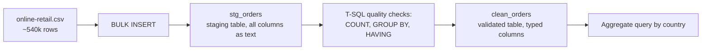

# Lab 01: Loading Online Retail Data into SQL Server

## Objectives

- **Part 1:** Load the real UCI Online Retail dataset into a staging table and assess data quality with T-SQL
- **Part 2:** Fix data types and isolate the messy rows instead of deleting them blindly
- **Part 3:** Handle missing CustomerID as a real feature of the data, not a bug
- **Part 4:** Produce a first aggregate query answering a real question

## Background / Scenario

A UK-based online retailer that sells mostly giftware has a year of order
history sitting in a single export: every invoice line, every product,
every country it shipped to, all in one flat file. Nobody has pulled
revenue by country yet, and the export includes cancelled orders mixed in
with real sales, which makes even that simple a question wrong if you
answer it carelessly.

This is the same first step as the other four series in this set: get the
raw export into a shape a human can actually query, using SQL Server and
T-SQL, before anything gets near Power BI.

## Required Resources

- SQL Server 2022 Developer or Express edition (free)
- SQL Server Management Studio (SSMS, free). SQL Server is the database
  engine, a background service with no interface of its own. SSMS is the
  client you connect with to write and run queries against it. They are
  two separate downloads, and installing SSMS alone gets you nowhere
  without a running SQL Server instance to point it at.
- `data/online-retail.csv`, the [Online Retail
  dataset](https://archive.ics.uci.edu/dataset/352/online+retail), UCI
  Machine Learning Repository, CC BY 4.0 license. No account needed to
  download. Export the workbook to CSV once downloaded, `BULK INSERT`
  needs a flat file, not an `.xlsx`.
- Approximately 2.5 hours

## Topology



---

## Part 1: Load and Assess

### Step 1: Get the file

Download `online-retail.xlsx` from the UCI page linked above and save it
as `online-retail.csv` (**File → Save As → CSV**), one sheet, roughly
540,000 rows, covering December 2010 to December 2011. `BULK INSERT`
reads a delimited text file, not a native Excel workbook.

### Step 2: Create a database and a staging table

```sql
CREATE DATABASE OnlineRetail;
GO

USE OnlineRetail;
GO

CREATE TABLE stg_orders (
    InvoiceNo    NVARCHAR(50),
    StockCode    NVARCHAR(50),
    Description  NVARCHAR(500),
    Quantity     NVARCHAR(50),
    InvoiceDate  NVARCHAR(50),
    UnitPrice    NVARCHAR(50),
    CustomerID   NVARCHAR(50),
    Country      NVARCHAR(100)
);
```

<details>
<summary>Hint</summary>

Every column here is text (`NVARCHAR`), even `Quantity` and `UnitPrice`,
which are obviously numbers. A staging table's job is to accept whatever
the file actually contains without failing the load. If `InvoiceNo` were
typed as `INT` here, every cancellation row (the ones with a "C" prefix)
would abort the load instead of letting you find them with a query.

</details>

### Step 3: Bulk insert the raw file

```sql
BULK INSERT stg_orders
FROM 'C:\data\online-retail.csv'
WITH (
    FORMAT = 'CSV',
    FIRSTROW = 2,
    FIELDTERMINATOR = ',',
    ROWTERMINATOR = '0x0a',
    CODEPAGE = '65001',
    TABLOCK
);
```

Adjust the file path to wherever you saved the CSV. `BULK INSERT` runs on
the SQL Server *service* account, not your own login, so the file needs to
sit somewhere that account can read, typically a local path on the same
machine the service runs on, not a network share without extra
configuration.

<details>
<summary>Hint</summary>

If `BULK INSERT` fails with a permissions or "cannot bulk load" error, the
service account most likely can't see the path you gave it. Move the CSV
into a folder like `C:\data\` at the root of the drive rather than under
your own user profile, since `C:\Users\<you>\Downloads\` is often locked
down to your login specifically.

</details>

### Step 4: Check what actually landed

```sql
SELECT COUNT(*) AS row_count FROM stg_orders;

SELECT TOP 20 * FROM stg_orders;
```

> **Why check before cleaning.** A query built on data you haven't looked
> at will produce a number that's wrong in a way you can't see. It will
> just look like an answer. This dataset has at least four separate
> quality issues layered on top of each other, and fixing them in the
> wrong order hides the ones underneath.

### Step 5: Check each column with T-SQL, not a spreadsheet formula

```sql
-- Does InvoiceNo ever start with "C"?
SELECT COUNT(*) AS cancellation_rows
FROM stg_orders
WHERE InvoiceNo LIKE 'C%';

-- Blank or missing Description
SELECT COUNT(*) AS blank_description
FROM stg_orders
WHERE Description IS NULL OR LTRIM(RTRIM(Description)) = '';

-- Rows where UnitPrice can't even convert to a number, or is zero/negative
SELECT COUNT(*) AS bad_price_rows
FROM stg_orders
WHERE TRY_CAST(UnitPrice AS DECIMAL(10,2)) IS NULL
   OR TRY_CAST(UnitPrice AS DECIMAL(10,2)) <= 0;

-- Blank CustomerID, as a percentage of total rows
SELECT
    COUNT(*) AS total_rows,
    SUM(CASE WHEN CustomerID IS NULL OR LTRIM(RTRIM(CustomerID)) = ''
             THEN 1 ELSE 0 END) AS blank_customer_id,
    CAST(SUM(CASE WHEN CustomerID IS NULL OR LTRIM(RTRIM(CustomerID)) = ''
                   THEN 1 ELSE 0 END) AS DECIMAL(10,4))
        / COUNT(*) AS blank_customer_pct
FROM stg_orders;
```

<details>
<summary>Hint</summary>

`TRY_CAST` returns `NULL` instead of erroring when a value can't convert,
which is exactly what you want while auditing a staging table full of
text. Start with the `CustomerID` and `Description` blank counts, they're
the cheapest checks, then move to `InvoiceNo LIKE 'C%'` for a rough sense
of how many rows might be cancellations before doing anything with them.

</details>

**Troubleshooting:** if the blank `CustomerID` count comes back as zero,
the column probably loaded with blanks read as the literal text `"0"`
rather than a true empty string. Re-check a `SELECT DISTINCT CustomerID`
sample. `BULK INSERT` into an `NVARCHAR` staging column should preserve a
genuinely empty field as `''` or `NULL`, so a `"0"` value there usually
means the source file itself has that convention, worth confirming rather
than assuming.

<details>
<summary>Expected result, Part 1</summary>

`row_count` lands close to 540,000. `cancellation_rows` (InvoiceNo
starting "C") is roughly 3-4% of rows. `blank_description` is a small
fraction, well under 1%, but those rows still carry real `Quantity` and
`UnitPrice` values. `bad_price_rows` is a similarly small fraction.
`blank_customer_pct` sits far higher, around a quarter of all rows. That
gap is large enough that it can't be an accident or a data-entry error;
it means something structural about how this retailer's checkout works,
which Part 3 gets into.

</details>

---

## Part 2: Fix Types and Flag, Don't Delete

### Step 1: Find the other data-quality problem: junk Description text

```sql
SELECT DISTINCT Description
FROM stg_orders
WHERE Description LIKE '%?%'
   OR Description = UPPER(Description) AND LEN(Description) < 15
ORDER BY Description;
```

<details>
<summary>Hint</summary>

Look through the result for entries like "check", "damages", "wrongly
marked", "sold as set". These are internal stock-adjustment notes that
leaked into a product field, not real products. They cluster in this
pattern (short, all-caps, or containing a stray character) rather than
spreading evenly through the column, which is why this filter catches
most of them in one pass instead of needing a manual scan of 4,000
distinct descriptions.

</details>

### Step 2: Create the validated table with real types

```sql
CREATE TABLE clean_orders (
    InvoiceNo       NVARCHAR(20)    NOT NULL,
    StockCode       NVARCHAR(20)    NOT NULL,
    Description     NVARCHAR(500)   NULL,
    Quantity        INT             NOT NULL,
    InvoiceDate     DATETIME2       NOT NULL,
    UnitPrice       DECIMAL(10,2)   NOT NULL,
    CustomerID      NVARCHAR(20)    NULL,
    Country         NVARCHAR(100)   NOT NULL,
    IsCancellation  BIT             NOT NULL,
    LineRevenue     AS (Quantity * UnitPrice) PERSISTED
);
```

<details>
<summary>Hint</summary>

`InvoiceNo` stays `NVARCHAR`, not `INT`: the "C" prefix on cancellation
rows would otherwise fail every one of those rows on insert. `LineRevenue`
is a computed column, marked `PERSISTED` so it's stored on disk rather
than recalculated on every query, the same pattern the coffee-shop
series' `revenue` column uses. It will be negative on cancellation rows by
construction, that's correct, not a bug: a plain `SUM` of this column
already nets cancellations against original orders.

</details>

### Step 3: Insert, typed, with the cancellation flag set

```sql
INSERT INTO clean_orders
    (InvoiceNo, StockCode, Description, Quantity, InvoiceDate,
     UnitPrice, CustomerID, Country, IsCancellation)
SELECT
    InvoiceNo,
    StockCode,
    NULLIF(LTRIM(RTRIM(Description)), ''),
    TRY_CAST(Quantity AS INT),
    TRY_CAST(InvoiceDate AS DATETIME2),
    TRY_CAST(UnitPrice AS DECIMAL(10,2)),
    NULLIF(LTRIM(RTRIM(CustomerID)), ''),
    Country,
    CASE WHEN InvoiceNo LIKE 'C%' THEN 1 ELSE 0 END
FROM stg_orders
WHERE TRY_CAST(Quantity AS INT) IS NOT NULL
  AND TRY_CAST(InvoiceDate AS DATETIME2) IS NOT NULL
  AND TRY_CAST(UnitPrice AS DECIMAL(10,2)) IS NOT NULL;
```

> **Flag it, don't remove it.** The instinct on seeing "C" prefixes and
> negative quantities is to filter them out at load time so revenue totals
> look clean. That throws away the only real signal this dataset has for
> returns rate, which Lab 03's dashboard needs. Keep every row that
> parses; let downstream queries and measures decide what to include.
> Junk `Description` rows and zero/negative `UnitPrice` rows stay in
> `clean_orders` too, for the same reason: they still carry a real
> `Quantity` and contribute to total revenue, they just don't belong in a
> clean product list, which Lab 02's dimension table handles separately.

<details>
<summary>Expected result, Part 2</summary>

`clean_orders` has close to the same row count as `stg_orders`, minus only
the rows where `Quantity`, `InvoiceDate`, or `UnitPrice` genuinely failed
to parse as their target type, which should be a tiny fraction. `IsCancellation`
is `1` on the same roughly 3-4% of rows identified in Part 1. `LineRevenue`
is negative on every cancellation row and positive everywhere else.
Summing `LineRevenue` for a single `StockCode` that appears in both a
normal order and a cancellation should net close to zero if the
cancellation reversed that exact order.

</details>

---

## Part 3: CustomerID and Guest Checkouts

### Step 1: Quantify the gap in the validated table

```sql
SELECT
    COUNT(*) AS total_rows,
    SUM(CASE WHEN CustomerID IS NULL THEN 1 ELSE 0 END) AS guest_rows,
    CAST(SUM(CASE WHEN CustomerID IS NULL THEN 1 ELSE 0 END) AS DECIMAL(10,4))
        / COUNT(*) AS guest_pct
FROM clean_orders;
```

**Expected result:** roughly a quarter of rows have no `CustomerID`,
matching Part 1's staging-table count.

### Step 2: Don't just filter them out

> **A blank CustomerID here isn't dirty data, it's a guest checkout.**
> This retailer's export doesn't assign an ID when someone orders without
> an account. Filtering those rows out to make a customer dimension
> "clean" silently deletes a real quarter of revenue from every
> customer-level analysis, while leaving it in every country- or
> product-level one. That's an inconsistency later labs will trip over if
> it isn't decided here, on purpose, in the open.

### Step 3: Decide the rule and write it down

For this lab, the rule is: guest-checkout rows stay in `clean_orders` with
`CustomerID` left `NULL` at this stage. Lab 02 maps every `NULL`
`CustomerID` to a single `'GUEST'` placeholder row in `dim_customer`
rather than dropping them. Any measure that reports by customer
undercounts guests as one bucket; any measure that reports by country or
product is unaffected. This rule is what Lab 02 builds `dim_customer` on
directly.

```sql
-- Add a comment documenting the rule, visible to anyone who queries the table
EXEC sys.sp_addextendedproperty
    @name = N'GuestCheckoutRule',
    @value = N'CustomerID NULL means guest checkout, not missing data. Mapped to GUEST in dim_customer, Lab 02.',
    @level0type = N'SCHEMA', @level0name = 'dbo',
    @level1type = N'TABLE',  @level1name = 'clean_orders';
```

<details>
<summary>Expected result, Part 3</summary>

`guest_pct` matches Part 1's blank-`CustomerID` percentage, around a
quarter. `clean_orders` still has `NULL` in `CustomerID` for those rows;
nothing in this lab converts them to a placeholder value yet, that's
deliberately left for Lab 02, once a real dimension table exists to hold
it.

</details>

---

## Part 4: A First Aggregate Query

### Step 1: Revenue by country, completed sales only

The question is "which country generates the most revenue," which usually
means completed sales, not the net-of-returns number.

```sql
SELECT
    Country,
    SUM(LineRevenue) AS total_revenue
FROM clean_orders
WHERE IsCancellation = 0
GROUP BY Country
ORDER BY total_revenue DESC;
```

**Expected result:** the United Kingdom dominates by a wide margin. This
retailer's customer base is mostly domestic, with a long tail of smaller
European markets.

### Step 2: Compare against the net figure

```sql
SELECT SUM(LineRevenue) AS net_revenue_all_rows
FROM clean_orders;
```

Compare this total against Step 1's completed-sales-only total, summed
across all countries. The difference is exactly the value of cancelled
orders, a sanity check that `IsCancellation` is doing what it claims.

<details>
<summary>Hint</summary>

If the two totals come out identical, the `WHERE IsCancellation = 0`
clause didn't actually filter anything, check that the column really
holds `0`/`1` values and isn't still text left over from a copy-paste of
the staging query.

</details>

### Step 3: Answer the question this lab set out to answer

Which country generates the most revenue, cancellations excluded? Which
country has the highest cancellation rate *as a share of its own orders*,
not just in absolute terms?

```sql
SELECT
    Country,
    SUM(CASE WHEN IsCancellation = 1 THEN 1 ELSE 0 END) AS cancelled_lines,
    COUNT(*) AS total_lines,
    CAST(SUM(CASE WHEN IsCancellation = 1 THEN 1 ELSE 0 END) AS DECIMAL(10,4))
        / COUNT(*) AS cancellation_rate
FROM clean_orders
GROUP BY Country
HAVING COUNT(*) > 50
ORDER BY cancellation_rate DESC;
```

Step 1 answers the first question cleanly, a plain `GROUP BY`. The second
needs a ratio per group, which is why this query divides two aggregates
inside the same `SELECT` rather than running two separate queries and
comparing them by eye. The `HAVING COUNT(*) > 50` clause excludes
countries with too few orders to make a rate meaningful, the same
low-volume trap Lab 03's dashboard has to guard against later.

<details>
<summary>Hint</summary>

Without the `HAVING` clause, a country with three total orders and one
cancellation posts a 33% rate that looks dramatic and means nothing.
Compare the result with and without the `HAVING` filter once, to see the
difference directly rather than taking it on faith.

</details>

<details>
<summary>Expected result, Part 4</summary>

The United Kingdom leads on total revenue by a wide margin, commonly
80-90% of the whole dataset, with the rest spread across Germany, France,
EIRE, and a long tail of smaller European markets. The all-rows total
should exceed the cancellations-excluded total by roughly the value of
cancelled revenue. The country with the highest cancellation *rate* is
not necessarily the UK. A smaller market with a handful of large cancelled
orders can post a higher rate than the UK's much larger order volume
dilutes down to.

</details>

---

## Troubleshooting

| Symptom | Cause | Fix |
|---|---|---|
| `cancellation_rows` returns 0 in Part 1 | InvoiceNo cast to a numeric type somewhere upstream, dropping the "C" prefix | Confirm `stg_orders.InvoiceNo` is `NVARCHAR`, not `INT` or `BIGINT` |
| Revenue total for cancellations is positive | Quantity stayed as text and `SUM` concatenated strings instead of adding numbers | Confirm `clean_orders.Quantity` is `INT`, re-check the `TRY_CAST` in Part 2 Step 3 |
| `guest_pct` in Part 3 returns 0 | Import converted blank CustomerID to the literal string `"0"` | Re-check `stg_orders` with `SELECT DISTINCT CustomerID`, adjust the `NULLIF` in Part 2 Step 3 if needed |
| Country totals in Part 4 don't match a manual check | `IsCancellation` filter left out of the `WHERE` clause, or applied to the wrong column | Re-read the query against Part 2's `CASE` logic |
| Non-ASCII characters in Description show as garbled text (`é` instead of `é`) | `BULK INSERT` ran without `CODEPAGE = '65001'`, or the source CSV wasn't saved as UTF-8 | Re-run `BULK INSERT` with `CODEPAGE = '65001'` explicit, confirm the CSV's encoding when it was saved from Excel |

---

## Reflection

1. What fraction of rows are guest checkouts, and what would silently
   dropping them have cost the country-level query versus a
   customer-level one?
2. Why does netting cancellations against original orders in one `SUM`
   give a different answer than filtering cancellations out entirely, and
   which one answers "how much revenue did we keep"?
3. If next year's export arrives with the same four quality issues, how
   many of today's queries would you actually have to rewrite versus just
   re-run?

---

## What Went Wrong When I Did This

- **Ran `BULK INSERT` without setting `CODEPAGE`** on the first attempt.
  Most of the dataset loaded fine, but product descriptions with an accented
  character, mostly French and German product names in this retailer's
  giftware catalogue, came through as garbled multi-byte text instead of
  the real character. Didn't notice until Part 1's `SELECT DISTINCT
  Description` scan turned up entries with `é` and similar sequences that
  looked like encoding damage, not genuine data. Dropped `stg_orders` and
  reloaded with `CODEPAGE = '65001'` explicit.
- **Compared `StockCode` values across two queries using a plain `=`**,
  and got inconsistent duplicate counts between a check run against
  `stg_orders` and the same check run against `clean_orders` right after.
  The database's default collation was case-insensitive but
  accent-sensitive, so `'85123A'` and `'85123a'` matched, which was fine,
  but two descriptions differing only by a diacritic that the earlier
  encoding bug had mangled did not match something they should have. Fixed
  the encoding first; the comparison problem resolved itself once the
  underlying text was correct.
- **Filtered out blank `CustomerID` rows** before running the country
  aggregate in Part 4, on the assumption that a clean customer field
  mattered everywhere. The UK revenue total dropped by close to a quarter
  compared to a version with guest checkouts included, which made no sense
  for a question that has nothing to do with customer identity. Reworked
  Part 3 to keep guest rows in `clean_orders` and only exclude them where
  the analysis is actually customer-scoped.

---

## Where This Breaks

The database answers today's two questions but not the next ones:

- Cancellation rate as a share of a country's own orders needs a ratio
  computed inline in every new query, there's no reusable calculation any
  report can just point at
- The `NULL` `CustomerID` rows have no placeholder yet: there's no way
  yet to see how guest-checkout revenue compares to identified-customer
  revenue as a trend over time
- `StockCode` hasn't been checked yet for the same `Description` appearing
  under multiple different text values, a problem Lab 02's product
  dimension runs straight into

**Next:** [Lab 02: Building a Power BI Data Model](02-data-model.md)
