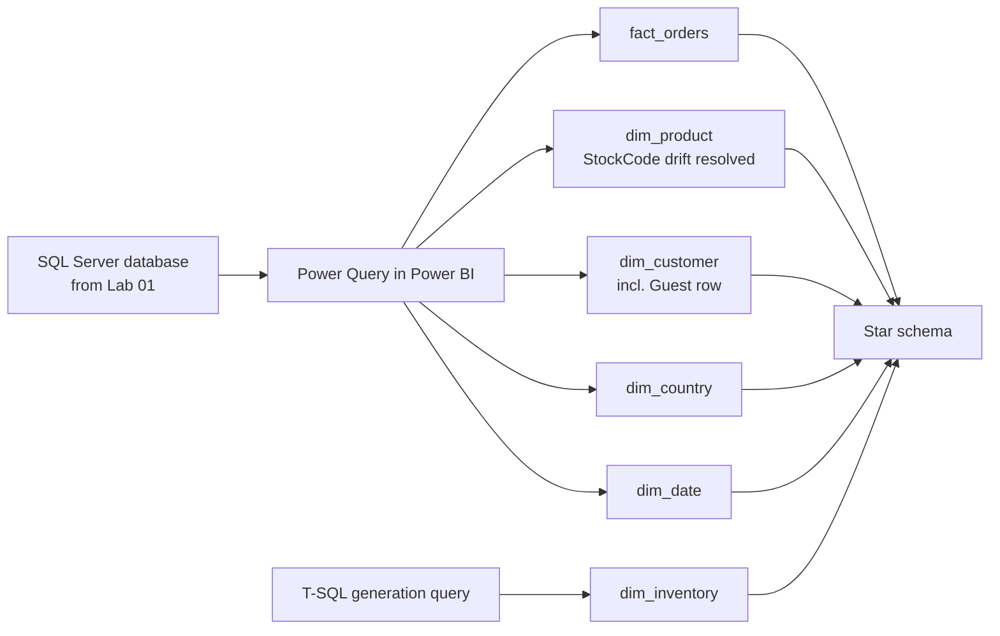

# Lab 02: Building a Power BI Data Model

## Objectives

- **Part 1:** Import the SQL Server database and shape a star schema
- **Part 2:** Fix the StockCode/Description drift caught in Lab 01
- **Part 3:** Build the synthetic dim_inventory table
- **Part 4:** Handle cancellations properly in the fact table, and write the first DAX measures

## Background / Scenario

Lab 01 left off with a database that answers "which country, which
cancellation rate" through T-SQL aggregate queries, and a flag on
`StockCode` still to check: does the same product code ever carry more
than one `Description`? It does, and it's not a small problem: this
retailer's staff typed product descriptions by hand at the point of sale
for over a year, and the same SKU picked up spelling variants, case
differences, and outright different wording along the way.

This lab builds the star schema Power BI actually needs: a fact table and
a set of dimension tables, with that drift resolved properly instead of
left to fragment the product list.

## Required Resources

- Power BI Desktop
- The `OnlineRetail` database from Lab 01, containing `clean_orders`
- Approximately 3 hours

## Topology



---

## Part 1: Import and Shape

### Step 1: Get the data

**Home → Get Data → SQL Server** → enter the server name and
`OnlineRetail` as the database → tick `clean_orders` → **Transform
Data**. Load into Power Query, not directly onto the canvas: the fact and
dimension tables all come out of this one query.

### Step 2: Plan the grain

Each row in the source is one invoice line: one product, one quantity, on
one invoice. That's the grain of `fact_orders`. Nothing in this lab
aggregates it up to invoice level or down below line level.

> **Decide the grain before building anything.** Every measure written
> later assumes a grain implicitly. If `fact_orders` accidentally holds a
> mix of line-level and invoice-level rows, which happens if a later
> `GROUP BY` step is applied inconsistently, every SUM silently
> double-counts some invoices and not others, and nothing in the visual
> layer will flag it.

<details>
<summary>Expected result, Part 1</summary>

The query editor shows the same row count as Lab 01's `clean_orders`
table, close to 540,000 rows, unchanged. This part only loads and plans;
it doesn't filter or aggregate anything yet.

</details>

---

## Part 2: Fix the StockCode Drift

### Step 1: Confirm the problem Lab 01 flagged

Reference the source query → keep `StockCode`, `Description` → **Group
By** `StockCode`, count distinct `Description`.

**Expected result:** a meaningful number of StockCodes, commonly several
hundred, have more than one distinct `Description` on file. Examples look
like `"RED WOOLLY HOTTIE WHITE HEART."` against `"RED WOOLLY HOTTIE WHITE
HEART"` (trailing punctuation) or genuinely different casing and spacing.

<details>
<summary>Hint</summary>

If the count-distinct step returns 1 for every StockCode, check that the
Group By ran on the referenced query, not a filtered or partially-typed
copy. A few hundred collisions in a catalogue this size is the expected
shape, so a clean zero is a sign the step didn't run against the full data.

</details>

### Step 2: See why this matters before fixing it

Build a quick test pivot grouping by raw `Description` instead of
`StockCode`. The count of "distinct products" comes out higher than the
count of distinct `StockCode` values, because one real product has
fragmented into two or three rows that look unrelated to a naive `GROUP
BY`.

> **A naive `dim_product` built on `Description` instead of `StockCode`
> undercounts nothing and overcounts everything.** Total revenue stays
> correct either way, because it's summed at the fact-table grain. What
> breaks is anything that groups or ranks by product: "top 10 products by
> revenue" splits one product's revenue across two or three rows, each
> individually smaller, and the real top product can drop out of a Top 10
> visual entirely because its total got divided against itself.

### Step 3: Pick the canonical description per StockCode

For each `StockCode`, take the most frequently occurring `Description` as
canonical, the assumption being that typos and variants are rarer than
the correct spelling, which holds up against a spot check of this data.

**Add Column → Custom Column**, after grouping by `StockCode` and
`Description` with a row count:

```
= Table.Group(Source, {"StockCode"}, {
    {"Description", each List.Mode([Description]), type text}
})
```

`List.Mode` returns the most common value in the list, the canonical
spelling, per `StockCode`.

**Troubleshooting:** if two descriptions for one `StockCode` are exactly
tied in frequency, `List.Mode` returns whichever came first in the list,
which is arbitrary but stable. For this lab that's an acceptable
compromise; a production build would want a manual override table for
ties, which is a reasonable extension but out of scope here.

### Step 4: Build dim_product on the canonical mapping

Merge this canonical `StockCode → Description` table back as the source
for `dim_product`. Keep `StockCode`, canonical `Description`. **Remove
Duplicates** on `StockCode`, now safe, because the drift that used to
prevent a clean dedup is resolved.

**Expected result:** one row per `StockCode`, matching the distinct
`StockCode` count from Step 1, not the higher raw-`Description` count.

<details>
<summary>Expected result, Part 2</summary>

`dim_product` row count equals the distinct `StockCode` count from Step 1
exactly, commonly a few thousand rows for this dataset. If it's higher,
`Remove Duplicates` ran before the `List.Mode` collapse rather than after,
and drift is still hiding in the table.

</details>

---

## Part 3: The Synthetic dim_inventory Table

### Step 1: Why this table has to be synthetic

The source data has no stock-on-hand or warehouse information at all: it's
a sales transaction export, not an inventory system. Lab 05's what-if
analysis needs something to project against, so this lab builds a
plausible synthetic table rather than pretending real inventory data
exists.

> **Label synthetic data as synthetic, in the database, not just in this
> lab's notes.** A stock-on-hand figure with no real source looks exactly
> like a real one once it's sitting in a Power BI visual. Anyone building
> on this model later, including a future version of yourself, needs to
> be able to tell at a glance which numbers trace to the UCI dataset and
> which were generated to make Lab 05 possible.

### Step 2: Build it in T-SQL, one row per distinct StockCode

Back in SSMS, against `OnlineRetail`:

```sql
CREATE TABLE dim_inventory (
    StockCode           NVARCHAR(20)  PRIMARY KEY,
    warehouse_location  NVARCHAR(20)  NOT NULL,
    stock_on_hand        INT          NOT NULL,
    reorder_point         INT         NOT NULL
);

INSERT INTO dim_inventory (StockCode, warehouse_location, stock_on_hand, reorder_point)
SELECT
    StockCode,
    CASE ABS(CHECKSUM(NEWID())) % 3
        WHEN 0 THEN 'North'
        WHEN 1 THEN 'Midlands'
        ELSE 'South'
    END,
    ABS(CHECKSUM(NEWID())) % 501,
    20 + ABS(CHECKSUM(NEWID())) % 81
FROM (SELECT DISTINCT StockCode FROM clean_orders) AS distinct_products;
```

<details>
<summary>Hint</summary>

`NEWID()` generates a fresh random value per row, `CHECKSUM(NEWID())`
turns it into an integer, `ABS(...)  % 3` folds that into one of three
buckets for `warehouse_location`, and `% 501` / `20 + ... % 81` bound
`stock_on_hand` to 0-500 and `reorder_point` to 20-100. Run this `INSERT`
once. Re-running it against the same table without a `TRUNCATE` first
would either fail on the primary key or double the row count, and
re-running it after a `TRUNCATE` would generate a completely different
set of random values, a moving baseline Lab 05's what-if projection can't
work against.

</details>

### Step 3: Confirm it's a genuine one-to-one table before importing

```sql
SELECT StockCode, COUNT(*) AS occurrences
FROM dim_inventory
GROUP BY StockCode
HAVING COUNT(*) > 1;
```

This should return zero rows: the `PRIMARY KEY` constraint on
`dim_inventory.StockCode` already guarantees it, but confirming it
directly here is cheaper than debugging a many-to-many relationship
warning inside Power BI later.

### Step 4: Import it and relate it

**Get Data → SQL Server** → tick `dim_inventory` → **Transform Data** →
**Close & Apply**. Relate `dim_inventory[StockCode]` to
`dim_product[StockCode]`, one-to-one.

<details>
<summary>Hint</summary>

If Power BI flags the relationship as many-to-many instead of one-to-one,
`dim_inventory` still has duplicate `StockCode` rows on the SQL Server
side, despite the primary key. Go back to Step 3's query and confirm it
actually returned zero rows before assuming the problem is on the Power
BI side.

</details>

<details>
<summary>Expected result, Part 3</summary>

`dim_inventory` has exactly one row per `StockCode` in `dim_product`, the
same row count as Part 2's result. `stock_on_hand` values sit somewhere in
0-500 for every row with no blanks, and `warehouse_location` shows only the
three values used in the `CASE` expression. None of these numbers trace
back to the UCI dataset. Say so on the report page once this table reaches
Lab 03's dashboard, not just here.

</details>

---

## Part 4: Fact Table, Cancellations, and First Measures

### Step 1: Build fact_orders

From the source query, keep: `InvoiceNo`, `StockCode`, `CustomerID`
(mapped to "GUEST" where blank, per Lab 01's rule), `Country`,
`InvoiceDate`, `Quantity`, `UnitPrice`, `LineRevenue`, `IsCancellation`.
Rename query `fact_orders`, **Close & Apply**.

### Step 2: Don't collapse cancellations into a single netted row

> **A cancellation row and the order it reverses are both real events with
> their own dates.** Netting them into one row at load time, subtracting
> the return from the original sale and keeping only the difference,
> throws away *when* the cancellation happened, which Lab 04's time
> intelligence needs, and it also throws away the ability to compute a
> returns rate at all, since there'd be nothing left to count. Keep both
> rows; let measures decide what to include, exactly as Lab 01 did with
> the flag.

### Step 3: Build dim_customer, dim_country, dim_date

`dim_customer`: distinct `CustomerID` values from `fact_orders`, plus the
"GUEST" row added explicitly (not one row per guest, a single shared row,
since there's no way to distinguish one guest checkout from another in
this data).

`dim_country`: distinct `Country` values.

`dim_date`: **Modeling → New Table**:

```dax
dim_date =
CALENDAR( DATE(2010,12,1), DATE(2011,12,31) )
```

Add `Year`, `MonthName`, `MonthNumber`, `YearMonth` calculated columns for
Lab 04. Mark it as a date table: **Table tools → Mark as Date Table →**
select the `Date` column.

<details>
<summary>Hint</summary>

`YearMonth` as plain text (e.g. `FORMAT([Date], "MMM YYYY")`) will sort
alphabetically on a chart axis unless something tells Power BI otherwise.
That's a problem for Lab 04, not this lab, but adding a numeric
`YearMonthNumber` column alongside it now saves a rebuild later.

</details>

### Step 4: Wire up the relationships

`fact_orders[StockCode]` → `dim_product[StockCode]` (many-to-one)
`fact_orders[CustomerID]` → `dim_customer[CustomerID]` (many-to-one)
`fact_orders[Country]` → `dim_country[Country]` (many-to-one)
`fact_orders[InvoiceDate]` → `dim_date[Date]` (many-to-one)
`dim_product[StockCode]` → `dim_inventory[StockCode]` (one-to-one)

All single direction, filtering from dimension to fact.

### Step 5: First measures

```dax
Total Revenue =
CALCULATE(
    SUM(fact_orders[LineRevenue]),
    fact_orders[IsCancellation] = FALSE
)
```

```dax
Cancelled Revenue =
CALCULATE(
    SUM(fact_orders[LineRevenue]),
    fact_orders[IsCancellation] = TRUE
)
```

```dax
Net Revenue = SUM(fact_orders[LineRevenue])
```

```dax
Cancellation Rate =
DIVIDE(
    CALCULATE( COUNTROWS(fact_orders), fact_orders[IsCancellation] = TRUE ),
    COUNTROWS(fact_orders)
)
```

> **`Net Revenue` and `Total Revenue` are deliberately different
> measures, not a typo.** `Net Revenue` is what actually happened:
> sales minus cancellations, useful for a finance-style total. `Total
> Revenue` is completed-sales-only, useful for "how much did we sell before
> anyone changed their mind." Put both on a card in Lab 03 side by side; a
> single "Revenue" number would hide which one it is.

### Step 6: Sanity-check against Lab 01

Build a table visual: `dim_country[Country]`, `[Total Revenue]`. Compare
the UK total against the SQL aggregate query from Lab 01 Part 4. They
should match exactly, if they don't, the fact table grain or the
cancellation flag came through wrong somewhere in the import.

<details>
<summary>Hint</summary>

A mismatch usually traces to one of two places: `IsCancellation` imported
as a number (0/1) instead of a true boolean and a filter condition
written for `TRUE`/`FALSE` silently matched nothing, or `fact_orders`
picked up extra rows from a bad merge somewhere in Part 1. Compare row
counts between SQL Server and Power BI before chasing the revenue figure
itself.

</details>

<details>
<summary>Expected result, Part 4</summary>

`Total Revenue` for the United Kingdom matches Lab 01's SQL query figure
to the penny. `Cancellation Rate` overall lands in the same 3-4% range as
the row count identified in Lab 01 Part 1. `Net Revenue` is lower than
`Total Revenue` by roughly the value of cancelled orders. If `Net Revenue`
comes out higher, the cancellation quantities are being added instead of
netted, since they're stored as negative numbers by construction.

</details>

---

## Troubleshooting

| Symptom | Cause | Fix |
|---|---|---|
| Top-products visual shows near-duplicate product names | dim_product built on raw Description instead of resolved StockCode mapping | Redo Part 2 Step 3-4, confirm Remove Duplicates ran on the canonical table |
| Total Revenue in Power BI doesn't match Lab 01's query | IsCancellation is a SQL Server `BIT` (0/1) that Power Query didn't convert to a true boolean | Check the column type in Power Query; confirm it shows as True/False, not 0/1, before the filter is applied |
| dim_inventory relationship shows a many-to-many warning | Duplicate StockCode rows in dim_inventory despite the SQL primary key | Re-run Part 3 Step 3's check directly in SSMS before assuming the problem is in Power BI |
| Cancellation Rate returns blank | COUNTROWS(fact_orders) evaluated inside a filter context with no rows, likely a broken relationship | Check dim_date relationship direction and that InvoiceDate falls inside the CALENDAR range |

---

## Reflection

1. Why does `List.Mode` fix the top-products problem without changing the
   total revenue figure at all?
2. What would have happened to Lab 05's what-if projection if dim_inventory
   had one row per raw transaction line instead of one row per distinct
   StockCode?
3. `Net Revenue` and `Total Revenue` will diverge more in some countries
   than others, what would you expect that to say about a country's
   returns behaviour, and how would you check it?

---

## What Went Wrong When I Did This

- **Built the first version of dim_product straight off `Remove
  Duplicates` on the raw Description column**, before checking StockCode
  drift at all. The Top Products visual in a later draft of Lab 03 showed
  "RED WOOLLY HOTTIE WHITE HEART." and "RED WOOLLY HOTTIE WHITE HEART" as
  two separate bars, each roughly half the size of what the product
  actually sold. Traced it back to this step and reworked Part 2 from
  scratch using `List.Mode`.
- **Netted cancellations against original orders during the Power Query
  load**, using a `Table.Group` that summed `Quantity` per `StockCode` and
  `InvoiceDate` before the fact table even existed. `Cancellation Rate`
  came out as a divide-by-zero because there was nothing left to count as
  a cancellation row: they'd already been absorbed. Had to reimport from
  the Lab 01 database rather than un-net what I'd already collapsed.
- **Generated dim_inventory with a fresh `INSERT` every time I reopened
  the lab**, without a check for whether the table already existed. The
  second run doubled the row count and immediately violated the primary
  key on the third. Added the Step 3 duplicate check as a standing
  habit, and stopped re-running the `INSERT` once the table was
  populated: a what-if scenario in an early attempt at Lab 05 needs a
  fixed baseline, not a table that regenerates on every session.

---

## Where This Breaks

The star schema is sound and the numbers tie back to Lab 01, but:

- There's no dashboard yet: every question still means opening the model
  view and building a one-off visual
- `Cancellation Rate` exists as an overall number with no way to see which
  specific products are driving it
- `dim_customer`'s "GUEST" row means any customer-level visual undercounts
  how many distinct guest sessions actually happened, there's no way to
  tell one guest checkout from another, which Lab 03's dashboard needs to
  be honest about

**Next:** [Lab 03: Building the Interactive Dashboard](03-dashboard.md)
