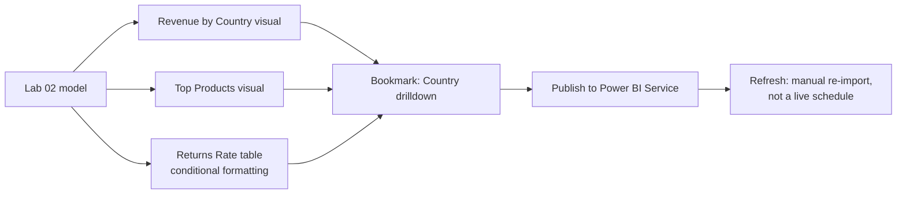

# Lab 03: Building the Interactive Dashboard

## Objectives

- **Part 1:** Build the core dashboard page: revenue by country, top products, returns rate
- **Part 2:** Add bookmarks for a country-drilldown view
- **Part 3:** Conditional-format products with high return rates
- **Part 4:** Publish, and be honest about what "scheduled refresh" means for static historical data

## Background / Scenario

Lab 02 left off with a clean star schema and a handful of measures, but no
dashboard: every question still meant opening the model view and building
a one-off table. `Cancellation Rate` existed as a single overall number,
with no way to see which products were actually driving it.

This lab turns the model into something a stakeholder could actually open
and use: a page they can filter, drill into, and read at a glance, without
knowing what a star schema is.

## Required Resources

- Power BI Desktop
- The `.pbix` file from Lab 02
- A Power BI Service account (free or trial licence) for the publish step
- Approximately 3 hours

## Topology



---

## Part 1: The Core Visuals

### Step 1: Revenue by country

Map or bar chart: `dim_country[Country]` on axis, `[Total Revenue]` as
value. Sort descending. The UK will dominate the chart enough to make
every other country hard to read on a linear axis, that's expected, not
a formatting bug, and it's worth leaving visible rather than log-scaling
it away, since "the UK is that dominant" is itself the finding.

### Step 2: Top products, by resolved product name

Bar chart: `dim_product[Description]` (the canonical, drift-resolved
version from Lab 02) on axis, `[Total Revenue]` as value, Top N filter set
to 10.

> **This is the visual that proves Lab 02's StockCode fix mattered.** If
> you build this against the raw, undeduplicated description field instead
> of `dim_product`, the same product can appear as two or three separate
> bars, each smaller than it should be, and the actual best-seller can
> drop out of the Top 10 entirely. Worth checking once, on purpose: swap
> the field and watch a bar split into two.

<details>
<summary>Expected result</summary>

The top bar is a clearly dominant giftware item, not a near-tie between
the top two or three. This retailer's sales are concentrated enough that
one or two SKUs stand well above the rest. If two bars for what looks like
the same product name both appear in the Top 10, the field is still bound
to raw Description rather than `dim_product`.

</details>

### Step 3: Returns rate by product

Table visual: `dim_product[Description]`, a new measure:

```dax
Product Cancellation Rate =
VAR TotalLines =
    CALCULATE( COUNTROWS(fact_orders), ALLEXCEPT(fact_orders, dim_product[StockCode]) )
VAR CancelledLines =
    CALCULATE(
        COUNTROWS(fact_orders),
        fact_orders[IsCancellation] = TRUE,
        ALLEXCEPT(fact_orders, dim_product[StockCode])
    )
RETURN
    DIVIDE( CancelledLines, TotalLines )
```

> **Why `ALLEXCEPT` instead of just relying on the visual's row context.**
> Inside a table visual, row context already restricts to one product, so
> `ALLEXCEPT` looks redundant here, but this measure gets reused on a card
> later filtered by country too, and without `ALLEXCEPT` pinning the
> calculation to the product dimension specifically, an outer country
> filter would silently change what "total lines for this product" means
> between visuals. Better to be explicit now than debug it later.

### Step 4: Sort and check for products with too few orders to be meaningful

Sort the table by `Product Cancellation Rate` descending. Add
`COUNTROWS(fact_orders)` as a second column. Some products at the top of
the list will have a 100% cancellation rate on a total of one or two
orders, statistically meaningless, but visually identical to a genuine
problem product unless the order count sits right next to it.

<details>
<summary>Hint</summary>

If every row at the top of the sorted list shows a rate of exactly 100%,
that's the low-volume trap, not a genuine finding. Check the order-count
column before assuming these are real problem products. Part 3 fixes this
properly; for now, just confirm you can see it.

</details>

<details>
<summary>Expected result, Part 1</summary>

Revenue by country matches Lab 02's table visual. The Top 10 products chart
shows one dominant bar and a scaled-down tail, no two bars representing an
obviously identical product name. The returns table's top rows by
unfiltered rate are almost all single-digit order counts at 100%,
expected at this stage, and the reason Part 3 exists.

</details>

---

## Part 2: Bookmarks for Country Drilldown

### Step 1: Set the default view

With no filters applied, **View → Bookmarks → Add**. Name it `All
Countries`.

### Step 2: Filter to the UK and capture a second bookmark

Click the UK bar in the Revenue by Country chart to cross-filter the page.
**Add** a new bookmark, name it `UK Detail`. Check **Data** is included in
the bookmark's captured state, not just the visual selection.

### Step 3: Build the toggle

Add two buttons, "All Countries" and "UK Detail", each with **Action →
Type: Bookmark** pointing at the matching bookmark.

> **A bookmark captures filter state, not a live selection.** Clicking the
> UK bar and then editing a measure afterward does not update the
> bookmark, it's frozen at capture time. If Lab 02's model changes later
> (say, a new measure gets added), existing bookmarks still work because
> they store filter state, not the visual definitions, but any new visual
> added after the bookmark was captured won't be part of it until the
> bookmark is re-saved.

<details>
<summary>Hint</summary>

If clicking "UK Detail" doesn't restore the filter, the bookmark was
probably captured with the **Data** option unchecked in the bookmark pane.
Open the bookmark's options and confirm Data is included, then re-capture.

</details>

<details>
<summary>Expected result, Part 2</summary>

Clicking "UK Detail" cross-filters every visual on the page to the United
Kingdom only, with revenue and product totals dropping to match the UK
subset from Lab 01/02. Clicking "All Countries" restores the unfiltered
totals exactly. Toggling back and forth a few times should return
identical numbers each time. A bookmark that drifts between clicks means
Data wasn't captured correctly.

</details>

---

## Part 3: Conditional Formatting for High-Return Products

### Step 1: Apply conditional formatting to the returns table

Select the `Product Cancellation Rate` column → **Conditional formatting →
Background color → Rules**. Format rule: red above 0.3, amber 0.1-0.3,
default below 0.1.

### Step 2: Suppress the low-volume false positives from Part 1 Step 4

Add a measure that blanks out the rate when volume is too low to trust:

```dax
Product Cancellation Rate (Filtered) =
VAR OrderCount = CALCULATE( COUNTROWS(fact_orders), ALLEXCEPT(fact_orders, dim_product[StockCode]) )
RETURN
    IF( OrderCount >= 10, [Product Cancellation Rate], BLANK() )
```

Use this measure, not the raw one, for the conditional formatting rule.

> **A red cell on one order out of one is not a finding.** Conditional
> formatting makes a number visually authoritative regardless of how
> reliable it is, a stakeholder scanning red cells has no way to tell a
> genuine high-return product from a product that was ordered once and
> returned once. Gating the measure on volume before formatting it is
> cheaper than adding a disclaimer nobody reads.

### Step 3: Verify against a known case

Pick one product with a high but low-volume rate and one with a high rate
at real volume (checked in Part 1 Step 4). Confirm only the second one
still shows red after Step 2.

<details>
<summary>Expected result, Part 3</summary>

After switching to the filtered measure, most of the red cells from Part 1
disappear. The volume gate at 10 orders removes the majority of them,
since single-digit order counts are common in a catalogue this size. What
remains red should be products with real order volume and a genuinely
elevated cancellation rate, not statistical noise.

</details>

---

## Part 4: Publish and the Refresh Question

### Step 1: Publish

**Home → Publish**, sign in, choose a workspace.

### Step 2: State plainly what "scheduled refresh" means here

> **This dataset is historical and static, December 2010 through December
> 2011, and it stops there.** There is no live source to schedule a
> refresh against. In a real deployment, "scheduled refresh" means Power
> BI Service re-pulling from a live database on a timer, so the report
> reflects today's data tomorrow. The SQL Server database from Lab 01
> could technically be scheduled to refresh, but nothing writes new rows
> into `clean_orders`, so a scheduled refresh here would just mean Power
> BI re-running the same query against the same fixed table on a timer:
> technically functional, practically pointless. Worth saying directly
> rather than configuring a schedule that implies data is moving when it
> isn't.

### Step 3: What a real refresh setup would need instead

If this were a live retailer, the workflow would need: an On-premises data
gateway (since `OnlineRetail` runs on a local SQL Server instance, not a
cloud database Power BI Service can reach directly), a refresh schedule
matched to how often the source actually changes, and refresh failure
alerts. None of that applies to a fixed historical export from 2011, so
this lab stops at publishing the static snapshot rather than building
infrastructure with nothing behind it.

### Step 4: Confirm the published report works cross-filtered

Open the published report in a browser, click through both bookmarks, and
confirm conditional formatting rendered the same as in Desktop. Service
sometimes renders custom color rules slightly differently from Desktop's
preview.

<details>
<summary>Expected result, Part 4</summary>

The published report loads with the "All Countries" bookmark state as
default (whichever was active when you last saved before publishing).
Both bookmark buttons work identically to Desktop. Conditional formatting
colors should match, though exact shades can render a shade lighter or
darker in a browser than in Desktop. The threshold behavior (which cells
go red vs. amber) is what actually matters, not the precise hex value.

</details>

---

## Troubleshooting

| Symptom | Cause | Fix |
|---|---|---|
| Top Products bar chart shows near-duplicate bars | Visual built against raw Description instead of dim_product | Swap the field to dim_product[Description] |
| Conditional formatting shows red on products with 1-2 orders | Used the unfiltered rate measure | Switch the visual to `Product Cancellation Rate (Filtered)` |
| Bookmark doesn't restore the UK filter | "Data" checkbox was unchecked when the bookmark was captured | Re-capture the bookmark with Data included |
| Published report's conditional formatting looks washed out | Service renders the color scale slightly differently from Desktop | Re-check the rule's exact threshold values in Service, adjust if needed |
| Publish fails with a data source error | Power BI Service can't reach the local SQL Server instance without a gateway registered | Install and register an On-premises data gateway, or accept the report works from Desktop only for this lab |

---

## Reflection

1. Why does gating `Product Cancellation Rate` on order volume change
   which products get flagged red, without changing the underlying
   revenue numbers at all?
2. What's the actual difference between "this report has scheduled
   refresh configured" and "this report's schedule fires against a table
   that never changes", and would a viewer of the published report be
   able to tell which one they're looking at?
3. If a stakeholder asked for the returns-rate table sorted by rate alone,
   with no volume filter, what would you tell them about why that's a
   worse default?

---

## What Went Wrong When I Did This

- **Built the Top Products chart before rechecking which product field it
  was bound to**, and only noticed the duplicate-bar problem because a
  product I knew sold well from Lab 01's exploration wasn't in the Top 10.
  Traced it to the visual defaulting to a raw description field left over
  from an earlier draft of the model, not `dim_product[Description]`.
- **Shipped the returns-rate table with conditional formatting before
  adding the volume gate.** The top of the sorted list was almost entirely
  products with one order and one cancellation, a 100% rate that told me
  nothing. Only caught it because I cross-checked the order count column
  out of habit, not because anything visually signaled the numbers were
  unreliable.
- **Set up a Power BI Service scheduled refresh against the SQL Server
  table** out of reflex, because that's the normal next step after
  publishing. Realized partway through configuring it that nothing writes
  new rows into `clean_orders`, the data doesn't change, and it would have
  just quietly re-run the same query against the same 2011 data forever,
  implying freshness that didn't exist. Removed the schedule and
  documented the limitation instead.

---

## Where This Breaks

The dashboard reads well but has real gaps:

- Revenue by country is a snapshot, not a trend: there's no way yet to
  see whether returns rate or revenue is improving or worsening month over
  month
- The dataset only covers thirteen months, which is enough for genuine
  month-over-month comparison but not enough for year-over-year
- Nothing on this page breaks down revenue over time at all: every visual
  built so far collapses the whole date range into one number

**Next:** [Lab 04: Time Intelligence](04-time-intelligence.md)
