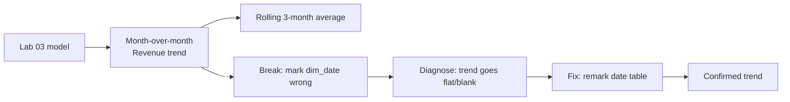

# Lab 04: Time Intelligence

## Objectives

- **Part 1:** Build a month-over-month revenue trend across the real Dec 2010-Dec 2011 span
- **Part 2:** Add rolling and comparison measures on top of the trend
- **Part 3:** Break the model on purpose, then diagnose why time intelligence failed
- **Part 4:** Fix it and confirm the trend is trustworthy again

## Background / Scenario

Lab 03 left off with a dashboard that answers "how much, from where, and
what's returned" as a single snapshot, no visual on that page shows
change over time at all. That's the gap this lab closes, and it's the one
lab in this series where the underlying dataset actually supports it
properly: thirteen real months, December 2010 through December 2011, with
no gaps large enough to break a monthly trend.

This lab also deliberately breaks the model partway through, on purpose,
because the way time intelligence fails silently in Power BI is worth
seeing once under controlled conditions rather than for the first time in
a real report.

## Required Resources

- Power BI Desktop
- The `.pbix` file from Lab 03
- Approximately 2.5 hours

## Topology



---

## Part 1: The Month-over-Month Trend

### Step 1: Confirm the date table is fit for purpose

Open `dim_date` from Lab 02. Confirm it's marked as a date table (**Table
tools → Mark as Date Table**, `Date` column selected) and that its range,
`DATE(2010,12,1)` to `DATE(2011,12,31)`, actually covers every
`InvoiceDate` in `fact_orders`. If the fact table has any date outside
that range, every time-intelligence function silently returns blank for
those rows instead of erroring.

### Step 2: Build the trend visual

Line chart: `dim_date[YearMonth]` on the axis, `[Total Revenue]` as value.

**Expected result:** a real trend, not a flat line. This retailer's
revenue rises sharply toward November and December 2011, consistent with
a gift-focused retailer's seasonal pattern, and dips around the mid-year
months.

### Step 3: Add month-over-month growth

Write a measure, `Revenue MoM %`, that returns the percentage change in
`[Total Revenue]` between the current month in context and the month
before it. You need `DATEADD` to shift the filter context back one month
against `dim_date[Date]`, and `DIVIDE` rather than `/` so a zero-revenue
prior month doesn't throw an error.

<details>
<summary>Hint</summary>

`DATEADD(dim_date[Date], -1, MONTH)` inside a `CALCULATE` gives you the
prior month's `[Total Revenue]` as a comparison value. Store both the
current and shifted totals in variables first, then divide their
difference by the prior month's value. Watch the sign: use current minus
previous, not the other way round, or growth reads as decline.

</details>

Add as a second line on a combo chart, or as a separate table below the
trend.

> **`DATEADD` needs a marked, contiguous date table to mean anything.**
> This is the same requirement Step 1 checked, restated as the reason it
> matters: `DATEADD(dim_date[Date], -1, MONTH)` walks the calendar
> structure of `dim_date`, not `fact_orders`. If `dim_date` has a gap or
> isn't marked as a date table, `DATEADD` doesn't error, it just returns
> blank or a wrong month, which is a much harder bug to notice on a chart
> than a red error banner would be.

### Step 4: Sanity-check December 2010 and December 2011 separately

The dataset starts December 1, 2010 and ends December 9, 2011, not a
full final month. Filter the trend to just December in both years and
confirm the chart visibly shows partial data for the later one, rather
than an artificially low bar that looks like a genuine December slump.

**Troubleshooting:** if the final month looks like a cliff-edge drop
instead of a partial month, add a text callout or note on the visual:
comparing a full December 2010 against a 9-day December 2011 as if
they're equivalent periods is a real trap for anyone reading this chart
without that context.

<details>
<summary>Expected result, Part 1</summary>

The line rises through autumn and peaks in November 2011, the run-up to
Christmas, then appears to fall sharply in the final December. That fall
is the partial-month artifact from Step 4, not a real trend reversal.
`Revenue MoM %` should read strongly positive through Sep-Nov 2011 and
sharply negative for the final December once you check it, which is the
same partial-month effect showing up in growth-rate terms instead of
absolute terms.

</details>

---

## Part 2: Rolling Average and Prior-Period Comparison

### Step 1: Rolling 3-month average

Write `Revenue 3M Avg`: the average of `[Total Revenue]` over the trailing
three months ending on whatever month is in the current filter context.
`AVERAGEX` iterating over a date range built with `DATESINPERIOD` is the
standard pattern for this.

<details>
<summary>Hint</summary>

`DATESINPERIOD( dim_date[Date], MAX(dim_date[Date]), -3, MONTH )` returns
the trailing three-month window ending at the last date in context. Feed
that table into `AVERAGEX` with `[Total Revenue]` as the expression to
average. The interval has to be negative for "trailing"; positive gives you
a forward-looking window instead, which won't visibly break anything but
will quietly answer the wrong question.

</details>

Add as a third line on the trend chart, it should visibly smooth out the
month-to-month noise while still tracking the seasonal rise.

### Step 2: Cancellation rate over time

The returns signal from Lab 02 deserves the same treatment as revenue:
does the cancellation rate drift over the year, or stay roughly flat? Using
the pattern from Step 1, write a measure that evaluates `[Cancellation
Rate]` for each month in the trend rather than collapsing to one overall
number.

<details>
<summary>Hint</summary>

You don't need `DATESINPERIOD` here since you're not averaging across
months, just re-evaluating one month at a time. `CALCULATE([Cancellation
Rate], DATESBETWEEN(dim_date[Date], STARTOFMONTH(dim_date[Date]),
ENDOFMONTH(dim_date[Date])))` restricts the existing measure to the
current month's boundaries. This matters less inside a table or chart
already sliced by month, since the row context does most of the work
already, but it makes the measure safe to drop onto a card outside that
context too.

</details>

Plot alongside revenue. A rising cancellation rate during the same months
revenue peaks would be worth a note on the dashboard: high season and
high returns can move together for reasons worth naming (rushed gift
purchases, wrong-size or wrong-item orders) rather than left as an
unexplained correlation.

<details>
<summary>Expected result, Part 2</summary>

`Revenue 3M Avg` should trail the raw monthly line with a lag, rising more
slowly into the November/December peak and staying elevated a month or two
after it, exactly what a trailing average does. Cancellation rate should
stay in a broadly similar band to the overall 3-4% figure from Lab 01,
with some month-to-month noise; a large sustained rise around the
November/December peak is a real, explainable pattern, not a bug to chase.

</details>

---

## Part 3: Break It on Purpose

### Step 1: Unmark the date table

**Table tools → Mark as Date Table**, and deliberately uncheck it, or
change the assigned `Date` column to a different column that isn't a
proper contiguous calendar.

### Step 2: Watch what happens to the trend

Return to the Part 1 Step 2 line chart. Depending on which change was
made, the result is one of: the `DATEADD` measure returns blank across the
board, the chart silently reorders months alphabetically instead of
chronologically (this is the more common failure when `YearMonth` is a
text column with no explicit sort-by-column set), or nothing visibly
changes at all until a downstream measure is checked closely.

> **Time intelligence functions don't throw an error when the date table
> is wrong, they just compute against the wrong thing, or nothing.** This
> is the same category of failure as Lab 02's silently-fragmented product
> list: a broken measure that still returns a plausible-looking number is
> far more dangerous than one that visibly fails, because nothing forces
> anyone to notice.

### Step 3: Diagnose it properly

Don't just undo the change, work out which specific requirement broke
first:

1. Is `dim_date` still marked as a date table? (**Table tools** ribbon)
2. Does `dim_date[YearMonth]` have a numeric sort-by-column
   (`dim_date[YearMonthNumber]`) set, so "Jan" doesn't sort before
   "Dec"? (**Column tools → Sort by column**)
3. Does the relationship from `fact_orders[InvoiceDate]` to
   `dim_date[Date]` still exist and point the right direction?

Check each in order, this is the same sequence a real debugging session
would follow, cheapest check first.

<details>
<summary>Hint</summary>

Whichever of the three you changed in Step 1, the other two are still
fine. The fault isolates to exactly one check. If the chart went
alphabetical rather than blank, look at what a sort-by-column actually
controls before touching the date table's Mark as Date Table setting; the
two failures look similar on screen but come from unrelated causes.

</details>

<details>
<summary>Expected result, Part 3</summary>

Whichever break you introduced, `Revenue MoM %` and `Revenue 3M Avg` both
show visibly wrong output: either blank across every month, or numbers
that no longer track the seasonal shape from Part 1. The line chart itself
may still render something, which is the point. A wrong number that looks
like a plausible chart is the actual failure mode being demonstrated here,
not a Power BI error banner.

</details>

---

## Part 4: Fix and Confirm

### Step 1: Re-mark the date table

**Table tools → Mark as Date Table**, `Date` column, confirm.

### Step 2: Re-check the sort-by-column

`dim_date[YearMonth]` (text, e.g. "Dec 2010") needs **Column tools → Sort
by column** set to `dim_date[YearMonthNumber]` (a numeric column counting
months sequentially from the start of the range, not just 1-12, so 2010
and 2011 don't interleave).

```dax
YearMonthNumber = YEAR(dim_date[Date]) * 12 + MONTH(dim_date[Date])
```

### Step 3: Confirm the trend matches Part 1

Rebuild the Part 1 Step 2 chart. It should match exactly, same shape,
same December 2011 partial-month dip. If it doesn't, one of the three
checks in Part 3 Step 3 is still wrong.

### Step 4: Re-run MoM and the rolling average

Confirm `Revenue MoM %` and `Revenue 3M Avg` both recompute correctly
against the restored date table.

<details>
<summary>Expected result, Part 4</summary>

The trend, MoM, and rolling-average visuals all match their Part 1/Part 2
shape and values exactly, month-for-month. If any number differs from the
pre-break baseline, one of the three checks from Part 3 Step 3 is still
unresolved. Re-run them in order rather than guessing which one is left.

</details>

---

## Troubleshooting

| Symptom | Cause | Fix |
|---|---|---|
| MoM measure returns blank for every month | dim_date not marked as a date table | Table tools → Mark as Date Table |
| Months on the trend chart appear in alphabetical, not chronological order | YearMonth text column has no sort-by-column set | Add YearMonthNumber, set as sort-by-column for YearMonth |
| December 2011 looks like a steep drop-off | Partial month (data ends Dec 9, 2011) plotted as if equivalent to a full month | Add a note or exclude the partial month from month-over-month comparisons |
| 3-month rolling average is identical to plain revenue | DATESINPERIOD given the wrong direction (positive instead of -3) | Confirm the interval argument is negative for "trailing" |

---

## Reflection

1. Why did unmarking the date table not throw a visible error anywhere in
   the report, and what does that imply about how often time-intelligence
   measures should be spot-checked against a known-good baseline?
2. What's the practical difference between comparing December 2010 to
   December 2011 as whole months versus as equivalent day-ranges, and
   which one is this retailer's stakeholder more likely to actually want?
3. If the cancellation rate does rise alongside revenue during peak
   months, what would you need to check before claiming one causes the
   other?

---

## What Went Wrong When I Did This

- **Unmarked the date table for Part 3 and expected an error message.**
  Power BI gave none. The trend chart kept rendering, just with months
  sorted alphabetically, which looked plausible enough at a glance that I
  almost moved on without noticing December had landed between August and
  January.
- **Compared December 2010 to December 2011 as if they were equivalent
  periods** on an early version of the MoM chart, before checking how many
  days of data the later month actually had. The apparent "December
  slump" was really a 9-day month compared against a 31-day one. Caught it
  only because the drop looked too steep against the retailer's known
  gift-season pattern to be believable.
- **Set the sort-by-column to `MonthNumber` (1-12) instead of a true
  sequential `YearMonthNumber`.** This worked fine until the chart crossed
  the year boundary, at which point December 2010 and December 2011
  collapsed onto the same axis position. Didn't catch it until the line
  chart showed an impossible zigzag around the turn of the year.

---

## Where This Breaks

The trend is real and the diagnosis exercise is done, but:

- There's still no way to ask "what if returns had been lower" or "what if
  we'd reordered stock sooner", every measure so far describes what
  happened, not what could happen
- Anyone with access to this report sees every country's numbers; there's
  no way yet to restrict a regional manager to their own country's data
- The rolling average and MoM measures both assume a single global view,
  neither has been tested under a filtered subset of countries, which
  matters once row-level security exists

**Next:** [Lab 05: What-If Analysis and Row-Level Security](05-what-if-rls.md)
