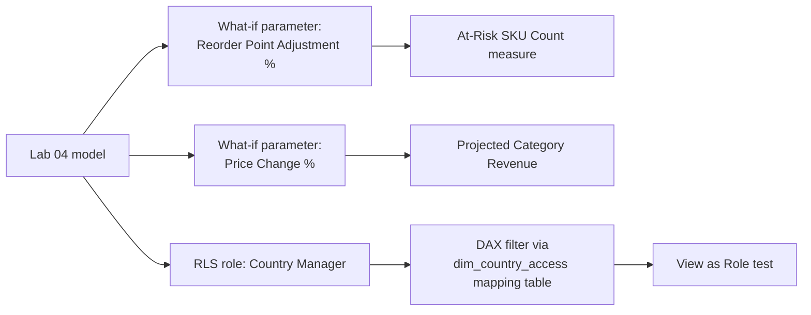

# Lab 05: What-If Analysis and Row-Level Security

## Objectives

- **Part 1:** Build a what-if parameter projecting a reorder-point change against dim_inventory
- **Part 2:** Extend it to a price-change scenario using the resolved product dimension
- **Part 3:** Implement row-level security so each country's manager sees only their own orders
- **Part 4:** Test RLS as a restricted user, not just as the report author

## Background / Scenario

Two questions close this series out. First: this retailer's warehouse
team wants to know what happens to at-risk-of-stockout product counts if
reorder points move up or down, a question that only makes sense because
Lab 02 built a synthetic `dim_inventory` table to answer it against.
Second: a regional structure with country managers needs each manager
restricted to their own country's orders in the same published report,
not thirteen separate exports. Neither is answerable with what Labs 01-04
built.

## Required Resources

- Power BI Desktop
- The `.pbix` file from Lab 04
- Approximately 3 hours

## Topology



---

## Part 1: What-If on the Reorder Point

### Step 1: Create the parameter

**Modeling → New Parameter → Numeric range.** Name `Reorder Point
Adjustment %`, min -50, max 50, increment 5, default 0. Check **Add slicer
to this page**.

**Expected result:** Power BI creates a new table with one column and a
generated measure, `Reorder Point Adjustment % Value`.

<details>
<summary>Expected result, Part 1 setup</summary>

The new `Reorder Point Adjustment %` table appears in the Fields pane with
a slicer showing values from -50 to +50 in steps of 5, defaulting to 0. It
has no relationship line to any other table in the model view. That
absence is expected, not a mistake to fix.

</details>

### Step 2: Inspect what it built

```dax
Reorder Point Adjustment % Value =
SELECTEDVALUE('Reorder Point Adjustment %'[Reorder Point Adjustment %], 0)
```

> **A what-if parameter is a disconnected table, not a relationship.** It
> has no key into `dim_inventory` or `fact_orders`, the slicer just sets
> a value that a measure reads with `SELECTEDVALUE`. Nothing about the
> model "knows" this represents a stock policy change; the measures
> written next are what give it meaning, exactly the same mechanism as
> the coffee-shop series' price scenario, applied here to inventory
> instead.

### Step 3: Write the at-risk count measure

Write a measure, `At-Risk SKU Count`, that counts how many distinct
`StockCode`s in `dim_inventory` have `stock_on_hand` at or below their
`reorder_point`, adjusted by the scenario percentage from the parameter.
You'll need `DISTINCTCOUNT` wrapped in a `CALCULATE`/`FILTER`, reading the
parameter's generated value measure to scale `reorder_point` up or down.

<details>
<summary>Hint</summary>

```dax
At-Risk SKU Count =
VAR AdjustmentPct = 'Reorder Point Adjustment %'[Reorder Point Adjustment % Value]
RETURN
    CALCULATE(
        DISTINCTCOUNT(dim_inventory[StockCode]),
        FILTER(
            dim_inventory,
            dim_inventory[stock_on_hand] <= dim_inventory[reorder_point] * (1 + AdjustmentPct / 100)
        )
    )
```

`FILTER` has to iterate `dim_inventory` row by row because the comparison
depends on two columns from the same row. A measure-level `CALCULATE`
filter argument on its own can't express "this row's stock against this
row's adjusted reorder point."

</details>

Card visual, with the parameter's slicer on the page. Move the slider from
0 toward +50 and confirm the count rises. A higher reorder point means
more SKUs read as "at risk" at the same stock level, which is the correct
direction: raising the threshold that defines "at risk" always increases
how many SKUs qualify.

<details>
<summary>Expected result, Part 1</summary>

At the default 0% adjustment, the count lands somewhere in the low hundreds
to low thousands of SKUs, depending on the random values your `dim_inventory`
generated in Lab 02. There's no single right number here since the table
is synthetic, but the count should move monotonically upward as the slider
moves from -50 toward +50, never flat and never reversing direction.

</details>

> **This measure is built on synthetic data, and that has to stay visible
> on the report page, not buried in a tooltip.** `dim_inventory` was
> generated with a random T-SQL `INSERT` in Lab 02 because the source
> dataset has no real stock table. A warehouse team reading this card
> without that context would reasonably assume it reflects an actual
> count. A text box stating the source plainly belongs next to this
> visual, not just in this lab's notes.

---

## Part 2: What-If on Price, by Category

### Step 1: Create the second parameter

**Modeling → New Parameter → Numeric range.** Name `Price Change %`, min
-20, max 20, increment 1, default 0.

### Step 2: Restrict the scenario to one product category

The source data doesn't ship a clean "category" column, so this uses a
simple grouping added to `dim_product` in this step: split on whether
`Description` contains "CHRISTMAS" (a real, common prefix in this
retailer's giftware catalogue) versus everything else.

```dax
Product Group =
IF(
    CONTAINSSTRING( dim_product[Description], "CHRISTMAS" ),
    "Seasonal",
    "Standard"
)
```

Add as a calculated column on `dim_product`.

### Step 3: Write the projected revenue measure

Write `Projected Seasonal Revenue`, following the same shape as Part 1's
at-risk measure: read the price parameter's value, apply it only to the
seasonal slice of revenue, and leave standard-product revenue untouched.
Split `[Total Revenue]` into its seasonal and non-seasonal parts first:
applying the percentage to the whole total, then trying to back out the
non-seasonal share, is the wrong order and double-counts the effect on
what should be an unaffected slice.

<details>
<summary>Hint</summary>

`CALCULATE([Total Revenue], dim_product[Product Group] = "Seasonal")` gets
you the seasonal slice; subtract that from `[Total Revenue]` for
everything else. Scale only the seasonal variable by `(1 + PricePct/100)`
and add the untouched remainder back on.

</details>

Card visuals: `[Total Revenue]` next to `[Projected Seasonal Revenue]`,
both parameter slicers on the page.

<details>
<summary>Expected result, Part 2</summary>

At 0% price change, `Projected Seasonal Revenue` equals `[Total Revenue]`
exactly. Moving the slider to +20% raises the projected figure by less
than 20% of the total. Only the seasonal slice scales, and Christmas-
prefixed items are a meaningful but partial share of this retailer's
catalogue, not the majority of revenue. If +20% moves the projected total
by close to 20% of the whole figure, the split in Step 3 isn't actually
isolating the seasonal group.

</details>

> **This measure assumes demand doesn't change with price**, a mechanical
> projection, not an elasticity model, same limitation as the reorder-point
> measure has for demand patterns. Worth stating on the report page
> itself: a 20% price rise on seasonal giftware in November almost
> certainly changes how much of it sells, and neither what-if measure in
> this lab can represent that.

---

## Part 3: Row-Level Security

### Step 1: Create the role

**Modeling → Manage roles → Create.** Name it `Country Manager`.

### Step 2: Why a direct filter on dim_country won't work cleanly

The naive approach is a DAX filter directly on `dim_country`:

```dax
[Country] = USERPRINCIPALNAME()
```

This assumes each manager's Power BI Service login email literally equals
a country name, which it never will. Use a mapping table instead, same
reasoning as restricting any access rule that isn't itself a column on the
dimension it's restricting.

### Step 3: Build the mapping table

**Modeling → New Table**:

```dax
dim_country_access =
DATATABLE(
    "UserEmail", STRING,
    "Country", STRING,
    {
        {"manager.uk@example.com", "United Kingdom"},
        {"manager.germany@example.com", "Germany"},
        {"manager.france@example.com", "France"}
    }
)
```

Relate `dim_country_access[Country]` to `dim_country[Country]`, many-to-
one, single direction toward `dim_country`.

### Step 4: Filter the role through the mapping table

```dax
[UserEmail] = USERPRINCIPALNAME()
```

Applied on `dim_country_access`, not on `dim_country` directly.

> **Filter the access table, not the data table, whenever the access rule
> isn't itself a column on the data.** `dim_country` has no email column
> and shouldn't gain one, mixing access control into a dimension table
> Lab 02 built for an unrelated purpose is how a model ends up with
> columns nobody remembers the reason for two years later.

<details>
<summary>Expected result, Part 3</summary>

The model view shows a new single-direction relationship from
`dim_country_access` to `dim_country`, and the `Country Manager` role in
**Manage roles** shows one DAX filter expression on `dim_country_access`,
not on `dim_country` itself. Nothing changes yet in the report view. RLS
has no visible effect until you actually view as that role in Part 4.

</details>

---

## Part 4: Test as a Restricted User

### Step 1: View as role, inside Power BI Desktop

**Modeling → View as → check Country Manager → Other user →** enter
`manager.germany@example.com`.

**Expected result:** every visual on every page filters to Germany only,
the country revenue chart, the top products chart, the returns table, and
both what-if cards from Parts 1 and 2, none of which were built with RLS
in mind.

> **RLS applies model-wide, retroactively, to visuals built before the
> role existed.** That's the entire point of building it at the model
> layer instead of filtering each visual by hand, and testing it against
> pages designed in Labs 03 and 04, with no awareness RLS would exist
> later, is exactly what proves that.

### Step 2: Confirm the what-if parameters still work under RLS

With the role active, move both sliders from Parts 1 and 2.

**Expected result:** `At-Risk SKU Count` and `Projected Seasonal Revenue`
recalculate against Germany's data only. `dim_inventory` isn't directly
related to `dim_country`, so check specifically whether the at-risk count
actually changed or stayed at the global figure.

<details>
<summary>Hint</summary>

Trace the relationship path by hand before assuming either measure is
right: does a filter on `dim_country` reach `fact_orders`, and from
`fact_orders` does it reach `dim_product`, and from `dim_product` does it
reach `dim_inventory`? Check each hop in the model view rather than
guessing from the number on the card. A plausible-looking number that
happens not to have moved is exactly the failure mode Lab 04 already
warned about.

</details>

**Troubleshooting:** if `At-Risk SKU Count` doesn't shrink under the
Germany role, it's because `dim_inventory` relates to `dim_product`, which
has no direct path back to `dim_country` through a single filtering
relationship. The model may need `dim_product` and `dim_inventory` to
inherit the country filter through `fact_orders`, which requires checking
that the relationship from `fact_orders` to `dim_product` is set to filter
in both directions, or accepting and documenting that stock-related
measures are intentionally global (a defensible choice, since real
inventory isn't usually country-scoped in this kind of retailer, but a
choice that needs to be stated, not discovered by a confused reader).

### Step 3: Publish and assign the role for real

After publishing to Power BI Service: **dataset settings → Security →**
add each manager's actual email under the `Country Manager` role.

**Troubleshooting:** RLS in Desktop's "View as" is a simulation. The real
test is a second person, signed in with their own account, opening the
published report. If that's not practical to arrange, state plainly that
RLS was verified in Desktop only, not against a live second account.

---

## Troubleshooting

| Symptom | Cause | Fix |
|---|---|---|
| At-Risk SKU Count doesn't move with the slider | Measure references the parameter column instead of the generated Value measure | Use `'Reorder Point Adjustment %'[Reorder Point Adjustment % Value]` |
| Projected Seasonal Revenue changes the total even at 0% | Product Group column miscategorized non-seasonal items as Seasonal | Check CONTAINSSTRING logic and spot-check a few Description values |
| View as Role shows all countries | Role filter applied to dim_country directly instead of dim_country_access | Move the filter onto dim_country_access, confirm relationship direction |
| At-Risk SKU Count stays global under a country role | dim_inventory has no filtering path back through dim_country | Confirm relationship direction fact_orders → dim_product, or document the measure as intentionally global |
| RLS works in Desktop but not after publishing | Role has no members assigned in Service | Add emails under dataset Security settings |

---

## Reflection

1. Why does `Projected Seasonal Revenue` split seasonal and non-seasonal
   revenue into two variables instead of applying the percentage to the
   whole total?
2. `dim_inventory` is synthetic and has no real country dimension baked
   in, what does that mean for whether `At-Risk SKU Count` should be
   restricted by Country Manager RLS at all, and is "leave it global" a
   defensible design choice or a gap?
3. If a fourth country's manager joins, what changes for RLS to cover
   them, anything in the DAX, or only the mapping table?

---

## What Went Wrong When I Did This

- **Applied the price change to total revenue, not just the seasonal
  group**, on the first version of `Projected Seasonal Revenue`. The
  projection overstated impact because standard (non-seasonal) product
  revenue was moving in the simulation too, which was never the question.
  The warehouse team's actual ask was about Christmas-line pricing
  specifically.
- **Wrote the RLS filter directly on `dim_country`** using
  `USERPRINCIPALNAME()` matched against country name text, which no
  login email will ever equal. "View as Role" returned zero rows for every
  test user before I reworked it through `dim_country_access`.
- **Assumed `At-Risk SKU Count` would automatically respect the country
  role** because every other measure in the model did. It didn't. The
  count stayed identical between the unrestricted view and the Germany
  view, because `dim_inventory` has no real path back to `dim_country`
  through the model's relationships. Took a while to notice, because the
  number looked plausible in both views; only caught it by deliberately
  comparing the two side by side instead of trusting the first one that
  loaded.

---

## Where This Breaks, and What's Next

The model can project reorder-point and seasonal-pricing scenarios and
restrict each country manager to their own orders, but neither what-if
measure has any real demand elasticity behind it, the inventory table is
synthetic from the start and was never going to be country-scoped without
real warehouse data to base that on, and the RLS mapping table is
maintained by hand rather than sourced from wherever staff accounts
actually live.

One gap this lab hasn't touched at all: everything so far assumes revenue
comes from a single sales channel, in a single currency, from a single
fact table. That assumption holds for exactly as long as the retailer
sells through one website. Lab 06 changes that setup.

**Next:** [Lab 06: Capstone, A Second Sales Channel, in a Second
Currency](06-capstone.md)
