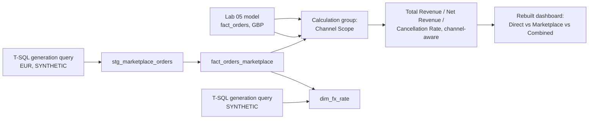

# Lab 06: Capstone, A Second Sales Channel, in a Second Currency

## Objectives

- **Part 1:** Generate a synthetic marketplace export in EUR directly in
  SQL Server and merge it against a currency conversion rate table in
  Power Query
- **Part 2:** Decide between a composite model and a unified fact table,
  and build the chosen approach
- **Part 3:** Build a calculation group so revenue and returns measures
  work across both channels without duplicating a measure family
- **Part 4:** Rebuild Lab 03's dashboard as a channel-aware final report
- **Part 5:** Reconcile the two channels against each other and write up
  what the combined view actually shows

## Background / Scenario

The retailer has spent a year selling through its own site, the UCI
dataset every lab in this series has been built on. Now it has started
listing a subset of the same giftware catalogue on a European marketplace
platform, priced in euros, with its own transaction export format that
doesn't match the direct-site schema at all. Different column names, order
IDs instead of invoice numbers, and no separate cancellation flag, just a
`status` field that includes `"returned"` as one of several values.

This is not a hypothetical add-on. It's the single most common thing that
breaks a "finished" retail Power BI model in practice: revenue stops being
one number from one source. The moment a second channel exists, every
measure this series has built up (`Total Revenue`, `Net Revenue`,
`Cancellation Rate`, the country and product breakdowns) has to either be
rebuilt twice or rebuilt once in a way that works against both fact tables
without silently favouring one channel's definition of "cancelled" over
the other's.

The real UCI dataset covers exactly one channel. The marketplace data used
in this lab is synthetic, generated to be plausible against real prices and
real product codes from Labs 01-02, and it is labelled as synthetic
throughout. That's the same rule Lab 02 applied to `dim_inventory`, at
higher stakes, because this time the synthetic data sits in its own fact
table next to 540,000 real rows rather than in a single small dimension.

### Why a calculation group, and why not DirectQuery

A full composite model, one fact table in Import mode and the other in
DirectQuery against a live marketplace API, is the textbook answer to "two
sources, different refresh cadences." It's the wrong fit here. There is no
live marketplace API, both sources are static tables, and DirectQuery would
add query-folding complexity onto a scenario that doesn't need live data at
all. What this lab actually has is two Import-mode fact tables at the same
grain (one transaction line, one row) with parallel but not identical
measure requirements. That's precisely the case calculation groups exist
for. Instead of writing `Total Revenue (Direct)`, `Total Revenue
(Marketplace)`, `Total Revenue (Combined)`, and the same three-way split
again for `Net Revenue` and `Cancellation Rate`, one calculation group
applies a chosen channel scope to whichever base measure a visual already
uses. Nine measures collapse to three base measures plus one reusable
calculation group. If a live marketplace feed existed, this lab's answer
would change: DirectQuery becomes the right tool exactly when "live" is a
real requirement rather than an assumption.

## Required Resources

- Power BI Desktop, with Tabular Editor 2 or later installed (calculation
  groups aren't available in the standard Power BI Desktop UI as of this
  writing; they're written through the external tools ribbon)
- The `.pbix` file from Lab 05
- SSMS, connected to the `OnlineRetail` database, for Part 1's generation
  queries. There is no download for either table this lab uses, because
  neither one exists as real data anywhere.
- Approximately 4 hours

## Topology



---

## Part 1: The Marketplace Export and Currency Conversion

### Step 1: Generate the synthetic marketplace data in T-SQL

The marketplace platform's export format, for this lab, is:
`order_id`, `sku`, `order_date`, `qty`, `unit_price_eur`, `status`
(`"completed"`, `"returned"`, or `"pending"`), `buyer_country`.

Build this directly in SQL Server, not a download. There's no real
second-channel export for this retailer, because the scenario itself is
constructed for this lab. Base it on real products so it stays plausible:
pull 200-300 distinct `StockCode` values from Lab 02's `dim_product`
table, generate 8,000-12,000 order rows across September-December 2011
(the marketplace channel launched partway through the year this
retailer's direct-site data covers), with `unit_price_eur` roughly the
GBP `UnitPrice` from `clean_orders` multiplied by a plausible EUR/GBP rate
plus some noise, and `status` weighted so "returned" lands somewhere close
to the direct channel's cancellation rate rather than wildly off it. A
brand-new channel with a wildly different return rate would be a real and
interesting finding if it happened organically, but manufacturing that
difference by construction would just be building in a conclusion.

```sql
USE OnlineRetail;
GO

CREATE TABLE stg_marketplace_orders (
    order_id         INT IDENTITY(1,1) PRIMARY KEY,
    sku              NVARCHAR(20)   NOT NULL,
    order_date       DATE           NOT NULL,
    qty              INT            NOT NULL,
    unit_price_eur   DECIMAL(10,2)  NOT NULL,
    status           NVARCHAR(20)   NOT NULL,
    buyer_country    NVARCHAR(100)  NOT NULL
);

-- A small seed set of 250 real StockCodes, priced from clean_orders
WITH product_seed AS (
    SELECT TOP 250
        StockCode,
        AVG(UnitPrice) AS avg_unit_price
    FROM clean_orders
    WHERE IsCancellation = 0
    GROUP BY StockCode
    ORDER BY NEWID()
),
-- A numbers table to drive row generation without a loop
tally AS (
    SELECT TOP (10000) ROW_NUMBER() OVER (ORDER BY (SELECT NULL)) AS n
    FROM sys.all_objects a CROSS JOIN sys.all_objects b
)
INSERT INTO stg_marketplace_orders (sku, order_date, qty, unit_price_eur, status, buyer_country)
SELECT
    p.StockCode,
    DATEADD(DAY, ABS(CHECKSUM(NEWID())) % 122, '2011-09-01'),
    1 + ABS(CHECKSUM(NEWID())) % 5,
    ROUND(p.avg_unit_price * 1.15 * (0.9 + (ABS(CHECKSUM(NEWID())) % 21) / 100.0), 2),
    CASE
        WHEN ABS(CHECKSUM(NEWID())) % 100 < 4  THEN 'returned'
        WHEN ABS(CHECKSUM(NEWID())) % 100 < 10 THEN 'pending'
        ELSE 'completed'
    END,
    CASE ABS(CHECKSUM(NEWID())) % 4
        WHEN 0 THEN 'Germany'
        WHEN 1 THEN 'France'
        WHEN 2 THEN 'Netherlands'
        ELSE 'Belgium'
    END
FROM tally
CROSS JOIN product_seed p
WHERE tally.n <= 40  -- 250 products x 40 = 10,000 rows
ORDER BY NEWID();
```

<details>
<summary>Hint</summary>

Run this `INSERT` once and don't re-run it. Exactly the same reasoning as
Lab 02 Part 3's `dim_inventory`: regenerating the random values after Part
5's reconciliation is built would make every number in this lab's write-up
stop matching what a reader sees when they run it themselves. If you need
to adjust the generation logic, `TRUNCATE TABLE stg_marketplace_orders`
first, regenerate once, and don't touch it again.

</details>

Mark the table as synthetic where anyone querying it would see it:

```sql
EXEC sys.sp_addextendedproperty
    @name = N'DataSource',
    @value = N'SYNTHETIC. Generated for Lab 06, not a real marketplace export.',
    @level0type = N'SCHEMA', @level0name = 'dbo',
    @level1type = N'TABLE',  @level1name = 'stg_marketplace_orders';
```

### Step 2: Build the FX rate table

The marketplace's `unit_price_eur` needs converting to GBP to be
comparable with `fact_orders`. Build a small synthetic monthly rate table
directly in T-SQL: `YearMonth`, `EUR_to_GBP_rate`, one row per month from
September through December 2011, rates plausible for that real period
(roughly 0.86-0.88 GBP per EUR is a reasonable range to anchor on) with
small month-to-month movement, not a flat constant. A flat rate would
quietly remove the entire reason this lab uses a rate table instead of a
single conversion constant.

```sql
CREATE TABLE stg_fx_rate (
    YearMonth        INT            PRIMARY KEY,
    EUR_to_GBP_rate  DECIMAL(6,4)   NOT NULL
);

INSERT INTO stg_fx_rate (YearMonth, EUR_to_GBP_rate) VALUES
    (201109, 0.8720),
    (201110, 0.8695),
    (201111, 0.8760),
    (201112, 0.8610);
```

<details>
<summary>Hint</summary>

A single global constant would technically work for the numbers in this
lab, but it wouldn't demonstrate why a rate *table* joined by month is the
correct pattern for real currency conversion, where the rate genuinely
moves. Build it as a table now so the pattern is already right if this
model ever needed a longer date range.

</details>

### Step 3: Import both into Power BI and merge

**Get Data → SQL Server** for both `stg_marketplace_orders` and
`stg_fx_rate`. In Power Query, merge `stg_marketplace_orders` against
`stg_fx_rate` on a computed `YearMonth` key (derived from `order_date`,
same `YEAR()*12+MONTH()` pattern as Lab 04's `YearMonthNumber`; reuse it
rather than inventing a second date-key convention). Add a computed
column:

```
unit_price_gbp = [unit_price_eur] * [EUR_to_GBP_rate]
```

<details>
<summary>Hint</summary>

If the merge produces blank rates for some rows, check that both
`YearMonth` keys are actually the same data type. A text `"2011-09"` on
one side and a numeric `201109` on the other will look identical in a
preview pane but never match in a merge. Since both source columns here
came from SQL Server as `INT`, this is less likely than it would be
coming from a CSV, but confirm rather than assume.

</details>

<details>
<summary>Expected result, Part 1</summary>

`stg_marketplace_orders` loads with your generated row count (roughly
10,000, per Step 1). Every row after the merge has a non-blank
`unit_price_gbp`. Spot-checking a handful of rows by hand,
`unit_price_eur × EUR_to_GBP_rate` matches `unit_price_gbp` exactly.
`status = "returned"` lands somewhere in a similar range to the direct
channel's 3-4% cancellation rate, not dramatically higher or lower, per
the construction in Step 1.

</details>

---

## Part 2: Composite Model Decision and the Second Fact Table

### Step 1: Build fact_orders_marketplace at a matching grain

Apply the same grain discipline Lab 02 Part 1 established: one row per
order line, matching `fact_orders`. Keep `order_id`, `sku` (rename to
`StockCode` to match the existing key, since it's the same product
catalogue), `order_date`, `qty`, `unit_price_gbp`, `status`,
`buyer_country`. Add a computed `LineRevenueGBP = [qty] * [unit_price_gbp]`
and an `IsCancellation` column derived from `status = "returned"`, matching
`fact_orders`' boolean rather than the marketplace's three-way `status`
text. Downstream measures need one consistent flag shape across both fact
tables, not two different ones a calculation group would have to
special-case.

<details>
<summary>Hint</summary>

`"pending"` orders are neither completed sales nor cancellations. Decide
explicitly whether they count as revenue at all before writing
`IsCancellation`, the same kind of decision Lab 01 made out loud about
guest checkouts rather than leaving implicit. A defensible default:
exclude `"pending"` from both `Total Revenue` and `Cancellation Rate`
entirely, since it hasn't resolved to either outcome yet, and say so on
the report page.

</details>

**Close & Apply**, `fact_orders_marketplace`.

### Step 2: Relate it into the existing model

`fact_orders_marketplace[StockCode]` → `dim_product[StockCode]`
(many-to-one, same as the direct fact table). `fact_orders_marketplace
[buyer_country]` → `dim_country[Country]`. Check first whether every
`buyer_country` value in the marketplace data actually exists in
`dim_country` already, or whether the marketplace reaches new countries
the direct channel never has an entry for.

<details>
<summary>Hint</summary>

A relationship to a dimension with missing keys doesn't error in Power BI.
Rows with an unmatched key just silently don't participate in any visual
filtered or grouped by that dimension. If `dim_country` needs new rows
added for marketplace-only countries, do it before wiring the
relationship, not after, or you'll spend Part 5's reconciliation chasing
a gap that was never really in the data.

</details>

`fact_orders_marketplace[order_date]` → `dim_date[Date]`. Confirm
`dim_date`'s range from Lab 02 (`DATE(2010,12,1)` to `DATE(2011,12,31)`)
still covers every marketplace order date. It should, since the channel
launched inside that window, but confirm rather than assume.

There is deliberately no relationship between `fact_orders` and
`fact_orders_marketplace` directly. They're two fact tables at the same
grain, both filtering from the same shared dimensions, which is exactly
the shape a calculation group is built to sit on top of.

<details>
<summary>Expected result, Part 2</summary>

The model view now shows two fact tables, both connected to `dim_product`,
`dim_country`, and `dim_date`, with no direct relationship between the two
fact tables themselves. A plain `SUM(fact_orders_marketplace[LineRevenueGBP])`
dropped onto a card, with no other measure logic yet, returns a plausible
GBP figure somewhere in the tens of thousands to low hundreds of thousands,
depending on your Part 1 generation. That's small relative to the direct
channel's full-year total, since the marketplace channel only covers four
months on a smaller product subset.

</details>

---

## Part 3: The Calculation Group

### Step 1: Why base measures still need to exist first

A calculation group doesn't replace measures. It multiplies what a small
set of base measures can express. Before building the group, this lab
needs three genuinely channel-agnostic base measures. Write them yourself,
using the pattern already established across Labs 02-04 for `Total
Revenue`, `Net Revenue`, and `Cancellation Rate`, but note that these base
versions can't reference `fact_orders[IsCancellation]` or
`fact_orders_marketplace[IsCancellation]` directly. A base measure has to
work no matter which fact table the calculation group later points it at.

<details>
<summary>Hint</summary>

`SUM` and `CALCULATE`/`COUNTROWS` patterns written against a specific
table name (`SUM(fact_orders[LineRevenue])`) only ever touch that one
table. Writing `Total Revenue (Base)` against a single unified column
requires either a unified fact table (Part 3 Step 2 covers why this lab
doesn't build one) or a calculation-group calculation item that swaps
which table's column the base measure points at. That's exactly what
Step 3 below does. Keep the base measures simple for now; the channel
logic belongs in the calculation items, not duplicated into each base
measure.

</details>

### Step 2: Why a unified fact table isn't the answer here

The obvious alternative to two parallel fact tables is `UNION`-ing them
into one during Power Query and dropping the distinction. That would work
for `Total Revenue`, but it would erase exactly the thing this lab needs to
keep visible: the two channels have different definitions of a cancelled
order (a boolean flag versus a three-way status, already reconciled in
Part 2 Step 1) and different currencies converted at different monthly
rates, so any audit of "why does this number look off" needs to be able to
isolate one channel's rows from the other's. A calculation group preserves
that separation while still letting one visual show a combined total.

### Step 3: Build the calculation group in Tabular Editor

Open the model in **External Tools → Tabular Editor**. Create a new
calculation group named `Channel Scope`, with three calculation items:
`Direct`, `Marketplace`, and `Combined`.

```dax
// Calculation item: Direct
CALCULATE(
    SELECTEDMEASURE(),
    REMOVEFILTERS( fact_orders_marketplace ),
    fact_orders_marketplace[StockCode] = BLANK()
)
```

<details>
<summary>Hint</summary>

The `Direct` and `Marketplace` items each need to force the base measure
to evaluate against only one fact table's rows, without a direct
relationship between the two fact tables to lean on. The reliable pattern
is `CALCULATE(SELECTEDMEASURE(), <table>[somecolumn] = BLANK())`, which
works because a base measure summing `fact_orders_marketplace` naturally
returns blank once every row of that table is filtered out. The
`Marketplace` item is the mirror image, filtering `fact_orders` down to
nothing instead. `Combined` needs no filter argument at all: it's just
`SELECTEDMEASURE()` unfiltered, since both fact tables already contribute
to a properly-written base measure without any calculation item applied.

</details>

### Step 4: Rewrite the base measures to span both fact tables

With the calculation group in place, `Total Revenue (Base)` needs to sum
revenue from *both* fact tables, respecting each one's own cancellation
flag, so that `Direct` and `Marketplace` calculation items can correctly
isolate one side and `Combined` can correctly show both:

```dax
Total Revenue (Base) =
CALCULATE( SUM(fact_orders[LineRevenue]), fact_orders[IsCancellation] = FALSE )
    + CALCULATE( SUM(fact_orders_marketplace[LineRevenueGBP]), fact_orders_marketplace[IsCancellation] = FALSE )
```

Write `Net Revenue (Base)` and `Cancellation Rate (Base)` yourself,
following the same two-table-sum shape. `Cancellation Rate (Base)` is the
one that needs real care. It's a ratio, not a sum, so the numerator and
denominator each need their own two-table combination before dividing,
not a division applied after the fact.

<details>
<summary>Hint</summary>

```dax
Cancellation Rate (Base) =
VAR CancelledLines =
    CALCULATE( COUNTROWS(fact_orders), fact_orders[IsCancellation] = TRUE )
    + CALCULATE( COUNTROWS(fact_orders_marketplace), fact_orders_marketplace[IsCancellation] = TRUE )
VAR TotalLines =
    COUNTROWS(fact_orders) + COUNTROWS(fact_orders_marketplace)
RETURN
    DIVIDE( CancelledLines, TotalLines )
```

Combining two `COUNTROWS` before dividing, rather than averaging two
already-divided rates, is what keeps this honest when one channel has far
more orders than the other. A simple average of two rates would weight a
4,000-order month the same as a 40,000-order month, which isn't what
"overall cancellation rate" means.

</details>

<details>
<summary>Expected result, Part 3</summary>

With `Channel Scope = Direct` applied to a `Total Revenue (Base)` card, the
number matches Lab 02's `Total Revenue` almost exactly (small differences
are fine if data has changed since Lab 02; large differences mean the
`Direct` calculation item's filter isn't isolating correctly). With
`Channel Scope = Marketplace`, the number matches Part 2's plain-SUM
sanity check. With `Channel Scope = Combined`, the number equals the sum
of the other two. If `Combined` doesn't equal `Direct + Marketplace`
exactly, one of the calculation items has a filter that's leaking into the
other, most often `REMOVEFILTERS` targeting the wrong table.

</details>

---

## Part 4: The Channel-Aware Final Dashboard

### Step 1: Rebuild Lab 03's core visuals with a channel slicer

Using the pattern from Lab 03 Part 1, rebuild revenue-by-country and top-
products, but add a slicer bound to the `Channel Scope` calculation
group's items so a viewer can toggle between Direct, Marketplace, and
Combined without three separate pages.

### Step 2: Add a Direct vs Marketplace comparison visual

New to this lab: a visual that puts both channels side by side rather than
combining them. Clustered column chart, `dim_date[YearMonth]` on the axis
(filtered to September-December 2011, the only months the marketplace
channel has data for), `Total Revenue (Base)` as the value, `Channel
Scope` as the legend/small-multiple, showing `Direct` and `Marketplace`
as separate series.

<details>
<summary>Hint</summary>

A calculation group's items don't automatically become a legend field the
way a column does. Add the calculation group itself to the Legend well of
the visual, the same way you'd add any other field, and Power BI resolves
each item into its own series.

</details>

### Step 3: Carry the returns-rate and conditional formatting logic forward

Apply Lab 03 Part 3's volume-gated conditional formatting pattern to
`Cancellation Rate (Base)` under the `Combined` scope, at the product
level, reusing `ALLEXCEPT` exactly as Lab 03 Part 1 Step 3 established.
Decide what "enough volume to trust" means now that a product might have
9 direct-channel orders and 8 marketplace orders: 17 combined, or two
separate too-small samples that happen to add up to something that looks
sufficient.

<details>
<summary>Hint</summary>

There's a real, defensible case either way here. The point of this step is
to pick one and state the reasoning on the report page, not to find a
single correct answer. A combined 17 orders across two different checkout
flows and currencies is not obviously the same statistical unit as 17
orders from one channel; note that limitation next to the visual rather
than letting the volume gate imply more confidence than it has.

</details>

### Step 4: Carry RLS forward

Confirm Lab 05's `Country Manager` role still restricts both fact tables
correctly. `dim_country_access` filters `dim_country`, which now has two
fact tables filtering from it instead of one, so a correctly-built role
should need zero changes. Test with **View as Role** exactly as Lab 05
Part 4 did, and check both channels' totals shrink together under a single
country's role, not just the direct channel's.

<details>
<summary>Expected result, Part 4</summary>

The channel slicer correctly changes every visual's totals between Direct,
Marketplace, and Combined. The Direct-vs-Marketplace comparison chart shows
four months of marketplace bars (Sep-Dec 2011) next to the corresponding
direct-channel bars, with the marketplace figures noticeably smaller in
absolute terms. A new channel four months in rarely outsells an
established one within its first year. Under the Germany `Country Manager`
role, both channels' totals restrict to Germany-only orders without any
change to the RLS role definition itself.

</details>

---

## Part 5: Reconciliation and the Combined Report

### Step 1: Reconcile Combined against the sum of its parts

Build a table visual: `Channel Scope` on rows (all three items), `Total
Revenue (Base)` and `Cancellation Rate (Base)` as values. Confirm
`Combined`'s revenue equals `Direct` plus `Marketplace` to the penny, and
that `Combined`'s cancellation rate sits between the two individual
channels' rates. That's a weighted blend, and it should never sit outside
the range either channel individually occupies. If it does, the weighting
logic in Part 3 Step 4 has a bug.

### Step 2: Write the channel comparison finding

State, in a text box on the final dashboard page, which channel has the
higher cancellation rate and by how much, and whether that's a believable
finding given how the synthetic data was constructed in Part 1 Step 1, or
an artifact of how few months of marketplace data exist to compare against
a full year of direct-channel data. Four months of a new channel is a real
limitation for drawing a conclusion, not a footnote. Say so plainly rather
than presenting the comparison as settled.

<details>
<summary>Expected result, Part 5</summary>

`Combined` revenue equals `Direct + Marketplace` in the reconciliation
table, exactly, for every filter context you test it under (whole model,
one country, one product). The two channels' cancellation rates should be
in a broadly similar range by construction (Part 1 Step 1 built it that
way deliberately). A large, unexplained gap between them is a signal to
recheck the `IsCancellation` derivation in Part 2 Step 1, not a genuine
channel-behaviour finding, given how this dataset was built.

</details>

---

## Troubleshooting

| Symptom | Cause | Fix |
|---|---|---|
| `Combined` calculation item returns blank | `REMOVEFILTERS` targeting the wrong table, filtering out everything | Check each calculation item's DAX individually against a single-table base measure first |
| `Direct` and `Marketplace` items return identical numbers | Both items' filter conditions reference the same table | Re-check that `Direct` filters out `fact_orders_marketplace` and `Marketplace` filters out `fact_orders`, not both filtering the same one |
| Marketplace revenue looks implausibly large or small next to Direct | FX rate applied twice, or applied to `qty` instead of `unit_price_eur` | Re-check Part 1 Step 3's merge; `unit_price_gbp` should equal `unit_price_eur × rate`, spot-checked by hand |
| Calculation group doesn't appear in the Fields pane after editing in Tabular Editor | Changes not saved back to the model | Use **File → Save** in Tabular Editor, then refresh the Fields pane in Power BI Desktop, not just close the external tool |
| RLS role no longer restricts the marketplace fact table | `fact_orders_marketplace[buyer_country]` relationship to `dim_country` missing or one-to-many in the wrong direction | Confirm the relationship exists and filters from `dim_country` outward, same direction as `fact_orders` |
| Cancellation Rate (Base) looks wrong only when both fact tables are in scope | Ratio built from two already-divided rates averaged together, instead of combined counts divided once | Rewrite using the CancelledLines/TotalLines variable pattern from Part 3 Step 4's hint |
| `stg_marketplace_orders` generation query returns far fewer than 10,000 rows | The tally CTE's `CROSS JOIN` on `sys.all_objects` produced fewer rows than expected on a smaller SQL Server install | Check `SELECT COUNT(*) FROM sys.all_objects`, and if it's small, cross join it against itself again or lower the target row count in Step 1's `WHERE tally.n <=` clause |

---

## Reflection

1. Why does the calculation group approach keep `Direct`, `Marketplace`,
   and `Combined` correct simultaneously, where three separately-written
   measure families (nine measures instead of three) would have required
   updating three places every time a definition changed?
2. This lab chose two parallel Import-mode fact tables over a UNION into
   one table. What specific question would have gotten harder to answer if
   the two channels had been merged into a single fact table at load time?
3. The marketplace channel only has four months of data against the direct
   channel's full year. What would you need before treating any
   Direct-vs-Marketplace comparison in this report as a real finding rather
   than a preliminary read?
4. If a third channel launched next year in a third currency, what
   changes: anything in the calculation group's DAX, or only the model's
   table count and the FX rate table's rows?

---

## What Went Wrong When I Did This

- **Wrote the `Direct` and `Marketplace` calculation items with the same
  filter condition**, having copy-pasted one and only changed the table
  name in one of the two places it appeared. Both items returned identical
  numbers, which looked like a working `Combined` scope was actually
  double-counting, until I compared the two items' DAX side by side and
  found the leftover reference to `fact_orders` in what should have been
  the `Marketplace` item's filter.
- **Built `Cancellation Rate (Base)` as an average of the two channels'
  already-computed rates** the first time through:
  `(DirectRate + MarketplaceRate) / 2`. It looked reasonable until I
  compared it against the reconciliation table in Part 5 and the combined
  rate sat exactly halfway between the two channel rates regardless of how
  many orders each channel actually had. A 40,000-line direct channel and
  a 9,000-line marketplace channel should not weight equally. Reworked it
  to combine raw counts before dividing once.
- **Generated the marketplace `status` field with an even three-way
  split** between completed, returned, and pending, without checking what
  that implied for the cancellation-rate comparison in Part 5. The
  marketplace channel came out with a dramatically higher return rate than
  the direct channel purely because I'd picked round percentages instead
  of anchoring the "returned" share near the real channel's actual rate,
  which made Part 5's write-up read like a genuine finding when it was
  actually just how I'd rolled the dice in the `CASE` expression. Regenerated
  with "returned" weighted close to the direct channel's known 3-4%, and
  treated any remaining gap as the real signal worth writing up.

---

## Looking Back Across the Series

Six labs, one dataset that never stopped being useful. A year of real UK
online retail transactions turned out to contain a working data-quality
lesson (guest checkouts), a working deduplication problem (StockCode
drift), a working time-intelligence trap (the unmarked date table, the
partial final month), a working security requirement (country managers),
and, with this lab's synthetic addition, a working multi-source
integration problem. None of that was manufactured to teach a concept.
It's what was already sitting in the export, waiting to be noticed or
missed.

The pattern that mattered most across all six labs wasn't any one fix. It
was that almost every real defect was invisible at the point it got
introduced and only surfaced once something later depended on the
assumption being right. A silently-fragmented product list didn't matter
until a Top Products chart split a real seller in two. An unmarked date
table kept rendering a plausible-looking chart instead of throwing an
error. In this lab, a calculation item with a copy-pasted filter returned
a number confident enough to look correct until it was checked against its
own reconciliation. Power BI does not know the difference between a right
number and a wrong one that merely looks right. Building the habit of
checking a number against something you already know the answer to,
before trusting what's on the screen, is the actual skill this series was
for. The DAX and the T-SQL generation steps were just where that habit got
the most practice.
