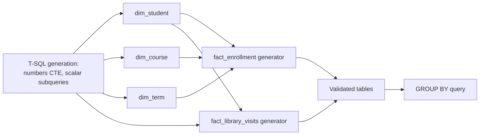

# Lab 01: Generating and Validating Synthetic University Data in T-SQL

## Objectives

- **Part 1:** Generate synthetic student, course, and term dimension data directly in T-SQL
- **Part 2:** Generate the enrollment and library-visit fact tables from those dimensions
- **Part 3:** Assess the generated data for the kind of mess a real export would have
- **Part 4:** Answer a first real question with a GROUP BY aggregate query

## Background / Scenario

State University wants a Power BI report on course completion and library
usage by program. There's no real dataset to pull this from, and there
shouldn't be one for a training exercise: student records at this grain
(student ID, course, grade, enrollment date) are the kind of data FERPA
exists to protect in the US, and the UK/EU equivalent isn't any looser.
Nobody's downloading that, real or fake-but-identifiable, into a personal
project.

So this lab starts differently from the rest of this series: instead of
loading a file, the data is generated from scratch directly in SQL Server,
using a numbers table and set-based T-SQL to produce realistic-looking,
entirely synthetic records. No real student, course, or institution appears
anywhere in it.

## Required Resources

- SQL Server (Developer or Express edition, free) and SQL Server Management
  Studio (SSMS). These are two separate downloads: SQL Server is the engine,
  a background service that stores and runs queries against your data; SSMS
  is the client application you type queries into. Installing one without
  the other is a common first-timer mixup, and SSMS on its own has nothing
  to connect to.
- No internet access needed beyond the two installers above: once SQL
  Server is running, everything in this lab is generated locally, nothing
  is downloaded.
- Approximately 2 hours

## Topology



---

## Part 1: Generate the Dimension Tables

### Step 1: Create the database

Open SSMS, connect to your local instance, and run:

```sql
CREATE DATABASE UniversityLab;
GO
USE UniversityLab;
GO
```

### Step 2: Decide what a student record needs, and what it must never need

Before writing a single `CREATE TABLE`, note that `dim_student` will hold
`student_id`, `program`, and `year_of_study`. That's it. No name, no date of
birth, no email, no contact detail of any kind.

> **This is a design decision, not a shortcut.** A real student information
> system has all of that, locked down under FERPA or UK GDPR with a named
> data controller. A training repo has no controller, no consent, no
> retention policy, and no business holding any of it. Leaving PII columns
> out entirely means there's no field to accidentally leak in a screenshot,
> a shared `.bak` file, or a GitHub commit. If a later lab seems to need a
> name to make a visual look realistic, the fix is a generic label like
> `Student 00412`, not a real-sounding one.

### Step 3: Build a numbers table

Every generated table in this lab needs a row-counting mechanism. Build it
once, reuse it everywhere:

```sql
CREATE TABLE dbo.Numbers (n INT PRIMARY KEY);
GO

WITH Seq AS (
    SELECT 1 AS n
    UNION ALL
    SELECT n + 1 FROM Seq WHERE n < 15000
)
INSERT INTO dbo.Numbers (n)
SELECT n FROM Seq
OPTION (MAXRECURSION 0);
GO
```

<details>
<summary>Hint</summary>

`OPTION (MAXRECURSION 0)` removes the recursive CTE's default cap of 100
levels. Without it, this statement fails partway to 15,000 with a recursion
limit error, not a row-count error, which is easy to misread as something
wrong with the data itself.

</details>

> **A numbers table beats a loop.** `WHILE` loops inserting one row at a
> time run 15,000 round trips through the query engine. The recursive CTE
> above builds the whole sequence in one set-based statement, and every
> generator in this lab joins against `dbo.Numbers` instead of looping,
> which is both faster and the idiomatic T-SQL pattern for this kind of
> problem.

### Step 4: Generate dim_student

```sql
CREATE TABLE dbo.dim_student (
    student_id      CHAR(6)      PRIMARY KEY,
    program         VARCHAR(30)  NOT NULL,
    year_of_study   TINYINT      NOT NULL
);
GO

WITH Programs AS (
    SELECT * FROM (VALUES
        (1, 'Computer Science'), (2, 'Biology'), (3, 'Business'),
        (4, 'Nursing'), (5, 'History'), (6, 'Mechanical Engineering')
    ) AS p(slot, program_name)
)
INSERT INTO dbo.dim_student (student_id, program, year_of_study)
SELECT
    'S' + RIGHT('00000' + CAST(n AS VARCHAR(5)), 5),
    (SELECT program_name FROM Programs WHERE slot = ((ABS(CHECKSUM(NEWID())) % 6) + 1)),
    (ABS(CHECKSUM(NEWID())) % 4) + 1
FROM dbo.Numbers
WHERE n <= 3000;
GO
```

<details>
<summary>Hint</summary>

`CHECKSUM(NEWID())` is the T-SQL equivalent of Excel's `RANDBETWEEN`: `NEWID()`
generates a fresh random GUID per row, `CHECKSUM` turns it into an integer,
`ABS(...) % 6` maps it onto 0 through 5, and `+ 1` shifts that onto the
1-6 range the `Programs` lookup expects. This pattern repeats for every
random draw in this lab, only the modulus changes.

</details>

<details>
<summary>Expected result, Part 1 (dim_student)</summary>

`SELECT COUNT(*) FROM dbo.dim_student;` returns exactly 3000.
`SELECT MIN(student_id), MAX(student_id) FROM dbo.dim_student;` returns
`S00001` and `S03000` with no gaps, since `student_id` is derived directly
from `dbo.Numbers` rather than drawn randomly.

</details>

### Step 5: Generate dim_course

```sql
CREATE TABLE dbo.dim_course (
    course_id    CHAR(4)      PRIMARY KEY,
    course_name  VARCHAR(40)  NOT NULL,
    credits      TINYINT      NOT NULL,
    department   VARCHAR(30)  NOT NULL
);
GO

WITH CourseNames AS (
    SELECT * FROM (VALUES
        (1, 'Intro Programming'), (2, 'Data Structures'), (3, 'Cell Biology'),
        (4, 'Organic Chemistry'), (5, 'Financial Accounting'),
        (6, 'Marketing Principles'), (7, 'Fundamentals of Nursing'),
        (8, 'Anatomy & Physiology'), (9, 'Modern World History'),
        (10, 'Thermodynamics')
    ) AS c(slot, course_name)
),
Departments AS (
    SELECT * FROM (VALUES
        (1, 'Computer Science'), (2, 'Biology'), (3, 'Business'),
        (4, 'Nursing'), (5, 'History'), (6, 'Mechanical Engineering')
    ) AS d(slot, department_name)
),
Credits AS (
    SELECT * FROM (VALUES (1, 3), (2, 4), (3, 5)) AS cr(slot, credit_value)
)
INSERT INTO dbo.dim_course (course_id, course_name, credits, department)
SELECT
    'C' + RIGHT('000' + CAST(n AS VARCHAR(3)), 3),
    (SELECT course_name FROM CourseNames WHERE slot = ((ABS(CHECKSUM(NEWID())) % 10) + 1)),
    (SELECT credit_value FROM Credits WHERE slot = ((ABS(CHECKSUM(NEWID())) % 3) + 1)),
    (SELECT department_name FROM Departments WHERE slot = ((ABS(CHECKSUM(NEWID())) % 6) + 1))
FROM dbo.Numbers
WHERE n <= 150;
GO
```

### Step 6: Generate dim_term

```sql
CREATE TABLE dbo.dim_term (
    term_id     CHAR(2)   PRIMARY KEY,
    term_name   VARCHAR(20) NOT NULL,
    start_date  DATE      NOT NULL,
    end_date    DATE      NOT NULL
);
GO

INSERT INTO dbo.dim_term (term_id, term_name, start_date, end_date) VALUES
('T1', 'Fall 2024',   '2024-09-02', '2024-12-13'),
('T2', 'Spring 2025', '2025-01-13', '2025-05-02'),
('T3', 'Fall 2025',   '2025-09-02', '2025-12-12');
GO
```

Only three rows, typed directly rather than generated: there's no benefit
to randomising something this small.

<details>
<summary>Expected result, Part 1 (dim_course, dim_term)</summary>

`dim_course` has exactly 150 rows, `course_id` running C001 through C150
with no gaps. `dim_term` has exactly 3 rows. Running
`SELECT DISTINCT program FROM dbo.dim_student;` returns exactly 6 distinct
values, not fewer: a result with 4 or 5 distinct programs at 3,000 rows
would suggest the modulus in Step 4 doesn't match the `Programs` CTE's
row count.

</details>

---

## Part 2: Generate the Fact Tables

### Step 1: Generate fact_enrollment

This is the big one, roughly 15,000 rows: each row is one student taking
one course in one term.

```sql
CREATE TABLE dbo.fact_enrollment (
    enrollment_id       CHAR(7)      PRIMARY KEY,
    student_id           CHAR(6)      NOT NULL REFERENCES dbo.dim_student(student_id),
    course_id            CHAR(4)      NOT NULL REFERENCES dbo.dim_course(course_id),
    term_id               CHAR(2)      NOT NULL REFERENCES dbo.dim_term(term_id),
    enrollment_date       DATE         NOT NULL,
    grade                 VARCHAR(2)   NOT NULL,
    completion_status     VARCHAR(15)  NOT NULL
);
GO

WITH Terms AS (
    SELECT * FROM (VALUES (1, 'T1'), (2, 'T2'), (3, 'T3')) AS t(slot, term_code)
),
Grades AS (
    SELECT * FROM (VALUES
        (1, 'A'), (2, 'B'), (3, 'C'), (4, 'D'), (5, 'F'), (6, 'W'), (7, 'IP')
    ) AS g(slot, grade_value)
),
Generated AS (
    SELECT
        'E' + RIGHT('000000' + CAST(n AS VARCHAR(6)), 6) AS enrollment_id,
        'S' + RIGHT('00000' + CAST(((ABS(CHECKSUM(NEWID())) % 3000) + 1) AS VARCHAR(5)), 5) AS student_id,
        'C' + RIGHT('000' + CAST(((ABS(CHECKSUM(NEWID())) % 150) + 1) AS VARCHAR(3)), 3) AS course_id,
        (SELECT term_code FROM Terms WHERE slot = ((ABS(CHECKSUM(NEWID())) % 3) + 1)) AS term_id,
        DATEADD(DAY, ABS(CHECKSUM(NEWID())) % 386, '2024-08-20') AS enrollment_date,
        (SELECT grade_value FROM Grades WHERE slot = ((ABS(CHECKSUM(NEWID())) % 7) + 1)) AS grade
    FROM dbo.Numbers
    WHERE n <= 15000
)
INSERT INTO dbo.fact_enrollment
    (enrollment_id, student_id, course_id, term_id, enrollment_date, grade, completion_status)
SELECT
    enrollment_id, student_id, course_id, term_id, enrollment_date, grade,
    CASE WHEN grade IN ('W', 'IP') THEN 'Not Completed' ELSE 'Completed' END
FROM Generated;
GO
```

<details>
<summary>Hint</summary>

`enrollment_id` pads to six digits where `dim_student` and `dim_course`
used five and three. Match the zero-padding width to the row count so IDs
sort and display consistently at 15,000 rows. `DATEADD(DAY, ABS(CHECKSUM(NEWID())) % 386, '2024-08-20')`
is the range-bound date equivalent of Excel's `RANDBETWEEN(DATE(...), DATE(...))`:
386 is the day span between 2024-08-20 and 2025-09-10, so the offset can
never land past the intended window.

</details>

> **Random join keys are what make this realistic, and what creates the
> problem Part 3 has to surface.** Two independent random draws can land on
> the same `student_id` + `course_id` + `term_id` combination more than
> once by chance, across 15,000 rows drawn from 3,000 students and 150
> courses. A real registrar's system would reject a student enrolling in
> the same course section twice in the same term. This generator doesn't
> know that rule, so it won't enforce it, which is exactly the kind of
> grain problem a real SIS export produces for a different reason (a
> retried sync, a duplicate upload) but that shows up identically in the
> data: more than one fact row per key that should be unique.

### Step 2: Generate fact_library_visits

Roughly 8,000 rows.

```sql
CREATE TABLE dbo.fact_library_visits (
    visit_id          CHAR(7)      PRIMARY KEY,
    student_id         CHAR(6)      NOT NULL REFERENCES dbo.dim_student(student_id),
    resource_id         CHAR(4)      NOT NULL,
    checkout_date       DATE         NOT NULL,
    return_date         DATE         NOT NULL,
    campus_location      VARCHAR(30)  NOT NULL
);
GO

WITH Locations AS (
    SELECT * FROM (VALUES
        (1, 'Main Library'), (2, 'Science Annex'), (3, 'Health Sciences Library')
    ) AS l(slot, location_name)
),
Generated AS (
    SELECT
        'L' + RIGHT('000000' + CAST(n AS VARCHAR(6)), 6) AS visit_id,
        'S' + RIGHT('00000' + CAST(((ABS(CHECKSUM(NEWID())) % 3000) + 1) AS VARCHAR(5)), 5) AS student_id,
        'R' + RIGHT('000' + CAST(((ABS(CHECKSUM(NEWID())) % 400) + 1) AS VARCHAR(3)), 3) AS resource_id,
        DATEADD(DAY, ABS(CHECKSUM(NEWID())) % 386, '2024-08-20') AS checkout_date,
        (ABS(CHECKSUM(NEWID())) % 21) + 1 AS loan_days,
        (SELECT location_name FROM Locations WHERE slot = ((ABS(CHECKSUM(NEWID())) % 3) + 1)) AS campus_location
    FROM dbo.Numbers
    WHERE n <= 8000
)
INSERT INTO dbo.fact_library_visits
    (visit_id, student_id, resource_id, checkout_date, return_date, campus_location)
SELECT
    visit_id, student_id, resource_id, checkout_date,
    DATEADD(DAY, loan_days, checkout_date), campus_location
FROM Generated;
GO
```

<details>
<summary>Hint</summary>

`resource_id` should draw from `% 400`, not from whatever modulus you used
for `course_id` in the previous step. It's an easy expression to copy-paste
across generators and forget to adjust the upper bound on.

</details>

<details>
<summary>Expected result, Part 2</summary>

`SELECT COUNT(*) FROM dbo.fact_enrollment;` returns 15000.
`SELECT COUNT(*) FROM dbo.fact_library_visits;` returns 8000.
`SELECT COUNT(*) FROM dbo.fact_library_visits WHERE return_date <= checkout_date;`
returns 0: `return_date` is always after `checkout_date` by 1 to 21 days,
never equal or earlier.
`SELECT COUNT(DISTINCT resource_id) FROM dbo.fact_library_visits;` should
land close to 400, not a suspiciously round number like 150.

</details>

---

## Part 3: Assess and Validate

### Step 1: Check for the duplicate enrollment problem

```sql
SELECT student_id, course_id, term_id, COUNT(*) AS row_count
FROM dbo.fact_enrollment
GROUP BY student_id, course_id, term_id
HAVING COUNT(*) > 1
ORDER BY row_count DESC;
```

<details>
<summary>Hint</summary>

`HAVING` filters on the aggregate (`COUNT(*)`), which `WHERE` can't do,
since `WHERE` runs before the grouping happens. A `WHERE COUNT(*) > 1`
version of this query fails to parse, not silently returns the wrong
rows, which at least makes the mistake obvious.

</details>

**Expected result:** a small but real number of students showing up twice
for the same course in the same term, a handful out of 15,000 rows, not
zero.

> **Why check now instead of trusting Lab 02 to catch it.** A GROUP BY
> query run directly against `fact_enrollment` right now would silently
> double-count those students' completion outcomes. Finding it here, in
> T-SQL, before any DAX gets written, means the fix in Lab 02 is a
> deliberate decision about which duplicate to keep, not a mystery someone
> has to reverse engineer from a wrong-looking chart.

### Step 2: Check for out-of-range values

```sql
SELECT COUNT(*) AS bad_dates
FROM dbo.fact_enrollment
WHERE enrollment_date < '2024-08-20' OR enrollment_date > '2025-09-10';

SELECT COUNT(*) AS bad_returns
FROM dbo.fact_library_visits
WHERE return_date <= checkout_date;
```

Both should return 0. This is the T-SQL equivalent of an Excel `Data
Validation` sweep: confirming the generator's own bounds actually held,
rather than assuming they did because the `DATEADD` expression looked
right.

<details>
<summary>Expected result, Part 3 Step 1-2</summary>

The duplicate-check query from Step 1 returns roughly a few dozen rows out
of 15,000 with `row_count` greater than 1, under half a percent is
typical, zero would be suspicious given three independent random draws at
this volume. Both Step 2 queries return 0.

</details>

### Step 3: Confirm data types

`enrollment_date`, `checkout_date`, `return_date`, `start_date`, and
`end_date` were declared `DATE` at `CREATE TABLE` time, and every `_id`
column was declared `CHAR`, so there's no separate type-detection pass the
way Excel/Power Query needs one. Confirm it directly instead of assuming
the `CREATE TABLE` statements ran as written:

```sql
SELECT TABLE_NAME, COLUMN_NAME, DATA_TYPE
FROM INFORMATION_SCHEMA.COLUMNS
WHERE TABLE_SCHEMA = 'dbo'
  AND (COLUMN_NAME LIKE '%date%' OR COLUMN_NAME LIKE '%_id')
ORDER BY TABLE_NAME, COLUMN_NAME;
```

<details>
<summary>Expected result, Part 3 Step 3</summary>

Every row with `date` in the column name shows `DATA_TYPE = 'date'`. Every
row ending in `_id` shows `DATA_TYPE = 'char'`. A `varchar` or `int`
appearing here means a `CREATE TABLE` statement was edited or re-run
differently than shown above.

</details>

---

## Part 4: Answer a First Real Question

### Step 1: Which program has the highest completion rate

```sql
SELECT
    ds.program,
    COUNT(*) AS total_enrollments,
    SUM(CASE WHEN fe.completion_status = 'Completed' THEN 1 ELSE 0 END) AS completed,
    CAST(SUM(CASE WHEN fe.completion_status = 'Completed' THEN 1 ELSE 0 END) AS DECIMAL(10,4))
        / COUNT(*) AS completion_rate
FROM dbo.fact_enrollment fe
JOIN dbo.dim_student ds ON ds.student_id = fe.student_id
GROUP BY ds.program
ORDER BY completion_rate DESC;
```

<details>
<summary>Hint</summary>

`CAST(... AS DECIMAL(10,4))` on the numerator before the division matters:
without it, SQL Server performs integer division on two `INT` operands and
`completion_rate` comes back as a column of zeros and ones instead of a
proportion.

</details>

**Expected result:** completion rate varies by a few percentage points
across programs, not dramatic, but visible, and worth re-running once Lab
02's duplicate fix changes the underlying counts slightly.

<details>
<summary>Expected result, Part 4</summary>

Six rows, one per program, each with `completion_rate` somewhere in the
0.60-0.90 range (grades A through D count as completed, W and IP don't,
drawn uniformly across 7 grade options so roughly 5/7 of rows complete
before any per-program variation). No program should show exactly 1.0 or
0.0: either would mean the JOIN or the CASE expression went wrong, not a
genuine result.

</details>

---

## Troubleshooting

| Symptom | Cause | Fix |
|---|---|---|
| `dbo.Numbers` insert fails partway with a recursion error | `OPTION (MAXRECURSION 0)` omitted | Re-run Part 1 Step 3 with the option clause included |
| `fact_enrollment` insert fails with a foreign key violation | `dim_student` or `dim_course` generated with a different row count than the modulus used in the fact generator | Confirm `% 3000` and `% 150` match the actual row counts from Part 1 |
| Completion rate query returns all zeros or all ones | Integer division: numerator not cast to `DECIMAL` before dividing | Re-check Part 4 Step 1's `CAST` wraps the `SUM`, not the whole expression |
| `HAVING COUNT(*) > 1` in Part 3 Step 1 returns every row | `GROUP BY` list missing a column, collapsing unrelated rows together | Confirm all three columns (`student_id`, `course_id`, `term_id`) are in the `GROUP BY` |

---

## Reflection

1. How many duplicate student/course/term combinations did the generator
   produce, and as a fraction of 15,000 rows, does it matter?
2. Why does leaving out name, date of birth, and email from `dim_student`
   cost nothing for this lab's actual questions?
3. The `grade` and `program` values are drawn from a uniform distribution:
   every option equally likely. What would change about the completion-rate
   answer if a real registrar's grade distribution were used instead?

---

## What Went Wrong When I Did This

- **Ran the `dbo.Numbers` recursive CTE without `MAXRECURSION 0` first**,
  since the default cap of 100 is easy to forget about coming from Excel's
  fill-down, which has no equivalent limit. It failed at row 101 with an
  error that (correctly) blamed recursion depth, not row count, which at
  least made the fix obvious once I read the message properly instead of
  assuming the whole approach was wrong.
- **Generated `fact_enrollment` before confirming `dim_student` actually
  held 3,000 rows.** An earlier run of Part 1 Step 4 had been interrupted
  partway (a dropped SSMS connection), leaving only around 1,800 rows in
  `dim_student`, but the fact generator's `% 3000` modulus still assumed
  3,000 existed. The foreign key constraint caught it immediately as an
  insert failure, which is a real advantage T-SQL has here: Excel's
  `RANDBETWEEN` would have silently generated `student_id` values with
  nothing to match, and nothing would have complained until a much later
  join came up short.
- **Generated `enrollment_date` with a `DATEADD` day offset that ran past
  what I'd intended**, because I'd copied the 386-day span from the
  enrollment date range and reused it unchanged for a different date
  window in an early draft of the library-visits generator, before
  correcting it to match `fact_library_visits`'s own intended range.
  Caught it with the Part 3 Step 2 out-of-range check, which is exactly
  why that query exists as a separate step instead of trusting the
  `DATEADD` expression by eye.

---

## Where This Breaks

- Duplicate student/course/term rows are flagged but not fixed; they're
  still in the table
- Every new question is a new ad hoc query with no shared, reusable
  calculation
- `program` only reaches an enrollment question through a manually
  written JOIN that has to be retyped for every new query

**Next:** [Lab 02: Building a Power BI Data Model](02-data-model.md)
