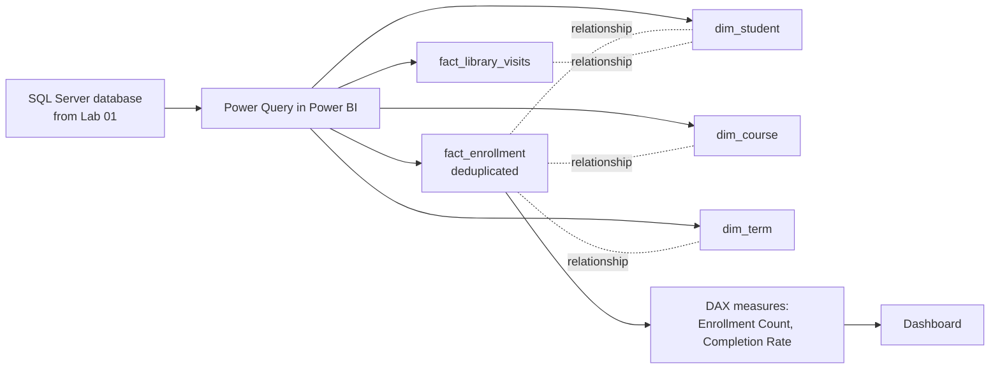

# Lab 02: Building a Power BI Data Model

## Objectives

- **Part 1:** Import the Lab 01 database into Power BI and build a star schema
- **Part 2:** Resolve the duplicate-enrollment problem found in Lab 01
- **Part 3:** Write DAX measures for enrollment counts and completion rate
- **Part 4:** Build a dashboard answering the Lab 01 question properly
- **Part 5:** Validate against the Lab 01 query

## Background / Scenario

Lab 01 answered "which program has the highest completion rate" with a
GROUP BY query, and flagged, without fixing, a real problem: some students
appear more than once for the same course in the same term. Left alone,
that inflates whichever program those duplicates happen to fall in.

Power BI fixes the maintenance problem (a measure defines the calculation
once, correct in any context) but not the duplicate problem by itself:
that needs a deliberate modelling decision, made here.

## Required Resources

- Power BI Desktop (free, Windows)
- The `UniversityLab` database from Lab 01, running in SQL Server, containing
  `fact_enrollment`, `fact_library_visits`, `dim_student`, `dim_course`,
  `dim_term`
- Approximately 2.5 hours

## Topology



---

## Part 1: Build the Star Schema

### Step 1: Load all five tables

**Get Data → SQL Server** → enter the server name and `UniversityLab` as
the database → **Import** mode → tick `fact_enrollment`,
`fact_library_visits`, `dim_student`, `dim_course`, `dim_term` →
**Transform Data**.

### Step 2: Rename and confirm column types

Power BI re-guesses types on import, independent of whatever was declared
in the `CREATE TABLE` statements. Re-check `enrollment_date`,
`checkout_date`, `return_date` are Date, not Text. A Text-typed date column
will still display fine in a table visual and then fail silently the
moment a relationship or a time intelligence function needs it.

<details>
<summary>Hint</summary>

The column type icon sits to the left of each column header in the Power
Query editor. Text shows "ABC", Date shows a calendar icon. Click the
icon to change it rather than trusting what Power BI guessed on import.

</details>

### Step 3: Confirm dim_term is small and typed correctly

Three rows, `start_date` and `end_date` as Date. This table matters more
than its size suggests: Lab 04 builds term-based comparisons directly off
it.

### Step 4: Close and apply

**Home → Close & Apply**.

<details>
<summary>Expected result, Part 1</summary>

Model view shows five tables with no relationships drawn yet (Power BI may
auto-detect one or two on `student_id`; leave those, they'll be confirmed
in Part 2). Every date column across all five tables shows a calendar
icon, not "ABC".

</details>

---

## Part 2: Resolve the Duplicate-Enrollment Problem

### Step 1: Confirm the duplicate in Power BI

**Model view** → try relating `fact_enrollment[student_id]` to
`dim_student[student_id]`. This relationship is fine on its own, since
`dim_student` is genuinely one row per student. The problem isn't the
relationship; it's that `fact_enrollment` itself has more than one row for
some student/course/term combinations, something no relationship catches.

Confirm it the same way Lab 01 did: a quick measure,

```dax
Duplicate Enrollment Check =
VAR EnrollmentsByKey =
    SUMMARIZE(
        fact_enrollment,
        fact_enrollment[student_id],
        fact_enrollment[course_id],
        fact_enrollment[term_id],
        "RowCount", COUNTROWS( fact_enrollment )
    )
RETURN
    COUNTROWS( FILTER( EnrollmentsByKey, [RowCount] > 1 ) )
```

Drop it on a card visual.

<details>
<summary>Expected result</summary>

A nonzero count, roughly matching what Lab 01 Part 3 found (a few dozen
combinations out of 15,000 rows). It won't be identical, since this
SUMMARIZE groups on the exact three-column key rather than Lab 01's
GROUP BY / HAVING query, but the order of magnitude should agree.

</details>

### Step 2: Decide what a duplicate actually means here

Two students genuinely re-enrolling in the same course in different terms
is normal: a retake after a fail or withdrawal. The problem is only a
row appearing more than once for the *same* student, course, **and**
term. That's not a retake, it's the same enrollment event counted twice.

> **The fix is not "remove all duplicates on student+course."** That would
> also delete legitimate retakes, which is a different and valid pattern in
> university data (someone fails a course, retakes it a year later: two
> real rows, two real terms). The grain that must be unique is
> student + course + **term**. Getting the grain wrong here either hides a
> real problem (too loose) or deletes real history (too strict).

### Step 3: Deduplicate in Power Query, not in DAX

Apply the same fix Lab 01's Troubleshooting table pointed at but didn't
require you to do yet: back in Power Query, on `fact_enrollment`, remove
duplicates keyed on the three columns that define a genuine enrollment
event, not the whole row, and not `student_id` alone.

<details>
<summary>Hint</summary>

Select all three key columns before choosing **Remove Rows → Remove
Duplicates**: click `student_id`, then Ctrl+click `course_id` and
`term_id`. Selecting just one column, or the whole table, produces a
different and wrong result (see Part 2 Step 2 above).

</details>

> **Why Power Query and not a DAX filter.** A DAX measure that works around
> duplicate rows has to remember to do so in every measure that touches
> `fact_enrollment`, forever. Removing the duplicate rows once, at the
> source, means every measure written after this point is correct by
> default instead of correct by discipline. This is the same lesson as the
> coffee shop series' compound key, applied to row grain instead of a join
> key.

### Step 4: Re-run the check

Re-open the report, refresh. `Duplicate Enrollment Check` should now read
0.

<details>
<summary>Expected result, Part 2</summary>

`Duplicate Enrollment Check` reads exactly 0. `fact_enrollment`'s row count
in Power Query's status bar has dropped from 15,000 by roughly the same
handful of rows Lab 01 flagged: a drop of a few dozen rows, not hundreds,
and not zero.

</details>

---

## Part 3: Write the Measures

### Step 1: Enrollment Count

```dax
Enrollment Count = COUNTROWS( fact_enrollment )
```

### Step 2: Completion Rate, the measure Lab 01 couldn't produce cleanly

```dax
Completion Rate =
DIVIDE(
    CALCULATE( [Enrollment Count], fact_enrollment[completion_status] = "Completed" ),
    [Enrollment Count]
)
```

### Step 3: Understand what this measure does in context

| Piece | What it does |
|---|---|
| `[Enrollment Count]` in the denominator | Every enrollment in the current filter context: whichever program, term, or course the visual is showing |
| `CALCULATE(..., completion_status = "Completed")` | Overrides just the completion filter, keeping program/term/course from the visual intact |
| `DIVIDE` | Returns blank instead of erroring if a filtered cell has zero enrollments: a program with no rows in a given term shouldn't show a divide-by-zero error |

> **This is the same shape as Lab 01's gap.** A T-SQL query's `CAST`-and-
> divide expression has to be rewritten for every new breakdown. This
> measure recalculates correctly whether it's sliced by program, by term,
> by both, or by neither, no redefinition needed.

### Step 4: Format as a percentage

Select `Completion Rate` → **Measure tools → Format → Percentage**, 1
decimal place.

<details>
<summary>Expected result, Part 3</summary>

`Enrollment Count` on a card reads a number close to but slightly under
15,000 (the deduplicated total from Part 2). `Completion Rate` on a card
with no filters reads somewhere in the 65-85% range, displayed as a
percentage like "71.4%", not a raw decimal like "0.714".

</details>

---

## Part 4: Build the Dashboard

### Step 1: Add visuals answering the Lab 01 question

| Visual | Fields | Answers |
|---|---|---|
| Bar chart | `dim_student[program]`, value `Completion Rate` | Which program has the highest completion rate |
| Matrix | Rows `dim_student[program]`, columns `dim_term[term_name]`, value `Completion Rate` | Is the answer consistent term over term, or does one term skew it |
| Slicer | `dim_term[term_name]` | (none) |

### Step 2: Read the matrix

**Expected result:** completion rate by program is now a direct read, and
the matrix's per-term breakdown shows whether Lab 01's answer holds up
across all three terms or was driven by one of them.

<details>
<summary>Expected result, Part 4</summary>

The bar chart shows six bars, one per program, each between roughly 65%
and 85%, sorted highest to lowest. The matrix shows the same six programs
against three term columns. At 15,000 rows spread across 6 programs and
3 terms, every cell should have enough enrollments to show a real rate; a
blank cell here is possible but unlikely, and worth a second look rather
than an automatic assumption of a bug. No cell should read exactly 0% or
100%.

</details>

---

## Part 5: Validate Against Lab 01

### Step 1: Cross-check the completion rate number

Pick one program. Confirm `Completion Rate` in the matrix, summed across
all three terms, is close to the Lab 01 query's calculated number for that
program, not necessarily identical, since Lab 01's number still included
the duplicate rows.

**Troubleshooting:** if the two numbers differ by more than the expected
duplicate-row effect, re-check that Part 2 Step 3 ran against the full
`fact_enrollment` table and not a filtered subset.

<details>
<summary>Expected result, Part 5</summary>

The chosen program's Power BI completion rate and the Lab 01 query's
calculated rate should sit within a percentage point or two of each
other. A gap wider than that points at a real discrepancy, not rounding:
check the Troubleshooting entry above before assuming it's fine.

</details>

---

## Troubleshooting

| Symptom | Cause | Fix |
|---|---|---|
| Completion Rate is identical across every program | DIVIDE denominator not affected by the program filter | Confirm `[Enrollment Count]` has no CALCULATE wrapping that strips the program context |
| Duplicate Enrollment Check still nonzero after Part 2 | Remove Duplicates run on the wrong query, or run before the merge that added program | Re-run Part 2 Step 3 directly on `fact_enrollment`, confirm via Applied Steps that it's the last step before Close & Apply |
| Relationship to dim_student shows a warning icon | student_id typed inconsistently (Text in one table, Whole Number in the other) | Re-check Part 1 Step 2 on both tables |
| Get Data → SQL Server fails to connect | Server name incorrect, or SQL Server service not running | Confirm the SQL Server service is running in SQL Server Configuration Manager, and that the server name matches what SSMS used to connect in Lab 01 |

---

## Reflection

1. Why does deduplicating on student + course + term preserve legitimate
   retakes, while deduplicating on student + course alone would not?
2. What would `Completion Rate` show for a program/term combination with
   zero enrollments, and why is that the right behaviour rather than an
   error?
3. If a student's `completion_status` were miscoded as blank instead of
   "Completed" or "Not Completed", how would that show up in this measure,
   and would you notice?

---

## What Went Wrong When I Did This

- **Ran Remove Duplicates on `student_id` alone first**, copying the
  instinct from a table where the entity itself needs to be unique. It
  deleted every enrollment past a student's first, including legitimate
  different-course and different-term rows. Reverted the query step and
  redid it on the correct three-column key.
- **Wrote `Completion Rate`'s CALCULATE with a hardcoded program filter**
  while testing (`CALCULATE([Enrollment Count], completion_status =
  "Completed", program = "Nursing")`) to check the number against Lab 01's
  Nursing figure, then forgot to remove the hardcoded program filter before
  building the bar chart. Every bar showed the same Nursing number until I
  caught it by comparing bars that should obviously have differed.
- **Deduplicated after building the program merge**, not before. Power
  Query's Applied Steps had Remove Duplicates listed above the merge step,
  so it ran against a version of the table that didn't have `program`
  attached yet, which was harmless here but meant the step order didn't
  match my mental model of what happened when. Reordered the steps to
  dedupe first, merge second.

---

## Where This Breaks

- The model works for one SQL Server connection, refreshed by hand
- Completion Rate is correct but there's no view of how it moves from one
  term to the next: a single term-level number, not a trend
- Nothing in the dashboard yet connects to library usage, despite that
  being one of the two source questions

**Next:** [Lab 03: Interactive Program Dashboard](03-dashboard.md)
