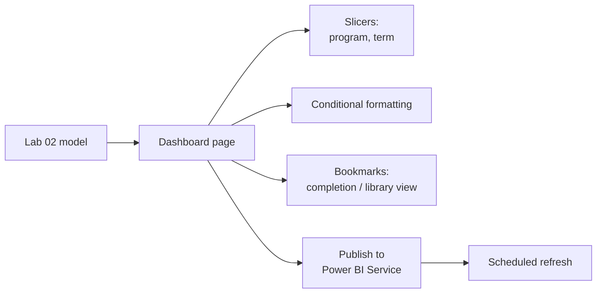

# Lab 03: Interactive Program Dashboard

## Objectives

- **Part 1:** Design a dashboard page around one decision, not a wall of charts
- **Part 2:** Overlay library usage onto the completion picture with cross-filtering slicers and a bookmark toggle
- **Part 3:** Apply conditional formatting to surface programs that need attention
- **Part 4:** Publish to Power BI Service and set a scheduled refresh

## Background / Scenario

Lab 02 built the data model and two visuals answering one question:
completion rate by program, by term. A dashboard has a different job: it
has to work for whoever opens it without knowing in advance which program
they care about, and it has to bring in the second dataset, library usage,
that's been sitting unused since Lab 01.

## Required Resources

- Power BI Desktop
- The `.pbix` file from Lab 02
- A free Power BI Service account (Microsoft 365 email works, or a free
  Fabric trial) for Part 4
- Approximately 3 hours

## Topology



---

## Part 1: Design Around One Decision

### Step 1: Write down the decision before building anything

A program coordinator opening this dashboard needs to answer one thing:
*is my program's completion rate falling behind the others, and is low
library engagement part of the picture?* Everything on the page should
serve that, not just "show all the numbers we have."

### Step 2: Build the core visual

Add a bar chart: axis `dim_student[program]`, values `[Completion Rate]`,
sorted descending.

### Step 3: Add a reference line

**Format the visual → Analytics → Average line.**

> **A single bar is not a signal; a comparison is.** "68% completion" means
> nothing by itself. "68% against an 81% average across programs" is the
> actual answer to the question Part 1 Step 1 asked.

<details>
<summary>Expected result, Part 1</summary>

Six bars, sorted descending, matching the Lab 02 numbers. The average line
sits somewhere in the middle of the range rather than near the top or
bottom. If every bar is on the same side of the line, sorting or the
average calculation is off.

</details>

---

## Part 2: Bring in Library Usage

### Step 1: Relate fact_library_visits to the model

Confirm in **Model view** that `fact_library_visits[student_id]` relates to
`dim_student[student_id]`, many-to-one, single direction. `dim_student` is
the only table that connects both facts: there's no direct relationship
between `fact_enrollment` and `fact_library_visits`, and there shouldn't
be one.

> **Two fact tables sharing one dimension, not joined to each other, is the
> normal shape of a star schema.** `fact_enrollment` and
> `fact_library_visits` are both "one row per event," at different grains,
> about different things. Trying to relate them directly would force a
> grain neither table actually has. `dim_student` is what lets a visual
> show both at once: one measure filtered by program (which lives on
> `dim_student`), reading from each fact table independently.

### Step 2: Write a library usage measure

```dax
Library Visits = COUNTROWS( fact_library_visits )
```

```dax
Avg Visits Per Student =
DIVIDE( [Library Visits], DISTINCTCOUNT( fact_library_visits[student_id] ) )
```

### Step 3: Add cross-filtering slicers

Add slicers for `dim_student[program]` and `dim_term[term_name]`. Confirm
**Format → Edit interactions** leaves cross-filtering on between the bar
chart, a new `Avg Visits Per Student` card, and both slicers.

<details>
<summary>Hint</summary>

**Edit interactions** appears on the ribbon only while a visual is
selected. Select the bar chart first, then the icons above each other
visual let you toggle filter/highlight/none per pair. Default is usually
already correct; the point of this step is confirming it, not necessarily
changing it.

</details>

### Step 4: Build two views with bookmarks

Using the same bookmark mechanism from the coffee shop series, build two
layouts on this page: one where the completion chart dominates and the
library card is small, one where it's reversed. Capture each as a
bookmark named `Completion Focus` and `Library Focus`.

<details>
<summary>Hint</summary>

Resize and reposition the visuals first for each layout, then **View →
Bookmarks → Add** captures whatever state is currently on screen. Order
matters: the bookmark doesn't retroactively remember a layout you had
before adding it.

</details>

### Step 5: Add buttons that apply each bookmark

**Insert → Buttons → Blank**, two buttons labelled "Completion" and
"Library". **Format → Action → Bookmark**, assign each button its
bookmark.

> **A bookmark captures visual state, not data.** Switching between the two
> views doesn't requery anything: it's the same model, laid out two ways.
> That's why it's instant, unlike a slicer change on a larger model, which
> does requery.

<details>
<summary>Expected result, Part 2</summary>

Clicking "Completion" shows the completion-focused layout, clicking
"Library" shows the library-focused layout, with no visible flicker or
requery delay. `Avg Visits Per Student` lands somewhere in the 1.5-4 range
per student across the whole dataset. A number under 1 or over 10 usually
means the DISTINCTCOUNT is running against the wrong table.

</details>

---

## Part 3: Conditional Formatting

### Step 1: Format the program bar chart by threshold

Apply the same idea Lab 02's Analytics average line showed you, but as a
color rule instead of a line: on the bar chart, set `Completion Rate`
conditional formatting so a program noticeably behind the group average
stands out at a glance, with a harder threshold for one that's badly
behind.

<details>
<summary>Hint</summary>

**Conditional formatting → Background color**, then **Format style: Rules**
rather than a gradient. A threshold-based read ("is this program behind")
needs discrete bands, not a smooth color scale. Two rules is enough: one
amber band under roughly 90% of average, one red band under roughly 75%.

</details>

### Step 2: Confirm it responds to filters

Apply the term slicer to a single term. Watch the bands shift as the
underlying average recalculates for that term alone.

**Expected result:** the formatting is relative to whatever's currently
filtered, not a fixed number. A program that's normally fine could
correctly show red in a term where every program had a rough run, because
the comparison is against that term's average, not a hardcoded target.

<details>
<summary>Expected result, Part 3</summary>

With no term filter applied, at least one bar shows amber or red (six
programs drawn from independent random data will rarely cluster tightly
enough for every bar to stay green). Switching the term slicer changes
which bars are colored, not just their exact color. A program that was
red overall can turn green filtered to a single term where it happened to
do better.

</details>

---

## Part 4: Publish and Schedule Refresh

### Step 1: Publish

**Home → Publish** → sign in → choose your workspace (My Workspace is
fine for a personal account).

### Step 2: Set up scheduled refresh

In Power BI Service, dataset settings → **Scheduled refresh**. Since the
source is an on-premises SQL Server database, this needs the **On-premises
data gateway** (free download, installed on the same machine as SQL
Server, or any machine that can reach it).

> **Publishing shares the report; it does not keep the data current.** A
> database source on your own machine means either a gateway running
> permanently, or someone remembering to re-publish. For synthetic training
> data this doesn't matter, but for a real coordinator's dashboard it's the
> difference between "current as of this morning" and "current as of
> whenever someone last remembered."

### Step 3: Set gateway or acknowledge the limitation

If installing the gateway isn't practical for this lab, set refresh to
manual and say so. Stating the limitation plainly is the point here, not
a shortcut being taken quietly.

<details>
<summary>Expected result, Part 4</summary>

The report is reachable at a Power BI Service URL, visible under your
workspace's Reports list, and opens with the same visuals and bookmark
buttons as Desktop. Refresh status in dataset settings shows either a
gateway connection or "manual", not an error, and not silently blank.

</details>

---

## Troubleshooting

| Symptom | Cause | Fix |
|---|---|---|
| Library card shows the same number regardless of program slicer | fact_library_visits not related to dim_student, or relationship direction wrong | Confirm Part 2 Step 1, single-direction toward dim_student |
| Buttons don't switch views | Bookmark captured the wrong visual state | Redo Part 2 Step 4, confirm "All visuals" selected when adding the bookmark |
| Conditional formatting looks static regardless of slicer | Rule set to fixed values instead of "Format by: Field value" | Rebuild as a measure-based rule |
| Scheduled refresh fails | No gateway, SQL Server unreachable from the cloud | Install gateway, or accept manual refresh and document it |

---

## Reflection

1. Why does `Avg Visits Per Student` need `DISTINCTCOUNT` in the
   denominator instead of a straight row count of `dim_student`?
2. What would go wrong if `fact_enrollment` and `fact_library_visits` were
   related directly to each other instead of through `dim_student`?
3. Is a program coordinator's dashboard, refreshed manually or through a
   single-machine gateway, an acceptable long-term setup? What would you
   tell them?

---

## What Went Wrong When I Did This

- **Related `fact_library_visits` to `fact_enrollment` directly** on
  `student_id`, thinking it would let visits and completions cross-filter
  more tightly. Power BI allowed it, and the model then had two paths
  between some tables, which made `Avg Visits Per Student` return
  different numbers depending on which visual triggered the calculation.
  Removed that relationship and left `dim_student` as the only bridge.
- **Built the conditional formatting rule against a number typed from one
  term's data**, the same mistake as the coffee shop series' equivalent
  lab, and for the same reason: it stopped making sense the moment the
  term slicer changed. Rebuilt it as a measure-based rule.
- **Assigned the wrong bookmark to the wrong button.** "Library" opened
  the completion-focused layout and vice versa, because I built both
  bookmarks before wiring either button and mixed up the order. Caught it
  immediately by clicking each button once before moving on, which is now
  just something to always do.

---

## Where This Breaks

- Refresh depends on a gateway running on one machine, or a human
  remembering to re-publish
- The model shows completion rate and library usage side by side but has
  no way to say whether this term is better or worse than the last one:
  the reason Lab 04 exists
- Nothing prevents someone editing the underlying SQL Server tables in a
  way that silently breaks the star schema

**Next:** [Lab 04: Term-over-Term Comparison](04-time-intelligence.md)
