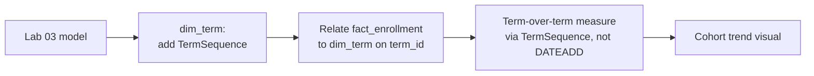

# Lab 04: Term-over-Term Comparison

## Objectives

- **Part 1:** Decide why this dataset needs term-based comparison, not calendar-date time intelligence
- **Part 2:** Build a term index and term-over-term DAX measures
- **Part 3:** Diagnose why the standard `DATEADD` pattern doesn't fit here
- **Part 4:** Build a cohort trend visual across all three terms

## Background / Scenario

Lab 03 shows completion rate and library usage per program, filterable by
term, but nothing on the dashboard says whether Fall 2025 is better or
worse than Spring 2025. The obvious move is Power BI's built-in time
intelligence (`DATEADD`, `SAMEPERIODLASTYEAR`), the same functions the
coffee shop series used in its Lab 04. Those functions assume a continuous
calendar, and a university term structure isn't one.

## Required Resources

- Power BI Desktop
- The `.pbix` file from Lab 03
- Approximately 2.5 hours

## Topology



---

## Part 1: Why Not Calendar Time Intelligence

### Step 1: Try the standard pattern and see why it doesn't fit

`DATEADD(dim_date[Date], -1, MONTH)` shifts a filter context back by a
fixed calendar unit. A university term doesn't have a fixed length:
Fall runs roughly September to December, Spring roughly January to May,
with a summer gap that has no term at all in this dataset. "One term ago"
is not "three months ago" in any of the three transitions in this data:
Fall 2024 to Spring 2025 is about a month gap, Spring 2025 to Fall 2025 is
about four months.

> **The mismatch is structural, not a data quality issue.** `DATEADD` and
> `SAMEPERIODLASTYEAR` are built for a continuous calendar where every
> month has a predictable neighbour. A term calendar is a short, deliberately
> maintained list (three rows in `dim_term`) where "previous" means "the
> row before this one in enrollment order," not "the same date last month."
> Forcing `DATEADD` to work here would mean padding `dim_term` with
> fictional weekly or monthly rows that no student ever enrolled in, which
> solves nothing and invents structure that isn't real.

### Step 2: Decide the right building block

The right comparison unit is **term sequence**, not calendar distance: term
2 compared to term 1, term 3 compared to term 2, using `dim_term`'s own
row order rather than a date function.

<details>
<summary>Hint</summary>

If you're unsure this reasoning holds, try it: compute the day gap between
`end_date` of one term and `start_date` of the next for all three
transitions in `dim_term`. If the three gaps aren't close to equal, a
fixed-unit calendar shift can't represent "one term ago" consistently.

</details>

---

## Part 2: Build the Term Sequence

### Step 1: Add a sequence column to dim_term

**Model view → dim_term → New Column**:

```dax
TermSequence = SWITCH(
    dim_term[term_id],
    "T1", 1,
    "T2", 2,
    "T3", 3
)
```

For three terms, hardcoding the mapping is the honest choice: a formula
elaborate enough to infer order from `start_date` for three rows adds
complexity a lookup table doesn't need. If a fourth term is added, add its
row here explicitly, the same reasoning as an accepted limitation in
`known-gaps.md`-style documentation, not a bug.

<details>
<summary>Expected result</summary>

Every row of `dim_term` shows a `TermSequence` value: T1 → 1, T2 → 2,
T3 → 3. No blanks: a blank means a `term_id` value in the SWITCH doesn't
exactly match what's in the table (check for stray whitespace from the
Lab 01 generated table).

</details>

### Step 2: Write the previous-term measure

Write `Completion Rate Prior Term`: a measure that finds whichever term
sequence number is currently in context, subtracts one, and recalculates
`[Completion Rate]` filtered to that prior sequence instead. It needs a
`VAR` for the current sequence, a `VAR` for the prior one, and a
`CALCULATE` wrapping a `FILTER` over `ALL( dim_term )`. The `ALL` matters,
because without it the filter can't move to a different term than the one
the visual is already showing.

<details>
<summary>Hint</summary>

`MAX( dim_term[TermSequence] )` reads the current context's term number.
`FILTER( ALL( dim_term ), dim_term[TermSequence] = PriorSeq )` is the
argument that goes inside `CALCULATE` alongside `[Completion Rate]`. The
whole expression is four lines: two VARs, then RETURN CALCULATE(...).

</details>

### Step 3: Understand what this does instead of DATEADD

| Piece | What it does |
|---|---|
| `MAX( dim_term[TermSequence] )` | Reads whichever term is currently in filter context; works whether the visual is filtered to one term or several |
| `FILTER( ALL( dim_term ), ... = PriorSeq )` | Replaces the current term filter with exactly one row: the term one sequence position earlier |
| `CALCULATE` | Re-evaluates `Completion Rate` inside that replaced context |

This is the same "shift the filter context, recalculate the measure inside
it" idea `DATEADD` uses, just driven by a small lookup table's own integer
column instead of a date function, because the underlying axis (term
sequence) isn't a calendar.

### Step 4: Term-over-term change

Write `Completion Rate Change` as the difference between the current and
prior-term measures you already have: one line, no new pattern needed.

### Step 5: Confirm against term 1

Put `Completion Rate Change` on a card, filtered to Fall 2024 (term
sequence 1).

<details>
<summary>Expected result, Part 2</summary>

`Completion Rate Change` is blank for Fall 2024: there's no prior term to
compare against, the same "first period has nothing before it" behaviour
any time-intelligence measure has, just reached a different way. For
Spring 2025 and Fall 2025 it shows a real (possibly small, possibly
negative) percentage-point difference, not blank.

</details>

---

## Part 3: Diagnose the Mismatch Directly

### Step 1: Try DATEADD anyway, on purpose

Add a test measure:

```dax
Completion Rate Prior Term (DATEADD attempt) =
CALCULATE( [Completion Rate], DATEADD( dim_term[start_date], -1, MONTH ) )
```

Put it on a card next to `Completion Rate Prior Term`, filtered to Spring
2025.

**Record what happens.** `dim_term[start_date]` isn't marked as a date
table and has only three rows spanning irregular gaps. `DATEADD` shifting
by exactly one month lands on a date that falls inside a different term
than the one actually before it, or on no term at all, depending on which
term is selected. The two measures disagree, and neither disagreement is
obviously the "wrong" one from the number alone: that's the actual
problem with using a calendar function on a non-calendar axis: it doesn't
error, it just quietly answers a different question than the one being
asked.

### Step 2: Remove the test measure

Delete `Completion Rate Prior Term (DATEADD attempt)` once the comparison
has been seen. It's a diagnostic, not something to ship on the dashboard.

### Step 3: Record the symptom

| Symptom | Likely cause |
|---|---|
| DATEADD-based measure disagrees with the TermSequence measure | DATEADD shifting by a fixed calendar unit across an irregular term gap |
| TermSequence measure blank for the first term | Correct, no prior term exists |
| TermSequence measure blank for every term | TermSequence column missing or not populated on dim_term |

<details>
<summary>Expected result, Part 3</summary>

The DATEADD attempt and the TermSequence measure disagree for at least one
term when compared side by side, sometimes by a wide margin, sometimes
returning blank where the TermSequence version returns a real number.
Neither number self-flags as wrong. After Step 2 the test measure no
longer appears in the fields list.

</details>

---

## Part 4: Cohort Trend Visual

### Step 1: Line chart across all three terms

Line chart: axis `dim_term[TermSequence]` (sorted), values
`Completion Rate`. Add `dim_student[year_of_study]` as a legend to see
whether first-years and fourth-years trend differently across terms.

### Step 2: Sort the axis correctly

Right-click the `TermSequence` field on the axis → **Sort by → term_name**
if it isn't already reading Fall 2024, Spring 2025, Fall 2025 in the
correct order. The sequence number drives comparison logic, but the axis
should still label with the readable term name.

### Step 3: Read the cohort pattern

**Expected result:** completion rate by year-of-study either holds roughly
steady across terms or shows a real trend (for instance, fourth-years
consistently completing at a higher rate than first-years). Either
outcome is a legitimate finding, since this is synthetic data with no
designed-in trend, not a result to force into a specific shape.

<details>
<summary>Expected result, Part 4</summary>

Four lines (one per year of study), each with three points, axis labelled
Fall 2024, Spring 2025, Fall 2025 in that order. Lines can cross or run
roughly flat; both are legitimate given uniformly-random source data. A
single flat horizontal line for all four years suggests the legend field
didn't actually apply.

</details>

---

## Troubleshooting

| Symptom | Cause | Fix |
|---|---|---|
| Completion Rate Prior Term errors with a circular dependency | FILTER(ALL(dim_term), ...) referencing dim_term while dim_term is also on the visual's axis, without CALCULATE clearing the original filter first | Confirm CALCULATE wraps the whole FILTER expression, not just part of it |
| TermSequence sorts alphabetically instead of by sequence | Term name field's own sort order not set | Column tools → Sort by Column → TermSequence, applied to term_name |
| Cohort line chart shows only one line | year_of_study not added as legend, or filtered to one value elsewhere on the page | Check page-level filters, re-add legend field |

---

## Reflection

1. Why does `DATEADD` disagreeing with the TermSequence measure not come
   with an error message? What would make a wrong time comparison loud
   instead of silent?
2. What would have to change in `dim_term` and `TermSequence` if State
   University added a Summer term?
3. Is hardcoding `TermSequence` with `SWITCH` an acceptable long-term
   approach, or does it become a liability past a certain number of terms?

---

## What Went Wrong When I Did This

- **Tried building this whole lab around `DATEADD` first**, following the
  coffee shop series' Lab 04 pattern directly, before actually checking
  whether a term calendar behaves like a date calendar. Built the measure,
  got numbers that looked plausible, and only caught the mismatch because a
  spot-check against the raw enrollment counts for Spring 2025 didn't
  match what the DATEADD measure claimed the "prior term" was.
- **Wrote the first `TermSequence` mapping using `RANKX` over
  `start_date`** instead of a plain `SWITCH`, assuming it would generalise
  better. For three known, fixed terms it was needless complexity that
  also broke the moment `dim_term` was filtered to fewer than all three
  rows on a slicer, because `RANKX` re-ranks within whatever's currently
  visible. Replaced it with the explicit `SWITCH`, which doesn't have that
  problem because it doesn't depend on what's in context.
- **Left the DATEADD test measure on the dashboard** after Part 3, and a
  later look at the report showed two "prior term" numbers side by side
  with no explanation of which was correct or why they differed. Deleted
  it and made a note that a diagnostic measure built to prove a point needs
  removing once the point's made, not left for a future viewer to puzzle
  over.

---

## Where This Breaks

- `TermSequence` is a hand-maintained mapping: adding a term means editing
  DAX, not just adding a row of data
- The comparison only works term-to-term; there's no year-over-year concept
  yet, because two Fall terms a year apart still means comparing by
  sequence position, not a calendar year function
- Nothing on the dashboard yet asks "what if" a retention programme changed
  these numbers, or restricts who can see which program's data: Lab 05

**Next:** [Lab 05: What-If Analysis and Row-Level Security](05-what-if-rls.md)
