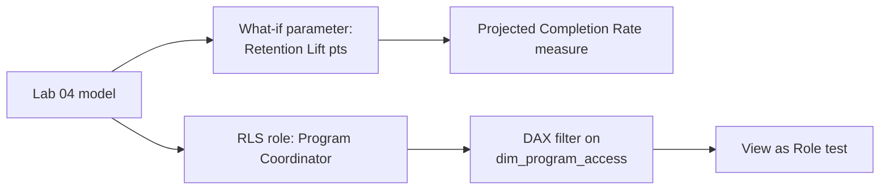

# Lab 05: What-If Analysis and Row-Level Security

## Objectives

- **Part 1:** Build a what-if parameter projecting a retention intervention's effect on completion rate
- **Part 2:** Project completion rate impact with the parameter driving a measure
- **Part 3:** Implement row-level security so each program coordinator sees only their program
- **Part 4:** Test RLS as a restricted user, not just as the report author

## Background / Scenario

Two questions remain unanswered going into the last stretch of this
series: "what happens to completion rate if a retention intervention lifts
it by X points," and "how do six program coordinators use the same report
without each seeing every other program's student-level numbers." Neither
is answerable with what Labs 01-04 built.

## Required Resources

- Power BI Desktop
- The `.pbix` file from Lab 04
- Approximately 3 hours

## Topology



---

## Part 1: The What-If Parameter

### Step 1: Create the parameter

**Modeling → New Parameter → Numeric range.** Name `Retention Lift (pts)`,
min 0, max 15, increment 1, default 0. Check **Add slicer to this page**.

<details>
<summary>Expected result</summary>

Power BI creates a new table with one column and a measure called
`Retention Lift (pts) Value`, plus a slicer on the current page bound to
it.

</details>

### Step 2: Inspect what it built

Open the auto-generated measure and confirm it reads the slicer's current
selection through `SELECTEDVALUE`, defaulting to 0 when nothing is
selected.

> **A what-if parameter is a disconnected table, not a relationship.** It
> has no key into `fact_enrollment` or `dim_student`; the slicer just sets
> a value that a measure reads with `SELECTEDVALUE`. Nothing about the
> model "knows" this represents a retention programme; the measure written
> next is what gives the number meaning.

---

## Part 2: Project the Completion Rate Impact

### Step 1: Write the projected completion rate measure

Write `Projected Completion Rate`: the current `[Completion Rate]` plus the
parameter's value (read as percentage points, so divide by 100), capped so
it can never exceed 100%. Unlike the coffee shop series' price-change
measure, this isn't a multiplication: a rate can't be scaled past 1.0 the
way a currency figure can, it has to be added to and then clamped.

<details>
<summary>Hint</summary>

Three variables: the base rate from `[Completion Rate]`, the lift as
`'Retention Lift (pts)'[Retention Lift (pts) Value] / 100`, and their sum.
`RETURN MIN( <sum>, 1.0 )` is the clamp: `MIN` against a literal, not an
`IF`, keeps it to one line.

</details>

### Step 2: Restrict the scenario to at-risk students only

The intervention this scenario models targets students below the
university-wide average completion rate, not every student. Applying a
uniform lift to programs already completing above average overstates the
effect. Write `Projected Completion Rate (At-Risk Only)`: it needs the
current program's rate, the overall university-wide rate ignoring whatever
program filter is active, and an `IF` that only applies the lift when the
program is below that overall rate.

<details>
<summary>Hint</summary>

`CALCULATE( [Completion Rate], ALL( dim_student ) )` gets the overall rate
regardless of which program the visual is filtered to: `ALL` on the
dimension table clears that filter for just this one variable. The `IF`
condition compares the program's own rate against that overall rate;
programs that pass stay untouched at their base rate rather than falling
through to a blank.

</details>

### Step 3: Build the comparison visual

Card visuals: `Completion Rate` next to `Projected Completion Rate
(At-Risk Only)`, with the parameter's slicer on the page, sliced by
`dim_student[program]` in a table. Move the slider and watch the at-risk
programs' projected numbers move while the others stay put.

> **This measure assumes the lift applies uniformly to every at-risk
> program and ignores cost, capacity, and whether the intervention is even
> the same one across programs.** It's a mechanical projection, not a
> costed model. That's a real limitation worth stating on the report page
> itself, not just here: a retention programme that works for Nursing
> students may not transfer to Computer Science, and this measure has no
> way to represent that difference.

<details>
<summary>Expected result, Part 2</summary>

At slider position 0, `Projected Completion Rate (At-Risk Only)` equals
`Completion Rate` exactly, for every program. Moving the slider up: any
program that was above the university-wide average stays completely
unchanged, while below-average programs' projected figures rise by up to
the slider's point value, never past 100%.

</details>

---

## Part 3: Row-Level Security

### Step 1: Create the role

**Modeling → Manage roles → Create.** Name it `Program Coordinator`.

### Step 2: Consider filtering dim_student directly, and why not to

A first instinct is a DAX filter straight on `dim_student[program] =
USERPRINCIPALNAME()`, but no coordinator's login email will ever equal a
program name like "Nursing". That comparison will always be false, which
means the role would hide every row instead of the wrong rows, worth
knowing before it looks like RLS is "working" by returning nothing.

<details>
<summary>Hint</summary>

If you want to see this fail before building the real fix, try it: create
the role with exactly that filter, then jump to Part 4 Step 1's "View as"
test early. Zero rows everywhere confirms the reasoning above rather than
suggesting something else is broken.

</details>

### Step 3: Build a proper mapping table

**Modeling → New Table**:

```dax
dim_program_access =
DATATABLE(
    "UserEmail", STRING,
    "program", STRING,
    {
        {"coordinator.cs@example.edu", "Computer Science"},
        {"coordinator.bio@example.edu", "Biology"},
        {"coordinator.biz@example.edu", "Business"},
        {"coordinator.nursing@example.edu", "Nursing"},
        {"coordinator.history@example.edu", "History"},
        {"coordinator.mecheng@example.edu", "Mechanical Engineering"}
    }
)
```

Relate `dim_program_access[program]` to `dim_student[program]`,
many-to-one, single direction toward `dim_student`.

### Step 4: Filter the role through the mapping table

```dax
[UserEmail] = USERPRINCIPALNAME()
```

Applied on `dim_program_access`, not on `dim_student`.

> **Filter the access table, not the data table directly, whenever the
> access rule isn't itself a column on the data.** `dim_student` has no
> email column and shouldn't: mixing access control into a dimension
> table Lab 02 built for an unrelated purpose is how a model ends up with
> columns nobody remembers the reason for. This is the same shape as the
> coffee shop series' store-manager mapping table, applied to programs
> instead of store locations.

<details>
<summary>Expected result, Part 3</summary>

Model view shows `dim_program_access` as a six-row table, related to
`dim_student` with the relationship line showing single-direction (arrow
pointing toward `dim_student`). The role appears under **Manage roles**
with the filter expression visible on `dim_program_access`, not on
`dim_student`.

</details>

---

## Part 4: Test as a Restricted User

### Step 1: View as role, inside Power BI Desktop

**Modeling → View as → check Program Coordinator → Other user →** enter
one of the six test emails.

<details>
<summary>Expected result</summary>

Every visual on every page filters down to that one program, including
the bar chart, the matrix, and the what-if cards built in Labs 02-04 that
were never told anything about RLS.

</details>

> **RLS applies model-wide, retroactively, to visuals built before the role
> existed.** That's the point of building it in the model layer instead of
> filtering each visual by hand, and also the reason to test it against a
> page that wasn't designed with RLS in mind: exactly what Part 4 does.

### Step 2: Confirm the what-if parameter still works under RLS

With the role still active, move the retention-lift slider.

<details>
<summary>Expected result</summary>

`Projected Completion Rate (At-Risk Only)` recalculates against only the
visible program's data. The two features compose without extra work,
because both operate through the filter context rather than through
hard-coded scope.

</details>

### Step 3: Publish and assign the role for real

After publishing to Power BI Service: **dataset settings → Security →**
add each coordinator's actual email under the `Program Coordinator` role.

**Troubleshooting:** RLS in Desktop's "View as" is a simulation. The real
test is a second person, signed in with their own account, opening the
published report. If that's not practical for this lab, state plainly
that RLS was verified in Desktop only, not against a live second account.

<details>
<summary>Expected result, Part 4</summary>

All six coordinator emails appear under the `Program Coordinator` role in
Service security settings. If a second account is available, that account
opening the report sees only its own program, matching what Desktop's
"View as" showed. If not, the report states plainly that only the Desktop
simulation was verified.

</details>

---

## Troubleshooting

| Symptom | Cause | Fix |
|---|---|---|
| Projected Completion Rate doesn't move with the slider | Measure references `[Retention Lift (pts)]` (the column) instead of the generated Value measure | Use `'Retention Lift (pts)'[Retention Lift (pts) Value]` |
| Projected Completion Rate exceeds 100% | MIN clamp missing or applied to the wrong variable | Confirm the RETURN wraps the whole projected value, not just LiftPoints |
| View as Role shows all programs | Role filter on the wrong table, or relationship direction wrong | Confirm filter sits on `dim_program_access`, relationship single-direction toward `dim_student` |
| RLS works in Desktop but not after publishing | Role has no members assigned in Service | Add emails under dataset Security settings |

---

## Reflection

1. Why does `Projected Completion Rate (At-Risk Only)` compare each
   program's rate to the overall average instead of applying the lift to
   every program equally?
2. What real-world factor does the what-if measure ignore, and what would
   a more realistic version need to account for it?
3. If a seventh program is added, what has to change for RLS to cover it?
   Anything in the DAX, or only the mapping table?

---

## What Went Wrong When I Did This

- **Applied the retention lift to every program**, not just those below
  average, on the first version of the measure. The projection showed
  Nursing (already the highest-completing program in this synthetic data)
  gaining points it had no plausible reason to gain from an at-risk
  intervention. Reworked it into the IF-gated version once that stood out
  on the comparison table.
- **Wrote the RLS filter directly on `dim_student`** using
  `USERPRINCIPALNAME()` matched against `program` text like "Nursing",
  which no login email will ever equal. "View as Role" returned zero rows
  for every test user, and it took a minute to realise that was the filter
  correctly doing exactly what it was told, not a bug. Reworked it through
  the mapping table.
- **Never tested with a second real account**, only Desktop's simulated
  "View as." Said so directly instead of implying it was fully verified,
  because it wasn't.

---

## Where This Breaks

Five labs in, and the model still rests on an assumption nothing has
tested yet: that `dim_student[program]` is a fact that never changes for
an existing student. It has held so far because this dataset has never
given it a reason not to.

- The RLS mapping table is maintained by hand, not sourced from wherever
  staff accounts actually live
- The what-if measure has no evidence base behind its retention-lift
  number, and no cost or capacity model behind it either
- Nothing in the model has ever had to represent a student changing
  program, or a program itself changing shape; both are routine at a real
  university and neither has come up yet

That last gap is deliberate, not an oversight: it's what Lab 06 exists to
force.

**Next:** [Lab 06, Capstone: Program Restructuring and Calculation
Groups](06-capstone.md)
