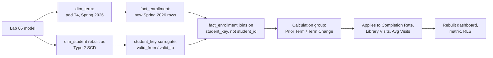

# Lab 06: Capstone: Program Restructuring and Calculation Groups

## Objectives

- **Part 1:** Add a fourth term with a genuine structural change: Business
  and History merge into a new program, and decide what that does to every
  measure and visual built so far
- **Part 2:** Build a Type 2 slowly-changing dimension for `dim_student` so
  a student's program history survives the merge instead of being overwritten
- **Part 3:** Replace the term-over-term measure family with a calculation
  group, once the SCD makes "current program" and "as-of program" different
  questions with different right answers
- **Part 4:** Rebuild the dashboard, matrix, and RLS against the corrected
  model, and reconcile every number against what Labs 01-05 produced

## Background / Scenario

Five labs built a working model: clean synthetic data, a star schema, a
dashboard, term-over-term comparison, a what-if scenario, and row-level
security. All of it assumed something that was never actually stated as an
assumption: that `dim_student[program]` is a fact that doesn't change.

It doesn't hold. A fourth term, Spring 2026, is added to this dataset, and
with it a restructuring that is common in universities and that this
series has deliberately avoided until now: Business and History are
merged into a new program, Business & Historical Studies, combining both
departments' course offerings under one administrative unit. Students who
were in Business or History before the merge didn't retroactively become
something else: they were in Business in Fall 2025 and are in Business &
Historical Studies from Spring 2026 onward. Both facts are true, and a
report that only stores the current value loses the first one.

This is a harder problem than Lab 02's `dim_term` rename fix, and harder
than the program-to-coordinator mapping table in Lab 05. Lab 02 corrected
a data-entry error where the past value was simply wrong. This is not an
error: Business really was Business in Fall 2025, and correctly showing
that is exactly the requirement. A plain rename mapping table (relabel
every historical row to the new name) would make every prior term's
reported completion rate for "Business" silently disappear, replaced by a
program that didn't exist yet when those students were enrolled. That is
the kind of defect this whole series has been built to catch: a number
that changes for a reason nobody asked for, computed correctly against a
model that quietly stopped meaning what it used to.

The fix is a **Type 2 slowly-changing dimension**: `dim_student` gets a
row per program-affiliation period per student, not one row per student.
A student who was in Business through Fall 2025 and moved into Business &
Historical Studies from Spring 2026 has two rows, each valid for a
different stretch of time, and `fact_enrollment` joins to whichever row
was current when the enrollment happened, not to whatever the student's
program says today.

The second new technique closes a different gap that's been building
since Lab 04. `Completion Rate Prior Term`, `Library Visits`, and `Avg
Visits Per Student` each need a term-over-term comparison, and writing
`[Metric] Prior Term` and `[Metric] Change` by hand for every one of them
means three near-identical measure pairs today and a fourth pair the next
time someone adds a metric. A **calculation group** defines the
"prior term" and "change" logic exactly once and applies it to whichever
base measure a report author drops next to it, the same DRY principle
Lab 02 applied to deduplication, now applied to a family of measures
instead of a family of rows.

## Required Resources

- Power BI Desktop (calculation groups require the **external tools**
  preview or Tabular Editor, see Part 3 for setup)
- The `.pbix` file from Lab 05
- Approximately 4 hours: this is deliberately the longest lab in the
  series
- [Tabular Editor 2](https://tabulareditor.com/) (free). Power BI
  Desktop's native UI cannot create calculation groups directly as of this
  writing; Tabular Editor connects to the open .pbix as an external tool

## Topology



---

## Part 1: The Merge, and Why the Obvious Fix Is Wrong

### Step 1: Add the new term

In `dim_term`, add a fourth row: `T4`, `Spring 2026`, start date
2026-01-12, end date 2026-05-01. Extend `TermSequence` to cover it.

<details>
<summary>Hint</summary>

This is exactly the "if a fourth term is added, add its row here
explicitly" case Lab 04 Part 2 Step 1 called out as an accepted
limitation, not a bug. The SWITCH in `TermSequence` needs a new branch
for `"T4" → 4`. Nothing else about the mechanism changes.

</details>

### Step 2: Generate the new enrollment rows

Using the same generation approach from Lab 01, add roughly 5,000 new
`fact_enrollment` rows for Spring 2026 directly in T-SQL, drawing
`student_id` from the existing 3,000 students and `course_id` from the
existing 150 courses, with `term_id = 'T4'`. A realistic fraction of
students don't re-enroll every term: 5,000 rows across 3,000 students is a
plausible continuation rate, not full participation.

<details>
<summary>Hint</summary>

This is the Lab 01 Part 2 Step 1 generator again, with `term_id` fixed to
`'T4'` and `dbo.Numbers` filtered to `n <= 5000` instead of 15000. The
`enrollment_id` sequence needs to continue past `E015000`, not restart at
`E000001`, or the new rows collide with the primary key from Lab 01.

</details>

### Step 3: Try the Lab 02-style fix first, and watch it fail

Before building the real solution, try the fast option: in Power Query,
add a step that replaces every `"Business"` and `"History"` value in
`dim_student[program]` with `"Business & Historical Studies"`.

Refresh the model. Filter the Lab 03 dashboard's matrix to Fall 2024.

<details>
<summary>Hint</summary>

Look specifically at the Business and History rows in the Fall 2024
column of the matrix, not just whether the report still runs.

</details>

<details>
<summary>Expected result</summary>

The matrix now shows "Business & Historical Studies" with a completion
rate for Fall 2024 and Spring 2025, terms that happened before this
program existed. Business and History as separate rows have vanished
entirely from every term, including the ones where they were the actual,
correct program name. The Lab 02 numbers this series has been
cross-checking against since Lab 02 Part 5 no longer reproduce.

</details>

### Step 4: Name what actually broke

> **A rename mapping table assumes the old value was always wrong.** Lab
> 02's `dim_term` fix and this situation look similar on the surface (both
> are "replace one label with another") but they aren't the same problem.
> Lab 02 corrected bad data entry: the term really was always meant to be
> one name, and an inconsistent second spelling was the error. Here,
> Business really was Business, correctly, for three terms. Overwriting
> that isn't a correction, it's a loss of real history, and it's exactly
> the kind of defect that doesn't announce itself: the dashboard still
> runs, the numbers still look plausible, they're just answering "what
> would completion rate have been if this program had always existed"
> instead of "what was completion rate."

Undo the Power Query rename step before continuing. It does not belong in
the final model.

---

## Part 2: Build the Type 2 Slowly-Changing Dimension

### Step 1: Understand what Type 2 means before building it

A Type 1 SCD overwrites the old value (what Part 1 Step 3 just did, and
why it lost history). A Type 2 SCD adds a new row instead of overwriting,
and gives every row a validity window. The table gains rows over time
instead of just changing values in place.

`dim_student` needs to go from one row per student to one row per
**student program-affiliation period**. Most students will still have
exactly one row, since most didn't change program. Only students whose
program was Business or History gain a second row, effective Spring 2026.

### Step 2: Design the new dim_student shape

| Column | Purpose |
|---|---|
| `student_key` | New surrogate key, one per row (not per student) |
| `student_id` | The natural key; same student can now have multiple rows |
| `program` | The program name valid for this row's window |
| `year_of_study` | Unchanged from the existing column |
| `valid_from` | Term sequence this row became current |
| `valid_to` | Term sequence this row stopped being current, or blank if still current |
| `is_current` | Boolean, true for exactly one row per student_id |

<details>
<summary>Hint</summary>

`student_key` can be as simple as `student_id & "-" & valid_from` in
Power Query, it just needs to be unique per row, not meaningful on its
own. Two students who were never affected by the merge get one row each
with `valid_from` at the start of the dataset and `valid_to` blank.

</details>

### Step 3: Build it in Power Query

Reference the existing `dim_student` query (not duplicate; the same
reasoning Lab 01 Part 3 gave for why Lab 02's fix belongs upstream, not as
a copy). For the ~2,000 students currently in Business or History:

1. Keep their existing row, but set `valid_to` to the sequence number of
   T3 (their program was correct through Fall 2025) and `is_current` to
   false.
2. Add a new row for each: same `student_id`, `program` = "Business &
   Historical Studies", `valid_from` = T4's sequence number, `valid_to`
   blank, `is_current` true.

Every other student keeps a single row, `valid_from` at the start of the
dataset, `valid_to` blank, `is_current` true.

<details>
<summary>Hint</summary>

Power Query's **Append Queries** is the mechanism here: build the
"unchanged students" table, build the "closed-out old rows" table, build
the "new current rows" table, then append all three into one
`dim_student`. Trying to do this with conditional columns on a single pass
gets unreadable fast; three separate, named steps is clearer and easier
to check.

</details>

### Step 4: Repoint fact_enrollment to the surrogate key

`fact_enrollment[student_id]` alone can no longer uniquely identify which
`dim_student` row applies. A Business student's Fall 2024 enrollment and
their Spring 2026 enrollment both carry the same `student_id`, but need to
join to different `dim_student` rows.

In Power Query, merge `fact_enrollment` against the new `dim_student` on
`student_id` **and** a comparison between `fact_enrollment[term_id]`'s
sequence and the `dim_student` row's `valid_from`/`valid_to` window, to
pull in the correct `student_key` for each enrollment. Add that
`student_key` as a new column on `fact_enrollment`, then relate
`fact_enrollment[student_key]` to `dim_student[student_key]` instead of on
`student_id`.

<details>
<summary>Hint</summary>

This merge condition is not a simple equi-join, since it needs "term
sequence falls inside this row's valid window," not "term sequence equals
this row's valid_from." Add a custom column on `fact_enrollment` first
that looks up the matching `student_key` via a function over the
`dim_student` table (List.Select or a nested join filtered by the
between-condition), rather than trying to express the whole thing as one
Merge Queries dialog: the built-in merge UI only does equality joins.

</details>

<details>
<summary>Expected result, Part 2</summary>

`dim_student` now has roughly 5,000 rows (3,000 students, plus one extra
row for each of the ~2,000 Business/History students) instead of 3,000.
Every `student_id` that appears twice has non-overlapping `valid_from`/
`valid_to` windows and exactly one row with `is_current = TRUE`.
`fact_enrollment[student_key]` is populated for all ~20,000 rows (15,000
original plus ~5,000 new Spring 2026 rows) with no blanks. A blank means
an enrollment's term fell outside every one of that student's validity
windows, which should not happen if Step 3 was built correctly.

</details>

### Step 5: Re-run the Fall 2024 check

Filter the matrix to Fall 2024 again.

**Expected result:** Business and History reappear as their own rows,
correct completion rates for that term, matching the numbers from before
Part 1 Step 3's failed attempt. Spring 2026 shows "Business & Historical
Studies" instead. No term shows a program that didn't exist in it yet.

---

## Part 3: Calculation Group for Term Comparison

### Step 1: Recognize the duplication this replaces

By the end of Lab 04, the model has `Completion Rate Prior Term` and
`Completion Rate Change`. Lab 03 added `Library Visits` and
`Avg Visits Per Student`, neither of which got a term-comparison version.
If a coordinator wants to know whether library usage is trending the same
direction as completion rate, there is currently no measure for that
without writing `Library Visits Prior Term` and `Library Visits Change` by
hand, then doing it again for `Avg Visits Per Student`, and again for
every future metric.

### Step 2: Install Tabular Editor as an external tool

Power BI Desktop's native ribbon has no calculation group UI as of this
writing. **External Tools** tab → Tabular Editor (installed separately,
picked up automatically once installed) → opens connected to the current
model.

### Step 3: Create the calculation group

In Tabular Editor: right-click **Tables → Create New Calculation Group**.
Name it `Term Comparison`. Add two calculation items:

```dax
-- Calculation item: "Current"
SELECTEDMEASURE()
```

```dax
-- Calculation item: "Prior Term"
VAR CurrentSeq = MAX( dim_term[TermSequence] )
VAR PriorSeq = CurrentSeq - 1
RETURN
    CALCULATE(
        SELECTEDMEASURE(),
        FILTER( ALL( dim_term ), dim_term[TermSequence] = PriorSeq )
    )
```

```dax
-- Calculation item: "Change"
SELECTEDMEASURE() -
CALCULATE(
    SELECTEDMEASURE(),
    VAR CurrentSeq = MAX( dim_term[TermSequence] )
    VAR PriorSeq = CurrentSeq - 1
    RETURN
        FILTER( ALL( dim_term ), dim_term[TermSequence] = PriorSeq )
)
```

> **`SELECTEDMEASURE()` is what makes this apply to any base measure
> instead of one.** Lab 04's `Completion Rate Prior Term` hardcoded
> `[Completion Rate]` inside the CALCULATE. This version calculates
> whichever measure the report author drops onto the same visual as the
> calculation group field: `Completion Rate`, `Library Visits`,
> `Avg Visits Per Student`, or any measure written after this lab, with no
> new DAX. The calculation group is applied by adding its field to a
> visual next to a base measure, the same way a slicer applies a filter.

### Step 4: Save back to the model

Tabular Editor → **File → Save**, which pushes the change back into the
open .pbix. Confirm in Power BI Desktop's field list that `Term
Comparison` now appears as a table with one field, holding three items.

<details>
<summary>Expected result</summary>

`Term Comparison` appears in the field list looking like a single-column
table. Dragging it onto a table visual alongside `Completion Rate` and
filtering the `Term Comparison` field to "Current" and "Prior Term"
produces two columns with the same numbers `Completion Rate Prior Term`
gave in Lab 04, same logic, reached through the calculation group instead
of a hand-written second measure.

</details>

### Step 5: Confirm it generalizes

Build a matrix: rows `dim_student[program]`, columns `Term Comparison`
(all three items), values `Library Visits`. Then rebuild the same matrix
with values `Avg Visits Per Student` instead. Do not write any new DAX
for either.

**Expected result:** both matrices show sensible Current / Prior Term /
Change columns, despite the calculation group never having been told
about `Library Visits` or `Avg Visits Per Student` specifically. The
"Change" column for `Library Visits` in Spring 2026 for Business &
Historical Studies pulls its "prior term" figure from the combined program
that only started existing that term: there is no meaningful Business &
Historical Studies figure for Fall 2025, so this cell should read blank,
not a number borrowed from old Business or History rows. If it shows a
number here, the SCD join from Part 2 isn't correctly scoping which
`student_key` rows count as this program in which term.

### Step 6: Retire the Lab 04 hand-written measures

`Completion Rate Prior Term` and `Completion Rate Change` are now
redundant with the calculation group. Leave them in place rather than
deleting them: Lab 04's report page still references them by name, and
pulling infrastructure out from under an already-shipped page is a worse
outcome than one extra unused measure sitting in the model. Note in the
model (a measure description, right-click → **Properties**) that they're
superseded by `Term Comparison` for any new work.

---

## Part 4: Rebuild the Dashboard Against the Corrected Model

### Step 1: Update the program bar chart

Lab 03's bar chart used `dim_student[program]` directly. With `dim_student`
now holding multiple rows per student, that axis needs to come from
`is_current = TRUE` rows only for a "current state" view, or needs to stay
term-aware for a historical one. Decide which the coordinator-facing page
needs and say so, since both are legitimate views of the same model and a
dashboard that mixes them without labeling which is which will mislead
whoever reads it.

<details>
<summary>Hint</summary>

A visual filtered to `dim_student[is_current] = TRUE` answers "how are
today's programs doing across all of history," folding Business and
History's past performance into Business & Historical Studies
retroactively for reporting purposes, a legitimate choice for a
forward-looking dashboard, as long as it's labeled. A visual left
unfiltered, joined through `fact_enrollment[student_key]`, answers "what
was true in each term," keeping Business and History separate in the
terms where they were real. The matrix in Step 2 needs the second
behavior; a single current-state summary card is a reasonable place for
the first.

</details>

### Step 2: Rebuild the term matrix

Rows `dim_student[program]`, columns `dim_term[term_name]`, value
`Completion Rate`, joined through the corrected `student_key`
relationship.

**Expected result:** four term columns. Business and History both have
values through Fall 2025 and blanks in Spring 2026. Business & Historical
Studies has values only in Spring 2026, blank in the three terms before
it existed. No program has a value in every column, and no program has a
value with a name mismatch (a "Business" value appearing under the Spring
2026 column would mean the SCD join is wrong).

### Step 3: Re-check RLS

The `dim_program_access` mapping table from Lab 05 relates to
`dim_student[program]`. Confirm whether that relationship still resolves
correctly now that `dim_student` has multiple rows per student, or needs
to relate to `dim_student[program]` filtered to `is_current` only, or
needs its own new row for the merged program's coordinator.

<details>
<summary>Hint</summary>

A coordinator's access should track the *current* program structure, not
history: whoever coordinates Business & Historical Studies now needs
access to every student who was ever in Business, History, or the merged
program, across every term. That argues for relating
`dim_program_access` to `dim_student[program]` without an `is_current`
filter (so it reaches every historical row via each student's
`student_key`), while adding one new mapping row for "Business &
Historical Studies" and deciding what happens to the two coordinator
emails that mapped to the programs it replaced.

</details>

### Step 4: Reconcile against every prior lab

Pick one program untouched by the merger, for example Nursing. Confirm
its Fall 2024 completion rate in this rebuilt model matches the number
from Lab 02 Part 5's validation exactly. An unrelated program should show
zero drift from a change that had nothing to do with it. Then confirm
Business's Fall 2025 completion rate matches what it was before Part 1's
merge, proving the SCD preserved history rather than just avoiding an
obvious error.

<details>
<summary>Expected result</summary>

Nursing's Fall 2024 completion rate is bit-for-bit identical to Lab 02's
figure. Business's Fall 2025 completion rate, checked against a screenshot
or note taken before Part 1 Step 3's failed rename attempt, also matches.
Any drift in either number means something in the SCD build touched rows
it shouldn't have.

</details>

---

## Troubleshooting

| Symptom | Cause | Fix |
|---|---|---|
| dim_student row count didn't grow after Part 2 | Append Queries step missing one of the three source tables, or run before the split into unchanged/closed-out/new-current | Confirm all three intermediate queries feed the final Append |
| Some fact_enrollment rows have a blank student_key | Enrollment's term_id sequence falls outside every valid_from/valid_to window for that student_id | Check that valid_to on the closed-out row and valid_from on the new row are set to adjacent term sequences with no gap |
| Term Comparison calculation group doesn't appear in the field list | Tabular Editor changes not saved back to the .pbix, or Power BI Desktop still showing a cached field list | Re-save in Tabular Editor, then refresh the fields pane in Desktop (or close and reopen the file) |
| Change column returns a number for a program's first-ever term | FILTER(ALL(dim_term), ...) landing on a prior sequence that has no real data for this program, but CALCULATE still evaluates rather than returning blank | Confirm the base measure itself returns blank for zero rows (check DIVIDE is used, not raw division); the calculation item should inherit that blank correctly if the base measure is written properly |
| RLS shows the wrong students for the merged program's coordinator | dim_program_access still only has rows for the old Business and History programs | Add a Business & Historical Studies row per Part 4 Step 3 |
| Nursing's Fall 2024 number drifted from Lab 02 | The SCD rebuild touched dim_student rows for students outside Business/History | Re-check Part 2 Step 3 only appends rows for the affected ~2,000 students, not the full 3,000 |

---

## Reflection

1. Why does a Type 2 SCD need a surrogate key (`student_key`) instead of
   continuing to use `student_id` as the relationship key into
   `fact_enrollment`?
2. The calculation group's "Change" item never mentions `Completion Rate`,
   `Library Visits`, or any specific measure by name. What makes it apply
   correctly to all three anyway?
3. Part 4 Step 1 identified two legitimate but different answers to "how
   is Business doing" (a current-state rollup and a term-accurate
   history. Which one belongs on a coordinator's weekly dashboard, and
   which belongs in an annual report to the university's leadership? Are
   they ever the same visual?
4. If a third program merge happened a year from now, what part of this
   lab's work would need to be redone, and what part (the calculation
   group specifically) would not?

---

## What Went Wrong When I Did This

- **Tried the Part 1 Step 3 rename first without meaning to build it as a
  demonstration.** Genuinely thought it would be the actual fix, since it
  matched Lab 02's pattern closely enough to feel familiar. Only noticed
  the historical Business and History rows had disappeared from Fall 2024
  because the matrix reconciliation habit from Lab 02 Part 5 was still in
  place. Kept the failed attempt in the lab deliberately once I realized
  how easy the mistake was to make.
- **Built the surrogate key as just `student_id` with a suffix number**
  (`S00412-1`, `S00412-2`) instead of using `valid_from` in the key, which
  worked until a merge step reordered the intermediate queries and the
  suffix numbers no longer matched which row was actually earlier.
  Rebuilt the key from `student_id` and `valid_from` together, which
  can't silently reorder because the value it's built from carries the
  meaning directly.
- **Wrote the custom-column lookup for `student_key` on fact_enrollment
  using a plain Merge Queries join on `student_id` first**, before
  realizing that gives every enrollment row two possible matches for the
  ~2,000 affected students (the closed-out row and the new current row),
  which Power Query resolved by silently picking one arbitrarily. Row
  counts looked right, but Fall 2024 Business enrollments randomly ended
  up pointing at the Spring 2026 dim_student row about half the time.
  Replaced it with the between-condition lookup in Part 2 Step 4, which
  can only ever match one row.
- **Left `Completion Rate Prior Term` referencing the old, non-SCD
  relationship path after Part 2**, which meant it kept returning Lab
  04's original numbers instead of the corrected ones, while
  `Term Comparison` (built after the SCD fix) returned different, correct
  numbers for the same terms: two measures on the same page disagreeing,
  the exact failure mode Lab 04 Part 3 built an entire diagnostic step
  around. Traced it back to the relationship, not the DAX, and confirmed
  Lab 04's old measures now run against the corrected `student_key`
  relationship too, which is why Part 3 Step 6 keeps them rather than
  quietly leaving a wrong number live on an old page.

---

## Closing Reflection: The Whole Series

Six labs, one synthetic dataset, and the same failure shape recurring at
increasing cost each time it was found: a model that computes a number
correctly against an assumption that quietly stopped being true. Lab 01
found it as three independent random draws producing a duplicate key. Lab
02 fixed it with a deduplication step at the right grain. Lab 04 found a
version of it in a calendar function applied to an axis that wasn't a
calendar. This lab found the most expensive version: an entire dimension
table's core assumption, "a student's program doesn't change," silently
false the moment a real institutional event happened, and cheap to fix
correctly only because the five labs before it had already built a model
disciplined enough to have a matrix, a validation habit, and a Lab 02
reconciliation number to catch the drift against.

That's the actual argument for the star schema, the measure-not-query
discipline, and the validate-against-the-last-lab habit that's run through
this whole series since Lab 01: none of it prevents a real-world change
from happening. What it does is make a silent, wrong number loud instead.
Part 1 Step 3's failed rename didn't quietly ship, it broke a check that
was already built and waiting for exactly this kind of mistake.

The two domains this training arc has now covered, coffee shop retail and
university enrollment, are different enough in subject that the pattern
underneath them is easy to miss: a reused ID that means different things
in different contexts, a filter that silently returns zero rows instead
of erroring, a dimension that was never actually static being treated as
if it were. None of those are Power BI problems specifically. They're
data modeling problems that Power BI's DAX and star-schema conventions
make visible, if the person building the model goes looking, and mostly
invisible if they don't.

What a real deployment still needs past where this series ends: a live
connection to whatever system actually tracks program changes, rather
than a manually maintained SCD built by hand once for this lab; a
calculation group library that covers more than one comparison type
(term-over-term is one axis among several a real institutional research
office would want); and governance around who's allowed to define a
"program merge" in the model at all, since Part 1 showed how easy it is
for that decision to be made accidentally, by whoever reaches for the
fast fix first. Those are the honest next steps, the same way Lab 05
closed with its own list. This one is just the last time this particular
series gets to say so.
